# Falcon logic and architecture

The technical companion to [README.md](README.md). It explains what Falcon does, how it works, where the code lives and the correctness rules that changes must keep. Each mechanism comes with the reason for it. It is the architecture reference, not a changelog: the history of changes lives in the Git log. This file stays at the repository root beside the README. Build and library-rebuild instructions are in [REBUILDING.md](REBUILDING.md).

How to read it:

- [What Falcon is for](#what-falcon-is-for) gives the purpose and the two foundations that most design decisions follow from.
- The [feature map](#feature-map) lists everything a user can do: how to reach it, what can switch it off and what shared state it changes. A feature that exists in the code but is missing from the map is a documentation bug.
- [Flows and who decides](#flows-and-who-decides) explains the main workflow and the few shared rules that decide whether an action is allowed right now.
- [What Falcon does not do](#what-falcon-does-not-do) lists deliberate gaps, known limits and accepted trade-offs.
- From the [source map](#source-map) onward, the sections explain how it works: the engine, opening and decoding, colour, review data, the two platforms and release packaging. [Maintaining this reference](#maintaining-this-reference) comes last.

Windows and macOS share one source tree: the same Rust engine and the same interface, written in Slint (the interface toolkit). Mac-only code sits behind `cfg(target_os = "macos")`, and a few shared files (`main.rs`, `support.rs`) keep their Windows and Mac branches side by side. Mac-specific behaviour is collected under [Platform rules and the Mac](#platform-rules-and-the-mac) so the shared sections are not interrupted by it. Where a Mac mechanism changes shared behaviour, the shared section says so and links there.

Names in backticks (functions, types, constants, Slint properties and callbacks) are the stable anchors. Line numbers drift, so search for the name. When this document and the current source disagree, the source is right and this document needs fixing.

## Contents

1. [What Falcon is for](#what-falcon-is-for)
2. [Feature map](#feature-map)
3. [Flows and who decides](#flows-and-who-decides)
4. [What Falcon does not do](#what-falcon-does-not-do)
5. [Source map](#source-map)
6. [The tick, threads and workers](#the-tick-threads-and-workers)
7. [State ownership and folder changes](#state-ownership-and-folder-changes)
8. [Startup, shutdown and the diagnostic log](#startup-shutdown-and-the-diagnostic-log)
9. [Interface markup (Slint)](#interface-markup-slint)
10. [Opening and inspection](#opening-and-inspection)
11. [Decoding and display](#decoding-and-display)
12. [Rationing work ahead of the user](#rationing-work-ahead-of-the-user)
13. [Memory: GPU budgets, RAM cache and recovery](#memory-gpu-budgets-ram-cache-and-recovery)
14. [Input guards and failure paths](#input-guards-and-failure-paths)
15. [Windows HEIC hardware decoding](#windows-heic-hardware-decoding)
16. [Colour](#colour)
17. [Orientation and rotation](#orientation-and-rotation)
18. [RAW viewing and development](#raw-viewing-and-development)
19. [Export](#export)
20. [Review, selection and menus](#review-selection-and-menus)
21. [File operations, delete and recovery](#file-operations-delete-and-recovery)
22. [Saved state and data safety](#saved-state-and-data-safety)
23. [Motion and immersive mode](#motion-and-immersive-mode)
24. [Platform rules and the Mac](#platform-rules-and-the-mac)
25. [Windows file icons and associations](#windows-file-icons-and-associations)
26. [About card](#about-card)
27. [Languages](#languages)
28. [Public source and release packaging](#public-source-and-release-packaging)
29. [Rules learned in practice](#rules-learned-in-practice)
30. [Before shipping a feature](#before-shipping-a-feature)
31. [Maintaining this reference](#maintaining-this-reference)

## What Falcon is for

Falcon is a photo viewer for **culling**: going through a shoot quickly to pick the keepers and set the rest aside. It is built for large shoots, for example RAW+JPG bursts from a Canon R5 II. You can:

- browse at a high frame rate and see a sharp full-resolution or RAW image when you stop;
- zoom in to check focus;
- rate (0–5 stars), flag (pick) and reject;
- rotate, with the turn written into the file or an XMP sidecar when you apply it;
- delete to the Recycle Bin (Windows) or the Trash (Mac), with recovery;
- compare two near-identical frames side by side;
- hand off the picks by copying them, moving the rejects away, or exporting web-ready copies.

It all happens in one native window that stays responsive on any GPU. The same pipeline reads nine kinds of file — JPEG, PNG/APNG, TIFF, WebP, HEIC/HEIF, JPEG XL, BMP, GIF and camera RAW — and draws them in the display's own colour profile.

A RAW file and the camera's finished image of the same frame (a JPG or HEIC with the same name) form one **shot**. Browsing moves over shots, not files.

### The two foundations

Almost every "why is it like that?" answer comes back to one of these two.

1. **Performance.** Holding an arrow key should browse at about 30 photos a second (the default browse target, `scrub_fps`), even over 45–110 megapixel files. A full decode cannot keep up, so Falcon works in *tiers*: a cheap preview now, a sharp frame a moment later. Everything heavy runs off the interface thread.
2. **A smooth experience.** No hitches, no flicker, no lost work. GPU uploads are limited per frame. The full-resolution decode waits for browsing to settle before it starts. Saves are atomic (written to a temporary file, then swapped in whole) and retried. A damaged or huge file cannot crash the app: decoding runs on worker threads, every tick of the interface runs inside `catch_unwind` (Rust's way of catching a crash), and if ticks keep failing Falcon shows a banner and saves the review data outside the failing tick.

## Feature map

This section is the *what*: everything a user can do, mapped so the relationships between features and the user's flows can be checked. [Flows and who decides](#flows-and-who-decides) explains how the features interact, and [What Falcon does not do](#what-falcon-does-not-do) lists what is deliberately missing. The rest of the document is the *how*.

How to read the tables:

- **How you reach it** lists every way in: keys, menus, buttons and gestures.
- **What can switch it off** is the state that makes the feature available or not. The shared rules behind it are in [Flows and who decides](#flows-and-who-decides).
- **What it changes** is the shared state it writes. Two features that change the same state interact.
- **Code** names the symbols to search for. A name such as `open-folder` is a callback on `MainWindow` in `main_window.slint`; Rust registers it as `app.on_open_folder`.

### Folders, sessions and the window

| Feature | How you reach it | What can switch it off | What it changes | Code |
| --- | --- | --- | --- | --- |
| Open an image | Toolbar **Open ▾ → Image…** (`open-folder`, a file picker that also lets you browse into any folder); drop a file on the window; a file passed at launch, for example by double-clicking an associated file; on Mac, Finder's open-document event | Always available. Launching with nothing to open shows the empty window. | Opens that file's folder with the clicked photo first, before the rest of the folder is scanned (see [Opening and inspection](#opening-and-inspection)) | `begin_reload`, `resolve_target`, `photo_open.rs`, `macos_open.rs` |
| Open a folder | **Open ▾ → Folder…** (`open-folder-direct`, a true folder picker); drop a folder on the window | Always available | The current folder (`cur_dir`), the shot list (`shots`), the folder-open counter (`generation`) and every per-folder cache, through `apply_scan` | `begin_reload`, `apply_scan` |
| Folder scan | Part of every open | — | Builds the `Shot` list. A file's first 32 bytes decide its type (`sniff_kind`, `SNIFF_HEAD_BYTES`); the extension is only the fallback. A RAW and a finished file with the same name pair into one shot, and `finished_rank` picks the finished partner. Mac `._*` companion files are skipped (`is_appledouble_sidecar`). Cloud placeholders (files a sync service lists but has not downloaded) are tagged and never read, so they keep their extension's type. Header reads are bounded and may overlap (`scan_io.rs`). | `scan_folder_with_metadata`, `scan_classify` |
| Sort | Toolbar sort menu (`sort-pick`, `sort-dir-pick`): Name, Date taken, Date modified, Date created, Size, Type or Rating, ascending or descending. Name uses natural order, like Explorer (`a2` before `a10`). | Unavailable while a photo-first open is still scanning the folder (`opening-photo`) | Re-orders `shots` under one folder-open counter. Date-taken values are remembered across folders in `TAKEN_CACHE` (up to 50,000 files). Each folder's sort is remembered (see folder memories). | `sort-method`, `TAKEN_CACHE` |
| Folder change | Any open, re-sort, or rescan after a file operation | — | One chokepoint, `apply_scan`: every decode tier's `on_folder_swap`, the per-shot metadata (`meta.on_folder_swap`) and the view state are reset; an open confirm dialog and the photo menus close; a pending delete is forgotten. A rescan of the same folder carries the selection and live review edits across by file name. See [Switching folders](#switching-folders). | `apply_scan` |
| Window size and position | At launch, when **Remember window size & position** is on (Settings → DISPLAY, default Off) | `remember_geometry` | `win_geom` in settings. A watchdog re-applies maximize on the window's own monitor. | `SavedWinGeom` |
| Panel layout | At launch and on folder open; **Restore panels** (`restore-panels`) | Settings → DISPLAY → **Floating panels**: Hidden, Minimised or On (`panels_default`) | `info_open_v2`, `raw_open`, `grid_open`, `film_visible`. A folder you have read before reopens in its remembered info view (Simple, Standard or Full). The launch default `info_view` changes only through Settings → DISPLAY → **Info panel view**, never through the panel's own header buttons. | `PanelsSegCell`, `InfoView` |
| Folder memories | Opening a folder seen before | Settings → INPUT → **Resume position memory** (off, last 3, last 10 or a custom number; `resume-cap-changed`) and **Remember sorting and panel layout** (same choices, default 10; `sort-cap-changed`; 0 turns those memories off) | A toast offers **Resume**, which jumps to the photo you last viewed (`last_viewed`, most recent first). The folder's sort, info view and minimised panels come back. Ratings, flags, rejects and pending rotations always reload from the folder's review file, whatever these settings say. | `trim_resume_lru`, `sort_folders`, `panel_folders` |
| Several Falcon windows | Launching Falcon again | Never blocked: there is no single-instance lock | `open_folders.json` lists each window's folder, refreshed about every 25 s and treated as stale after 90 s. Opening a folder that another live window has open shows a warning that review edits are last-writer-wins. The first instance owns `falcon.log`; later ones write `falcon-<pid>.log` in the configuration folder (only when diagnostic logging is on). | `register_open_folder`, `heartbeat_open_folder`, `claim_primary_instance` |
| Reveal in Explorer / Finder | Photo menus: **Reveal in Explorer/Finder** (`reveal-shot`). When the menu's photo is in an armed selection, **Reveal N in Explorer/Finder** (`reveal-selected`) opens one window with every selected photo's file highlighted, one file per shot (the finished file, else the RAW). **Show** in result toasts and the events centre opens the output folder (`reveal-path`). | Needs a real file on disk | Nothing | `reveal_paths`; `SHOpenFolderAndSelectItems` (Windows), `activateFileViewerSelectingURLs` (Mac) |
| Show the log file | Settings → DEVELOPER → **Show log file** (`show-log`), below **Diagnostic logging** | — | Nothing | `active_log_path` |

### Browsing and viewing

| Feature | How you reach it | What can switch it off | What it changes | Code |
| --- | --- | --- | --- | --- |
| Step and browse | **←/→** tap or hold (`navigate`, `navigate-step`, `nav-released`); **Home/End**; **↑/↓** move a row in the grid | Arrow keys wait only for dialogs, the welcome guide and open menus (`photo-popup-open`), so they work on the verified nearby photos during a photo-first open. Home/End read `popup-open` and, in View only, wait for the whole folder. In compare with both halves pinned, `nav_allowed` refuses before anything moves, pulses the pins and says why. The opt-in **Never browse onto a blank photo** (Settings → INPUT, `scrub_wait_cache`) holds a step until the next photo has a thumbnail or preview. | `current`, the kind of navigation (`NavKind`), the motion clock | `nav_allowed`, `scrub_wait_ready` |
| Wheel browse | The wheel over the photo or the filmstrip | **Mouse wheel changes photo** (Settings → INPUT, default On; Off makes the wheel zoom). Refused while `photo-popup-open`. | `wheel_accum`, a drift-free bank of notches the tick pays out at the browse rate. On a Mac a held arrow key owns navigation and wheel notches during the hold are dropped (`HELD_KEY_OWNS_NAV`), because a trackpad's resting finger and its inertia produce real notches that would pull `current` back. | `step_wheel_advance`, `wheel_step_decision` |
| Sharp browsing while zoomed | Browsing while zoomed in | **When zoomed** in the toolbar's browse-speed panel: Speed or Always sharp (`zoom_always_sharp`, default Speed) | Paces each step to the measured full-resolution rate. If the next sharp frame is not ready, the step shows the preview and sharpens in place, so no notch is silently lost; a notch that must be dropped is reported in a toast. | `wheel_step_decision` |
| Zoom and pan | Ctrl+wheel (⌘+wheel on Mac), or the plain wheel when wheel browsing is off (`zoom-at`); pinch on a Mac trackpad; drag to pan (`pan-start`, `pan-move`); **z** resets (`pan-reset`); the zoom badge toggles 1:1 and Fit | Only real dialogs and the welcome guide block it (`inspection-blocked`); a folder that is still loading does not. A notch that would not change the zoom at 1× or at the maximum (12×, `MAX_ZOOM`) is ignored (`zoom_notch_target`). | Zoom and pan. Stamps the input clock, which pauses preparing-ahead work (see [Rationing work ahead of the user](#rationing-work-ahead-of-the-user)). | `zoom_notch_target`, `inspection.rs` |
| Zoom badge | The image/RAW panel's chip and its compact twin on the compare bar; a tap toggles 1:1 and Fit | — | Shows only what is true: accent **Focus 1:1** (100 % or more over the full-resolution frame); amber **Loading…** (zoomed in over the preview while a sharper frame is still coming); amber **Not sharp** (the full-resolution decode failed and the retry card is up); grey **Loading…** at Fit (a sharper frame really is on its way); otherwise **Zoomed** or **Fit**. "Still coming" is `support::detail_pending`, never just "no detail frame": a playing GIF, an unsupported file, a failed decode and a mid-browse frame have no detail frame but are not loading. Amber appears only when zoomed in. | `FocusBadge` (`controls.slint`), `detail_pending` |
| Zoomed-region tiles | Zooming past fit on a large image | **Adaptive Hi-Res** (Settings → PERFORMANCE, default On); the GPU memory tier | `roi.tiles`, `roi.region`. The publish gate never holds them. | `RoiZoom` (`roi.rs`) |
| Filmstrip | Click a thumbnail (`film-clicked`); the wheel over it (`film-scroll`); drag 1:1 (`film-drag-start`, `film-drag-move`, `film-drag-end`); its mini scroll bar (`film-seek`); the toolbar's position chip recentres it (`film-recenter`) | `film-visible` | `film_pos`, `film_target`, `film_follow`. Strip gestures stamp the input clock. Dragging scrolls the strip without changing `current`. | `film.rs` |
| Drag up to compare | Drag a filmstrip thumbnail upward (`film-classify`) | The drag must stay within a cone around straight up: Settings → DEVELOPER → Advanced → **Filmstrip drag-up tolerance** (`film_drag_cone_deg`, default 20°, 5–45°) | Sends that shot to a compare half. The shot is captured when the pointer goes down, so it cannot change during the drag. | `film_drag_classify` |
| Grid dock | The toolbar's grid button; click a tile; **↑/↓** | `grid-open` | `current`. Its scroll bar is the shared `MiniVBar`, the same component as the Review panel's. When it recentres on the current photo it remembers the value it wrote, so its own scroll is never mistaken for the user's. | `grid-vp-y` |
| Compare A/B | **c** (`toggle-compare`); photo menu **Compare — send to A (left)** or **B (right)**; drag up from the filmstrip | Not available in immersive mode | `cmp_a_idx`, `cmp_b_idx`, the focused half and the pins. **Tab** swaps the active half, **Space** pins it, Ctrl+wheel always zooms. Rating and marking act on the focused half, not `current`. Selection and bulk keys go dormant. | `unpinned_target`, `PinTarget` |
| Info / EXIF panel | **i** (`toggle-info-panel`), the photo menu, Settings → DISPLAY → **Floating panels** | **Hidden** hides both floating panels. The **i** key minimises or expands the info panel, and from Hidden brings both panels back; it does nothing in immersive mode. | `info_open_v2`, `info-min`, the folder's remembered view (Simple, Standard or Full) | `info_key_action`, `InfoView` |
| Floating EXIF panel | **View EXIF** in either photo menu (`float-exif-open`) | — | Draggable (`float-exif-moved`), pinnable (`float-exif-toggle-pin`) and closable. It reads the shared metadata stores, not a copy taken when it opened. | `FloatingExif` |
| Image/RAW panel | Shown for every photo; for a pair, its **Preview / RAW** selector (`set-raw`) chooses which file the full-resolution tier shows | The Floating panels setting; RAW mode lasts for the session only | `raw_mode`. Changing it bumps `det_epoch`, so a frame developed in the old mode is thrown away. | `on_set_raw` |
| Immersive / full screen | **f** (`toggle-fullscreen`), **F11**, **⌃⌘F** on Mac (on a Mac laptop F11 is the system's Show Desktop key), the Mac menu's Enter/Exit Full Screen, the photo menu; **Esc** leaves | Windows: Falcon covers the screen with a borderless window and never calls winit's `set_fullscreen`, which briefly repaints a framed window. Mac: see [Platform rules and the Mac](#platform-rules-and-the-mac). | Hides all chrome; rating and marking keys stay live. Corner controls reappear on hover and stay for **Corner controls stay visible** seconds (`reveal_linger_sec`, default 3). See [Motion and immersive mode](#motion-and-immersive-mode). | `immersive`, `FKeyIntent` |
| Window controls | Title-bar minimise, maximise and close; double-click; drag (`titlebar-pressed`, `square-release-requested`) | `modal-blocking` mutes the toolbar's panel buttons | Windows: a latch squares the window's rounded corners while maximized or immersive (`chrome-square`). Mac: Falcon draws no window buttons (`native-window-controls`); Apple's own buttons sit beside the toolbar in the title bar. | `chrome-square` |
| Toolbar status area | Always, in the toolbar's `hudclip` area | Shrinks in four fixed steps as room runs out: everything (384 px or more); without the path pill (316 px or more); only the filmstrip and grid toggles and the cache meter (76 px or more); buttons only. See [Title-bar geometry](#title-bar-geometry). | Position chip (click recentres the strip and resumes following), path pill (click copies the photo's path), cache meter, events bell | `MainToolbar` (`toolbar.slint`) |
| Developer readouts | Settings → DEVELOPER → **Dev panel (HUD)** (`toggle-hud`) | — | Extra engine readouts; also reveals the Simulate VRAM chips | `dev_hud` |
| GIF playback | An animated GIF with two or more frames, in single view | Not in compare | `step_gif_advance` owns the stage and `step_display` steps aside | `tick.rs` |

### Culling, selection and review data

| Feature | How you reach it | What can switch it off | What it changes | Code |
| --- | --- | --- | --- | --- |
| Rate 0–5 | **1–5** and **0** (`set-rating`), the photo menus, the immersive cull card, Review tiles | The keys are rebindable (`ACTIONS`). With a selection armed, the keys rate the whole selection (see bulk actions). | `ratings` → `save_selection` → the durable writer; optional XMP `xmp:Rating` | `bulk_rate_request` |
| Press the rating again to clear | Pressing the photo's current rating key again | **Press current rating again to clear** (Settings → INPUT, default On). The setting affects only the keyboard: the star controls (info card, cull card, menu row) always clear on a second press. | `ratings` | `on_key_typed` |
| Flag, reject, unmark | **p** / **x** / **u**, both photo menus, the cull card | Rebindable. Flag and reject exclude each other. | `marks` | `ACTIONS` |
| Next unrated | **n** (`next-unrated`) | A folder is open | `current` | — |
| Selection | Click a tile; **Ctrl-click** toggles; **Shift-click** selects a range (`sel-gesture`); **Select / Deselect** in either photo menu (the word follows whether the menu's photo is selected); **Select all** (**Ctrl+A**, `select-all-displayed`: every photo currently displayed — the Review panel's filtered list while it is open, the whole folder when it is closed); **Select new / edited** (`select-new-edited`); **Clear selection** (`clear-selection`); **Esc** clears it when no menu or dialog is open, compare is off and the Review panel is closed | `sel-affordance-live` = not opening a photo, not in compare, not immersive, no dialog. One classifier, `sel-gesture-kind(ctrl, shift)`, is read by all four tile surfaces and by the menu row. | `SelectSet`: in memory only, kept by file name through a same-folder rescan, cleared by a folder change, never saved. When you clear or replace a selection of three or more photos, a toast offers **Restore**. | `SelectSet`, `esc_clears_selection` |
| Bulk rate, flag, reject, unmark, delete, rotate, reveal, copy | The same keys (including **r** / **Shift+R** and **Ctrl+C**), or the counted rows in either photo menu: Flag N, Reject N, Unmark N, Delete N photos…, Rotate N right/left, Reveal N in Explorer/Finder and the counted Copy rows. Counted rows appear only when at least two photos are selected and the menu's own photo is one of them (`ctx-plural`); otherwise the single-photo rows show. | `bulk-actions-armed` = something selected, not in compare, not immersive. This one property decides whether the keys act on one photo or on the selection, and every plural label and shortcut hint follows it. Bulk rating asks first (`BulkAsk`) unless **Direct bulk rating** (DEVELOPER → Advanced) is on. | `ratings` / `marks` over `bulk_targets`; delete uses the normal recycle path | `bulk_actions_allowed`, `bulk_targets`, `BulkAsk` |
| Review panel | **s** (`toggle-sel-panel`), the toolbar's Review button, the Picks and Rejects count chips, the rotation reminder's **Open Review** | Shares the top-left area with Settings and the browse-speed panel: one at a time | Filters: **Reviewed** (rated, flagged or rejected), **Picks**, **Rejects**, **Rated** (with per-star chips) and **Rotated**, plus a hidden **Selected** filter whose chip appears only while something is selected. The generic open lands on Selected when a selection exists, otherwise on Reviewed. It loads and pins its own thumbnails. Its output area holds Copy and Export (for whatever it displays), Move rejected, Empty to Recycle Bin/Trash, the Rotations Apply and Discard buttons, and **XMP sync**. | `sel_open`, `filter-mode`, `out_col1_label` |
| Hover preview | Rest the pointer on a Review thumbnail | **Hover to preview** (Settings → REVIEW, default On); **Appears**: after a short rest (333 ms, `HOVER_REST_MS`) or at once. Off in compare, in immersive and under any dialog or menu (`hover-preview-live`). No room below about 759 px of window width. **Esc** hides it. | Shows the photo larger beside the panel, using the browsing preview (a preview decode on a miss, never full resolution). The box keeps the photo's shape: a 3:2 photo is half the window wide, other shapes get the same area, capped at 60 % of the window width and 80 % of the height between toolbar and filmstrip. The hovered frame is protected from eviction. | `hover_box`, `hover_preview_step`, `fast_evict_protected` |
| Undo / redo | **Ctrl+Z**; **Ctrl+Shift+Z** or **Ctrl+Y** (`undo`, `redo`); the events centre's Undo and Redo buttons | Per folder, up to 500 steps. Blocked by any dialog or menu (`popup-open`), because undo jumps `current` to the edited photo. While a photo menu is open, the keys act on that menu's photo. There is no redo of a delete or a move. | One history: the `UndoRedo` stack plus the last delete and the last move, ordered by `Act.seq`, so Ctrl+Z always undoes the most recent of them | `undo_arm`, `UndoRedo`, `UndoEntry` |
| Rotate | **r** / **Shift+R** (`rotate-shot`), both photo menus. With a selection armed, `bulk-rotate(dir)` makes one undo step for the whole batch and skips animated GIFs, saying so. | Automatic EXIF orientation combines with the manual turn | `RotState` holds turns over unrotated cached pixels: rotation is applied when drawing, so it never throws away decoded pixels | `RotState`, `UndoEntry::BulkRot` |
| Apply rotations | Review panel → Rotations → **Apply** or **Discard** (`apply-rotations`, `discard-rotations`), each with a counted confirm. Closing the app with turns pending shows a reminder: **Open Review** or **Close anyway**. | Pending turns exist | Writes the original. A JPEG gets a 2-byte orientation patch at a re-parsed, verified position, checked before and after the write (compare-and-swap). RAW files, finished PNG, TIFF, WebP and HEIC, and JPEGs without a usable EXIF orientation get an XMP sidecar instead. See [Orientation and rotation](#orientation-and-rotation). | `apply_rotation`, `patch_jpeg_orientation`, `write_xmp_sidecar` |
| XMP rating sync | Review panel → **XMP sync** (`toggle-xmp-sync`); turning it on can offer to write sidecars for existing ratings (`xmp-backfill-confirm`) | `xmp_sync_ratings`, default Off | `<photo>.xmp` `xmp:Rating` through the writer. A name-keyed record, reloaded for each folder, stops existing ratings from being rewritten in bulk. | `write_xmp_rating_sidecar` |
| Retry a failed photo | Tap the failure card ("Tap to retry — the other photos are unaffected") or the "Full-res unavailable — tap to retry" pill (`retry-detail`) | A failure is latched for this photo | Clears this photo's failure marks in all four tiers: preview (`fast.failed`), full resolution (`detail.failed`), thumbnail, and zoomed region (`roi.failed`) | `on_retry_detail` |

### File operations and export

| Feature | How you reach it | What can switch it off | What it changes | Code |
| --- | --- | --- | --- | --- |
| Copy a photo's files to the clipboard | Photo menu **Copy <format>**, **Copy RAW**, **Copy both** (`copy-files`); **Ctrl+C** / **⌘C** (`copy-shortcut`) | Rows appear only for the pair's real files (`ctx-has-finished`, `ctx-has-raw`). Ctrl+C copies the first choice that applies from the ordered preference in Settings → COPY SHORTCUT; one function, `ranked_copy_mode`, decides both what Ctrl+C does and which row shows the shortcut hint, so they cannot disagree. | The system clipboard, as files (on Mac, file URLs plus a plain-text path on the general pasteboard). The first row is named from the classified format ("Copy JPG", "Copy HEIC"), else "Copy image". With a selection armed the family goes plural: counted rows (`copy-selected(kind)`) appear in both menus, and Ctrl+C copies the whole set with one clipboard write and one toast. | `ranked_copy_mode`, `bulk_copy_paths`, `do_copy_kind_bulk` |
| Copy a name or path | Click the photo menu's header, which is the photo's name (`copy-ctx-name`); click the name in the info panel (`copy-name`); click the toolbar's path pill (`copy-path`) | — | Clipboard text | — |
| Copy the displayed photos | Review panel → **Copy picks** (the label follows the panel's filter: picks, rated, selected or displayed) opens a counted confirm (`copy-picks`) | Something to copy in the current filter; the Rejects filter says "Nothing to copy" | Copies the original bytes into `./Picks` using the `.part` protocol (write under a temporary name, then rename). The confirm chooses **RAW + image**, **RAW only** or **Image only**; can include rejected photos in the set (off by default); warns about unapplied rotations, because a copy carries the original bytes; and counts cloud files that must download first. The finish message also counts copied files this computer cannot open, judged from the classified bytes, never the extension — for example "· 3 HEIC files this PC can't open — a Mac or phone can". | `PICKS_SUBFOLDER`, `out_col1_label` |
| Move rejected | Review panel → **Move rejected** (`move-rejects`), with a counted confirm | Rejected photos exist | Moves them into `./Rejected`. That folder deliberately has no export manifest, because Empty would recycle it. | `result_subfolder` |
| Empty to Recycle Bin / Trash | Review panel (`empty-rejected`), with a confirm | `./Rejected` is not empty | Recycles the folder's contents after a writer barrier (a wait until every queued save has reached disk) | — |
| Undo a move | The toast's **Undo** (`undo-move`); **Ctrl+Z** | The last file operation was a move | Moves the files back; across drives it falls back to the same `.part` protocol | `undo_moves` |
| Web export | Review panel → **Export…** (`open-export`); the export sheet (`export-web`, `cancel-export`) | A recipe that names a watermark image needs that file; the export refuses if it is missing | Writes `./export` atomically (`.part`, then rename) with a progress bar, **Cancel**, and a `falcon_export.json` manifest. Every exported file is newly encoded from the original. Format: **JPG** (default; quality tier; embedded sRGB profile) or **PNG** (lossless at `png::Compression::Fast`; tagged with the `sRGB` chunk rather than an embedded profile; keeps the source's transparency and 16-bit depth). One pipeline, `export_web_file`: resize → convert to sRGB → stamp the watermark → encode, so the sRGB watermark never passes through the colour transform. Copy and move always carry original bytes (`CopyOriginal`); only export converts colour. Optional **Append the preset name to filenames** writes `<name>_<preset>.<ext>` through one name builder, `web_deliverable_name`, whose extension comes from the run's format. Before anything is decoded, a collision check asks **Cancel / Skip existing / Overwrite** when files of the same format already exist. RAW-only shots follow the run's **Skip / Camera preview / Develop RAW** choice. See [Export](#export). | `EXPORT_SUBFOLDER`, `WebFormat`, `export_web_file`, `web_deliverable_name` |
| Watermark and presets | In the export sheet: watermark None, Image or Text (`set-wm-type`); choose the image (`choose-watermark`); text and font (`wm-text-changed`, `set-wm-font`); custom size and opacity (`set-wm-custom`); live preview (`wm-request-sample`); presets (`save-preset`, `apply-preset`, `delete-preset`, `new-preset`) | — | A preset is a complete recipe, not a partial overlay. Each saved preset shows four chips — format, size, quality and watermark (`PresetBrief`) — so you can see what it will do before running a large batch. | `WmPreset`, `PresetBrief` |
| Delete to Recycle Bin / Trash | **Del** or **Backspace** (`delete-key`), both photo menus (`delete-shot`) | A three-button dialog: **Cancel**, **Mark as rejected**, **Move to Recycle Bin** / **Move to Trash** (danger colour). **Enter cancels.** | Captures the photo's identity — folder-open counter, folder, position and name — and checks it again before acting. Recycles the pair's files and their XMP sidecars after a writer barrier; the rescan lands on the neighbouring photo. See [File operations, delete and recovery](#file-operations-delete-and-recovery). | `DeleteRecord`, `del_pending` |
| Recover a delete | The **Recover** toast (`recover-delete`); **Ctrl+Z** | The session's one remembered delete (`DeleteRecord`), with the file still in the bin | Windows restores from the Recycle Bin (`trash::os_limited`); the Mac renames the file back from the Trash location captured at delete time with `renamex_np(…, RENAME_EXCL)`. A name clash is skipped, never overwritten. | `DeleteRecord` |
| Restore an earlier selection | The **Restore** offer (`restore-selection`) after you clear or replace three or more selected photos | `restore_offer_live(stash_dir, scanned_dir)`: the offer names a folder and works only while that folder is on screen | `SelectSet` | `restore_offer_live` |

### Settings

| Section | Rows | Notes |
| --- | --- | --- |
| INPUT | **While the folder is loading**: View only or Allow photo edits (`photo_open_edits`, default View only) · **Mouse wheel changes photo** (default On) · **Press current rating again to clear** (default On) · **Never browse onto a blank photo** (`scrub_wait_cache`, default Off) · **Resume position memory** · **Remember sorting and panel layout** | The wheel setting also appears on the welcome guide. |
| COPY SHORTCUT | The ordered preference for what **Ctrl+C** copies: the image, the RAW or both (`CopyPrefRow`, `copy_prefs`) | One preference drives both Ctrl+C and the menu's shortcut hint. |
| PERFORMANCE | **GPU JPEG decode** (nvJPEG on Windows; on Mac the row names Image I/O, `accel_toggle_label`) · **Adaptive Hi-Res** (default On; when off, a whole-image resolution limit) · **HEIC speed priority** (default Off) · **Colour-managed CMYK JPEGs** (Windows only, default Off: sends four-channel JPEGs to Windows' own codec instead of Falcon's portable conversion; hidden on Mac because its wording is about Windows' codec, `cmyk_route_visible`) · **Efficiency mode**: Auto, On or Off (default Auto) · **Fast View**: preview detail (Faster preview or Sharper preview) and **Benchmark** with the current folder or a generated target size (`run-benchmark`, `set-bench-target-mp`, `apply-bench-rec`) | The rows that trade decode work against what you see sit together. Efficiency mode cuts only preparing-ahead work — never the displayed photo, the compare halves, explicit requests, zoom tiles or filmstrip thumbnails — and a status line says whether it is active and why. Auto follows the power source and, on Windows, Battery saver. The browse rate itself (5, 12, 20, 30 or 120 fps, or custom; default 30) and **When zoomed** (Speed or Always sharp) are in the toolbar's browse-speed panel. |
| DISPLAY | **Auto-orient (EXIF)** (default On) · **Interface motion** (default On) · **Remember window size & position** (default Off) · **Floating panels**: Hidden, Minimised or On · **Info panel view**: Simple, Standard or Full · **Corner controls stay visible** (1–10 s, default 3) | `motion_ui` is a pure interface switch: Off makes every panel, toast and full-screen transition instant. **Info panel view** is the launch default for folders without a remembered view and applies to the open panel at once; the panel's own header buttons change only the current view and that folder's memory. |
| REVIEW | **Hover to preview** (default On) · **Appears**: After a short rest or At once (default after a short rest; dimmed, not hidden, while hover preview is off) | Placed between DISPLAY and COLOUR: what you see, then how you judge it. |
| COLOUR | One card per display: gamut (sRGB, Display P3, Adobe RGB, Rec.2020, DCI-P3 or a custom profile) · **Auto-detect this monitor** · load an ICC profile · **Forget display** (with a confirm) · expand or collapse | One window, one active display and one live transform; the setting is stored per display. On Windows, Auto-detect reads the display's SDR profile and knows the colour mode: under Auto Colour Management or HDR it chooses sRGB and says which mode is on, how to turn it off and which profile it would use otherwise, because Windows already maps SDR windows and a second transform would convert twice. A background watcher reports colour changes made in Windows. On Mac, Auto-detect asks CoreGraphics for the window's display colour space (`CGDisplayCopyColorSpace` → `CGColorSpaceCopyICCData`), saves the bytes as an app-owned profile and installs it through `install_custom_icc`; the Mac listens for display changes with `CGDisplayRegisterReconfigurationCallback`. See [Colour](#colour). |
| FILE ASSOCIATIONS | Windows: one checkbox per format — JPEG · PNG/APNG · TIFF · HEIC/HEIF · WebP · GIF · BMP · JPEG XL · RAW — plus **Distinct RAW-format icons**, **Remove** and **Windows Settings…** (`assoc-apply`, `assoc-remove`, `assoc-open-defaults`, `refresh-assoc`). Mac: **Make default** and **Reset** per format family, through LaunchServices. | The Windows HEIC row is dimmed, with an explanation, when Windows' HEIF/HEVC codec is not installed. See [Windows file icons and associations](#windows-file-icons-and-associations). |
| DEVELOPER | Always shown: **Dev panel (HUD)** · **Diagnostic logging** (default Off) · **Show log file** · the **HEIC hardware lane** speculative decode cap (applies at once; the `FALCON_HEIC_LANE_CAP` environment variable overrides it for the whole run and hides the control). Two folds that close every time Settings opens; each header counts the rows changed from their defaults (`dev_fold_counts`): **Advanced** — Direct bulk rating (no ask) · Posture benchmark · Filmstrip drag-up tolerance · GPU backend (status; on Windows also Auto, Vulkan or DX12, applied at next launch) · Simulate VRAM (with the Dev panel on); **Legacy** — Async frosted blur · RAM frame cache (L2) · Browse-priority detail scheduling · Frost from thumbnails · Decode pool: 18 workers (restart) | Engine levers; the defaults are tuned. |
| CONTROLS | Rebind the 17 printable-key actions in `ACTIONS`: rate 1–5 and 0, flag, reject, unmark, next unrated, compare, info panel, Review panel, reset zoom, immersive, rotate right and left (`rebind`, `reset-cull-binds`) | Printable characters only; Space is reserved. |
| BASIC SHORTCUTS | Rebind the 7 system keys in `BASIC_ACTIONS` — previous, next, first, last, compare swap, compare pin and delete — behind an edit-mode unlock (`basics-locked`, `basics-unlocked`, `basics-cancelled`, `reset-basic-binds`) | Esc, the grid's ↑/↓ and mouse clicks are listed for information and cannot be rebound. The delete key also covers Backspace. |
| Footer | The version (opens the [About card](#about-card)) · **Show welcome** | |
| Benchmark | The welcome guide's **Quick benchmark** and Settings → Fast View | Reports the sustained browse rate for each tier (Faster preview, Sharper preview, full resolution) plus decode and upload rates. Saved results carry `BENCH_SCHEMA_VER` (4); results from an older schema are discarded on load. |

### Feedback, help and failure surfaces

| Surface | When it appears | Behaviour | Code |
| --- | --- | --- | --- |
| Toast | Any operation result | One slot. A replacement carries a "+N" counter. Dismissing it acknowledges it (`dismiss-toast`). Notices last up to 10 s (`TOAST_MS_MAX`). The countdown freezes while the pointer is anywhere on the card, and while a blocking dialog or the welcome guide covers it (`toast-blocked`), so an offer such as Recover cannot expire while you could not click it. The ask-first rating question has its own 20 s clock (`ASK_MS`). If another message replaces an unanswered question, the new card adds a line such as "Rating question cancelled — the 12 photos are unchanged". | `show_transient_toast`, `show_ask_toast` |
| Events centre | The toolbar bell (`toggle-notif`, `notif-dismiss`, `notif-clear`) | The lasting list, up to 50 entries: save failures, damaged-file warnings and operation results, with **Resume**, **Show**, **Undo** and **Redo** buttons. Opening it removes the current toast. | `NotifEntry` |
| Tooltip | After a 600 ms hover | One always-present tooltip layer at the window root; `cy == 0` marks a toolbar tooltip. The cache meter keeps its own twin because its text updates while you hover it. See [Tooltips](#tooltips). | `Tip` (`theme.slint`) |
| Loading state | The current photo has no decoded frame yet | The stage dims the previous photo's pixels, so they never pass for the current photo, and shows a quiet **Loading…** pill | — |
| Failure cards | A photo that cannot be shown | Three kinds. A **genuine failure**: warning colour and "Tap to retry — the other photos are unaffected". A **cloud placeholder**: a calm cloud and no retry line, because Falcon retries by itself; nothing is damaged. **Unsupported**: "This file type can't be previewed yet", with a format badge named from the file's bytes where they are readable — a HEIC on a Windows PC without the codec says HEIC, which tells the user what to install; a container Falcon can read but not decode (today AVIF) gets the generic wording. | `cur-failed`, `cur-cloud`, `cur-unsupported` |
| Tick failure banner | About 30 consecutive failed ticks (~0.5 s) | A danger banner, and a rescue save of the review data outside the failing tick, repeated while the failures last. One clean tick clears it. See [The tick, threads and workers](#the-tick-threads-and-workers). | `PANIC_SURFACE_TICKS`, `tick-degraded` |
| Welcome guide | First run; reopen it from the Settings footer's **Show welcome** (Mac: Falcon → Show Welcome Guide) | Three columns: **1 · The keys** (the live key map, **[Right-click] a photo for everything else**, and File associations → Apply to all), **2 · The feel** (the wheel setting and Quick benchmark) and **3 · The colour** (match Falcon to this display once). `onboarding_shown` is saved when the guide is shown, not when it is closed. | `welcome-open` |
| Context menus | Right-click | Two photo menus aimed at one photo — the photo menu (stage and filmstrip) and its Review-tile twin — plus the sort menu, the **Open ▾** menu and the events dropdown. `ctx-target` is −1 for the stage photo, or the clicked thumbnail's index. Both photo menus close on a folder change, use the frosted glass panel and show shortcut hints built from the live key map. While a photo menu is open, its shortcut keys act on that menu's photo (`menu-action`). See [Review, selection and menus](#review-selection-and-menus). | `ctx_populate_fields`, `menu.slint` |
| About card | The version in the Settings footer | See [About card](#about-card) | `about.rs` |

## Flows and who decides

### The main workflow

Open a folder → the photo appears while the filmstrip fills → browse with **←/→** or the wheel, each stop settling to a sharp full-resolution frame → **z** or the wheel to check focus at 1:1 → **1–5 / p / x** to judge → **c** to compare two near-identical frames → **s** to open Review and check the picks → **Copy** or **Export** to hand them off.

Every step can be undone (undo, redo, unmark, Recover) except a finished export, an export that overwrote files, and an emptied bin.

The diagram shows that workflow as a loop: browsing and judging repeat until the picks are checked and handed off.

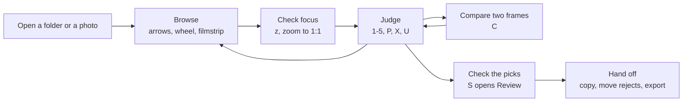

### The shared rules that decide what is allowed

Most "why can't I do this right now?" answers come from one of these. Each is a single named property or function, not a rule repeated in every control.

1. **Dialogs (`modal-open`).** `dialog-open` is true while the About card, Settings, the browse-speed panel (`loading-open`), a confirm dialog (`confirm-kind` not 0), the export sheet, the rotation reminder, the forget-display confirm or the Mac first-launch association prompt is open. `modal-open` adds the welcome guide, an unfinished-boundary loading wait, and, in **View only**, a photo-first open that is still scanning the folder (`opening-photo` and not `photo-open-edits`). Rating, marking, rotating, copying and the other edits read it; Rust reads it through `get_modal_open()`. Narrower gates sit beside it:
   - `inspection-blocked` = dialogs plus the welcome guide. Zoom, pan, Fit and 1:1 read it, so you can inspect the clicked photo while its folder is still loading.
   - `menu-open` = a photo menu, the Review-tile menu, the sort menu, the Open menu or the events dropdown. `popup-open` = `modal-open` or a menu; Home/End, undo and redo, compare swap and pin, the compare wheel and the hover preview read it. `photo-popup-open` = `inspection-blocked` or a menu; the arrow keys and the photo and filmstrip wheels read it, which is why a wheel notch over Settings or over a menu never changes the photo.
   - `modal-blocking` is the subset that draws a full-window dimmed layer: About, confirms, the rotation reminder, the export sheet, forget display and the association prompt. It mutes the toolbar's panel buttons, and together with the welcome guide and the pointer it freezes the toast countdown.
   - The full-screen key has its own gate, `modal-open-fs`. On Mac it leaves out the welcome guide, so **F** works on the welcome screen.

   The exact definitions and a diagram of how the gates combine are in [Input gates](#input-gates).
2. **Compare (`compare`).** Entering compare makes the selection controls and bulk keys dormant, points rating and marking at the focused half, and hides the immersive cull card. Leaving restores all three.
3. **Immersive (`immersive`).** Hides all chrome, keeps rating and marking keys live, makes the same selection controls dormant, and leaves the corner controls as the only confirmation.
4. **Selection armed (`bulk-actions-armed`)** = something selected, not in compare, not immersive. This one term decides whether **p / x / u / 1–5 / r / Del / Ctrl+C** act on one photo or on the whole selection, so every plural menu label and shortcut hint must agree with it. The photo menus add one more term: counted rows appear only when the menu's own photo is selected and at least two are selected (`ctx-plural`).
5. **The publish gate** — the only rule the user cannot see. It decides what Falcon may do for photos nobody has asked for yet (preparing ahead) while a hand is on the mouse. `speculative_publish_arm` picks a row (`GateArm`: `Sheet`, `Browse`, `Gesture`, `Tail`, `Quiet`, `Disarmed`, `Efficiency`) and each row maps to one answer (`PublishGate`: `Full`, `Pace` or `Park`). **It never delays what the user asked for:** the displayed photo, both on-screen compare halves, the Review tile under the pointer and the frame a paused browse is waiting for are exempt at every holding site through one object, `support::ExplicitSet` (built on `displayed_shot` and `fast_evict_protected`). See [Rationing work ahead of the user](#rationing-work-ahead-of-the-user).

### One panel at a time

Settings, the browse-speed panel and the Review panel share the top-left area: opening one closes the others. Every place that opens one records whether it closed another first (`panel-switch`). A switch shows the new panel at once; only an open from nothing slides in, and only when **Interface motion** is on. The info and image/RAW panels float independently, and the grid dock is separate.

### Interactions worth stating outright

Each of these is a real, deliberate coupling.

| When this is true… | …this changes |
| --- | --- |
| Something is **selected** | Rating, marking, rotating, deleting and Ctrl+C act on the selection. The Review panel shows its hidden **Selected** filter. The photo menus show counted rows that say what they will do ("Flag 12", "Delete 12 photos…", "Rotate 12 right", "Reveal 12 in Explorer"; the Mac menu bar says "Flag 12 Photos", "Rotate 12 Photos Right"). **r / Shift+R** turn the whole selection as one undo step. |
| **Compare** is on | Selection and bulk keys are dormant; rating and marking act on the focused half; Ctrl+wheel always zooms in; the immersive cull card and the hover preview are off. |
| **Immersive** is on | All chrome hides and corner controls appear on hover; selection and bulk keys are dormant; the Review panel is removed, not just hidden; on a Mac the window's full-screen state changes too (see [Platform rules and the Mac](#platform-rules-and-the-mac)). |
| **Settings** is open | The dialog gate blocks the action keys and the photo wheels. Preparing ahead is slowed, not stopped: at most one prepared full-resolution frame is shown every 250 ms (`SETTINGS_PUBLISH_PACE_MS`). |
| The user is **gesturing** (pan, zoom, panel or strip scroll) | Preparing ahead parks: no new prepared full-resolution decodes, finished ones are held, a bounded drain continues, and the preview tier holds too (`fast_speculation_held`). It eases back through a paced tail: parked for 0.9 s after the last input, paced until 3 s. |
| A photo-first open is still **scanning the folder** | In View only, edits wait (`modal-open`); zoom, pan and browsing the verified nearby photos work; sorting and selection gestures wait. |
| **Efficiency mode** is active | Prepared full-resolution frames are paced (`GateArm::Efficiency`) and the browse rate has a lower ceiling (`EfficiencyLimits`); the displayed photo is never slowed. |
| **Auto-orient** is off | EXIF orientation is ignored; manual turns still apply. |
| **RAW mode** is on for a pair | The full-resolution tier develops the RAW while the preview tier still shows the finished image. That is why the full-resolution tier's RAM-cache shortcut is switched off in RAW mode (the `!raw` term beside `l2::full_res_serves`). |
| A shot is a **cloud placeholder** | Its failure card is the calm cloud. It is the one kind of file the scan may not read, so it keeps its extension's type and says so in one log line. A retry sweep clears its failure marks after 30 s, then 60, 120 and 240 s, up to five times (`CLOUD_RETRY_CAP`); a completed download is noticed at once and the file's bytes are then read to classify it (`reclassify_hydrated`). Copy and Move confirms count it as needing a download first. |
| The **output colour** (gamut or ICC profile) changes | `drop_developed_caches` drops every developed cache, every interface colour (48 theme tokens) is converted again (`apply_theme_transform`), and every `cm_bake_key` changes, so old colour bakes cannot be reused. See [Colour changes versus folder switches](#colour-changes-versus-folder-switches). |
| The **folder changes** | `apply_scan` closes any open confirm, forgets a pending delete, resets every tier, and drops the upload drain's carried work together with its in-flight marks. |

### Destructive acts: how you start them and how you get back

One severity rule applies everywhere: the consequential button carries the severity colour, **Cancel** is the quiet button, and **Enter never destroys**. In confirm dialogs Enter cancels, except the copy confirm (Enter copies, which only adds files) and the rotation reminder (Enter opens Review). No ring or marker shows which button Enter will press.

| Act | Start | Confirm | Way back |
| --- | --- | --- | --- |
| Rate, flag, reject | Key, photo menu, cull card, Review tile | None for one photo. For a selection, the ask-first question (`BulkAsk`) unless Direct bulk rating is on; it lasts 20 s, pauses under the pointer, and is cancelled aloud if another message replaces it. | **Ctrl+Z**, or press the same key again |
| Rotate | **r** / **Shift+R**, either photo menu; the whole selection when armed | None. An animated GIF in a selection is skipped and named in the finish message. | Rotate back; one **Ctrl+Z** undoes a whole batch; the original file is untouched until **Apply** |
| Apply rotations | Review panel → Rotations → **Apply** (or **Discard**) | A counted confirm. Closing the app with turns pending shows a reminder: **Open Review** or **Close anyway**. | None: this is the point of no return for the file. The JPEG patch re-reads the file and checks the current value before writing (compare-and-swap); an unusual file gets a sidecar instead, and a file that cannot be written keeps its pending turn. |
| Delete | **Del**, either photo menu | Three buttons; **Enter cancels** | The **Recover** toast or **Ctrl+Z**, from the Recycle Bin or Trash; a name clash is skipped, never overwritten |
| Empty to Recycle Bin / Trash | Review panel | Counted confirm | The system Recycle Bin or Trash |
| Copy, Move rejected | Review panel | Counted confirm, which also warns about unapplied rotations and about cloud files that must download first | **Undo** for a move; a copy only adds files |
| Write XMP sidecars for existing ratings | Turning **XMP sync** on | Confirm; Enter cancels | — |
| Web export | The export sheet | The sheet is the confirm, plus a collision confirm (**Cancel / Skip existing / Overwrite**) when the run would replace files of the same format in `./export` — a `.png` collides with a `.png`, not with the `.jpg` of the same name, because the run will not touch the `.jpg`. Progress with **Cancel**. | Cancel mid-run; files already written stay. **Overwrite** is the one export path with no undo, and its message says so. |
| Forget a display | Settings → COLOUR | `display-del-confirm`; Enter cancels | Detect the display again |

## What Falcon does not do

This is a statement about the product, not a to-do list. Everything here is deliberate, measured or a known limit. Each limit says what happens and why it is left as it is, so a later change does not rediscover it as a new bug. The work queue itself is kept outside this document.

### Deliberate gaps

- **No catalogue, library or database.** Falcon works on the folder in front of it. There is no import step, no library across folders, no keywords, captions or faces, and no rating search across shoots. Saved state is per folder: a review file beside the photos (`falcon_review_data.json`) and optional XMP sidecars.
- **No editing.** Rotation is the only change Falcon makes to an original photo. There is no crop, exposure or white-balance editing and no develop settings. RAW "development" means decoding for display or export with the camera's own white balance, not an editable recipe.
- **No stacking, virtual copies or collections** beyond ratings, flags, rejects and the selection.
- **Export is deliberately narrow.** Copy the displayed photos' original files, move the rejects away, or make new web copies in **JPG or PNG** (`WebFormat` in `falcon-decode`; sRGB, optional watermark, optional RAW development for RAW-only shots). There is no WebP export: the linked `image-webp` encoder writes only lossless WebP, and a useful lossy WebP would need libwebp, a C library, which would be a project of its own. There is no TIFF, PSD or GIF export: none of them is a format for handing photos over for the web, even though the `tiff` and `gif` libraries are already linked for decoding. There is no print module and there are no upload targets.
- **Accessibility is limited.** Only the menus carry accessibility labels, and there is no tested screen-reader support. Falcon is designed for visual, pointer-first use; keyboard shortcuts speed it up but do not form a complete keyboard-only path.
- **Distribution.** Windows ships as one portable `.exe`: no installer and no code signing, so Windows may warn before the first run. The Mac app is ad-hoc signed (signed without a paid Apple identity) but not notarized, so macOS asks once per build ("Open Anyway"). The Windows build links its C runtime statically, and the newer per-display colour functions (`ColorProfileGetDisplayDefault`, `ColorProfileGetDisplayUserScope`) are looked up at run time from System32 only (`bind_modern_icc`), so Falcon also starts on Windows 10 and falls back to the older per-device profile there.

### Colour, stated exactly

A source file's colour space is decided by its profile's colorants (the measured primaries), not its name. A matrix-and-curve profile that matches no named space is drawn through its own colorants and curves (`Gamut::SourceIcc`). The limits:

- at most 64 such profiles per session (`SOURCE_PROFILE_CAP`);
- a profile whose white point is neither D65 nor D50 is refused (`FaithfulRefusal::NonAdaptableWhite`), which keeps true DCI-P3 content correct;
- a profile without a usable tone curve falls back to the older name-based routes;
- on Windows the zoomed-region path does not use the hardware HEIC lane (`heic_zoom_accelerated()` is true only on Mac);
- under Windows Auto Colour Management or HDR, Falcon does not colour-manage the display at all. Windows already maps SDR windows, so a second transform would convert twice; Auto-detect chooses sRGB and names the mode instead;
- Falcon has no HDR output, and HDR (PQ/HLG) JPEG XL files show as unsupported.

See [Colour](#colour) for how the pipeline works.

### What still differs by platform

These are current design facts, not unfinished work:

- The hardware HEIC lane exists only on Windows (`hwheic::lane_admits` is a `false` stub elsewhere); the Mac decodes HEIC through Image I/O.
- The colour-settings watcher is Windows only; the Mac listens for display changes instead.
- The Mac has no Battery saver signal, so Efficiency mode's Auto follows only the power source there.
- The GPU backend choice (Auto, Vulkan or DX12) is Windows only; the Mac always uses Metal.
- On a normal Mac build the CPU RAM frame cache (L2) is off. Mac memory is unified (shared by CPU and GPU), so a CPU byte cache would double-book the memory the Metal working-set budget already governs. The developer setting `FALCON_CLASSIC_POOLS=1` restores the Windows-style pools and the cache. The Mac's available-RAM probe (`host_statistics64`) still feeds the elastic decode-pool governor's memory-pressure input.
- Neither platform has paid code signing.
- Copying files to the clipboard, reveal and open in Finder (`/usr/bin/open`, with the child process reaped so no zombie process is left) and Trash recovery are full equivalents of the Windows features.

### Known limits in everyday use

#### Input and interaction

- **A very still zoom-drag eventually releases background work.** While the user drags a zoomed photo, `fast_hold_engaged` holds back preparing-ahead work so that it does not compete with the gesture. Every pointer event restarts the clock: preparing ahead stays parked for 0.9 s after the last movement (`INTERACT_PARK_WINDOW_MS`) and returns to full speed after 3 s (`INTERACT_PACE_TAIL_MS`). If the user holds the button down without moving for longer than 3 s, background work resumes at full rate while the button is still down. The cause is that `main_window.slint` provides `pan-start`, `pan-move` and `pan-reset`, but no `pan-end` and no "button is down" state, so Rust cannot tell "holding still" from "let go". (The filmstrip does have this state, as `film_dragging`.) The structural fix is a pan-end or press-state callback from the interface.
- **While Settings is open, the publish gate stops at its first row** (`GateArm::Sheet`), so no gesture parks anything during that time.
- **The compare wheel can still drop a single notch when the browse target is below about 7 fps.** The paced step is then longer than the 140 ms after which a quiet wheel's leftover notches are discarded (`HOLD_TIMEOUT_MS`).
- **While a photo-first open is still discovering the folder,** plain browsing of the verified nearby photos works, but the selection preview and drag-to-compare are not offered yet; unavailable thumbnail edits show the disabled colours and swallow clicks. See [Opening and inspection](#opening-and-inspection).

#### Files and formats

- **Select new / edited** compares each file's size and modification time with the export manifest and keeps no clock of its own, so a cloud sync that touches files can make them look edited.
- **Cloud-placeholder detection reads file metadata only,** so it cannot see a file that is partway through downloading.
- **A cut-off JPEG looks like a normal photo.** When a JPEG ends early (a missing end marker, an interrupted copy or sync), the pure-Rust decoder refuses it. `decode_jpeg_arm` in `falcon-decode` then gives the operating system's codec a second chance (`os_codec_decode_rgb`), but only for that error class (`jpeg_err_is_truncation`) and only for a real standalone file (`shot.has_jpg`). A RAW's embedded preview never gets the second chance, and genuine corruption still fails. The OS codec decodes what arrived and fills the missing rows (grey on Windows). Nothing on screen says the picture is incomplete; only the optional diagnostic log has a `jpeg-truncated` line, capped at 200 per session. The suggested fix is an "incomplete file" note on the info panel and badge, using the same mechanism that already shows a misnamed file as `PNG 893 KB (named .JPG)`.
- **AVIF and TGA are recognised but not decoded.** The byte check identifies AVIF as `SrcKind::Unsupported`, and the `.avif` and `.tga` extensions get the same verdict (`UNSUPPORTED_IMG_EXTS`). HDR-to-SDR handling for AVIF has not been designed, and Falcon never silently clips HDR. A `Shot` carries no format name for an unsupported file, so menus and badges use generic wording instead of naming a format they cannot open.
- **`is_heic_path` checks only the extension, on purpose.** It drives the start-up HEIC codec check, which must run on a Windows machine with no HEIF codec, where the scan classifies the same files as unsupported. As a result, a HEIC renamed to `.jpg` does not trigger the check, although the scan still classifies the file correctly by its bytes.
- **The byte check decides how a file is decoded, not whether it is listed.** It runs only for names that already pass the folder scan's image-extension filter, so a PNG named `scan001` or `page.dat` stays invisible.
- **Fujifilm X-Trans RAW files** are developed on the CPU with Markesteijn demosaicing (a high-quality method for Fujifilm's 6×6 sensor pattern), for both viewing and export (`xtrans.rs`). The RAW library's default for X-Trans is a simpler bilinear method, which gives a green colour cast. This path is verified on a real X70 file and on synthetic phase, colour and crop cases; it is not certified for every Fujifilm model.
- **Two Falcon windows on one folder.** Falcon keeps `open_folders.json` in its configuration folder, so that a second running copy can warn that a folder is already open ("review edits … are last-writer-wins"). Each copy refreshes its entry every 25 s (`heartbeat_open_folder`); an entry older than 90 s (`OPEN_FOLDER_STALE_MS`), or one from a process that has exited, is ignored. The heartbeat and folder-open writes go through the durable writer; only the removal at exit writes inline, because it runs after the writer has been drained. The update is a read-modify-write with no lock between processes. If two copies write at the same moment, one entry can be lost. It corrects itself at the next heartbeat, and the only cost is a missed or spurious warning.
- **No directory flush after an atomic write.** `write_atomic` writes a uniquely named temporary file, synchronizes it and renames it over the target. On macOS only, when the full-sync operation returns `ENOTSUP` (as on some writable SMB shares), it requires ordinary `fsync` to succeed instead. Other errors still fail; the fallback cannot promise the stronger physical-device flush guarantee. Review JSON, XMP sidecars and JPEG orientation patches share this synchronization helper. A failed temporary-file write, sync or rename removes only its own temporary file and preserves the previous target. Nothing flushes the parent directory after the rename, so on some file systems a power cut just after the rename can still lose it.
- **Interrupted copy and export recovery is a timeout rule.** A leftover `.part` claim is recovered only when it is at least 60 seconds old. That is a heuristic, not proof that the writer stopped: a live writer stalled for longer can still race the recovery, and there is no lock between processes. See [File operations, delete and recovery](#file-operations-delete-and-recovery).
- **A Mac logout may report that Falcon interrupted it,** because the quit handler cancels the system's quit and Falcon then exits by itself after saving. See [Shutdown order](#shutdown-order).

#### Export limits

- **The cancel message:** a cancelled run's message (`Export cancelled — N written before stopping`, plus a failure count) does not say how many written files came from camera previews or RAW development. The run's diagnostic log line does (`… from camera previews, … developed from RAW`).
- **The manifest:** the export manifest (`falcon_export.json`, one `ManifestRec` per file with size and modification time) does not record where the pixels came from, and the file name is the same either way. When the export folder is reopened later, a camera-preview file and a finished-image file look identical.
- **Camera-preview colour:** a camera preview is always treated as sRGB. `shot_source_gamut` returns `Gamut::Srgb` for any shot without a decodable finished file (`!has_jpg`) and does not read the embedded preview's own colour tag. A camera set to Adobe RGB embeds an Adobe RGB preview, which then exports unconverted under an sRGB tag. The fix is to read the embedded JPEG's colour tag.
- **What PNG keeps.** PNG export keeps transparency and 16-bit depth wherever Falcon owns the decode. Known gaps:
  - **Windows HEIC:** `wic_decode_rgb24` asks Windows' converter for 24-bit RGB, so transparency and 10/12-bit depth are lost before Falcon sees a pixel. The export log says so once per run (`heic_keep_note`). Keeping them needs a second converter target, chosen after a `GetPixelFormat` probe, and a test HEIC that actually has alpha or extra depth.
  - **macOS HEIC:** Image I/O draws into an 8-bit-per-channel bitmap, so transparency reaches the PNG but extra depth does not. A 16-bit drawing path has not been built, because it cannot be run or measured from the Windows build machine.
  - **Unusual TIFFs:** the pure-Rust path covers every 8- and 16-bit RGB, RGBA and grey TIFF. What falls through to the OS codec (bilevel, CMYK and unusual layouts) keeps neither alpha nor depth.
  - **JPEG XL:** the 16-bit path reads the same stream as `u16` instead of `u8`. The tree has no JXL encoder, so no test file exercises this path.
- **What PNG costs.**
  - **Memory:** rotating by 90°, 180° or 270° costs one full-frame copy, because `rotate_samples` cannot rotate in place. A 16-bit PNG decode briefly holds two frames (the big-endian buffer and the `Vec<u16>`). The `png` 0.17 single-call encoder builds the whole compressed file in memory before writing it. A full-size 16-bit export of a 45 MP photograph peaked at about 1.9 frames (about 683 MB), and at about 4.1 frames (about 1.46 GB) on content that does not compress. The crate's `StreamWriter` would stream, but it uses a different compressor and would change the bytes of every PNG.
  - **Compression level:** PNG export sets `Compression::Fast` explicitly. Measured on a 45 MP photograph resized to 4096 px, Fast took 68 ms for 28.1 MB and Default took 1,194 ms for 21.3 MB. A file a quarter smaller is not worth 17 times the encode time for photographs. Flat graphics would be better served by Default.
  - **What the user sees:** the watermark stays visible over transparent areas. A full-size 16-bit PNG can be about a quarter of a gigabyte, and only the log's byte count says so.

### Known limitations and accepted trade-offs in the design

These are parts of the engine that are knowingly unfinished or deliberately accepted.

#### One decoder interface, but no single decode layer

`ImageDecoder` (`falcon-decode/src/decode.rs`) is the per-worker interface for finished images (not RAW). It has two main calls:

- `decode_scaled` returns a picture at least as large as the requested size, for display.
- `decode_full` returns the full-resolution RGB that the zoom cropper works from.

`decode_yuv` adds planar YUV (brightness and colour stored separately) for decoders that can produce it. A decoder that cannot handle a file returns `DecodeError::Unsupported`, and the caller falls back to `CpuDecoder`. The fallback is chosen by return value, never by `#[cfg]`.

Four decoders implement it:

- `CpuDecoder`: the portable pure-Rust path. It is the only decoder the fast-preview and thumbnail tiers use.
- `NvJpegDecoder`: NVIDIA JPEG decoding on Windows.
- `WicDecoder`: Windows' own codecs. Today only the opt-in colour-managed CMYK JPEG route uses it.
- `ImageIODecoder`: macOS Image I/O.

The full-detail worker and the zoom worker each own one accelerated decoder plus the CPU fallback. Two things sit outside the interface: RAW development, which is a separate demosaic pipeline, and the Windows hardware HEIC path, which enters `falcon-decode` through a hook that `native/hwheic.rs` installs. So there is no single decode-tier abstraction above the workers. Whether to build one, now that both platforms ship, is an open design question.

#### Adding a file format is a checklist

Every `match` on `SrcKind` is exhaustive, so a new variant does not compile until each one handles it (for example `kind_tag`, `file_color_tag` and the decode dispatch). The file-extension lists are not checked by the compiler:

- `JPEG_EXTS`, `PNG_EXTS` … `UNSUPPORTED_IMG_EXTS` in `falcon-decode/src/lib.rs` are plain string lists. They are read by `is_known_image_ext`, by the scanner's extension ladder in `scan_catalogue_subset`, by `FolderCatalogue::simple_candidates` and by `single_photo_candidates`.
- The platform association code keeps its own lists (`file_icons.rs`, `windows_assoc.rs`, `mac_assoc.rs`).
- The byte check (`sniff_kind`) needs the new format's signature.

Adding a format means visiting each of these by hand.

#### The save queue has no length limit

Most worker request channels are plain `mpsc` channels (unbounded queues between threads), but each is limited in practice by the caller's bookkeeping: a request is recorded as pending or in flight before it is sent, and the same photo is not requested twice. Result and upload channels have a fixed size (`sync_channel`).

The durable writer's queue (`WriteMsg`, `writer_loop` in `support.rs`) is the exception. It keeps every save, in order, so only the disk's write speed limits its length. This is deliberate: a save must never be dropped.

Related limits that do exist:

- The date-taken memo (`TAKEN_CACHE`) has a size cap (see [Switching folders](#switching-folders)).
- `settings.json`, the folder's review file and the export manifest each refuse to read more than 16 MiB (`CONFIG_MAX_BYTES`, `SELECTION_MAX_BYTES`, `EXPORT_MANIFEST_MAX_BYTES`).

#### Hardware acceleration answers that are fixed at compile time

The rule is that knowing a hardware path exists is not the same as knowing it is serving this folder, and only the second may change scheduling.

On Windows, `support::heic_fast_accelerated()` follows the rule. It is true only when both of these hold:

- The hardware HEIC lane is alive (`hwheic::lane_live`).
- The lane is serving this folder (`HwService::Serving`). A folder earns this after `HW_SERVICE_PROMOTE` (2) hardware-served decodes and loses it again when declines dominate.

Every folder therefore opens with the conservative schedule for costly HEIC. On a folder the lane declined, trusting the lane's mere presence made fast browsing 4.3 times slower than with the lane switched off.

Three answers still do not follow the rule:

- `heic_fast_accelerated()` is always true on macOS (`cfg!(target_os = "macos")`). Image I/O has no per-file decline, so there is no service question to ask yet, but the answer is still a claim, not a measurement.
- `support::heic_zoom_accelerated()` is just `cfg!(target_os = "macos")`. On Windows the zoom path (`decode_full_rgb` → `decode_source_rgb`) never uses the hardware HEIC lane, so zooming a HEIC waits for a full software decode. The speed popup says so (`zoom_sharp_slow_note_for`). Switch this function to a per-folder service test when the zoom path is routed to the hardware lane, and not before.
- `hwheic::lane_admits()` returns a flat `false` on every platform except Windows.

Each of these is a scheduling decision. Replace them with runtime tests of whether the lane is actually serving. See [Windows HEIC hardware decoding](#windows-heic-hardware-decoding).

#### The rescan after a file operation runs on the interface thread

After a delete, move or undo, the operation stores a request in `reload_req`. The next tick runs the synchronous `reload` in `main.rs`, but only if the user is still on that folder (checked with `last_scanned_dir.still_on_screen`). `reload` calls `falcon_decode::scan_folder_with_metadata` on the interface thread.

That scan reads the first bytes of every file again to classify it by content. It has no memory of the reads it made a moment earlier: `FolderCatalogue` keeps header results only for one opening.

Measured on a local SSD, this costs about 15 µs per file and is not noticeable. On a network share it costs one round trip per file. On a cold external hard disk it costs one head seek per file, so the interface can pause.

Possible fixes:

- Make the rescan adaptive, with a slow-drive fallback and a short-lived memo of the reads.
- Move the content read to the photo's first decode.

A memo is a cache, so its invalidation (for example, a file replaced under the same name) needs a design, not a one-line change. Changing when files are classified is a product decision, not a refactor.

#### No RAM keep-alive for full-detail frames, and no disk cache

The RAM cache (`L2Store` in `l2.rs`) keeps decoded fast-preview frames after their GPU textures are evicted. Going back to a photo then re-uploads it from RAM instead of decoding it again. Its normal budget is the smaller of 25 % of RAM and 8 GiB, and it shrinks under memory pressure.

Full-detail frames have no RAM keep-alive of their own. The detail tier may reuse an existing RAM entry only when `full_res_serves` confirms that the entry really is the sharp frame: the right source and enough pixels.

A disk (SSD) cache tier was rejected. Reading a decoded frame back from an NVMe drive costs about as much as decoding it again, and RAM can already hold whole folders. Falcon saves no thumbnail or preview cache between sessions, so opening a folder for the first time (cold) and opening it again (warm) are different measurements. See [Memory: GPU budgets, RAM cache and recovery](#memory-gpu-budgets-ram-cache-and-recovery).

#### Zoom decodes on NVIDIA do not limit the source size

The zoom worker's NVIDIA YUV route checks only that the requested crop fits its output size (the `fits` test in the zoom worker). It then calls `decode_full_yuv(&bytes, 0)`, where `0` means no limit on the source's long side.

Today this fails safely. nvJPEG's own support check, or a failed GPU allocation (`ensure_dev`), returns nothing, and the worker falls back to the RGB route. On a card with a lot of video memory, it is still an unbounded full-source decode.

#### Folder switching is only partly guarded by the compiler

Most per-folder state lives in owner structs whose reset the compiler helps enforce, but some is still reset line by line. See [Folder switching is only partly compiler-guarded](#folder-switching-is-only-partly-compiler-guarded).

#### Accepted trade-offs

| Trade-off | What happens | Why it is accepted |
| --- | --- | --- |
| Start-up preview size | `boot_scrub_dim_for` sizes the first previews from the screen, clamped to `SCRUB_DIM_MIN`..`SCRUB_DIM_MAX` (2048–2880 px). Once browsing has stopped for 250 ms, `step_adaptive_res` re-sizes them from the window. | Only the first fraction of a second uses the start-up size. |
| File-extension lists | See [Adding a file format is a checklist](#adding-a-file-format-is-a-checklist). | The compiler checks the `SrcKind` matches; only the lists are maintained by hand. |
| Custom display profile key | `Gamut::Custom` carries no data. A counter (`custom_profile_gen` in `falcon-color`) changes whenever the profile changes, so caches keyed on `Gamut` drop pixels converted with the old profile. Source profiles do carry data: `Gamut::SourceIcc(u16)` indexes a registry of embedded profiles. | Correct, but the key alone does not prove it. |
| One toast at a time | Toasts show one card at a time (`write_toast_card`). The events centre (the bell) is the lasting record, fed by `step_notifs` and `log_event`. Each call site decides whether a message reaches the bell. | It works, but a new failure path tends to default to the log only. |
| Three browsing-speed signals | `scrub_vel` (prefetch direction, `momentum_split_ahead`), `nav_rate` (whether to delay the detail settle) and the `SETTLE_MS` (150 ms) windows are measured separately. | They decide different things for different tiers, so they never contradict each other on screen. A change to `SETTLE_MS` moves all three. |

Already single-sourced and described elsewhere: the colour-management shader core ([Colour](#colour)); `drop_developed_caches` ([Colour changes versus folder switches](#colour-changes-versus-folder-switches)); the `modal-open` gate ([Input gates](#input-gates)); the exhaustive `is_fast_lane` upload split ([Worker rules](#worker-rules)); the size-tagged fast cache ([Decoding and display](#decoding-and-display)).

## Source map

Paths are relative to `falcon/native/src/` unless shown in full.

| Responsibility | Source |
| --- | --- |
| Constants, `fn main`, window setup, platform events and the interface callbacks (`app.on_…`) | `main.rs` |
| The tick: collecting worker results (`drain_*`), showing them, and the ordered per-tick steps (`step_*`) | `tick.rs` |
| Shared types and helpers: settings, saved review data and the durable writer (the save queue), selection and undo, file operations and export runs, the publish gate and `ExplicitSet`, colour and display helpers, the string builders, and the Mac in-window title-bar fallback (the `mac_titlebar` module) | `support.rs` |
| Opening the clicked photo first, then the folder; zoom and pan while the folder loads | `photo_open.rs`, `inspection.rs` |
| The decode tiers, one owner each: browsing previews (`FastTier`), full detail including RAW development (`DetailTier`), zoomed regions (`RoiZoom`), thumbnails and the blur source (`Film`) | `fast.rs`, `detail.rs`, `roi.rs`, `film.rs` |
| RAM keep-alive cache for decoded frames (`L2Store`, called L2) | `l2.rs` |
| Per-photo metadata and each photo's source-colour record (`PerShotMeta`) | `meta.rs` |
| View and navigation state reset on a folder change (`ViewReset`); accepting a change of the Preview/RAW selector (`accept_raw_mode`) | `view.rs` |
| Windows hardware HEIC decoding: capability probe, sessions and the decode hook | `hwheic.rs`; `falcon/crates/falcon-hwdec/` (`hevc.rs`, `session.rs`, `dxva.rs`, `photo.rs`) |
| Mac decode-pool sizing: the elastic pool governor, as pure state machines that Windows never builds | `pool_gov.rs` |
| Energy-saving (Efficiency) mode | `efficiency_mode`, `efficiency_engaged`, `efficiency_scrub_cap`, `efficiency_limits`, `efficiency_publish_arm` and the power watcher (`start_power_watch`) in `support.rs`; `effective_scrub_fps` in `tick.rs` |
| The tick's full and idle rates | `TickPosture` in `main.rs`; `TICK_FULL_MS`, `TICK_IDLE_MS` and `tick_wants_full` in `support.rs` |
| Temporary developer posture benchmark: measures worker widths and CPU classes and only writes diagnostic log lines; it schedules nothing | `posture.rs` |
| Wording, glyphs and labels that differ by platform (`PlatformStrings`, `PLATFORM`) | `platform.rs` |
| RAW-only export policy and progress | `raw_export.rs`; RAW development in `falcon/crates/falcon-decode/src/raw_export.rs` and `xtrans.rs` |
| Menu blur (the frosted glass behind menus and panels); an opt-in capture hook for checking it, which is the only code that reads the GPU back | `backdrop.rs`, `glass_blur.rs`; `menu_probe.rs` |
| Optional diagnostic logging and its permission gate (`LogGate`); log lines queue as `WriteMsg::Log` | `diagnostic_log.rs`; `support.rs` |
| About card | `about.rs`, `ui/about.slint` |
| Languages: choosing one, message lookup (`tr`, `tr_format!`, `tr_plural!`, `tr_noop!`), the Settings picker; plural rules; turning packs into bundled translations | `i18n.rs`, `i18n_rules.rs`; `build_translations.rs`; `translations/`; `scripts/check-translations.py` |
| Windows file associations, the icon helper and per-format shell icons | `windows_assoc.rs`, `windows_icon_bridge.rs`, `file_icons.rs`; `falcon/native/shell-icons/` |
| Mac default-app settings (LaunchServices) and Finder's open-document events | `mac_assoc.rs`, `macos_open.rs` |
| Mac menu bar: what the menus contain and enable (pure, tested on Windows), and the native menu | `menubar_model.rs`, `mac_menu.rs` |
| Mac title-bar toolbar: route choice, the AppKit host and the hidden toolbar window (`mac_titlebar_window_attributes` in `main.rs`). The word "experiment" in these names does not mean optional: this is the normal Mac toolbar. Diagnostic-only variants sit beside it. | `mac_experiment.rs`, `mac_experiment_native.rs`, `ui/mac_toolbar.slint`; diagnostics: `mac_chrome_compat.rs`, `mac_experiment_ui.rs`, `ui/mac_experiment.slint` |
| Interface markup (18 `.slint` files). `MainWindow` (`main_window.slint`) holds state, panels and the input gates; `MainToolbar` (`toolbar.slint`) is the shared toolbar. `ui.rs` compiles the markup and exposes its types to Rust; it contains no markup. | `falcon/native/ui/`; `ui.rs` |
| File-type detection, folder scan, decoding and the export encoders (`lib.rs`); the finished-image decoder interface (`decode.rs`); bounded header reads (`scan_io.rs`); HEIF grid parsing (`heif_grid.rs`); NV12-to-RGB conversion (`yuv_kernel.rs`); rotation write-back and XMP sidecars (`apply.rs`); RAW development for export and for X-Trans (`raw_export.rs`, `xtrans.rs`) | `falcon/crates/falcon-decode/` |
| Colour spaces, ICC profiles and transforms | `falcon/crates/falcon-color/` |
| GPU work: RAW development on the GPU (`lib.rs`), HEIC tile assembly (`heic.rs`) and banded read-back planning (`band.rs`) | `falcon/crates/falcon-gpu/` |
| Optional NVIDIA JPEG decoding | `falcon/crates/falcon-nvjpeg/` |
| Libraries carried with Falcon's changes: winit, the window library, changed for the Mac title-bar toolbar; and zune-jpeg, a JPEG decoder. Falcon's own JPEG viewing uses `jpeg-decoder` (plus nvJPEG on Windows and Image I/O on Mac). zune-jpeg is linked only through the `image` library that rawler (the RAW library), Slint and resvg use; its only known route at run time is rawler's `raw_image()` for DNG files whose raw data is lossy-JPEG compressed. Falcon never calls rawler's preview functions. See [Public source and release packaging](#public-source-and-release-packaging). | `falcon/vendor/winit/`, `falcon/vendor/zune-jpeg/` |
| Tests outside the source files: the Mac title-bar move test and the opt-in Windows Shell icon tests | `falcon/native/tests/mac_hosted_view.rs`, `falcon/native/tests/windows_shell_icons.rs` |

The full list of Mac-only modules is under [Platform rules and the Mac](#platform-rules-and-the-mac).

### Where common feature requests start

Confirm each symbol in current source before relying on it.

| Feature area | Where to start |
| --- | --- |
| Rebindable shortcuts | `ACTIONS` in `main.rs` lists the 17 printable-key culling actions (id, label, default key) shown in Settings → CONTROLS, including **f** for immersive mode. `BASIC_ACTIONS` lists the seven system keys — previous, next, first, last, compare swap, compare pin and delete (by default ←, →, Home, End, Tab, Space and Del) — which are rebindable in Settings → BASIC SHORTCUTS after pressing Edit. Esc, the grid's ↑/↓, F11, ⌃⌘F on Mac and mouse clicks stay fixed. The `FocusScope` in `main_window.slint` matches key presses against key properties that `support::refresh_basic_keys` keeps current. Tests: `keybind_tests` in `support.rs` and `action_default_keys_are_unique` in `main.rs`. |
| Saved settings and the Settings panel | The `Settings` struct in `support.rs`, saved as `settings.json` in the configuration folder (`config_dir`: `%LOCALAPPDATA%\Falcon` on Windows, `~/Library/Application Support/Falcon` on Mac). Settings widgets are in `ui/settings.slint`; the panel is laid out in `main_window.slint`. See the rules below. |
| Photo context menus | The menus behind `ctx-open` and `sel-ctx-open` in `main_window.slint`, built from `MenuItem`, `MenuSep` and `MenuHeader` in `ui/menu.slint`. Rust fills them through the `ctx-populate` callback and `support::ctx_populate_fields`. |
| Toasts and the events centre | `show_transient_toast`, `show_ask_toast` and `write_toast_card` in `main.rs`. `support::log_event` records a diagnostic line; it reaches `falcon.log` only when Settings → DEVELOPER → **Diagnostic logging** is on. |
| Export | The run, the collision check and file naming: `export_web_run`, `web_collision_scan`, `web_deliverable_name` and the folder name `EXPORT_SUBFOLDER` in `support.rs`. The pixel pipeline: `export_web_file` in `falcon-decode` (`export_web_image` is an in-memory entry used by that crate's tests). RAW-only policy and progress: `raw_export.rs`. The export sheet is in `main_window.slint`. |
| Mac menu bar | `menubar_model.rs` (what the menus contain and enable, tested on Windows) and `mac_menu.rs` (the native menu). |
| Wording that differs by platform | `PlatformStrings` in `platform.rs`. |

**Rules for changing saved settings.** All saved settings live in the `Settings` struct, so there is one place that cannot go stale.

- Every field has a default (`#[serde(default)]`), so an older or partial file that lacks a key loads that key's default.
- A renamed key is read once through `#[serde(alias)]` (for example `motion_toasts` → `motion_ui`) and written under the new name on the next save.
- Values that are launch defaults, such as the info panel's `info_view`, are passed into `build_settings` from their saved-preference cells, never read from the live interface property. Otherwise a temporary state on screen would become the next launch's default.

**Search for names, not line numbers.** Function and type names are stable; line numbers are not.

**Historical tags in source comments.** Comments in the source often carry tags from Falcon's development history: old version numbers, section marks (a § sign and a number) and short labels made of a letter and a number. They refer to internal development records that are not part of the public source. Read the explanation in the comment itself; the current code and this document are the reference.

## The tick, threads and workers

Falcon runs **one interface (UI) thread** driven by a repeating timer, the **tick**, plus several families of **worker threads** that talk to it over channels (a channel is a queue that one thread writes and another reads). Workers decode, scan and save; only the UI thread changes what is on screen. `main()` creates all shared state and hands it to the tick, which calls about 45 named steps (`step_*` and `drain_*` functions, mostly in `tick.rs`) in a fixed order every time it fires. The tick collects ("drains") worker results and checks each one before anything is shown ("publication"). Current-photo interaction takes priority over preparing neighbours and thumbnails; how much preparing-ahead work may run at any moment is explained in [Rationing work ahead of the user](#rationing-work-ahead-of-the-user).

Three safety rules apply to the whole tick:

- **The tick body runs inside `catch_unwind`.** A crash (panic) in one step costs that one tick, not the app. Unwinding releases every borrowed cell, so the next tick starts clean and the ~1 s autosave still runs.
- **Every lock tolerates a crashed thread.** Each `.lock()` and the `Condvar` wait recover a "poisoned" lock (one whose holder crashed) with `unwrap_or_else(|e| e.into_inner())`, so one worker crash cannot cascade.
- **A repeating crash is shown, not hidden.** After `PANIC_SURFACE_TICKS` (30 ticks, about 0.5 s) of consecutive tick panics, Falcon shows a "tick degraded" banner and saves the folder's review data directly (a rescue save), repeating every `PANIC_REFLUSH_TICKS` (300 ticks, about 5 s) while it continues. One clean tick clears the banner. The panic hook installed by `log_init` records a panic at most about once a second (when diagnostic logging is on), folding the rest into a "+N more suppressed" count.

Two things run before the guarded body on every tick. On Mac, `mac_experiment::sync_toolbar` copies the main window's state to the title-bar toolbar (it rides this tick; there is no second timer). If the rendering device has been lost (`should_halt_gpu_pumps`), the tick skips all work and asks the event loop to exit once, so Falcon can save state and show the restart prompt.

### Workers and publication

The diagram shows one tick's fixed step order (the groups follow the tick's timing labels, described below) and every worker family, with the channel each one uses and the step that sends to it or collects from it.

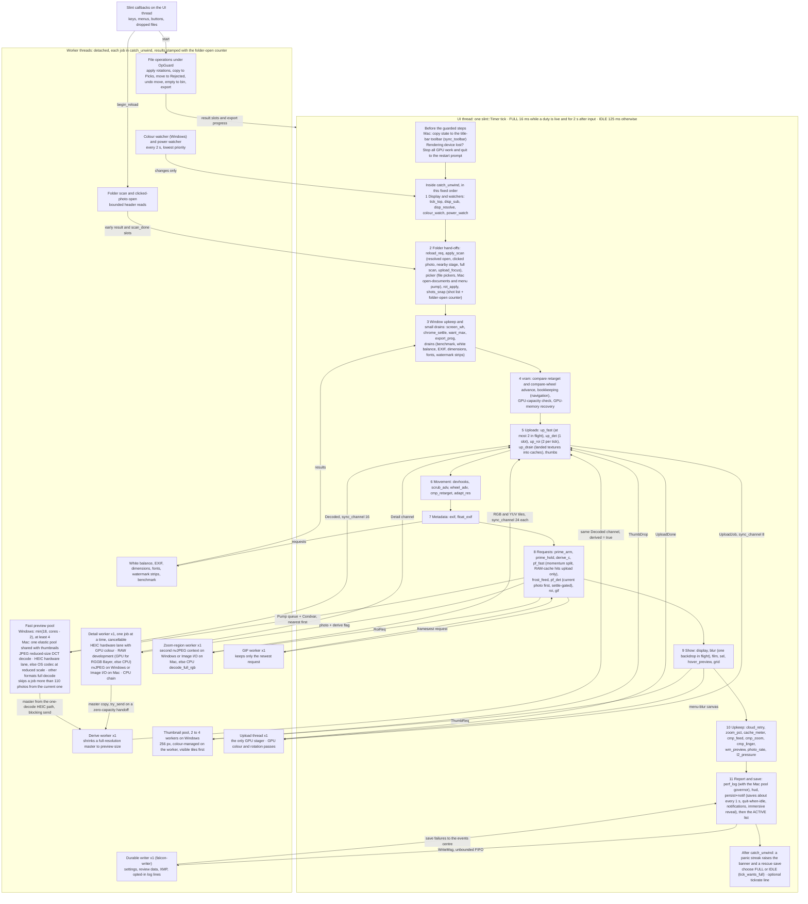

The UI thread collects every result and checks it (folder-open counter, photo and source identity, orientation, output colour) before it sends GPU work to the upload thread or shows anything. A finished worker job is not permission to replace the current photo. The queue limits bound how much work can wait; they never require a batch to fill before the clicked photo is shown. Navigation itself never decodes: input changes `current`, and the decode and GPU upload happen on later ticks. The per-tick path a pixel takes, from request to screen, is in [Decoding and display](#decoding-and-display).

### Tick rate: full and idle

The tick has two rates (`TickPosture` in `main.rs`; the constants and the rule are in `support.rs`). These rates are separate from Efficiency mode, the energy-saving setting.

| Rate | Constant | When |
| --- | --- | --- |
| Full, 62.5 ticks a second | `support::TICK_FULL_MS` = 16 | Anything is happening, or the last input was less than 2 s ago |
| Idle, 8 ticks a second | `support::TICK_IDLE_MS` = 125 | Nothing is live and the last input was more than 2 s ago |

- **Speeding up is event-driven.** The single `on_winit_window_event` hook calls `TickPosture::note_activity` *before* Slint handles the event, so the tick that serves a key press is at most 16 ms away even after an hour idle. Every window event counts except `RedrawRequested` (`support::winit_event_is_activity`): on macOS a redraw comes with almost every wake-up and would keep the tick at full rate forever.
- **Mac input that the main window never sees.** Two Mac input surfaces bypass the main-window hook: the native menu bar and the title-bar toolbar's own drawing surface. Both wake the tick themselves through `note_menu_activity`, so the first command after a quiet spell is handled within one fast tick, not 125 ms later.
- **Slowing down is checked by the tick itself.** Nothing produces an event when the last job stops, so at its tail, outside `catch_unwind`, the tick calls `support::tick_wants_full(active, since_activity_ms)`, which is `active || since_activity_ms < TICK_HYSTERESIS_MS` (2000 ms). A tick that keeps panicking counts as active (`"tick-panic"`), so a broken tick can never also go to sleep.
- **The timer handle is weak.** `TickPosture` holds a `Weak<slint::Timer>`. A strong handle would form a loop (timer → tick closure → posture → timer) and leak the whole tick closure, about 3,600 lines of captured state, for the life of the process.
- **The rate changes only on a real change.** `set_full` does nothing when the rate is already right, because `set_interval` restarts the timer and calling it every tick would drift the 16 ms period. Each real change writes one `tick: full|idle … (reason)` log line.

Tests in `support.rs` (`posture_tests`) pin the reasoning:

- The 2 s hold outlasts the longest tick-counted job that has no ACTIVE term of its own (the ~1 s settings save, `save_ctr >= 60`, that is `TICK_LONGEST_COUNTED_CADENCE_MS` = 960 ms) and the 700 ms `IDLE_DEEPEN_MS` gate, so such work always finishes on the 16 ms clock.
- The idle period is shorter than the smallest settle window (`SETTLE_MS` = 150 ms), the Mac full-screen poll (`FS_POLL_MS` = 250 ms) and the Mac pool governor's 1 s sample. Idling can delay a wall-clock window by one idle tick but can never skip it. 1000 ms divides into whole idle ticks (8 = 1 s housekeeping).
- The rule and constants are identical on Windows and Mac (`the_posture_decision_has_no_platform_arm`).

Measured on Windows with a folder open and the app idle: about 8 wake-ups a second (7.98 Hz) instead of 62.5, and idle CPU of 0.28 % instead of 0.69 % at a constant full rate. On an M4 Pro MacBook the same design cut idle wake-ups from about 64 to about 12 a second and reduced energy use about sevenfold. `FALCON_TICK_RATE=<seconds>` logs a `tickrate:` line with the actual rate, the current rate and what is holding it.

### What keeps the tick at full rate (the ACTIVE list)

Just before the rate decision, the tick asks "is anything live?" in one short-circuiting `if / else if` chain in `main.rs` (stored in `tick_active`). It is the most important list for energy use. A missing term makes something stutter at 8 Hz. A term that is stuck true keeps the app awake forever. So the chain returns the **name** of the first live duty, not just yes or no (`""` means quiet). That name appears in the `tick:` and `tickrate:` log lines, so a stuck term shows up in a single log line.

| Group | Terms (as named in the log) |
| --- | --- |
| 1. Gestures in progress | `key-hold`, `scrub`, `strip-drag`, `wheel`, `compare-wheel` |
| 2. Settle and pacing windows | `motion`: navigation from any source in the last 2 s (`last_motion`, restamped by `step_bookkeeping`); covers `SETTLE_MS`, 2 × `SETTLE_MS` and `IDLE_DEEPEN_MS` |
| 3. Animation this tick drives | `strip-glide` (measured movement, `support::film_glided`), `gif`, `gif-decode` |
| 4. Decode or upload in flight | `fast-pool`, `detail-worker`, `detail-cpu`, `roi-worker`, `detail-upload`, `detail-queued`, `fast-upload`, `thumb-pool`, `backdrop` |
| 5. Operations running | `export`, `bench`, `file-op`, `picker`, `scan`, `quit-pending` |
| 6. Countdowns counted in ticks | `cull-chip-linger`, `raw-peek-linger`, `info-stub-linger`, `compare-pulse`, `compare-hint`, `selection-flush` |
| 7. Window and startup deadlines | `open-priming`, `chrome-settle`, `display-move`, `display-retry`, `display-listener` |

There are 35 terms; a repeating panic adds `tick-panic` outside the chain. Rules:

- Slint's own `animate` bindings are not listed, because Slint schedules their frames itself.
- Toasts are not listed. A toast's countdown is wall-clock milliseconds, so an idle tick ends it within 125 ms of its deadline, and the click that raised it already holds full rate for 2 s.
- Group 6 exists because a countdown measured in ticks would *stretch* 7.8× at the idle rate, not just arrive late.
- The chain's only lock is a `try_lock` on the fast decode queue (`fast.pump`). `WouldBlock` counts as busy for that tick. A poisoned lock is recovered and read, so a crash while a worker held the queue cannot pin the app at full rate for the rest of the session.

### Why a polling tick, not a purely event-driven design

GPU uploads must be limited per frame, caches are trimmed against a budget that moves, and a fixed step order makes decode → upload → display predictable and measurable (`worst_tick_ms`, `worst_tick_step`). The cost is deferred work: input changes `current`, and the decode and GPU upload happen on later ticks, never inside the input handler. The idle rate removes only the wake-ups nothing was waiting for.

### Tick timing labels (`worst_step=`)

The tick times itself with the `mk!("label")` macro. Each `mk!` records the time since the *previous* `mk!`, so a label names a **span** of code, not a single function. If one label spans several steps, a slow tick gets blamed on the wrong step. The rule is **one label per step wherever a step can block**. There are 54 labels (`grep -c 'mk!(' falcon/native/src/main.rs`).

The always-on `perf:` line reports the slowest tick in its window as `worst_tick=` and the label of that tick's slowest span as `worst_step=`. The two are recorded together, so they always describe the same tick. Each label costs one `Instant::now()` and a comparison. `FALCON_TICK_PROF=1` also logs a `tickprof:` line with the six slowest spans for any tick slower than `FALCON_TICK_PROF_MS` (default 25 ms).

| Labels, in tick order | What the span covers |
| --- | --- |
| `tick_top` · `disp_sub` · `disp_resolve` | start of the tick; installing the Windows display-change listener; finding the active display and installing its colour (a Win32 display enumeration) |
| `colour_watch` · `power_watch` | draining the colour-settings watcher (Windows; a no-op elsewhere) and the power watcher (Windows and Mac) |
| `reload_req` · `apply_scan` | a pending reload; the folder swap: the resolved open, the clicked-photo and nearby results, the full scan (`apply_scan`), and publishing the photo on screen to the upload thread (`upload_focus`) |
| `picker` · `rot_apply` | file-picker results, plus on Mac the Finder open-documents queue and the menu-bar pump (`mac_menu::tick_pump`); finished rotation writes |
| `shots_snap` · `screen_wh` · `chrome_settle` · `want_max` · `export_prog` | the shot-list snapshot with the folder-open counter; the gated `current_monitor()` call; window-corner settle; the re-maximize watchdog; export progress |
| `drains` | six `drain_*` calls (benchmark, white balance, EXIF, dimensions, fonts, watermark strips) plus `start_wm_strips` |
| `vram` | `step_compare_retarget`, `step_compare_browse_advance`, `step_bookkeeping` (navigation), the GPU-capacity block, `step_vram_recovery` |
| `up_fast` · `up_det` · `up_roi` · `up_drain` · `thumbs` | sending fast, detail and zoom-tile uploads; collecting finished textures; `drain_thumbs` |
| `devhooks` · `scrub_adv` · `wheel_adv` · `cmp_retarget` · `adapt_res` | debug hooks; scrub and wheel advance; compare retarget; adaptive resolution |
| `exif` · `float_exif` | the compare info panel and `step_settle_exif`; the floating EXIF panels |
| `prime_arm` · `prime_hold` · `derive_c` · `pf_fast` · `frost_feed` · `pf_det` | folder-open priming; deciding whether to derive the current preview from detail; fast prefetch; the blur-source feed; detail prefetch |
| `roi` | `step_roi_single`, `step_compare_pan_reclamp`, `step_roi_compare` |
| `gif` · `display` · `blur` · `film` | GIF advance; display; the blurred backdrop; filmstrip |
| `sel` | resume memory, upload-problem notices, the Rejected-folder count check, `step_selection` |
| `hover_preview` · `grid` | `step_hover_preview` (must run after `step_selection`); the folder grid |
| `cloud_retry` · `zoom_pct` · `cache_meter` · `cmp_feed` · `cmp_zoom` · `cmp_linger` · `wm_preview` | one step each (`wm_preview` also refreshes the export sheet's captions while it is open) |
| `photo_rate` · `l2_pressure` · `perf_log` · `hud` | photos per second; RAM-cache pressure; the perf log (on Mac this span also contains the elastic pool governor's 1 s step); the HUD |
| `persist+notif` | `step_persistence` (~1 s saves), Developer change counts, the quit-when-idle gate, `step_notifs`, recovery availability, the last-action sentence, `step_immersive_reveal`. This is the one compound span left |

### Worker families

All workers are detached threads. Each job runs inside `catch_unwind`, and every lock tolerates a crashed thread.

| Worker | Count | Receives work through | Sends results through | Busy marker the tick reads |
| --- | --- | --- | --- | --- |
| Fast decode pool (browsing previews) | Windows: `decode_pool_workers(cores, pool18)` = `min(18, cores − 2)`, at least 4 (with the Legacy **Decode pool: 18 workers** setting Off, `cores.clamp(2, 16)`). Mac: the elastic pool below | `fast.pump`, a `(Mutex<Pump>, Condvar)` queue popped nearest-first by `support::pump_pop`. A queued job more than `DROP_DIST` = 110 photos from the current one is dropped, unless it is the hover preview's request (`support::fast_job_stale`) | `sync_channel::<Decoded>(16)` | `pump.inflight`, `pump.costly_inflight` |
| Mac elastic pool (normal Mac builds) | Between a floor taken from the saved benchmark and the performance-core count; `MacPoolGov::step` adjusts it once a second (see [Rationing work ahead of the user](#rationing-work-ahead-of-the-user)) | Serves both the fast queue and thumbnails. Slot 0 prefers thumbnails, the other slots prefer fast work, and each steals the other kind when its own queue is empty. `FALCON_CLASSIC_POOLS=1` restores separate fixed pools sized as on Windows | as the fast and thumbnail pools | as those pools |
| Derive | 1 | `sync_channel::<DeriveJob>(0)`, a zero-capacity handoff (see below) | the fast pool's `Decoded` channel | none, on purpose |
| Detail (full resolution) | 1, one job at a time, cancellable (`det_epoch`) | `channel::<(usize, bool)>` (photo, derive a preview too?) | `channel::<Detail>` | `det_busy`, `det_cpu`, `det_sent`, `detail.uploading` |
| Zoom region (ROI) | 1, one job at a time | `channel::<RoiReq>` | `sync_channel::<RoiRes>(24)` and `sync_channel::<RoiYuvRes>(24)` | `roi_busy` |
| Thumbnails | Windows: available cores ÷ 4, clamped to 2–4 (`spawn_fixed_thumb_pool`); Mac: the elastic pool | One shared `support::ThumbQueue`, which hands out explicit requests before speculative ones | `channel::<ThumbDrop>` | `film.pending` (and `film.failed`) |
| White balance, EXIF, dimensions | 1 each | `channel` | `channel` | `meta.wb_requested`, `meta.exif_requested`, `meta.dims_requested` |
| Upload | 1; the **only** thread that stages GPU textures | `sync_channel::<UploadJob>(8)` | `channel::<UploadDone>` | `fast.uploading`, `detail.uploading`, `bd_inflight` |
| GIF (thread `falcon-gif`) | 1 | `channel`; drains its backlog and keeps only the newest request | `channel` | `gif_inflight` (photo index and folder-open counter). The animated-GIF record starts at the written sentinel `u64::MAX`, never a real counter value |
| Durable writer (thread `falcon-writer`) | 1 | `mpsc::channel::<WriteMsg>`, the app's one unbounded queue (see [The save queue has no length limit](#the-save-queue-has-no-length-limit)) | none (a barrier answers) | `writer_barrier` |
| Fonts, watermark strips, benchmark, file operations | One-off or per run | — | a `channel` or an `Arc<Mutex<Option<…>>>` slot | `wm_strips_started`, `bench_running`, `sel_busy` |
| Colour watcher (Windows), power watcher (Windows and Mac) | 1 each, lowest priority, every 2 s | — | `mpsc` of changes only | none (drained with `try_iter`) |

**The derive handoff is its own resource limit.** `sync_channel(0)` succeeds only while the derive worker is waiting in `recv`, so at most one full-resolution copy exists at a time (about 186 MB for a 48 MP RGBA frame) and no backlog can form. Two producers use it:

- The detail worker uses `try_send`, so it never waits. A refusal just skips that derived preview, and a later scrub over the photo decodes normally. Refusals are counted (`support::note_derive_refused`) and shown as `dref=` on the `perf:` line.
- The fast pool's one-decode HEIC path hands over its full-resolution master with a blocking send (`support::hand_off_master`). If the derive thread has gone, this path switches itself off for the rest of the session with one log line, and later HEIC requests use the ordinary two-decode route.

The derive worker answers on the fast pool's own `Decoded` channel. A frame derived from a detail master is marked `derived: true`, so the collecting step does not touch queue bookkeeping that frame never had.

### Worker rules

- **Snapshot and counter together.** The shot list and the folder-open counter (`generation`) are read under one `shots.lock()`, so a reader can never see the new list with the old counter.
- **Every worker always answers**, even when it skipped or failed (a `w = 0` result, a skipped marker, `UploadDone::Failed`). Otherwise the requester's busy marker would never clear, and the ACTIVE list would hold full rate forever.
- **`send_or_rollback`** (`tick.rs`). A request site first marks work as pending and then sends it. A send can fail only when the worker thread is gone. In that case the rollback undoes exactly what was marked (for example `det_sent` with `det_busy`, `roi_busy`, or `film.pending`), and the lane logs its death once (`first_word`). It covers four lanes (`ReqLane::Detail`, `Thumb`, `Roi`, `Gif`) at seven call sites.
- **Failure memories are keyed by folder and photo.** `fast.failed`, `film.failed` and `roi.failed` store `(generation, index)`, so a failure in one folder never blocks the same index in the next. `detail.failed` uses the index alone, because only the UI thread uses it and it is cleared on a folder swap.
- **Upload lanes are chosen by hand.** `support::is_fast_lane` is an exhaustive `match` with no catch-all arm, so a new `UploadJob` kind won't compile until someone decides its lane.
- **Every upload answers.** A panic while staging becomes `UploadDone::Failed { fast_id, detail_id, backdrop, fatal }`, so no busy marker can stick. `fatal` failures (a caught panic, or pixel data whose length doesn't match its stated size) are remembered and not retried; ordinary declines (a fused-YUV refusal, a colour pipeline that couldn't be built) can be retried by another path.

### Upload order and back-pressure

**Upload order.** `support::spawn_upload_thread` pulls every queued job into a backlog and picks the next one with `pick_photo_upload`, in this order:

1. The oldest queued upload for the photo on screen, at any resolution. The tick publishes that photo as `upload_focus` (the current photo), except in Compare.
2. An open menu's blurred backdrop (`MenuBackdrop`), because the menu is something the user just asked for.
3. Fast-lane jobs before detail-lane jobs (`pick_upload_idx`). The whole-window glass rides the detail lane and never pre-empts a fast preview.

With browse scheduling off (`detail_sched`), or during zoomed always-sharp browsing (`zoom_sharp`), it uses arrival order instead, so a preview never jumps ahead of the sharp frame being watched. A detail-lane job that waited more than 1 s logs a "fast lane saturated" line, at most once every 5 s. Backdrops and benchmark probes are excluded from that check because waiting is their designed behaviour.

**Back-pressure.** The tick never copies pixels and never polls the GPU device. All staging copies happen on the single upload thread. It polls the device after every job, and every 250 ms while idle, so textures freed by cache evictions are reclaimed even when nothing is uploading. Do not add a per-tick `device.poll`: under heavy upload traffic it was measured at 26–52 ms per tick, with spikes to 98 ms, and made zoom-drag, filmstrip glide and browsing stutter.

The tick limits what is in flight, all into the job queue of 8 (`sync_channel::<UploadJob>(8)`):

- two browsing previews (`MAX_FAST_INFLIGHT`);
- one full-detail frame;
- one menu-blur canvas;
- two zoom-tile sends per tick (`MAX_ROI_SENDS`).

Each sender handles a full queue on purpose:

| Sender | When the queue is full |
| --- | --- |
| `step_upload_fast` | Puts the decoded frame back at the front of `drain_buf` and retries next tick. |
| RAM serves (`UploadJob::FromRam`, `UploadJob::DetailFromRam`) | Use up nothing; they are retried next tick. |
| `step_upload_detail` | Parks the decoded frame (`parked`, with `det_sent` restored) and retries next tick. Dropping it would mean decoding it again: 60–180 ms on nvJPEG, about 0.7–1.1 s on a busy hardware HEIC lane, seconds for a RAW development. |
| `step_upload_roi` | Drops the tile on purpose. It is only a crop: the zoom worker still holds the decoded source, and `step_roi_single` asks again after the 70 ms settle (`ROI_SETTLE_MS`), without a new decode. |
| `step_blur_backdrop` | Parks nothing; the next tick composes and tries again. |

## State ownership and folder changes

### Who owns which state

Three kinds of state exist, and the kind decides which threads may touch it. In the table, `Rc`, `RefCell` and `Cell` are Rust's single-thread sharing types; `Arc` with an atomic or a mutex is the type that may cross threads.

| Kind | Rule | Examples (code names) |
| --- | --- | --- |
| UI thread only | `Rc`, `RefCell`, `Cell`; workers never touch it | `current`, `shown`, `shown_dims`; the UI halves of the tier structs (`FastTier.cache`/`uploading`/`hover_pin`, `DetailTier`, `RoiZoom` tiles/region/source sizes, `Film` thumbnails/`pending`/`pinned`); `l2` (`L2Store`); `meta` (`PerShotMeta`: `exif_cache`, `wb_cache`, `shot_gamut`, request sets); `rot` (`RotState`); `undo_stack`; `notif_log`; `select_set`; the `display_*` colour cells; every filmstrip scroll cell and `last_*_key` memo |
| Shared with workers | `Arc` around an atomic or a mutex | `shots: Arc<Mutex<Arc<Vec<Shot>>>>`, `generation`, `len_atomic`, `cur_atomic`, `compare_atomic`, `detail_ahead_atomic`, `scrub_dim_atomic`, `fast_super`, `detail_dim_atomic`, `output_gamut`, `raw_mode`, `det_epoch`, `det_busy`, `det_cpu`, `det_awaited`, `roi_busy`, `meta.orient_cache`, `meta.file_gamuts`, `fast.pump`, `fast.failed`, `fast.hover_ask`, `film.frost`, `film.failed`, `roi.failed`, `vram_oom`, `gpu_lost`, `sel_busy`, `op_cancel`, `export_progress`, `upload_focus`, `scan_id`, `photo_open_id`; and the hand-off slots (`Arc<Mutex<Option<…>>>`): `reload_req`, `sort_reload_req`, `resolved_open`, `early_scan`, `scan_done`, `move_slot`, `rot.apply_slot`, `sel_status_slot`, `wm_sample_slot` |
| Process-wide statics | Owned by one module | `support`: `WRITER`, `GPU_MEMO`, `WIN_GEOM` and its `LATCH_GATE`, `SETTINGS_WARN`, `TAKEN_CACHE`, `DECODE_STATS`, `FAST_COST_KNOWN`/`FAST_COST_MEASURED`/`FAST_COST_SAMPLES`, `HW_SERVICE`, `DISPLAY_TOPOLOGY_DIRTY`, `MIRROR_LOGGED`, `HEIC_PROBED`, `SHUTDOWN_ONCE`, `LOG_TO_PID`, `DIAGNOSTIC_LOG`, `EFFICIENCY_MODE`, `MODERN_ICC_API`, `WEB_PART_CTR`, thread-local `BULK_ASK`. `hwheic` (Windows): `LANE_LIVE`, `LANE_LOST`, `ASSEMBLER`, `POOL` and `POOL_CV`, `DECLINE_MEMO`, `FOLDER_GEN`, `PLAN_CACHE`, the two storage limits (`RENDER_STORAGE_LIMIT`, `ASSEMBLY_STORAGE_LIMIT`) and five session counters. `main` (Mac): `MENU_SNAP`, `MAC_VRAM_SRC` |

### Per-folder state and its owners

A photo's position in the folder (its index) only means something inside one folder. Every store keyed by index must therefore be emptied when the user switches folders (a folder swap). Each image tier keeps such stores in one owner struct, and the owner clears them in one `on_folder_swap` method. A store added to an owner is cleared with it, instead of through a separate checklist that can be forgotten.

| Owner (file) | What it holds | On a folder swap |
| --- | --- | --- |
| `FastTier` (`fast.rs`), fast preview | `cache`: browsing previews in GPU memory (`FastEntry`: image, size, small blur image, decode size, rotation). `uploading`: previews on their way to the GPU. `failed`: previews that failed, keyed by folder-open counter and index, so a broken file is asked once per folder. `pump`: the prepare-ahead queue and the decodes in flight. `hover_pin`: the preview the Review panel's hover preview is showing, which eviction must keep. `hover_ask`: the index the hover preview is asking for, readable by decode workers (−1 = none). | Everything is cleared. The `pump` empties its waiting queue but keeps decodes already running (`inflight`); those finish or are discarded by their folder-open counter. |
| `DetailTier` (`detail.rs`), full detail | `cache`: full-resolution images already converted to the output colour space. `order`: least-recently-used order for that cache. `failed`: photos whose full-detail decode failed. `uploading`: the single full-detail image on its way to the GPU. | Everything is cleared. |
| `RoiZoom` (`roi.rs`), zoomed region | `tiles`: sharp zoom tiles, colour-converted. `region`: which photo and rectangle the shown tiles cover. `failed`: photos whose zoom decode failed. `src`: each photo's true source size from its header. | Everything is cleared. |
| `Film` (`film.rs`), thumbnails | `thumbs`: thumbnails, each tagged with the colour conversion it was baked for. `pending`: thumbnails being decoded. `frost`: small blur images made from thumbnails, which the fast workers also read. `failed`. `pinned`: thumbnails visible in the open Review panel or the grid dock's live window, which eviction must keep. `visible_pending`: requests that have been on screen while pending, the only ones `step_retire_thumbs` may retire. `grid_anchor`: the shot in the middle of the open grid dock, the eviction rule's third anchor; `None` while the dock is closed or hidden by immersive. `defer_requests` and the opening start-up state (`arm_open`, `startup_hold`, `visible_signal`). | Caches and marks are cleared. `apply_scan` re-arms the start-up state with `Film::arm_open` straight after. |

Each owner has a unit test that fills every store, runs the swap and checks each store is empty: `fast_tier_swap_clears_everything`, `detail_tier_swap_clears_everything`, `roi_zoom_swap_clears_everything` and `film_swap_clears_everything`. Each also has an `on_folder_swap_is_idempotent` test.

Most owner fields are plain interface-thread values (`RefCell`/`Cell`). Only fields that background threads touch are shared (`Arc`):

- `FastTier.failed`, `FastTier.pump` and `FastTier.hover_ask` (the decode workers).
- `RoiZoom.failed` (the zoom worker).
- `Film.frost`: written by the thumbnail workers and read by the fast workers to skip re-making a blur image.
- `Film.failed` (the thumbnail workers).
- `Film.visible_signal`: tells background folder discovery when the visible thumbnails have been shown.

`DetailTier` shares nothing. The detail worker replies through a channel. Its single-flight flag (`det_busy`) and develop-settings stamp (`det_epoch`) stay outside the struct because a folder swap does not reset them.

Three more owners follow the same rule for per-folder state that is not an image cache. Each one's swap method starts by destructuring every field of `self`, with no `..` (Rust's "and the rest"). Adding a field without deciding how it resets is therefore a compile error.

- **`PerShotMeta`** (`meta.rs`, `on_folder_swap(gen, len, shots)`) holds per-photo metadata. The orientation cache (`orient_cache`) is resized and stamped with the new folder-open counter, so late workers from the old folder become no-ops. It also clears or re-stamps:
  - the file colour facts (`file_gamuts`) and the shown-frame colour (`shot_gamut`);
  - white balance, the EXIF rows and their retry state;
  - the info-panel and colour-chip build signatures, and the size-request marks.

  The cloud-placeholder set (`cloud_tagged`) is refilled from the new scan.
- **`RotState`** (`support.rs`, `on_folder_swap(rots, shots)`) clears the per-index rotation caches and reloads the folder's recorded rotations. It drops an apply batch still queued from the old folder and returns it, so files written but not yet recorded in the review file are logged by name. It also clears the rotation-reminder acknowledgement. The auto-orient setting and the RAW-mode mirror deliberately survive.
- **`ViewReset`** (`view.rs`, `reset_for_swap(start)`) resets thirteen view and navigation values:
  - `compare`, `pan_carry`, `shown`, `last_seen`, `blur_key` and `last_film_key`;
  - the filmstrip position and gesture state (`film_pos`, `film_base`, `film_follow`, `film_target`, `film_dragging`);
  - `scrubbing` and `nav_dir`.

  Unlike the other owners, `ViewReset` holds shared `Rc` handles to cells that the tick and many interface handlers also use. Moving such widely used values into one struct would touch about a hundred call sites for no change in behaviour.

Tests pin these too: `per_shot_meta_swap_clears_and_reseeds`, `on_folder_swap_reseeds_deltas_and_clears_extras` (`RotState`) and `reset_for_swap_sets_every_transient`.

**Share these stores; never copy them.** Cloning a `RefCell` field copies its contents at that moment. A panel built from such a copy shows stale or empty data, for example an empty floating EXIF panel. Consumers hold the `Rc<PerShotMeta>`. The `no_consumer_copies_a_per_shot_metadata_cell` test in `meta.rs` rejects any copy of a `PerShotMeta` cell.

### Switching folders

When a folder scan finishes, one closure in `main.rs`, `apply_scan`, swaps in the new shot list and resets everything that belonged to the old folder. It runs for a new folder, for a rescan of the same folder, and at the end of an open that showed the clicked photo first. Nothing else runs on the interface thread meanwhile, so the order of the resets does not affect correctness. The folder-open counter (`generation`) is bumped under the same lock that swaps the shot list, so background results from the old folder are recognised and dropped later.

The diagram shows the groups of work `apply_scan` does, in order, including the two branches for a rescan of the same folder and for carrying prepared work over from a photo-first open.

```mermaid
flowchart TB
  DONE["Scan result arrives<br/>apply_scan(ScanDone)"] --> FLUSH["flush_old<br/>save the outgoing folder's review and rotation records"]
  FLUSH --> SAME{"Same folder?"}
  SAME -->|"yes"| CARRY["carry_live_review_on_rescan<br/>keep live ratings and marks newer than the disk copy"]
  SAME -->|"no"| SWAP
  CARRY --> OPENING{"Clicked photo still<br/>in its opening phase?"}
  OPENING -->|"yes"| TAKE["Promotion::take<br/>copy prepared work for unchanged files, by file identity"]
  OPENING -->|"no"| SWAP
  TAKE --> SWAP["Swap the shot list and bump the folder-open counter<br/>under one lock"]
  SWAP --> META["PerShotMeta::on_folder_swap<br/>orientation, colour facts, white balance, EXIF, cloud tags"]
  META --> SEL["Floating EXIF panels re-resolved by name<br/>SelectSet::restore_keys · reseed_xmp_journal"]
  SEL --> DEV["drop_developed_caches<br/>fast cache · detail developed set · zoom tiles · RAM cache"]
  DEV --> TIERS["FastTier · DetailTier · RoiZoom · Film<br/>on_folder_swap, then Film::arm_open"]
  TIERS --> MEMOS["reset_fast_cost (skipped on promotion) · reset_fast_latency<br/>hwheic::note_folder_swap · tick::release_parked_done"]
  MEMOS --> ROT["RotState::on_folder_swap<br/>reload recorded rotations, drop a stale apply batch"]
  ROT --> LOOSE["Remaining per-folder lines<br/>cloud re-check list · undo history · compare halves<br/>Review filters · selection counter · last scanned folder"]
  LOOSE --> VIEW["ViewReset::reset_for_swap<br/>compare off · shown record · filmstrip position"]
  VIEW --> UI["reset_transient_ui<br/>close confirm dialogs and photo menus, zoom to fit"]
  UI --> PROMO{"Promotion taken?"}
  PROMO -->|"yes"| RESTORE["Promotion::restore<br/>re-insert the copies at their new positions"]
  PROMO -->|"no"| SHOWN["New folder on screen"]
  RESTORE --> SHOWN
```

The boxes are grouped. The exact line order is in `apply_scan`; for example, the cost and memo resets sit between the tier calls. The rule: a store keyed by photo position belongs to an owner with a swap method. Add new per-folder state to an owner, not as another loose line in `apply_scan`.

**Promotion keeps prepared work.** Sometimes the clicked photo is shown before the scan finishes, and the scan result then describes the same folder. In that case `Promotion::take` (`photo_open.rs`) first copies everything already prepared for files whose bytes did not change. It matches by file identity, never by position. The copies cover:

- fast previews;
- full-detail images and their order;
- thumbnails and blur images;
- zoom tiles and source sizes;
- colour facts and rotation bases;
- undo history, zoom and pan.

The normal resets then run, and `Promotion::restore` puts the copies back at their new positions. The per-format cost measurements are kept too (`reset_fast_cost` is skipped), because the folder has not changed. See [Opening and inspection](#opening-and-inspection) for the photo-first open itself.

Some pacing state resets in the timer tick instead, when the tick sees the folder-open counter change. An example is the full-detail landing rate and its clock (`DetailPace::on_folder_swap`).

**What is still a checklist.** Some per-folder state is still reset by single lines in `apply_scan`:

- the cloud re-check list (`cloud_retry`) and undo/redo history (`UndoRedo::default()`);
- the compare halves' shown records and stored wheel notches, and the navigation kind;
- the Review panel's filters (`support::reset_folder_filters_on_scan`) and the selection rebuild counter (`sel_gen`);
- the tile-number plan and the folder's export record;
- floating EXIF panels, which are re-matched by file name or closed;
- the "last scanned folder" memory (`LastScannedDir::record`).

One helper, `reset_transient_ui`, closes or resets interface state that points into the old folder: open confirm dialogs, the pending delete identity, both photo context menus, the zoom region, compare, zoom and pan.

Process-wide memos are reset next to the owners:

- `support::reset_fast_cost`: the per-format cost measurements and the hardware-HEIC service record.
- `support::reset_fast_latency`: the energy-saving latency estimate, stamped with the new folder-open counter so a late result from the old folder cannot set it.
- `hwheic::note_folder_swap`: the hardware decline memo and the HEIC tile-plan cache.
- `tick::release_parked_done`: frames the upload drain was holding, released together with their in-flight marks.

**One memo deliberately crosses folders.** The Date-taken sort memo (`TAKEN_CACHE` in `support.rs`) is keyed by file path and checked against each file's modified time, so it stays correct across folders. It is not cleared on a folder switch, so sorting, switching folders and switching back stays fast. Instead, it is emptied all at once when it reaches 50,000 entries (`TAKEN_CACHE_MAX`, about 10 MB of paths). Cloud placeholders never get an EXIF read for this sort; they use the modified time from the folder listing, so sorting never downloads them.

### Colour changes versus folder switches

Some caches hold pixels already converted into the output colour space (the display's colour space or a chosen ICC profile). Those caches must be dropped when the output colour changes. A colour change must not drop folder facts, such as failure marks or source sizes. So the full-detail and zoom owners have two methods:

- `clear_developed()` drops only the colour-converted set. For `DetailTier` that is `cache`, `order` and `failed`; for `RoiZoom` it is `tiles`.
- `on_folder_swap()` calls `clear_developed()` and then clears the folder-only extras: `DetailTier.uploading`, and `RoiZoom.region`, `failed` and `src`.

`drop_developed_caches(&fast.cache, &detail, &roi, &l2)` in `main.rs` is the single list of colour-dependent caches: the fast preview cache, the full-detail and zoom developed sets, and the RAM cache (`l2`). Both the output-colour handler (`on_set_output_gamut`) and `apply_scan` call it, so a colour change and a folder switch always agree on what is colour-dependent. **Any new cache that holds converted pixels must be added to this function, never at a call site.** On a folder switch some stores are therefore cleared twice. That is harmless, and each owner's `on_folder_swap_is_idempotent` test pins it.

`drop_developed_caches` neither touches the upload-in-flight marks nor bumps the develop-settings stamp (`det_epoch`). Each handler that changes how photos are developed bumps `det_epoch` after storing its new setting. Those handlers are RAW mode, output colour, Resolution limit, Adaptive Hi-Res, Simulate VRAM, and both steps of the GPU-memory recovery ladder (`tick::step_vram_recovery`). Results still in flight under the old setting are then rejected, and the shown-photo record (`support::ShownRec`) sees that the stage is out of date. A new develop-settings handler owes the same bump.

Thumbnails are colour-converted too, but they are not thrown away on a colour change. Each thumbnail carries the conversion key it was baked with (`support::cm_bake_key`). `tick::regamut_invalidate_thumbs` only clears the pending set and bumps the thumbnail counter, so the old tile stays visible until its re-baked replacement arrives. The blur images in `Film.frost` come from unconverted pixels and survive a colour change. See [Colour](#colour).

### Folder switching is only partly compiler-guarded

`apply_scan` is the single place that resets per-folder state. Most of that state lives in owner structs that reset themselves through `on_folder_swap`: `FastTier` (`fast.rs`), `DetailTier` (`detail.rs`), `RoiZoom` (`roi.rs`), `Film` (`film.rs`), `PerShotMeta` (`meta.rs`), and `RotState` and `DetailPace` (`support.rs`). View and navigation state resets through `ViewReset::reset_for_swap` (`view.rs`). `PerShotMeta`, `RotState` and `ViewReset` begin with an exhaustive destructure of every field, so a new field does not compile until someone decides what a folder switch does to it.

The rest is still a checklist (listed under [Switching folders](#switching-folders)). Some handles are created as loose variables in `fn main` and cloned into the tick closure; per-folder state added that way must have its reset added to `apply_scan` by hand. Put new per-folder state in one of the owner structs instead.

**Known structure limit.** `fn main` in `main.rs` is about 20,000 lines long. Before the tick closure it clones a few hundred handles (`let x_t = x.clone();`), and the largest `step_*` functions in `tick.rs` take 30–40 parameters. The owner structs above show how to shrink this: group state that is reset together, and pass the owner instead of its fields.

### Folder-swap owners

When another folder opens, every per-folder store must be cleared or reseeded at the same moment. Two
bundles turn that into one call each:

- `PerShotMeta` (`meta.rs`) owns the per-shot metadata stores: `file_gamuts` (worker-shared source-colour
  facts, fenced by the folder-open counter), `orient_cache` (worker-shared EXIF base orientation),
  `shot_gamut`, `wb_cache`/`wb_requested`, `exif_cache`/`exif_requested`/`exif_retry`/`exif_built`,
  `cs_built` (the colour-label build signature), `dims_requested` and `cloud_tagged` (shots believed to be
  cloud placeholders). `PerShotMeta::on_folder_swap(gen, len, shots)` clears or reseeds all of them.
- `ViewReset` (`view.rs`) groups thirteen view and navigation handles: `compare`, `pan_carry`, `shown`,
  `last_seen`, `blur_key`, `last_film_key`, the filmstrip gesture cells `film_pos`/`film_base`/
  `film_follow`/`film_target`/`film_dragging`, `scrubbing` and `nav_dir`. `ViewReset::reset_for_swap(start)`
  sets them to a default centred on the new folder's first photo, so a scroll or drag started on the old
  filmstrip cannot strand the new one.

`ViewReset` deliberately holds shared `Rc` clones of the live cells instead of owning them. These are the
app's most widely used display and input state (`film_follow` alone has about fifteen writers), and moving
ownership would touch about a hundred call sites for no change in behaviour. Both reset functions start
with an exhaustive destructure of the struct, so adding a field fails to compile until the swap handles
it, and each bundle has a contract test.

## Startup, shutdown and the diagnostic log

### Startup order

`main()` does these in order (the reason is in brackets where the order matters):

1. `mac_experiment::prepare()`: on Mac, isolate an explicitly built diagnostic build's profile before anything reads settings or logs.
2. `diagnostic_log::capture_startup(load_settings)`: read `settings.json` first and hold any notes it produces [the saved diagnostic-logging choice decides whether a log may be written at all].
3. `log_init(boot.diagnostic_logging)`: claim the primary-instance lock, fix the log location and install the panic hook (even with logging Off). Then `support::init_writer` starts the durable writer [before anything can queue a save], and `replay_startup_notes` writes or discards the held notes.
4. On Windows, the `GetProcessTimes` line: time from process creation to `main()` [antivirus scans, cloud-file downloads and DLL loading are otherwise invisible].
5. **CUDA/nvJPEG first**: `nv` for the detail worker and `nv_roi` for the zoom worker [both must exist before any D3D12 device, or nvJPEG can deadlock]. On Mac, Image I/O fills the same hardware slot (`accel_avail_for`).
6. Early settings that the first decodes read: a Windows GPU memo found on a Mac is discarded (`stale_foreign_backend_memo`); the HEIC lane cap and speed priority; the CMYK route; Efficiency mode (`set_efficiency_mode`).
7. GPU power preference (`default_power_pref`; `LowPower` on a Mac running on battery) and backend selection (`plan_backend`; see [Choosing the GPU backend](#choosing-the-gpu-backend)).
8. `hwheic::probe_and_arm()`: the Windows hardware HEIC probe, on its own thread and never waited for [placed after backend tuning so the tuning's timings are not disturbed]. A no-op on Mac.
9. `MainWindow::new()`, then the four bundled Inter font faces are registered with `fontique`.
10. The launch target is read with `args_os` without touching the file system. The shot list starts empty, so a launch with no target stays empty.
11. Shared state is created and the workers start: the fast pool (or the Mac elastic pool), derive, detail, zoom, thumbnails, white balance, EXIF, dimensions, upload, GIF, fonts.
12. The settings-apply block (it reads settings again): default keys plus saved keys, then `dedup_keymap`; platform wording from `platform.rs`; the HEIC codec check and the cleanup of stale HEIC claims; the welcome card; the custom output ICC restore (`install_custom_icc`; a failure keeps the saved path and the session falls back); `apply_theme_transform`; the watermark restore; the version string (`env!("CARGO_PKG_VERSION")`). On Mac this block also sets the native window-button layout before the window exists (see [Platform rules and the Mac](#platform-rules-and-the-mac)).
13. About 175 callback registrations (`app.on_…`).
14. **One** `on_winit_window_event` hook [a second registration would replace the first]. It carries: the tick snap-back, first; `DroppedFile` → `begin_reload`; `Moved`/`Resized` → the display-move debounce and the `WIN_GEOM` window-size memory. On Mac it also carries the diagnostic input recorder, the input-method diagnostic line, re-applying the Metal layer's colour tag and the window buttons on resize, and trackpad pinch-zoom.
15. `set_rendering_notifier`: the frame counter and frame-time histograms; the `boot: first frame` line and the separate `boot: first photo rendered` line; display sharpness (`win_sf`). On `RenderingSetup` it captures the wgpu device, records the HEIC limits (`hwheic::note_render_storage_limit`, `note_render_max_texture`), installs `on_uncaptured_error` (GPU out of memory) and `set_device_lost_callback`, hands the device to the upload thread, and on Windows applies the DWM corner preference. On Mac it re-applies the drawing surface's colour tag after each frame.
16. The colour-settings watcher (`start_display_colour_watch`) and the power watcher (`start_power_watch`).
17. `tick.start(Repeated, TICK_FULL_MS)`: the tick always starts at full rate.
18. The window size and the saved geometry are restored, then the environment debug hooks run.
19. On Mac: `macos_open::install_odoc_handler` (Finder "Open With") and the quit handler (`register_quit_cancel` for file operations and export, then `install_terminate_handler`).
20. The launch target is opened through `Timer::single_shot(Duration::ZERO)` → `begin_reload`, so it runs inside the event loop.
21. On Mac, `mac_experiment::start` attaches the title-bar toolbar. Then `app.run()`.

### Choosing the GPU backend

Falcon pins FemtoVG 0.25.1 with a small wgpu pipeline-cache patch. Slint's rendering
notifier flushes a background clear before drawing the scene. That clear is submitted
normally but does not prune/reset the scene's pipeline cache; actual drawing flushes
retain the original pruning policy. Otherwise every redraw discards and recompiles the
scene pipelines (upstream Slint issue #12030). The patch retains drawing pipelines, not
photo textures, and leaves shader code, colour conversion and render order unchanged.

The GPU backend is the graphics interface wgpu uses: Vulkan or DX12 on Windows, Metal on Mac. The order of precedence is: the `WGPU_BACKEND` environment variable, then the Developer pin, then the saved memo, then auto-tune. The diagram shows that decision and the fallbacks that stop a bad choice from blocking startup.

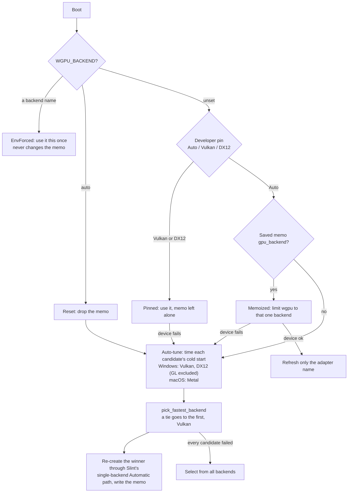

The memo is `gpu_backend`, plus the adapter name `gpu_adapter` for information. Limiting wgpu to that one proven backend can shorten startup a lot. Measured examples: on an Intel Arc 140V laptop, startup went from about 5.7 s to 0.33 s; on an NVIDIA machine the adapter-selection phase went from about 400 ms to 100 ms.

- **A bad memo or pin cannot stop the app starting.** If the limited `select()` fails, Falcon retries with every backend and re-tunes.
- **A Windows memo on a Mac is discarded.** On macOS, a memo naming Vulkan or DX12, for example in a settings file copied from Windows, is dropped at load (`stale_foreign_backend_memo`).
- **The decision logic is pure and unit-tested:** `plan_backend`, `select_outcome`, `pick_fastest_backend` and `format_backend_timings`.
- **The memo cannot be lost on save.** The process-wide `GPU_MEMO` is stamped onto every save by the `save_settings` chokepoint.
- The Developer card shows the measured timings, for example `vulkan=172ms dx12=2580ms`. The backend choice is shown on Windows only; a Mac build only has Metal.

### Startup timing lines

Boot log lines such as `boot: settings loaded in … ms`, `boot: wgpu backend selected in … ms` and `boot: MainWindow::new in … ms` show which launch phase is slow on any machine. The log keeps the first window frame (`boot: first frame … ms`) separate from `boot: first photo rendered`. The scan reports enumeration, header reads (with read count and reader count), pairing and sorting times (`support::log_scan_timing`), plus `scan: request N first shot ready in … ms`. A responsive window does not prove the requested photo is ready, so measure the two separately.

### Shutdown order

Every way out of the event loop (closing the window, a device loss, ⌘Q on Mac) ends in the same tail after `app.run()` returns. First, unfinished export work is told to stop. Then `support::graceful_shutdown` emits a fixed list of steps that `main` carries out:

`AwaitFileOpBoundary` (Mac immediate quit only: a bounded wait for a copy, move or export to reach a safe point; never emitted on Windows) → `DrainAppliedRotations` → `DrainPickerResults` → `RevertStagedEdits` → `SaveSettings` → `FlushSelection` → `WriterBarrier` → `UnregisterFolder`.

The order matters. Staged (unconfirmed) key and preset edits must be reverted before settings are saved. The two worker hand-offs must be drained before review data is written. The writer barrier must come after both writes, or they may never reach disk. The test `the_shutdown_tail_runs_its_steps_in_the_one_correct_order` pins this order. `SHUTDOWN_ONCE` makes a second arrival do nothing (on Mac, the quit handler and the ⌘Q key are two doors into the same exit). From the start of the tail every log line is written directly (`log_inline_from_now`), after a 2 s barrier that drains already-queued lines so the log stays in order.

Known Mac limitation: the quit handler answers `NSTerminateCancel` (it cancels the system's quit) and Falcon then exits by itself after the flush, so a system logout may report that Falcon interrupted it. The fix would be `NSTerminateLater` plus `replyToApplicationShouldTerminate:` (see the note in `macos_open.rs`).

### The diagnostic log

Settings → DEVELOPER → **Diagnostic logging** is Off by default, and the choice is saved.

- **Off means nothing on disk.** Falcon reads the saved choice before it starts logging. While logging is Off, Falcon creates and rotates no log files, and lines already queued are dropped, even if logging is switched On again later.
- **No stray lines after Off then On.** Each On period gets its own number, and a line is written only if it carries the current number (`LogGate` in `diagnostic_log.rs`). The same check covers lines in the save queue and lines written directly during a panic or at shutdown. Printing to the console uses its own lock, so ordinary interface logging never waits on the disk writer.
- **Early notes are held, not lost.** Messages from reading the settings file itself are held until the choice is known (up to 64 messages, 64 KiB). Then they are written with their original times, or discarded if logging is Off.
- **Switching On again in the same session appends** to the same file. Existing logs are kept, with the usual size cap.
- **Saving never depends on this setting.** Settings, review data, XMP ratings and save-failure notices work the same with logging Off.
- The automated Mac launch check turns logging on only inside its own separate test profile.

`support::log_event` records a diagnostic line; it reaches `falcon.log` only when logging is on, and then through the save queue (`WriteMsg::Log`).

**Where the log goes.** When logging is On:

- **The location is decided once at start and never moves** (`log_home`, `choose_log_dir`). On Windows it is the folder containing the executable. On Mac it is the folder containing `Falcon.app` (`mac_bundle_log_dir`). If that folder isn't writable, the log goes to the user's Downloads folder, then to Falcon's configuration folder. Mac diagnostic and automated launch-check builds always use their configuration folder. **The log's first line names the active path** and, when a fallback was used, why.
- **One file per instance.** The first instance claims a lock (`claim_primary_instance`: the named mutex `Local\FalconInstanceMutex_v1` on Windows, an `flock` on `falcon.lock` in the configuration folder on Mac) and writes `falcon.log`. A second window logs to `falcon-<pid>.log` in the configuration folder (`LOG_TO_PID`, `active_log_path`), so it never overwrites the first window's live log. Old per-pid logs are cleaned only there. This lock is for logging only: several Falcon windows may run at once. When asking for a log, say which folder to look in, and remember that a second window's evidence is in its own file.
- **Two bounded files, never one unbounded file.** Starting a log session renames the previous `falcon.log` to `falcon.log.1`. During a session, `log_append_capped` counts the bytes written and, at `LOG_SIZE_CAP_BYTES` (64 MB), rotates the same way; the new file's first line says so.
- Each line is formatted first and then written with a single `write_all` under a process-wide lock, so lines from different threads never interleave.

### Colour and file-type log lines

`falcon-decode` keeps one-time notes (`note_once`). When diagnostic logging is on, the app writes them to
the diagnostic log about every 1.5 seconds (`drain_decode_notes`). A file that behaves normally writes
nothing.

| Key | When | Cap |
| --- | --- | --- |
| `colour-resolve:{path}` | the bytes gave a different answer than the name alone would have | 200 files |
| `colour-miss:{profile}:{distance}` | a measurable profile matched no modelled gamut; says whether it renders faithfully, or which refusal applied | 8 profiles, separate counter |
| `sniff:{path}` | a file's bytes and name disagree; says which decoder it was sent to, not that it decoded | 200 |
| `placeholder-kind:{path}` | a cloud placeholder was classified by its name | 200 |
| `jpeg-truncated:{path}` | a truncated JPEG was decoded by the OS codec | 200 |
| `cmyk-os:{path}` | a four-channel JPEG took the Windows colour-managed route | 200 |

The four path-based families go through `note_path_capped`. Once a family is full it stops before storing
a new key, so the cap limits memory as well as output. These keys are built from the user's file paths,
and they live for the whole session.

The scan adds one line per folder for whatever its capped families swallowed ("…and M more like it in
this folder"). The two per-decode families each announce once that they are full. File and profile names
are reduced to one safe line (`sanitize_one_line` removes control characters and the
bidirectional-override characters). Profile names on the panel are limited to 32 display cells
(`quoted_profile_name`).

### Quitting and shutdown

Every way out of Falcon ends the event loop, then runs one shutdown sequence in `main()`. `support::graceful_shutdown` decides which steps run and in what order, and `main.rs` carries out each `ShutdownStep`. A process-wide `Once` makes sure the sequence runs only once, even if two quit routes arrive (for example ⌘Q and macOS's own quit request). Because the order is a function, a test checks it.

The diagram shows the quit routes and the fixed shutdown sequence they all reach.

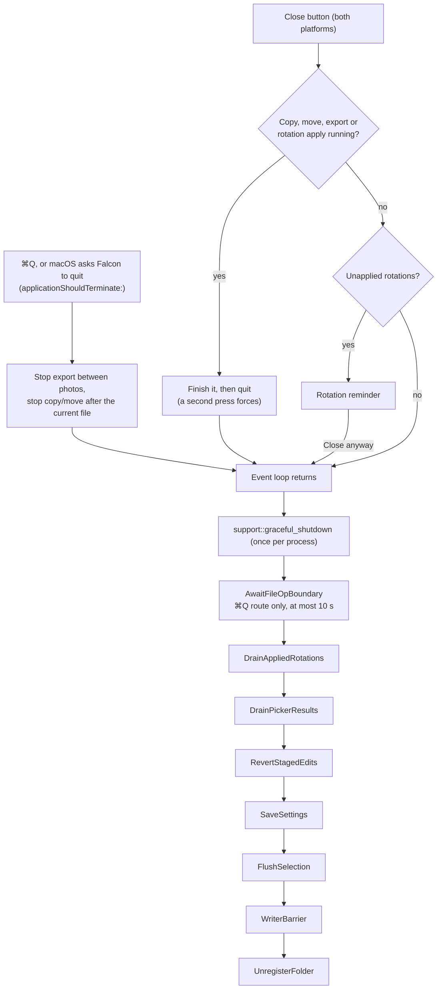

The order matters:
- Staged shortcut and export-preset edits are reverted before settings are saved, because the settings snapshot reads them.
- Both drains run before the review data is flushed, because they change what gets flushed.
- The writer barrier comes after every write.

Once the sequence starts, log lines are written directly instead of being queued. A short 2-second barrier first keeps earlier queued lines in order.

**⌘Q is an immediate, graceful quit (Mac).** There is no prompt and no deferral. It is still not a raw `terminate:`: Falcon's Quit item replaces the window library's `terminate:`, which would end the process before anything was saved. The loop returns at once and the full sequence runs. A running web export stops between photos, and a copy or move stops after the file it is writing. `AwaitFileOpBoundary` then waits at most 10 seconds (`support::await_file_op_boundary`) for that file to finish. Windows never runs that step, because every Windows exit route already waits for its workers. The ⌘Q route skips the rotation reminder; the close button keeps it.

`DrainPickerResults` applies a colour profile or watermark picked in the very last frame, so a choice made in a native file dialog is not lost. A folder picked at that moment is deliberately not opened. Folder reloads, scans and file moves are not drained.

### Developer settings and measurement levers

Settings → **Developer** keeps its everyday items visible:

- **Dev panel (HUD)**;
- **Diagnostic logging**, with **Show log file**;
- the **HEIC hardware lane: speculative decode cap** card (Custom | 4 | Uncapped, default 4; `heic_lane_cap: Option<i32>`). `None` means never chosen and takes the default 4 (`HEIC_LANE_CAP_DEFAULT`). A stored 0 counts as Uncapped only when `heic_lane_cap_set` shows the control wrote it. When `FALCON_HEIC_LANE_CAP` is set, the control is not shown at all, and the card's caption names the environment value instead.

Two collapsed groups hold the rest:

| Group | Control (code name) | Default | Applies | When changed |
|---|---|---|---|---|
| Advanced | Direct bulk rating (no ask) (`direct_bulk_rating`) | Off | Live | Bulk ratings apply without asking. Off means every bulk rating asks first, because this is the one lever that can rewrite many ratings with one key. |
| Advanced | Posture benchmark (dev) | — | On demand | Not saved. |
| Advanced | Filmstrip drag-up tolerance (`film_drag_cone_deg`) | 20° | Live | Tunes how far a filmstrip drag may stray upward. |
| Advanced | GPU backend (`gpu_backend_override`) | Auto | Next launch | Pins Vulkan or DX12. |
| Advanced | Simulate VRAM | Auto | Live | Re-sizes the texture budget as if the card had 4, 8 or 12 GB. Not saved. |
| Legacy | Async frosted blur (decode pool) (`async_blur`) | On | Live | Off: the upload thread makes each 160 px blur image itself (the old serial path). |
| Legacy | RAM frame cache (L2) (`ram_l2`) | On | Live | Off: nothing is deposited and revisits decode again; the pressure controller still samples. |
| Legacy | Browse-priority detail scheduling (`detail_sched`) | On | Live | Off: uploads go in arrival order, with the older settle-only neighbour rule. |
| Legacy | Frost from thumbnails (`frost_thumb`) | On | Live, per job | Off: the pool shrinks the whole ~44.8 MB frame for the blur image, and the menu blur stops using thumbnail blur images. |
| Legacy | Decode pool: 18 workers (restart) (`pool18`) | On | Next launch | Off: `cores.clamp(2, 16)` workers. |

Each group's header reads "· N changed" while anything inside differs from `Settings::default()`. The count comes from `support::dev_fold_counts`, published every tick; unsaved controls are not counted. Both groups are mount-gated rather than hidden with `visible:`, because a hidden body would keep its space and catch clicks. They collapse again each time Settings opens.

Some related settings live elsewhere:

- **Interface motion** (`motion_ui`) is in Display.
- Settings that trade decode work against what the user sees are in **Performance**: Adaptive Hi-Res, HEIC speed priority, Colour-managed CMYK JPEGs, Efficiency mode, and Fast View (Faster or Sharper preview, plus the Quick benchmark).

## Interface markup (Slint)

### How the markup is compiled

All interface markup lives in 18 `.slint` files under `falcon/native/ui/`. `falcon/native/src/ui.rs` defines nothing itself. It is a `slint::slint!` macro that imports and re-exports exactly these items:

- `MainWindow` (`main_window.slint`);
- `MacToolbarWindow` (`mac_toolbar.slint`) and `ToolbarState` (`toolbar.slint`);
- the `Theme` and `Tip` globals (`theme.slint`);
- the nine shared row structs from `structs.slint`: `FilmItem`, `SelTileRow`, `ExifRow`, `ExifBrief`, `KeybindRow`, `NotifRow`, `CopyPrefRow`, `WmFontRow`, `DisplaySection`.

The whole interface is one compilation unit. The macro records every imported file, so editing any `.slint` file triggers a rebuild. Look for markup in the `.slint` files; `ui.rs` contains none.

`falcon/native/build.rs` sets `SLINT_EMIT_DEBUG_INFO` only for debug builds, or when `FALCON_RIG_DEBUG_INFO=1` is set in the build environment. That debug information lets the headless layout tests (`tipgeom_tests.rs`, which check geometry without opening a window) find elements by id through `ElementHandle`. Release builds carry no element names, so a release test run without the opt-in finds zero elements. The same script stops the build if a usable `SLINT_SCALE_FACTOR` is set, because the Slint compiler would bake that scale into every shipped pixel. Setting `FALCON_ALLOW_SLINT_SCALE=1` as well turns the stop into a warning, for experiments only. Falcon reads the real scale from the window at run time.

### File structure

The diagram shows which `.slint` file imports which; an arrow means "imports from". `theme.slint` and `structs.slint` import nothing, and `main_window.slint` imports everything. There are no cycles. `mac_toolbar.slint` imports only the shared toolbar and the theme, which is how the Mac title-bar window draws the same `MainToolbar` as Windows.

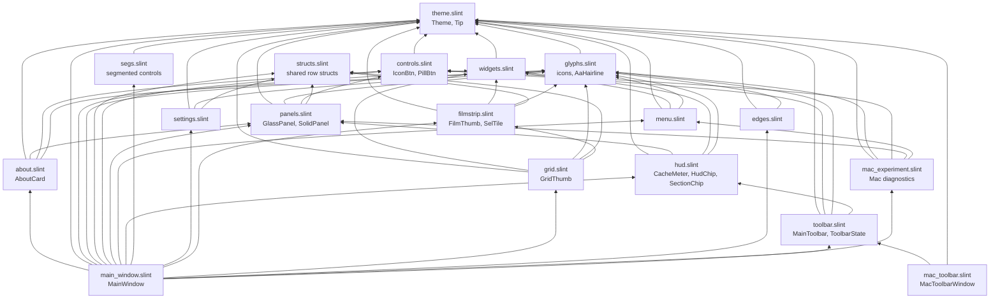

`grid.slint` borrows `TileBadge` from `filmstrip.slint`, so a badge change reaches both tile kinds. `mac_experiment.slint` also uses Slint's standard widgets for its diagnostic controls.

### MainWindow and the Rust boundary

`MainWindow` (`main_window.slint`) is the root component. It has roughly 650 root properties, about 190 callbacks and a dozen functions (approximate counts). The direction of each property is the contract with Rust:

- **`in`**: display state that Rust writes, such as counts, labels, images and flags.
- **`in-out`**: state the interface owns that Rust also reads or writes, such as open panels, settings values and zoom.
- **`out`**: facts the interface works out for Rust. These include geometry (`stage-w`, `stage-h`, `img-x`/`img-y`/`img-w`/`img-h`, `content-top`), `at-fit`, the gates (`modal-open`, `popup-open`, `inspection-blocked`, `modal-blocking`, `bulk-actions-armed`, `blur-sampler-mounted`, `hover-preview-live`) and the hover probes (`*-hot`).

**Platform differences are root properties, not `cfg` blocks in the markup.** This is what lets the headless layout tests check both platforms' geometry on a Windows machine. Rust publishes:

- `native-window-controls`: false on Windows, where Falcon draws its own window buttons and the preload meter sits on the left; true on macOS, where AppKit draws the window buttons and the meter sits beside the bell.
- `titlebar-leading-inset`: 0 on Windows, 80 on macOS.
- `is-mac`: for example, it hides the Vulkan/DX12 picker, because a Mac build only has Metal.
- the Mac file-association properties (`assoc-mac-mode`, `mac-assoc-rows`, `assoc-prompt-*`).
- the strings that name OS-specific things (`accel-toggle-label`, `empty-confirm-title`/`-body`/`-label`, `delete-confirm-label`), composed in `platform.rs`.

`titlebar-h` (44) is the one source for the bar height. Rust reads it and never repeats the number.

`MainWindow` draws `MainToolbar` itself on Windows and in the Mac in-window fallback. When the Mac title-bar toolbar is active (`mac-experiment-host`), `MainWindow` publishes the same values as one `toolbar-state` struct (`ToolbarState`), and `MacToolbarWindow` draws the toolbar from that.

**Rust composes text that contains numbers.** The markup never builds counted, pluralised or shortened text. The code treats Slint 1.17 as having no integer-to-string joining, and Slint cannot shorten a string to fit a width. So Rust builds these strings and publishes them as properties. Examples:

- `selected-chip-label`, the `bulk-*-label` and `ctx-*-label` rows, the export `out-*` strings and the `sel-hint-*` hints;
- `hud-pos-widest-a`/`-b`, the widest position text, used to size the position chip;
- the shortened path pieces `path-mid`/`path-dir`.

That is why `support.rs` and `platform.rs` contain a layer of string builders.

### Input gates

A few `out` predicates on `MainWindow` decide what may act on the photo. Every key arm, wheel handler and Rust callback reads one of them instead of repeating its terms, so a new dialog or menu joins every gate by being added in one place. Rust reads the gates through getters such as `get_modal_open()`; there is no hand-copied twin in Rust. [The shared rules that decide what is allowed](#the-shared-rules-that-decide-what-is-allowed) explains them in plain terms.

The diagram shows how the gates are built from one another; an arrow means "is part of", and each gate lists what reads it.

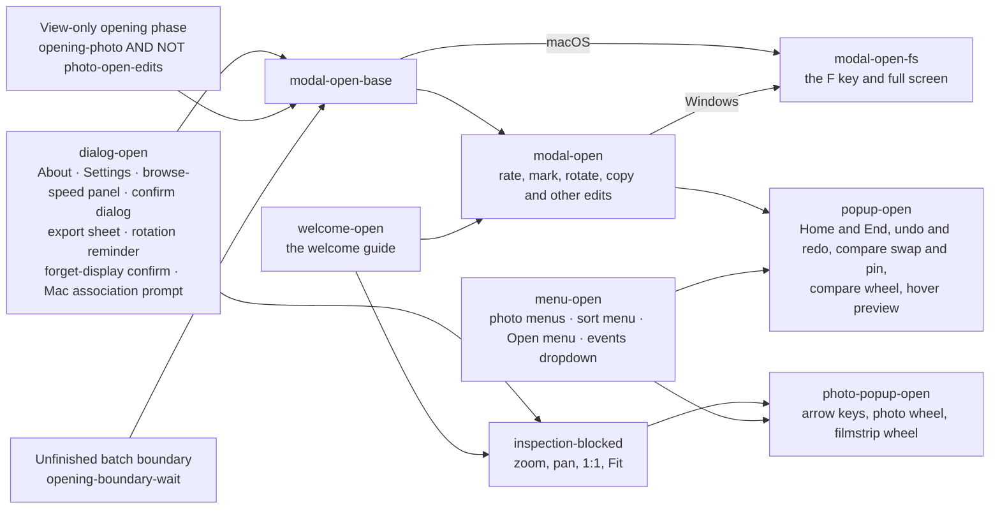

The exact definitions:

- **`dialog-open`** = `about-open || settings-open || loading-open || confirm-kind != 0 || export-open || rot-reminder-open || display-del-confirm || assoc-prompt-open`. (`loading-open` is the browse-speed panel.)
- **`modal-open-base`** = `dialog-open`, plus the View-only opening phase (`opening-photo && !photo-open-edits`) and `opening-boundary-wait`.
- **`modal-open`** = `modal-open-base || welcome-open`. Edits and culling keys read it, so in View only they wait for the full folder. The boundary-loading wait also blocks edits while a requested neighbour is still unknown.
- **`inspection-blocked`** = `dialog-open || welcome-open`. Zoom, pan, 1:1, Fit and browsing the verified nearby photos read it (Rust callbacks, the Fit key and the Mac menu rows included). They therefore work while the folder is still being scanned.
- **`menu-open`** = a photo menu (`ctx-open`), the Review-tile menu (`sel-ctx-open`), the sort menu, the Open menu or the events dropdown.
- **`photo-popup-open`** = `inspection-blocked || menu-open`. **`popup-open`** = `modal-open || menu-open`.
- **`modal-open-fs`** is the full-screen gate: `modal-open-base` on macOS (`native-window-controls`), `modal-open` on Windows. On macOS it leaves out the welcome guide, so **F** works on the welcome screen.
- **`modal-blocking`** is the subset that draws a full-window scrim (dimmed layer) above every panel: About, confirm dialogs, the rotation reminder, the export sheet, the forget-display confirm and the Mac association prompt. It disables the title-bar panel buttons, because their panels would open behind the scrim. Settings and the browse-speed panel are left out because their own buttons close them.
- **`toast-blocked`** = `modal-blocking || welcome-open || toast-hovered`. The toast countdown pauses while something covers the toast or the pointer rests on it.
- **`hover-preview-live`** = the hover setting is on, the Review panel is open, and not immersive, not `popup-open`, not compare.
- **Selection gates:** `bulk-actions-armed` = `count-selected > 0 && !compare && !immersive`. `ctx-rate-armed` adds `ctx-tile-selected`. `sel-affordance-live` = `!opening-photo && !compare && !immersive && !modal-open`.

A gated key or wheel is still accepted, so the event stops there, but it does nothing.

### App shell: window, keyboard and robustness

- **Window.** A re-maximise watchdog, throttled to 250 ms, keeps a maximised window maximised on the monitor it is on, not the primary one.
- **Keyboard.** One `FocusScope` in `main_window.slint` owns the photo shortcuts and reads the gates above. Controls actions are rebindable single characters (`ACTIONS`). The basic shortcuts (the default keys ←, →, Home, End, Tab, Space and Del: `BASIC_TOKENS`) are their own rebindable rows (`BASIC_ACTIONS`). No Controls action may take one of these keys; `support::reserved_token_refusal` says so and suggests what to press instead. Esc, the grid's ↑/↓, F11, ⌃⌘F on Mac and mouse clicks are fixed. See [Where common feature requests start](#where-common-feature-requests-start).
- **Robustness.** `catch_unwind` around the tick and the workers; `OpGuard` for file operations; atomic file writes; a symlink/junction check on destination folders, so copies and moves cannot be redirected outside the photo folder; a panic hook.
- **Several windows at once.** Multiple Falcon instances are allowed; there is no single-instance guard. The first instance claims "primary" only for logging (see [The diagnostic log](#the-diagnostic-log)). If two windows open the same folder, a warning says review edits (ratings, flags, rejects) are last-writer-wins between them (the open-folders registry).

### Design system

- **Layers go one way:** photo stage (`Theme.stage`) < app base (`Theme.base`) < raised block (`Theme.block`). Wells, the resting fill of inputs, chips and buttons (`Theme.well`), are darker than the block they sit on. Accent blue means active.
- **Hover uses solid steps.** Going from rest to hover swaps to an explicit solid fill (`well-hover`, `block-hover`). The 15 % wash is used only over transparent resting fills.
- **Window corners.** On Windows, the window's own 16 px arc (`winroot`, `Theme.radius-window`) is the only rounding, with Windows' own (DWM) rounding turned off (`DWMWCP_DONOTROUND`). The corners go square when maximised or immersive, through the sticky `chrome-square` latch. On macOS the system owns the window shape, so `winroot` draws no arc (`native-window-controls`).
- **Title bar.** A 44 px band with 40 × 44 button cells; see [Title-bar geometry](#title-bar-geometry).
- **Dialogs have one emphasis rule.** The destructive or consequential action carries its severity colour. Cancel is always the quiet ghost button. Enter never presses a destructive action (see [Destructive acts](#destructive-acts-how-you-start-them-and-how-you-get-back)).

Beside the colours, `Theme` holds about 40 non-colour tokens:

- **Corner radii:** `radius-window` 16, `radius` 12 (panels, cards, title-bar hover squares), `radius-ctrl` 8, `radius-sm` 6, `radius-xs` 4. All are even, so rounded corners render evenly.
- **Type sizes:** `font-xs` 9 up to `display-xl` 44.
- **Spacing:** `space-1` 4, `space-1h` 6, `space-2` 8, `space-2h` 10, `space-3` 12, `space-4` 16, `space-5` 20, `space-6` 24.
- Animation durations, hit sizes, border widths and the shadow geometry.
- **`section-w` 320:** the single source for the Settings panel width (`section-w + 2 × space-5` = 360) and for the three columns of the welcome guide. Never copy 320 or 360 as literals.

### Interface colours follow the photo colour pipeline

`Theme` (`theme.slint`) holds 48 colour tokens. Every one is `in-out` and written in sRGB: the value in the file is the design value. `apply_theme_transform` in `main.rs` runs at start-up, before the window shows, and whenever the output colour changes (`set_output_gamut`, which every gamut switch and ICC-profile load passes through). It converts every token with `falcon_color::transform_rgb8`, the same conversion the photos use, and writes it back. On an sRGB output nothing changes, and the alpha byte is never converted. The Mac title-bar toolbar is a separate window with its own copy of `Theme`: `copy_theme` (`mac_experiment_native.rs`) copies the converted tokens into it, and `mac_experiment::invalidate_toolbar_colour` refreshes its surface.

Rules:

- **Never write a literal colour where it is used.** A literal skips the conversion and will not match the photos on a wide-gamut or custom-profile display. Add or reuse a `Theme` token.
- Six tokens are opaque versions of a translucent colour laid over a background: `hover-flat`, `hover-flat-block`, `accent-hover-flat`, `danger-hover-flat`, `accent-soft-flat` and `danger-soft-flat`. Rust recomputes them from the already converted colours (flatten after converting), because the tone curve is not linear and the two orders give different results.
- A new colour token needs lines in `apply_theme_transform`, in `copy_theme` and in the token test in `tipgeom_tests.rs`, which checks each token against its sRGB design value.

### Title-bar geometry

These rules hold for the shared toolbar (`MainToolbar`, `toolbar.slint`) at its normal 44 px height. Change any of these numbers only together with the others.

- **Square hover washes.** Each title-bar button (`IconBtn` with `bar: true`) draws its hover wash (`barwash`) inset 2 px at the sides and 4 px at the top and bottom. The wash must be a true square, so the cell width is `bar-cell-w` = `titlebar-h` − 4: a 36 px square in a 40 × 44 cell. The radius scales with the square (12 at 36 px) and is rounded to an even number.
- **Every visible gap is 4 px:** above and below each wash, between neighbouring washes (2 + 2), and at the window edge. That is why the button row starts with a 2 px lead-in. On macOS the bell is the last cell, so the row also ends with a 2 px pad.
- The five left buttons and the bell use 40 px cells. The Windows minimise, maximise and close buttons keep the Windows convention: 44 px cells running into the corner.
- **The status band** between the button groups (`hudclip`, a frame that clips both drawing and clicks) is placed by fixed reservations, never by measured content. The text diagram shows the cells on each platform and the reservations that size the band.

```text
Windows (Falcon draws the window buttons)
|2| 40 | 40 | 40 | 40 | 40 | meter 62 |   status band   | bell 40 | min 44 | max 44 | close 44 |
|<---- left reservation 286 (uses 264) ---->|               |<---- right reservation 180 (uses 172) ---->|
band width = W - 286 - 180

macOS (AppKit draws the window buttons; leading inset 80)
| (window buttons) 80 |2| 40 | 40 | 40 | 40 | 40 |   status band   | meter 62 | bell 40 |2|
                      |<--- left 224 (uses 202) --->|                 |<-- right 110 (uses 104) -->|
band width = W - 80 - 224 - 110
```

The reservations (`left-reserve`, `right-reserve`) are the contract; the totals are what must keep fitting inside them. In the Mac title-bar toolbar, macOS sets the bar to 38 points, so cells shrink to 34 and the totals shrink with them, but the reservations stay.

- **The band gives up content in four tiers.** The thresholds are constants derived from measured element widths, never live measurements: an element that fed its own show/hide condition would flicker. The gates nest, so each step removes exactly one group.

| Tier | Band width | Shows |
| --- | --- | --- |
| T1 | ≥ 384 (`pill-show`) | filmstrip and grid toggles, count chips, folder-path pill |
| T2 | ≥ 316 (`chips-show`) | toggles and count chips; the path pill goes first |
| T3 | ≥ 76 (`ctrl-show`) | filmstrip and grid toggles only; the preload meter shares this gate |
| T4 | < 76 | buttons only |

At Windows' 560 px minimum window width the band is 94 px, so tier T3 still shows. The path pill shortens the folder path in three stages, but its width moves in 72 px steps sized from the full path text (`path-tier`), so changing stage does not shift anything.

### The preload meter

The title bar's preload meter (`CacheMeter` in `hud.slint`) shows how many neighbouring photos are prepared behind and ahead of the current one. It is a 62 px split bar:

- The widths of the two halves follow how many photos lie in each direction.
- Each half fills toward the centre in traffic-light colours as decoding catches up.
- A small dot between the halves marks the current photo. At a folder edge the empty side disappears and one full bar remains.
- `tick::step_cache_meter` never publishes zero for both sides, so the meter does not flash off and on during a pause.
- Each visible half keeps an 8 px minimum fill so a small share stays readable. The track clips, so nothing paints outside the 62 px cell.

There is one component with two mounting points, both in `MainToolbar` (`toolbar.slint`). On Windows it sits in the left button row; on macOS it sits immediately left of the notification bell. The two `if` gates on `native-window-controls` exclude each other, so exactly one meter exists. The toolbar decides when the meter is mounted (`cache-meter-show && hudclip.ctrl-show`) and owns its hover flag. That flag is cleared when the meter disappears (see [Hover state that outlives its element](#hover-state-that-outlives-its-element)).

In Efficiency mode a leaf glyph (`LeafGlyph`, driven by `efficiency-leaf`) appears inside the same 62 px:

- It is gated with `if`, never `visible:`.
- It sits in a `HorizontalLayout` with the track, so its 12 px cell plus 4 px spacing really shorten the track.
- It is centred vertically by a full-height wrapper cell with the glyph floored to the middle, because a `HorizontalLayout` does not centre a child that sets its own height.

The test ids `CacheMeter::leafglyph` and `CacheMeter::track` work from either mounting point. The meter's tooltip has its own always-present renderer at the window root, because its text changes while the pointer rests on it.

### Overlays, the wheel and the live title bar

In `winroot`, declaration order is paint order, and hit-testing runs in reverse. Every overlay starts at `y: root.content-top`: 0 in immersive mode, otherwise the title-bar height or the Mac toolbar overlap. This keeps the title bar usable under any panel or dialog.

Only five elements in `MainWindow` handle the wheel (`scroll-event`):

- the single-photo stage;
- the compare layer;
- the filmstrip;
- the Review panel's `review-swallow`, which accepts every wheel inside the panel so the photo behind does not move;
- the watermark preview in the export editor.

`Flickable`s (Slint's scrolling containers) scroll themselves. Every other `TouchArea` rejects the wheel, and a rejected wheel travels on to whatever is behind it. That is why the stage and filmstrip check `photo-popup-open`, and compare checks `popup-open`: a wheel over a dialog's scrim or a menu reaches them and must do nothing. They still accept it, so it stops there.

### Tooltips

Hosts write `Tip.text` and `Tip.cx` (and `Tip.cy` if the host is positioned) from their own `TouchArea`'s `changed has-hover`. On leave they clear only text they still own. Read `cx` from a child `TouchArea` at x = 0, never from a component root placed by a layout: Slint 1.17 double-counts that root's own x.

`cy == 0` means "title-bar tooltip", drawn 3 px below the 44 px bar. A positioned host must reset `cy` on every way the pointer can leave. One always-present renderer (`tiplayer`) at the window root shows the tooltip after a 600 ms pause. It has no input area, so it can never catch a click, and it never shows in immersive mode. The preload meter keeps its own renderer because its text changes while hovered. In the Mac title-bar toolbar, tooltips are placed from the toolbar surface's live height (see [Platform rules and the Mac](#platform-rules-and-the-mac)).

### Menu-blur samplers

Only surfaces with `hover-glass: true` actually read the blurred backdrop (`blur-backdrop`); other panels are handed it but never sample it. Each sampling surface's mount condition is a named property. The same property is read by the surface's `if` and by the OR that tells Rust whether to build the backdrop at all:

- `raw-panel-mounted` and `raw-stub-mounted`;
- `info-stub-mounted` and `info-panel-mounted`;
- `cull-card-mounted` (the immersive cull card);
- `float-exif-mounted`;
- `compare-bar-mounted` (the compare bar and its pin labels);
- `ctx-menu-mounted` (both photo context menus);
- `sort-open` (the sort menu).

`blur-sampler-mounted` is built from those properties, not from copies of their expressions, so changing a gate changes the OR in the same edit. When it is false, `tick::step_blur_backdrop` invalidates the backdrop key and does no work. **A new glass surface must add its mount property to this OR**; otherwise it shows an old blur or none. How the blur itself is made is in [Decoding and display](#decoding-and-display).

### Hover state that outlives its element

A Slint `TouchArea` that is destroyed never reports that the pointer left. So whatever decides when an element is mounted must also clear what that element set. These observers do so:

- `changed immersive` and `changed compare` clear their surfaces' hover flags and any tooltip those surfaces own.
- `changed info-open`, `changed cache-meter-show`, `changed raw-panel-mounted`, `changed raw-stub-mounted`, `changed sel-open` and `changed sel-chip-mounted` do the same for theirs.
- In `MainToolbar`, the band's `changed pill-show`, `changed chips-show` and `changed ctrl-show` observers clear the tooltip texts their elements can own.

Clear only on the edge where the element disappears, and only a tooltip text this owner set.

### Layout: one child takes the slack

In every fixed-height panel body, exactly one child is the absorber: `vertical-stretch: 1` and truly unbounded (`max-height: 100000px`). A `Flickable` needs that explicit maximum, because without it the compiler ties its maximum and preferred height to its content, and stretch then has no effect. Every stretch-0 sibling needs a bounded maximum, because a bare `Text` reports an infinite one.

The absorbers are `setflick` (Settings), `selgrid` (Review), `notifflick` (events), `wcflick` (welcome guide), the watermark font picker's `Flickable`, the About card's body, and the export sheet's `elistflick` (list mode) and `edflick` (preset editor).

`edflick` sets `interactive: false` on purpose: the live watermark preview owns dragging. `elistflick` spells out `interactive: true` so nobody copies that exception onto it. In Slint 1.17 `interactive` only controls dragging; the wheel still scrolls.

**The absorber is also the shrink rule.** Slint shares spare height by stretch, and takes a shortage back by stretch as well. When the window is short, the scroller must be the child that gives up height, down to a `min-height` of about one row, so the action row stays on screen. Never reserve a fixed number of pixels for "the rest of the sheet"; that number goes stale as soon as the sheet grows. Two engine facts matter here:

- A bare `Text` reports its minimum equal to its preferred height, so it never shrinks.
- A box layout reports the sum of its children's stretch, so a nested `if …: VerticalLayout` passes a shortage down to the scroller inside it.

**Draw the boundary between chrome and body.** In a sheet, the header and the action row are chrome. Everything between them is body, and the body scrolls. In the export sheet's list mode, the run-scoped questions and the preset list share one column, `ebody`, inside `elistflick`, whose `viewport-height` is `ebody.preferred-height`. Tying the viewport to the preset list alone would collapse it and leave presets unreachable. At the smallest window (560 × 400) the Cancel/Export row must still lie inside the panel.

### Photo tiles and shared glyphs

Three tile components show photos: `FilmThumb` (filmstrip, 120 × 80), `GridThumb` (grid dock, 120 × 80) and `SelTile` (Review panel, 3:2 with a caption). All three are fed from the same `FilmItem` model row: `GridThumb` and `SelTile` take the row, and `FilmThumb` takes its fields one by one. The host works out selection, preview and "ghost" state and passes it down, so each rule lives in one place. All three share:

- a constant 2 px identity border (`border-identity-w`), so selection never changes geometry;
- a selection rim that wins over the accent and reject colours;
- a hover lift with a 9 px blur and 2 px offset (`shadow-lift`);
- photo first: no tint and no dimming on the photo's pixels, ever.

Shared drawings live once in `glyphs.slint` and are reused rather than copied:

- `GridDotBlock`, `GridGlyph` and `FilmFrameBlock`;
- `ChevronGlyph`, with `points-down` and a `left` arm; the arrow points where the content will move;
- `CloseGlyph`, the standard dismiss ×;
- `LeafGlyph`.

### Hairlines

Slint draws a plain filled `Rectangle` without anti-aliasing (edge smoothing). A 1 px line therefore covers one or two device rows depending on where its edge falls, and two long rules can render at different thicknesses. So every 1 px rule, divider and menu separator is drawn by one component, `AaHairline` (`glyphs.slint`). It is an empty slot holding one of two conditional children: horizontal, or vertical (the same element rotated a quarter turn). The child has only `border-width` and `border-color`, which Slint strokes with anti-aliasing. `weight` (default 1 px) sets the thickness. The child overhangs its slot by `weight / 2` at each end along the line, because the renderer insets a bordered rectangle by half the border width and the stroke has no end caps; without the overhang the line ends short. `HRule`, `MenuSep`, `BriefSep` and `MinimizeIcon` (1.5 px) all use it.

Hazard: the overhang sticks out of the slot, and a cached layer's origin is the bounding box of its children. An `AaHairline` placed flush against the leading edge of a host with `clip` and `border-radius` shifts that host's layer origin by half a border width. Check this whenever you mount one flush to an edge.

### Shadows

There is one resting shadow class: `Theme.shadow-blur` (12 px), `Theme.shadow-dy` (4 px) and the colour `shadow-control`. It is bound at six places, so they match by construction:

- `GlassPanel`, which includes both context menus;
- `SolidPanel` dialogs;
- the toast;
- the "Scanning…" pill;
- the degraded-tick banner;
- the dragged row in the copy-preference list.

`shadow-lift` (9 px blur, 2 px down, the darkest alpha) is the tile hover lift. It stays separate on purpose, because it signals hover rather than resting elevation. `shadow-panel` is still defined and converted with the other tokens, but no surface uses it. It can be removed together with its lines in `apply_theme_transform`, `copy_theme` and the token test.

**Sharp text in cached layers and segmented controls.** The Settings and Browse-speed panels place their cached layers on whole device pixels, so text stays sharp without any change to fonts, weights or layout. Segmented controls (`Seg`, `CustomSeg` in `segs.slint`) round only their painted background; labels and inputs sit under a plain rectangular clip, because a rounded clip at a fractional position blurs text even inside a pixel-aligned panel. On the custom-speed control, the veil that marks speeds beyond the device's limit still paints over the labels.

## Opening and inspection

Falcon shows the photo you opened before it finishes scanning the rest of its folder. (In code,
the folder scan is called *discovery*.) The clicked photo comes before the folder scan, before
neighbouring previews and before thumbnails. Once it is on screen, zoom and pan work without
waiting for anything else, while the scan runs in the background.

**While the folder is loading.** Settings → INPUT → **While the folder is loading**
(`photo_open_edits`) decides what else is allowed during the scan:

- **View only** (the default) lets you browse a checked batch of nearby photos but not change
  anything.
- **Allow photo edits** also lets you rate, flag, reject and rotate those verified photos before
  the scan finishes. Selection gestures and sorting still wait for the whole folder. File and
  whole-folder operations stay blocked at their own callbacks in both modes.

Zoom, pan, 1:1, Fit and browsing the verified nearby photos read `inspection-blocked` (dialogs and
the welcome guide) or `photo-popup-open` (those plus open menus), so they work while the scan runs.
Edits, culling keys, Home/End and Compare read `modal-open` or `popup-open`, which also count the
View-only opening phase. In View only, Home and End wait for the real first and last photo. See
[Interface markup (Slint)](#interface-markup-slint) for the input gates.

Review marks, rotation and file actions always act on the whole shot (the RAW and its finished
file together) and on its full identity. Compare needs a second identified shot.

### Order of work when a photo is opened

The rules live in `photo_open.rs` and the folder-open worker in `main.rs`:

1. The clicked shot is published alone, with its RAW or finished partner, and its decode starts.
2. The nearby stage waits only until the interface has taken that first request: normally one
   tick, at most 250 ms (`REQUEST_HANDOFF_LIMIT`, `request_taken`). It never waits for a decode or
   a shown frame. If the hand-off does not happen in time, the nearby stage is skipped and logged.
3. The nearby batch (21 to 129 neighbours, only for Name, Date modified, Date created and Size
   sorts) and then the complete scan run in the background.
4. Until the clicked photo's first preview is visible, or while its full detail is decoding on the
   CPU, new thumbnail decodes wait, for at most 750 ms after the open (`defer_thumbnails`). After
   the preview shows, GPU full-detail decoding and CPU thumbnails may overlap. A queued thumbnail
   for a visible cell can be raised in priority without starting a second decode of it.
5. Scan results are held while the clicked photo is still becoming visible, until it shows, fails
   or 10 seconds pass (`defer_promotion`). After that, promotion waits for neither full detail nor
   neighbours.

The diagram shows these steps and what releases each wait.

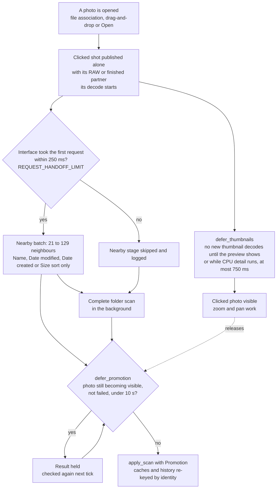

### How the clicked photo is found first

For an explicit file open, the open worker first calls `falcon_decode::scan_requested_shot`. It
lists the folder but reads metadata and headers only for the clicked file's same-stem group (for
example `IMG_0001.CR3` with `IMG_0001.JPG`). It then uses the same content classification,
RAW-partner ranking, cloud-placeholder check and shot creation as the full scan.

- Names that would make review records ambiguous (a dot or a parenthesis in the stem, or an
  AppleDouble `._` sidecar) skip this step and wait for the full scan, so an early photo can never
  borrow another photo's saved ratings.
- Unsupported and cloud-only shots also take the full path.
- The early photo gets no extension-only identity and no separate colour or orientation decoder.

The early result goes into the `early_scan` slot, checked against the open's `scan_id`. It carries
a real, paired shot and the folder's **complete** review journal: review entries for photos not
yet found stay in `extra`, and every rotation record travels with it. The normal `apply_scan` and
decode path displays it.

Folder discovery then continues at once. Previews decode on their own lane, and the scan never
waits for a frame. Loading the export manifest, full classification and sorting follow. Old
`.falcontmp` temporary files are cleaned only after the final result is published
(`support::reap_stale_temps`, guarded by `scan_id`). Every new explicit open clears both pending
result slots (`support::begin_explicit_scan`) and makes older workers' results invalid.

### The nearby batch

Before the scan finishes, Falcon can show a batch of nearby photos, but only when their order and
pairing are certain.

- **Size.** Enough to fill the visible filmstrip or grid: at least 21 photos, always an odd number,
  at most 129 (`photo_open::visible_batch_len`). The batch is preloaded in either mode.
- **Order.** Photos are taken in exact Name, Date modified, Date created or Size order from a
  metadata-only list (`single_photo_candidates`). Those sorts need nothing but the folder listing
  (`supports_nearby_sort`). Headers are read only for that window.
- **What waits for the full scan.** Folders with RAW files or duplicate stems, ambiguous names, and
  the Date taken, Type and Rating sorts, which need other files' contents or edits.

**Unfinished ends are visible.** The nearby result carries whether unread candidates remain before
and after its sorted window. Until that is known, the clicked-only stage treats both ends as
unfinished. The filmstrip shows a gray “Loading…” tile at each unfinished end; the folder grid
reserves a loading row at each such end. These are presentation cells, never shots: they add no
photo count, decoding, rating/selection target or file-operation identity. True known folder ends
keep their usual stop. Completion removes all continuation tiles.

Trying to browse past an unfinished end reuses the existing “Scanning folder…” overlay and keeps
one pending request (`opening-wait-dir`, a signed photo offset). Left/right, wheel and loading-tile
clicks request one photo. Grid Up/Down retains the original photo and a full row's offset, so it
lands directly above/below that photo when available. Repeats, including after a grid resize, do
not accumulate or reinterpret the request; earlier wheel/held motion is cleared when queuing a row.
Browsing back or jumping to a real photo cancels it. Promotion matches the original photo by full
identity before applying the offset; a proven folder end uses the usual clamping and clears the
wait. Scan errors clear it too. An explicit folder change discards the old wait. The overlay never changes
`photo-ready`, so it cannot hold discovery back through `defer_promotion`.

To identify files, the scan reads only the first bytes of each one; see
[Folder scan reads](#folder-scan-reads). A file's type always comes from those bytes, never from its
name alone.

### Promotion: the clicked photo joins its folder

When the scan finishes, the photo moves into the full folder view without reloading. This is
*promotion*, done by the `apply_scan` closure in `main.rs` with `photo_open::Promotion`
(`Promotion::take` and `Promotion::restore`).

- **Identity, never position.** `same_photo` finds the open photo in the new list by full identity:
  name, RAW path, finished path, format, decodable-picture flag and cloud-placeholder flag.
- **What is carried across**, moved to its new position:
  - browsing previews, full-detail frames and thumbnails;
  - source dimensions and completed zoom tiles;
  - menu-blur images (`film.frost`);
  - frame colour records (`shot_gamut`) and file colour records (`file_gamuts`): which colour space
    each frame's pixels and each file are in;
  - the finished-image and RAW orientation bases;
  - the Undo and Redo history (`reindex_history`);
  - the current zoom and pan.
- **Changed files are not carried.** A shot whose files changed during the scan
  (`changed_sources`) is invalidated and decodes again.
- The colour-chip memo (`cs_built`) is cleared, so the chip is rebuilt for the new position. The log
  line `scan: promotion retained fast=… detail=… thumbnails=…` reports what was kept.

**Undo and Redo survive promotion.** `photo_open::reindex_history` carries the history by matching
identities in the old and new shot lists. A grouped action that loses any of its members is dropped
whole. This is the one exception to "a folder swap clears Undo": ordinary folder swaps and rescans
after file operations still reset history.

**Promotion waits for the clicked photo.** It never interrupts the current photo's unfinished
decode. `photo_open::defer_promotion` holds it until the photo is ready or has failed, for at most
10 seconds, and a newer open supersedes it immediately. The final promotion merges edits made in the
meantime and recomputes Rating order with stable ties (`refresh_rating_sort`).

If a new explicit open fails after a partly opened folder was kept, `recover_partial` finishes that
folder through the normal same-folder reload. Never infer that a folder is complete, and never decide
saved review data or the early-edit choice, from the temporary shot count.

A result from an older scan or decode must never replace a newer open request. A correct-looking
thumbnail or embedded preview does not prove the full-resolution path is correct.

### Every folder open uses one path

Command-line arguments, drag and drop, the picker, recent folders and Finder open events all call
`begin_reload`.

- It retires the previous request and any queued scan before branching, then checks the target on
  a worker (`support::resolve_existing_target`). A missing target keeps the current session, and a
  missing file can never silently open its parent folder and select a different photo.
- The tick accepts only the newest resolved request.
- For a different folder, the scan worker reads review data once and classifies, pairs and sorts off
  the interface thread. `apply_scan` then swaps the state and restores selection, rotations, panels,
  resume position and export manifest through the shared path. `register_open_folder` runs when the
  swap is accepted.

An explicit reopen of the same folder also cancels older opens; internal reloads after file
operations do not. Same-folder reloads stay synchronous. Ratings and marks for a Rating sort come
from live memory, and `flush_old` writes finished changes before the swap refreshes review and
rotation state. So reading a review file that has not been written yet cannot bring back cleared
ratings or apply a rotation twice. `scan_id` guards both publishing and applying, and a superseded
scan returns `Interrupted` instead of publishing a partial list.

### Cold and warm opens

A folder's first open (cold: nothing in the operating system's file cache) and a repeat open (warm)
are measured separately. A repeat open can be faster only because the operating system's file cache
is warm. Falcon keeps no thumbnail or preview cache on disk, and every open decodes its thumbnails
afresh; adding a disk cache would be a product decision, not a speed fix. Header reads are reused
only within one folder opening (`FolderCatalogue`, below).

### File type detection ("bytes over names")

Each finished image gets one format, `SrcKind`, with nine values: `Jpeg`, `Png`, `Tiff`, `Webp`,
`Heic`, `Jxl`, `Bmp`, `Gif` and `Unsupported`. The folder scan sets it in exactly one place,
`scan_classify` in `falcon-decode`, and every other part of the app reads that value. The file's
own first bytes decide; the extension is only the fallback. The tests live in `falcon-decode`'s
`bytes_over_names` module. The three rules:

1. **Never read a cloud placeholder.** Opening a OneDrive or iCloud stub would download it. The scan
   reads the placeholder flag from the directory listing it already has (`is_cloud_placeholder`
   over `FILE_ATTRIBUTE_RECALL_ON_DATA_ACCESS` and related flags on Windows; `is_dataless` over
   `SF_DATALESS` on macOS). A placeholder keeps its extension's format. The header read is passed in
   as a closure, so the test `the_sniff_never_touches_a_cloud_placeholder` can prove it is never
   called. When the file later downloads, the cloud retry sweep (`step_cloud_retry`) calls
   `reclassify_hydrated`, which reads it and corrects the format in place.
2. **The bytes win.** If the header names a known format, that replaces the extension's answer
   everywhere at once, because there is only one `kind`.
3. **Unknown bytes fall back to the name.** A short or unreadable file, or a header `sniff_kind`
   does not recognise, keeps the extension's answer. A `.tga` (a format with no signature) still
   works, and no existing folder is reclassified by guesswork.

`sniff_kind` reads the first 32 bytes (`SNIFF_HEAD_BYTES`). It is a pure, table-tested function. It
recognises:

- PNG by its full 8-byte signature;
- the JPEG XL container box and the bare `FF 0A` codestream;
- JPEG by `FF D8 FF`;
- GIF only by the full `GIF87a`/`GIF89a`;
- WebP only as `RIFF` plus `WEBP` (`RIFF` alone is also WAV or AVI);
- TIFF, including BigTIFF;
- BMP only when the header size after `BM` is one of the eight defined values;
- ISO-BMFF (`ftyp`) by its brands, read only within the `ftyp` box's own declared size.

The `avif`/`avis` brands are checked first and answer `Unsupported`, because Falcon has no AVIF
decoder. So an AVIF is never mistaken for a HEIC just because it also lists `mif1`. Video and CR3
brands answer "unknown".

RAW files are split off by extension **before** any header is read; rawler (the RAW library)
identifies RAW formats itself. So a JPEG named `.cr3` still goes to the RAW decoder, and a CR3 named
`.jpg` still fails as a finished image.

HEIC is the one conditional format. A file that is HEIC by its bytes takes the same check as a file
named `.heic` (`heic_scan_kind_here`). It is always decodable on macOS. On Windows it is decodable
only when the HEVC/HEIF Image Extension is installed (`wic_heif_codec_present`, asked once per scan
and only if the folder holds a HEIC). Without the codec the shot is `Unsupported`. It still knows it
is a HEIC (from `Shot::sniffed` when name and bytes disagreed, otherwise from the extension), so the
app can tell the user which codec to install.

The diagram shows how one folder entry gets its format.

```mermaid
flowchart TB
  ENTRY["Folder entry<br/>(directory listing + metadata)"] --> AD{"AppleDouble ._ sidecar?"}
  AD -->|"yes"| SKIP["Skip and count"]
  AD -->|"no"| EXT{"Extension"}
  EXT -->|"RAW extension"| RAW["RAW slot: never sniffed<br/>rawler identifies it later"]
  EXT -->|"other"| IGN["Not an image: ignored"]
  EXT -->|"finished-image extension"| PH{"Cloud placeholder?<br/>Windows attributes / macOS SF_DATALESS"}
  PH -->|"yes"| NAME["Keep the extension's kind<br/>log: classified by its NAME"]
  PH -->|"no"| HEAD["read_head: first 32 bytes<br/>scan_io, up to 8 readers"]
  HEAD --> SNIFF{"sniff_kind"}
  SNIFF -->|"unknown or short"| NAME2["Keep the extension's kind"]
  SNIFF -->|"HEIC"| GATE{"heic_scan_kind_here<br/>macOS: yes / Windows: codec installed?"}
  GATE -->|"yes"| HEIC["Heic"]
  GATE -->|"no"| UNS["Unsupported"]
  SNIFF -->|"other known format"| BYTES["The bytes' kind wins<br/>sniffed is set if the name disagreed"]
  NAME --> PAIR["Pairing and mint_finished"]
  NAME2 --> PAIR
  HEIC --> PAIR
  UNS --> PAIR
  BYTES --> PAIR
  RAW --> PAIR
```

### Folder scan reads

The scan (`scan_folder_with_metadata` and its cancellable form) first lists the folder and keeps
each entry's metadata. It then reads the 32-byte headers it needs through `scan_io`:

- At most eight files are open at once (`MAX_SCAN_READERS`). Batches below 16 header reads
  (`PARALLEL_SCAN_MIN_FILES`), such as the clicked photo, read one at a time. Workers take files one
  by one, so one slow part of a network folder cannot hold up the rest.
- The placeholder check sits inside the read, so even a worker handed a cloud path cannot open it.
- Results go back in listing order. Classification, RAW pairing, same-stem ranking, unique names and
  IDs then run on one thread in that order, so parallel reads cannot change any of them.
- If a reader thread cannot start, the calling thread reads its share.
- Cancellation is checked between files and before returning. A superseded scan returns an
  `Interrupted` error, never a partial folder.
- `sort_scanned_shots` sorts by size, modified or taken date from the same metadata snapshot instead
  of asking the disk again.
- `FolderCatalogue` holds one directory listing and its header results for one folder opening. The
  clicked photo, the nearby batch and the full scan therefore never read the same header twice. It
  is not a saved cache. Before promotion, `finish` re-checks the files an early stage used and
  re-reads any that changed.
- `FALCON_SCAN_WORKERS=1` forces serial reads for diagnosis; larger values are capped at eight.

**AppleDouble files are skipped.** On exFAT, FAT32 and network drives, macOS stores file metadata in
a hidden companion file such as `._IMG_7737.HEIC` beside `IMG_7737.HEIC`. It is a few kilobytes of
metadata, not a photo, but it carries the photo's extension, and because `._` sorts first it would
otherwise become the folder's landing photo. Folder scanning drops any name starting with `._`
before anything else reads it (`falcon_decode::is_appledouble_sidecar`, used by scanning and
pairing). This happens on both platforms, because memory cards travel between Macs and PCs. The scan
log reports how many were skipped (`FolderScan::appledouble`).

**What the header reads cost.** On a release build with a warm local NVMe drive, one open, one
32-byte read and one close cost about 13–16 µs per file, whatever the file size. RAW files and
placeholders skip the read. A 500-file folder scanned in about 0.4 ms without header reads and
7.4 ms with them, still small next to the ~300 ms before the first photo appears. In a 6,289-PNG
cloud-synced folder with every file local, warm repeated scans took 221–255 ms with one reader,
130–132 ms with four and 108–116 ms with eight, with identical results. These are scan times, not
full launch times. On a network share or a cold spinning disk each header read is a round trip or a
seek. The rescan after a delete, move or undo runs synchronously on the interface thread and repeats
these reads.

### Shots, pairing and names

Files with the same name stem form *shots* (one photo, possibly with a RAW and a finished file):

- A RAW pairs with its best finished sibling. Ranking (`finished_rank`, highest wins):
  `Jpeg 8 > Tiff 7 > Png 6 > Jxl 5 > Webp 4 > Bmp 3 > Gif 2 > Heic 1 > Unsupported 0`, then by path.
  The rank uses the kind the bytes declared, so a misnamed file ranks as what it really is and
  cannot push out a genuine sibling.
- Only RAW + finished collapses into one shot. Two finished images with one stem (say a JPG and a
  TIFF) are separate shots named with their extension (`IMG_0042.jpg`, `IMG_0042.tif`). Extra RAWs
  with the same stem (a CR3 and a DNG) become their own RAW-only shots, so nothing is hidden or left
  undeletable.
- A final pass makes every shot name unique by adding ` (2)`, ` (3)` and so on. The shot name is the
  key for ratings, marks and selection, so two shots must never share one.
- RAW development is not a `SrcKind`. A RAW-only shot is `kind: Jpeg` (its embedded preview is a
  JPEG) with no finished path (`jpg: None`).

### Cloud-only files (placeholders)

OneDrive Files-On-Demand and iCloud can leave a file on disk as a stub whose pixels are still in the
cloud (a *cloud placeholder*; downloading it is called *hydrating*). On these services opening the
file is itself a download request, so Falcon's folder scan never reads a placeholder.

- **Detection reads metadata only.** The scan already reads each folder entry's metadata. On Windows
  `falcon_decode::is_cloud_placeholder` checks the `RECALL_ON_DATA_ACCESS` attribute. On macOS
  `falcon_decode::is_dataless` checks the `SF_DATALESS` flag in `st_flags`. Other platforms have no
  such flag. A match sets `Shot.cloud_placeholder`.
- **A calm card, not a broken image.** If a placeholder fails to decode, the stage shows a neutral
  card with a cloud glyph (`CloudGlyph`, driven by `cur-cloud` in `main_window.slint`). It has no
  warning colour and no manual-retry line, because nothing is damaged. A genuine decode failure keeps
  the warning-coloured card.
- **Copy and Move warn first.** Their confirm dialogs count the cloud-only files the operation would
  download (`copy-cloud-notice`, `move-cloud-notice`).
- **The retry sweep** (`tick::step_cloud_retry`) does nothing in a folder with no tagged shots, so
  local folders pay no cost. At most every 30 seconds it re-checks each tagged shot that has a
  failure recorded, using metadata only:
  - **The file has arrived:** the tag is dropped and the shot's failure records are cleared, so
    every tier tries again.
  - **Still a placeholder:** retries are capped and spaced out. The cap is `CLOUD_RETRY_CAP` = 5
    attempts per shot, with waits of 30 s, 60 s, 120 s, then 240 s (`cloud_retry_backoff`). After
    that the shot keeps its card until the folder is reopened, the user retries by hand, or the file
    arrives.

  The cheap metadata re-check itself is never capped.
- **A downloaded file is re-classified from its bytes.** The scan could judge a placeholder only by
  its name. When the file arrives, `falcon_decode::reclassify_hydrated` re-stamps the shot's `kind`,
  `sniffed` and `has_jpg`. It uses the same `mint_finished` rule as the scan, so a RAW's undecodable
  partner cannot end up in a state the scan would never produce. The change is copy-on-write on the
  shared shot list (`Arc::make_mut`); positions, names and order stay the same, so nothing keyed on
  them is invalidated. A re-classified file gets the same one-time message a normal scan gives when
  contents and extension disagree, and the log counts re-classified files.
- **Known limit.** Metadata cannot show a download in progress. The retry sweep is the workaround;
  Falcon does not subscribe to download events.

### Browsing, scrubbing and the filmstrip

- **Arrow keys.** A tap moves one photo. Holding the key starts a steady *scrub* that advances on a
  drift-free clock, so a slow tick does not make it lurch or catch up in a burst.
- **Mouse wheel.** Settings → INPUT → **Mouse wheel changes photo** (`wheel_nav`) is On by default,
  so the wheel moves to the previous or next photo. Turned Off, the wheel zooms instead. Ctrl+wheel
  on Windows and ⌘+wheel on Mac always zoom (Slint reports the Mac ⌘ key as Control). A setting saved
  as On or Off is kept; a settings file without it gets the default. Startup applies these settings
  through `support::apply_input_settings`. Browsing banks wheel notches and applies them at the scrub
  rate on the same drift-free clock (`step_wheel_advance`), so a fast spin is merged rather than
  queued; see [Zoomed browsing and the mouse wheel](#zoomed-browsing-and-the-mouse-wheel).
- **Wheel over overlays.** Small overlays (the Preview/RAW selector, the develop and info panel
  stubs, floating EXIF panels) have no wheel handler, so an unused wheel turn reaches the photo. An
  EXIF list that overflows still scrolls itself. The Review panel's `review-swallow` keeps unused
  wheel turns only inside its own rectangle, so its grid scrolls and the photo beside it stays
  usable. Other large menus and dialogs block input to the photo.
- **Preview resolution.** The browsing preview runs at one of two decode sizes either side of the
  target: **Faster preview** (`Subsample`) or **Sharper preview** (`Supersample`); see
  [The sampling contract](#the-sampling-contract). The benchmark in Settings decodes an image of the
  chosen megapixel count and reports the frames per second each one can sustain while browsing.
- **The filmstrip is virtualised.** Rows are reused with `set_row_data`, never rebuilt. The strip,
  the grid dock and the Review grid refresh from a counter that goes up on every thumbnail arrival
  (`thumb_gen`). It never uses the thumbnail cache's length, which stops changing once the cache is
  full (`THUMB_CACHE_MAX` = 400) on a big folder.
- **Tile hover.** A tile lifts instantly on hover and settles back over 120 ms.
- **Drag up to compare.** A filmstrip drag within ±`film-cone-deg` of straight up becomes a Compare
  drag; any other direction scrubs. The default is 20°, the range 5–45°, set in Settings → INPUT.
  The classifier is sticky, and it records which shot was pressed at pointer-down, so a strip
  rebuild mid-drag cannot send the neighbouring shot.
- **Home and End** use the same discontinuous-jump path as a filmstrip click (`prime_jump`).
- **Position chip.** Clicking the HUD's position chip re-centres the strip and turns follow-current
  back on (`film-recenter`).
- **Clearing a rating.** Pressing a photo's current rating key again clears the rating. This is a
  Settings option (`same_key_clear`, default On) and applies to the keyboard only; clicking the
  current star on a single photo always clears it.

## Decoding and display

Each kind of image work has one owning structure in the code, so clearing it on a folder change
cannot be forgotten. These are: browsing previews (the *fast tier*, `FastTier`), full-resolution
images including RAW development (the *detail tier*, `DetailTier`), sharper tiles for zoomed regions
(`RoiZoom`), thumbnails and the menu-blur source (`Film`), per-photo metadata (`PerShotMeta`) and
view state (`ViewReset`). Work the user asked for (*explicit* work) always comes before preparing
photos ahead (*speculation*); see [Rationing work ahead of the user](#rationing-work-ahead-of-the-user).

How much decoding runs on the GPU or the CPU depends on the computer and the format. nvJPEG needs an
NVIDIA card, while the Windows hardware HEIC path works with any graphics driver that offers HEVC
video decoding. Never decode the same full image twice, and never add decoding or GPU read-back just
for a visual effect.

A result may be shown only if it still matches all of these: the current folder open (the
*folder-open counter*, `generation`), the photo and its source file, the orientation, the output
colour setting and the requested quality. Changing folders resets per-folder state in one place,
`apply_scan`. It calls each owner's swap method (`on_folder_swap`, or `ViewReset::reset_for_swap`
for view state) and `drop_developed_caches`, which an output-colour change also calls; see
[State ownership and folder changes](#state-ownership-and-folder-changes). When the clicked photo is
promoted into its folder, prepared work for unchanged files is carried over by file identity instead.
A result served from a cache keeps its pixel record: which file, colour space and orientation it came
from. A worker finishing is not the same as its result being shown; measure disk, decoding, GPU
upload and on-screen time separately.

The interface tick runs every 16 ms while something is happening and every 125 ms when idle
(`TICK_FULL_MS`, `TICK_IDLE_MS`); see [The tick, threads and workers](#the-tick-threads-and-workers).
Don't add permanent fast repaint loops, or loops that keep repositioning native windows, to hide
state bugs. Background folder scanning must never download cloud-only placeholder files.

**Words used here.**

- **Fast tier** (`FastTier`): screen-sized browsing previews, decoded ahead in the direction you are
  moving.
- **Detail tier** (`DetailTier`): the full-resolution image, including RAW development, decoded when
  browsing settles.
- **Zoom tiles** (`RoiZoom`, "ROI" = region of interest): sharper pieces of a zoomed-in area.
- **Derive**: shrinking a full-resolution image that has already been decoded into a preview, instead
  of decoding the file again.
- **Generation** (folder-open counter): a number stamped on background work, so results for a folder
  you have left are thrown away.
- **Explicit** work is what you asked for; **speculation** is preparing photos ahead. Explicit always
  comes first.
- **Drain**: the tick collecting finished worker results. **Publish**: handing a decoded frame to the
  upload thread so it can be shown, which happens only if it still matches the current request.
- **Master**: a full-size decoded frame that other, smaller frames can be derived from.

### The decode tiers

The image-loading engine is Falcon's hot path. Each photo can be decoded at up to four sizes, and
each size has its own worker group and cache.

| Tier | Workers | Decoders | What it makes | Where it is kept | Start reading at |
|---|---|---|---|---|---|
| Browsing preview (`fast` tier) | The fast decode pool. On Windows up to 18 workers (`decode_pool_workers`: logical cores − 2, at least 4); with the `pool18` setting Off, `cores.clamp(2, 16)`. On normal Mac builds an elastic pool shared with thumbnails. Plus one **derive worker**. | CPU decoders: `jpeg-decoder` stopping at a reduced DCT size for JPEG; full decodes for PNG, TIFF, WebP, JPEG XL, BMP and GIF. HEIC: the Windows hardware lane where it serves the folder, else Windows' imaging codec (WIC) decoding at reduced scale, else a full WIC decode; Image I/O on Mac. Sometimes no decode at all: on a costly HEIC lane the current photo's preview is **derived** from its full-detail frame (`derive_fast_rgba`). | A preview sized from the window. The target long side moves in 64 px steps (`ADAPT_STEP`), from 2048 px (`SCRUB_DIM_MIN`) up to `adapt_max_for` (the screen's long side, at most 4096 and at least 2880). **Sharper preview** (`Supersample`) decodes at the smallest size that covers the target, then shrinks it. **Faster preview** (`Subsample`) applies the same rule to half the target. | `FastCache` in GPU memory, with a byte budget, backed by the RAM keep-alive cache (`l2.rs`). Each entry carries a 160 px blur image for the menu blur, normally taken from the thumbnail. | `step_adaptive_res`, `step_prefetch_fast`, `fast_frame_rgba`, `derive_fast_rgba`, `fast.rs`, `l2.rs` |
| Full detail (`detail` tier) | One worker, one decode at a time, cancellable | nvJPEG for JPEG on Windows with an NVIDIA GPU. The Windows hardware HEIC lane. Image I/O on Mac. Otherwise CPU or OS decoders; images too large for the GPU path use the reduced-size CPU path (`fast_frame_rgba`). RAW development. A hardware-lane HEIC master already in RAM is served without decoding again (`UploadJob::DetailFromRam`). | Full resolution once navigation stops; on weaker GPUs limited to the `detail_cap` long side (see [GPU memory budget and sharp-zoom tiers](#gpu-memory-budget-and-sharp-zoom-tiers)). | `DetailCache` (byte budget) in `detail.rs` | `step_prefetch_detail`, the detail worker in `main.rs`, `decode_scaled`, `browse_frame_rgba(Lane::Native)` |
| Zoomed region (`ROI` tier) | One worker | A CPU full decode (`decode_full_rgb`) with a parallel crop, or a second nvJPEG context. YUV tiles are converted on the GPU. | Screen-sized tiles of the full source, used when the source's long side exceeds `detail_cap`. | `RoiZoom.tiles` in `roi.rs`: GPU tiles, least recently used first, within `ROI_TILE_BYTES` (420,000,000 bytes) | `step_roi_single`, the ROI worker |
| Thumbnail | 2–4 workers on Windows and on classic Mac builds (a quarter of the logical cores); the shared elastic pool on normal Mac builds. Visible tiles come before preparing-ahead requests. | CPU. HEIC may use the file's embedded preview. | 256 px (`THUMB_DIM`) | `Film` thumbnails in RAM, at most 400 (`THUMB_CACHE_MAX`) plus the pinned tiles on screen, each colour-managed and stamped with its colour key (`ThumbEntry`). Eviction removes the tile farthest from the nearest of the current photo, the filmstrip's centre and, while the grid dock is open and not hidden by immersive, the middle of its viewport (`Film::grid_anchor`). The thumbnail-derived blur map `film.frost` has its own cap. | The thumbnail pool, `lookup_thumb`, `drain_thumbs` |

The diagram follows a pixel from a request to the screen. Results are checked twice: before they are
sent to the upload thread, and again when the texture lands.

```mermaid
flowchart LR
  NAV["Input moves the current photo c<br/>navigation never decodes, except prime_jump for a jump"]
  subgraph REQ["Tick: request phase"]
    PF["step_prefetch_fast<br/>window split ahead and behind by momentum<br/>RAM cache hit: FromRam, no decode<br/>miss: pump queue, nearest first"]
    PD["step_prefetch_detail<br/>c first when detail_c_dispatch says Now,<br/>then 3 ahead and 1 behind, deeper after 700 ms still,<br/>never more than the cache can hold"]
    PR["step_roi_single and step_roi_compare<br/>tiles for the zoomed region"]
    PT["Thumbnail feeds<br/>visible tiles first, then the menu-blur feeder"]
  end
  subgraph TIERS["Decode tiers"]
    FT["Browsing preview: the fast pool<br/>64 px size steps from 2048 px up to adapt_max<br/>JPEG stops at a DCT size, HEIC lane or OS codec at scale,<br/>other formats decode in full"]
    DV["Derive worker<br/>shrinks a master to preview size"]
    DT["Full detail: one worker<br/>HEIC GPU-colour door, RAW development,<br/>nvJPEG or Image I/O, CPU chain<br/>size: detail_cap or the Resolution limit"]
    RT["Zoom region: one worker<br/>whole source decoded and kept, then cropped tiles"]
    TT["Thumbnails: 2 to 4 workers or the Mac elastic pool<br/>256 px, colour-managed on the worker"]
  end
  L2["RAM keep-alive cache<br/>l2.rs"]
  SEND["Send steps: drop an old folder or old Faster/Sharper tier,<br/>hold speculative frames during a gesture, in-flight caps"]
  U1["Upload thread<br/>creates the texture, GPU colour transform and rotation"]
  UD["step_upload_drain<br/>refuses a stale counter, wrong output colour, wrong tier,<br/>stale rotation or a preview-sized stamp, then inserts and evicts"]
  FC["FastCache in GPU memory<br/>byte budget, at most 150 frames"]
  DC["DetailCache in GPU memory<br/>byte budget"]
  RC["Zoom tiles in GPU memory<br/>up to 420 MB"]
  THC["Film thumbnails<br/>CPU images, at most 400, plus the frost blur map"]
  SD["step_display<br/>full detail when not scrubbing, the preview while scrubbing,<br/>a thumbnail stand-in until one lands, zoom tiles drawn over"]
  NAV --> PF
  PF --> FT
  PD --> DT
  PR --> RT
  PT --> TT
  DT -->|"master copy, try_send"| DV
  FT -->|"one-decode HEIC master"| DV
  FT -->|"Decoded, 16 slots"| SEND
  DV -->|"Decoded"| SEND
  DT -->|"Detail"| SEND
  RT -->|"RGB and YUV tiles, 24 slots each"| SEND
  L2 -->|"FromRam and DetailFromRam"| SEND
  SEND -->|"UploadJob queue of 8"| U1
  U1 -->|"UploadDone"| UD
  UD -->|"deposit"| L2
  UD --> FC
  UD --> DC
  UD --> RC
  TT -->|"ThumbDrop"| THC
  FC & DC & RC & THC --> SD
```

**What a cached preview records.** Each `FastEntry` holds:

- the uploaded, upright texture (`img`, `w`, `h`);
- its 160 px blur image (`blur`, `bw`, `bh`);
- the preview size it was decoded *for* (`dim`; see the size rules under
  [The RAM keep-alive cache](#the-ram-keep-alive-cache));
- the rotation baked into it (`turns`).

The preview request filter (`fast_want_class`) and `step_display` both compare `turns` with the live
rotation. A frame baked at an old rotation is treated as missing and is re-uploaded, not shown.

The Faster/Sharper preview choice is not stored in the entry, because both choices share one size
bucket. Instead the decode result carries a `sup` tag (`Decoded::sup`, echoed in
`UploadDone::Fast`). A frame decoded under the other choice is dropped before upload
(`step_upload_fast`) and again when it lands (`step_upload_drain`).

**Thumbnails are colour-managed.** The thumbnail worker converts each tile into the output colour
space and stamps it with that colour key (`ThumbEntry = (slint::Image, u64)`).

- When the output colour space changes, `tick::regamut_invalidate_thumbs` does **not** clear the
  thumbnails. The filmstrip and the Review grid keep showing the old tiles for a second or two while
  `lookup_thumb` re-requests each one, because a blank culling view is worse than briefly old colours.
- The stage is stricter. Its instant stand-in (`standin_thumb`) refuses a tile baked for another
  colour space and keeps the previous sharp frame instead. The rule: anything that shows a cached
  thumbnail at stage size must check the colour key; tile-sized views need not.
- The frost blur map is not cleared either, because its blur images are made from unconverted pixels
  and carry their own colour space. `drain_thumbs` enforces the map's own size cap, so it cannot
  outgrow the thumbnail cache.

**Two different "full images".**

- **The sharp image at Fit** comes from the detail tier. For JPEG on NVIDIA and HEIC on the Windows
  hardware lane it is decoded on the GPU, so it does not compete for the processor.
- **The 1:1 zoom image** is a separate decode of the whole source into main memory, because cropping
  needs the whole source. It competes with the preview pool.

So the preview window shrinks to the current photo (`support::collapse_fast_window`) while the user
is not moving and either of these is in flight:

- a zoom-region decode;
- a detail decode that runs on the CPU (`detail_decode_is_cpu_bound`): a finished image that is not a
  nvJPEG JPEG and not a hardware-lane HEIC. That covers software HEIC, PNG, TIFF, WebP, GIF, BMP,
  JPEG XL, and JPEG without nvJPEG. RAW development is not counted, because it has its own GPU path.
  On macOS every HEIC counts as accelerated.

Jobs already running finish; only new dispatch waits. A decode left in flight when the user moves on
belongs to a photo they are leaving, so the window does not collapse while they are moving.

A JPEG that the nvJPEG unit rejects for its size falls back to `fast_frame_rgba`, so a very large
image is shown at reduced size instead of failing. Every full-size decode first checks the header's
dimensions against `max_source_pixels()`; see
[Input guards and failure paths](#input-guards-and-failure-paths). Paths that must hold the whole
source are bounded by that limit: the 1:1 zoom decode, and formats that cannot decode at reduced
size (TIFF, PNG).

### One tick: from pixel to screen

Navigation writes exactly one thing: `current`, plus a `NavKind` tag. Everything else follows on
later ticks, in the order shown below (the tick body in `main.rs`). The tick only feeds jobs to the
upload thread; all staging copies happen on that thread.

```mermaid
flowchart TB
  T0["Tick starts<br/>16 ms while active, 125 ms when idle"] --> D0["Collect worker results<br/>benchmark, white balance, EXIF, dimensions, fonts, folder scan"]
  D0 --> C1["Compare: give current to the free half<br/>apply banked compare-wheel notches"]
  C1 --> BK["step_bookkeeping: motion, settle timers, pan carry"]
  BK --> OOM["step_vram_recovery: GPU out-of-memory recovery"]
  OOM --> SEND["Upload sends, jobs only, no copying<br/>step_upload_fast, step_upload_detail, step_upload_roi"]
  SEND --> LAND["step_upload_drain: textures that landed<br/>validate, insert in caches, deposit to RAM cache, evict"]
  LAND --> TH["drain_thumbs: thumbnails and frost blur images"]
  TH --> ADV["step_scrub_advance and step_wheel_advance<br/>paced to the sharp tier when zoomed with Always sharp"]
  ADV --> C2["Compare: re-assign halves after the advance"]
  C2 --> RES["step_adaptive_res: preview size follows the window"]
  RES --> EXIF["Settle and EXIF panels"]
  EXIF --> REQ["Requests: step_prefetch_fast, RAM hits upload-only, rest to the pool<br/>step_frost_feed, step_prefetch_detail, current first, velocity-gated"]
  REQ --> ROI["Zoom regions: step_roi_single, compare regions"]
  ROI --> GIF["step_gif_advance"]
  GIF --> DISP["step_display: choose and present the stage frame"]
  DISP --> UI["step_blur_backdrop, filmstrip, selection, hover preview, folder grid,<br/>cloud retry, zoom percent, cache meter, compare feed and zoom"]
  UI --> TAIL["step_l2_pressure, perf log and HUD, saving, notifications"]
```

**One `current` write per event, with a tag.** Each navigation writes `current` once and tags it:

- `NavKind::Absolute`: the invoker named a destination (filmstrip, Home/End, grid row, Review tile,
  next-unrated, cull undo/redo).
- `NavKind::Relative`: a step (arrow keys). In Compare, the free half then moves by the same step
  from its own position.

`Absolute` is the default, and `step_compare_retarget` consumes the tag
(`nav_kind.replace(Absolute)`). An invoker that forgets to tag therefore gets the safe behaviour.

Wheel input only accumulates notches (`wheel_accum`; `cmp_wheel_accum` in Compare; capped at ±4 by
`WHEEL_ACCUM_MAX`) plus a timestamp. The tick applies the banked steps at the browse rate without
drift, and drops the remainder once the wheel has been quiet for 140 ms (`HOLD_TIMEOUT_MS`), so
buffered wheel events never glide on after the wheel stops.

**Navigation input never decodes, with one deliberate exception.** A key press, wheel notch or click
only moves `current`; the tick requests the decodes. The exception is `prime_jump`, the shared body
for every discontinuous jump: a filmstrip click, the Review-panel jump (`sel_jump`), Home/End,
next-unrated, and the `FALCON_DEBUG_JUMP` hook. It does three things at once:

- sets the direction (`nav_dir`);
- stores `cur_atomic` immediately, because the pool's staleness check reads it and would otherwise
  drop a long jump's own decode as stale;
- if the target is not already cached, pushes its preview decode to the front of the queue, with its
  cost mark (`support::pump_push_front`).

Because a jump starts work immediately, invokers ask `nav_allowed()` before priming. When Compare has
both halves pinned, they call `refuse_nav()` instead: it pulses the pins and shows a rate-limited
note, rather than starting a decode nobody will see. Cull undo/redo do not use this refusal; they use
a separate "show the result" path (`show_or_say`).

### Publishing a frame

**A publish always creates its own texture.** A full-size frame is staged into a new texture on
Slint's own GPU device:

- `create_texture_rgba` for plain pixels;
- `create_texture_cm` when the colour is converted;
- `create_texture_rotated` when the frame is rotated;
- `falcon_gpu::YuvConvert::convert` for YUV planes.

The finished `wgpu::Texture` returns through `UploadDone`. `step_upload_drain` wraps it in a
`slint::Image` (`import_texture`), and `step_display` assigns it. No spare texture is kept, so tearing
is impossible by construction: a half-written texture is never reachable from the scene, and the swap
is a single `Image` assignment on the interface thread. The test is
`support::publish_tests::a_publish_never_disturbs_the_frame_already_on_screen`. The log line reads
`full-res #N published (M ms upload)` (`support::publish_line`).

**Do not slice the publish into bands.** Splitting the full-size texture write into many smaller
submissions does not help, for three reasons:

- **It cannot help.** The frame that first shows the new photo samples the whole texture, so every
  band must finish before that frame can draw. Slicing only moves the wait.
- **The evidence for it is weaker than it looks.** The correlation that suggests it (publish time
  against the 95th-percentile frame gap, r = 0.74–0.95) is partly built in: both spans include the
  interface thread's own scheduling delay, so they move together whatever the copy does.
- **It costs real work.** Measured: wgpu zero-filled each partially written texture (378 zero-fill
  regions on a 48 MP frame), 22 device-wide lock acquisitions replaced one, a blocking poll entered
  the browsing path, and on a 4 GiB budget the weakest hardware got the most submissions.

(Banding is used safely in one other place, the HEIC read-back on a separate device; see
[The read-back](#the-read-back).)

To measure publish cost directly, set `FALCON_FRAME_PROF=1`. Its `frameprof:` line includes
`arr p95=… n=…`, the frame-gap distribution over arrival frames only. An arrival is counted only where
`step_display` presents the shot's own decoded frame (`had_main`). These are excluded: thumbnail
stand-ins, failure placeholders, Compare halves, GIF frames, and re-presents caused only by a
develop-setting change.

**A refused YUV frame is remembered per file, not for the whole session.** On NVIDIA, the detail and
zoom workers can hand over JPEG planes in YUV form for the GPU to convert (`falcon_gpu::YuvConvert`).
If one conversion fails (empty or over-limit dimensions, or a short plane), that failure is about one
file. `support::note_yuv_refused` records it by folder-open counter and photo, and both producers ask
`yuv_refused` before offering YUV planes for that photo again. Only a failure to build the conversion
pipeline itself (`build_yuv` on the upload thread) switches YUV off for the session (`yuv_enabled`
becomes false, reported to the events centre), because retrying the build would loop.

### What the stage shows

`step_display` chooses the stage frame for the current photo on every tick. The diagram shows its
decision order.

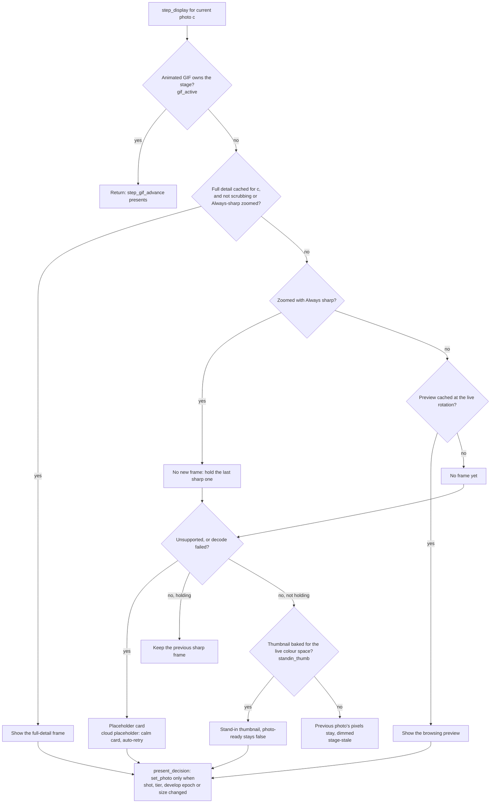

What the stage shows:

- **Full detail** when it is cached and the user is not scrubbing, or is zoomed with Always sharp.
- **Otherwise the browsing preview**, if one is cached at the live rotation.
- **A stand-in** while a supported photo is still loading: its RAM thumbnail, shown at once, but only
  if that thumbnail was baked for the live colour space (`standin_thumb`). `shown_standin` makes sure
  the real frame still replaces the stand-in even at identical size.

The interface gates:

- `photo-ready` is true only when the stage shows the current photo's own decoded frame, not a
  stand-in. Zoom, pan and the 1:1 click wait for it.
- `cur-loading` drives the quiet Loading pill.
- `stage-stale` dims a previous photo's pixels so they never read as the current photo.
- Rating and flag keys check in Rust that the shown photo is exactly `current` (`cull_gate`), rather
  than reading the lagging interface property.

When the user browses while zoomed, the pan carries to the next photo (`PanCarry`,
`support::carry_pan`). For the same aspect ratio it keeps the same pixels; otherwise it keeps the
same proportional position. It is applied on the first present, stand-in included.

**Zoomed browsing: Speed or Always sharp.** The browse-speed popup's **When zoomed** control has two
settings:

- **Speed** (the default) shows the cached preview and sharpens when full detail lands.
- **Always sharp** (`zoom_sharp_active`) shows only the detail tier while zoomed. `want_full` holds,
  and `hold_sharp` keeps the last sharp frame on stage instead of flashing the preview.
  `step_scrub_advance` and `step_wheel_advance` pace the browse to the measured detail rate
  (`detail_fps`, through `effective_scrub_fps`; see
  [Always-sharp browse pace](#always-sharp-browse-pace-detailpace)) and only step onto cached detail,
  so `current` can never run ahead of the sharp tier.

The frame a blocked browse is waiting for counts as explicit work throughout the detail tier
(`support::detail_awaited_mirror`, part of `support::ExplicitSet`). A blocked browse therefore moves
at the decoder's real rate, not at the 250 ms pace (`SETTINGS_PUBLISH_PACE_MS`) applied to paced,
preparing-ahead publishes. Failed and unsupported photos still show their placeholder, so a bad file
cannot wedge the hold.

**The present record has three terms.** `support::ShownRec` records the shot index, the tier, and the
develop-settings epoch:

- The **tier** says whether the pixels came from the detail tier or the preview tier.
- The **epoch** is `det_epoch`. Every develop-setting change bumps it: RAW/finished mode, output
  colour space, ICC profile, Resolution limit, Adaptive Hi-Res, Simulate VRAM, and both GPU
  out-of-memory steps.

`support::present_decision` is the whole present gate. A new `set_photo` is owed when:

- the shot, tier or epoch changed;
- the same key arrives at new dimensions;
- a stand-in is being replaced by the real frame;
- a placeholder is due.

The epoch term exists because a change can keep both the key and the size. A CR3 RAW and its JPG are
both 8192×5464, so with Always sharp holding the zoomed frame, switching between RAW and JPG would
otherwise change nothing on screen, permanently. The key is exact, not approximate: the detail drain
rejects any frame developed under another epoch, so everything in the detail cache matches the live
epoch. A present caused only by an epoch change is not counted as a frame arrival, which keeps
`frameprof:`'s `arr` figure honest.

**The animated-GIF lane owns the stage.** `step_display` is not the only presenter: `step_gif_advance`
runs before it. For an animated GIF with at least two frames in the single view, it owns the stage,
and `step_display` returns at once (`gif_active`).

- The first time, it requests one decode on the `falcon-gif` worker and lets the ordinary tiers show
  the colour-managed first frame meanwhile.
- The worker decodes all frames and converts them from sRGB to the output colour space
  (`bake_anim_frames`). The frame store records the photo, folder-open counter, output colour space
  and custom-profile generation. `anim_store_current` drops the store after navigation, a rescan, a
  colour-space switch or a custom-profile reload.
- While zoomed, playback freezes on the current frame and the zoom-region tier shows it.
- In Compare, or for a still GIF, the lane hands the stage back to the normal path but still records
  whether the file is animated, since the context menus need that answer.

See [Formats beyond the core set](#formats-beyond-the-core-set) for the GIF decoder and its size cap.

### Zoomed browsing and the mouse wheel

**A zoomed wheel never silently eats a notch.** Two rules, each right on its own, could combine into a
lost notch:

1. Always sharp refuses a step onto a photo whose detail is not cached, and clears that notch's
   credit.
2. The stale-wheel rule then discards the bank 140 ms later.

Below about 7 frames/s the paced interval is longer than 140 ms, so a lone notch could vanish even
with the next frame ready.

The per-tick verdict is therefore the pure function
`tick::wheel_step_decision(held, zoom_sharp, next_ready, wait_ready, pending, stale, credit)`, which
returns a `WheelStep`. Rows are checked in order:

| Order | Condition | Result |
|---|---|---|
| 1 | Nothing banked | `Bank` (nothing to do) |
| 2 | An arrow key is held and `support::HELD_KEY_OWNS_NAV` is true (macOS only) | `DropExcess(WheelDrop::Held)`. The held key owns navigation, so trackpad micro-scrolls and momentum cannot drag `current` against it. On Windows the constant is false and a notch made during a held arrow is applied. |
| 3 | The opt-in **Never browse onto a blank photo** setting refuses (`scrub_wait_ready`) | `Bank` while the wheel is live; `DropExcess(WheelDrop::WaitBar)` once it is stale. |
| 4 | The wheel is stale (quiet longer than `HOLD_TIMEOUT_MS`) | Pay the one owed step: `AdvanceProxy` if Always sharp is on and the next detail is not ready, otherwise `AdvanceSharp`. |
| 5 | The paced clock is not due (`credit` false) | `Bank` |
| 6 | Always sharp, next detail not ready | A single banked notch takes `AdvanceProxy` now; a multi-notch spin keeps pacing (`Bank`). |
| 7 | Otherwise | `AdvanceSharp` |

The type makes the guarantee checkable: while zoomed, every notch advances sharp, advances with the
preview, or joins a paced spin whose end may drop only *excess* notches.

`AdvanceProxy` is the escape hatch, not the normal path. The detail prefetcher keeps neighbours ready,
so most notches advance sharp. A preview advance shows what a single arrow press shows, then sharpens
in place through the standing detail request: `step_prefetch_detail` asks for the new `current`
first, and `detail_c_dispatch` answers `Now` while Always sharp is on.

The only drop the user can cause comes from the opt-in setting, because a preview advance would land
on exactly the blank photo that setting forbids. A sole dropped notch is logged
(`support::wheel_notch_dropped_line`) and shows `support::WHEEL_WAIT_TOAST` ("Still loading — scroll
again when the next photo appears"). The toast is rate-limited by `REFUSAL_TOAST_GAP_MS` (1.5 s), the
gap every refusal toast shares: cull keys, Compare 1:1, both halves pinned, close deferral, delete in
Compare, and the wheel. Excess notches of a spin drop silently, and the macOS held-key drop is
log-only. At the folder's edge nothing is refused, because `scrub_wait_ready` treats `next == cur` as
ready.

*Known limitation:* the Compare wheel (`step_compare_browse_advance`) still discards its whole bank
once the wheel has been quiet for 140 ms, before paying a paced step. Below about 7 frames/s a lone
notch in Compare can therefore be lost.

### The focus badge

The badge says how sharp the shown frame is. Its states, in priority order (`FocusBadge` in
`ui/controls.slint`):

| Badge reads | When |
|---|---|
| **Focus 1:1** (accent) | Zoom is 100 % or more and the full-detail frame is shown. |
| **Not sharp** | Zoom is 100 % or more, detail is not shown, and full detail has failed (the retry card is up). |
| **Loading…** (amber) | Zoomed in to 100 % or more and detail is not shown yet. |
| **Loading…** (grey) | At Fit, and a sharper frame is still owed. |
| **Zoomed** | Between Fit and 1:1. |
| **Fit** | Otherwise. |

Rust, not the markup, decides that a sharper frame is owed. The tick publishes `detail-pending` from
`support::detail_pending(scrubbing, gif_active, unsupported, cached, failed)`: true only when the
detail tier still owes the current photo a frame and nothing stands in its way. Compare publishes
`cmp-detail-pending` for its halves. Because Compare passes `scrubbing: false`, the compact chip reads
"Loading…" during a Compare scrub where the single view reads "Fit".

A playing GIF, an unsupported placeholder, a latched failure and a frame shown mid-scrub all read
"Fit": none of them is loading anything. Amber cannot appear at Fit, because the amber state requires
zoom above 1.

*Known limitation:* when zoomed to 100 % or more over a playing GIF or an unsupported placeholder, the
badge reads amber "Loading…" indefinitely. The zoomed state checks only whether detail is shown, with
no pending term.

### The RAM keep-alive cache

`L2Store` (`l2.rs`) keeps decoded preview frames in main memory after their GPU texture is evicted, so
a photo the user has already visited never decodes again. It is owned by the interface thread and is
pure logic (no GPU or interface code), with its own unit tests. It runs on Windows. On a normal Mac
build it is off (`l2_allowed()`): CPU and GPU share one memory pool that the Metal working-set budget
already governs, so a second CPU-side byte cache would count the same memory twice. The Developer
settings row shows it greyed out with that reason, and `FALCON_CLASSIC_POOLS=1` turns it back on for
comparison runs.

- **What it buys.** A backward pass or a change of direction re-uploads from RAM (texture creation
  only) instead of paying about 200 ms to decode again. On a revisit the `perf:` line shows `dec=0/s`
  and `l2h>0`.
- **Zero-copy.** The upload thread wraps the frame and its blur image in `Arc<[u8]>` (a shared,
  reference-counted buffer) before creating the texture. A deposit is therefore a pointer move, and a
  hit is a pointer clone.
- **Serving from RAM.** A wanted frame still in RAM goes to the upload thread as
  `UploadJob::FromRam`: upload only, sharing the two preview in-flight slots, retried next tick if
  they are full. It is never queued for the pool: `step_prefetch_fast` splits the wanted list into
  RAM-served and pool-decoded frames before rebuilding the queue.
- **Source colours only.** Entries keep the photo's own colour-space pixels. Colour management happens
  on the GPU at upload, so a later output-colour change converts from the original.
- **One decode per shot (hardware HEIC).** When a Windows hardware-lane HEIC is decoded once as a
  full-size master, the master is deposited with `master: true` and the live develop epoch, and the
  detail tier can serve it as `UploadJob::DetailFromRam` instead of decoding again; see
  [One HEIC decode per shot](#one-heic-decode-per-shot). `FALCON_HEIC_ONE_DECODE=0` turns this off.

**Budget and eviction.**

- **Budget.** The nominal budget is `min(25 % of physical RAM, 8 GiB)` (`l2_budget_bytes`), designed
  for 16–32 GB machines. Below 1 GiB nominal (less than 4 GiB of RAM) the cache is off for the session
  (`L2_BOOT_FLOOR`). The live budget follows available memory; see
  [The RAM pressure valve](#the-ram-pressure-valve).
- **Eviction.** The entry farthest from the current photo goes first, in either direction (`|i − c|`),
  so both sides survive a change of direction. The GPU preview cache, by contrast, keeps its
  directional 2:1 window.
- **The explicit set is never evicted.** Both the GPU and the RAM evictions skip
  `support::ExplicitSet` (asked through `fast_evict_protected`): the displayed photo, both Compare
  halves, the Review tile under the pointer (`hover_pin`), and the frame a blocked Always-sharp browse
  is waiting for (`awaited`). If only protected entries remain, the store stays over budget by at most
  those five frames rather than evicting a photo that is on screen or awaited. The overshoot clears
  itself as soon as the pointer moves or the browse advances.

**The size and tier tags: one test, three users.**

- **`dim` is the size bucket the frame was requested for.** It is stamped when the decode starts, from
  `scrub_dim_atomic`, and is never the pixel long side. A frame requested at 3840 and kept at its 4096
  DCT size is tagged 3840: it satisfies a 3840 request and does not falsely satisfy a later 4096 one.
- **`l2::dim_satisfies(entry_dim, want)`** is true when `entry_dim ≠ PREVIEW_CACHE_DIM` and
  `entry_dim ≥ want`. It is the single test shared by the RAM hit rule (`L2Store::get`), the prefetch
  wanted-filter and the upload drain's duplicate check. If these disagreed, a size grow would either
  never re-decode or re-decode forever. `PREVIEW_CACHE_DIM` (0) marks a frame taken from a file's
  embedded preview, and the drain also refuses to insert such a frame, so an embedded preview can
  never be served as a browsing frame.
- **`L2Store::deposit_wanted(idx, dim)`** deposits only into an empty slot or over an entry with a
  smaller bucket, so the best frame wins without churning bytes.
- **`sup` is the Faster/Sharper choice the pixels were decoded under**, read from the same atomic that
  sized the decode. A frame that lands after the user switched is dropped; otherwise RAM would keep it
  and make that photo permanently soft. `sup` is compared with the live setting, not an epoch, so
  switching back quickly accepts frames again.
- **`master` and `epoch`** decide whether an entry may serve the full-detail tier
  (`l2::full_res_serves`).

The diagram shows how an entry is deposited, served and invalidated.

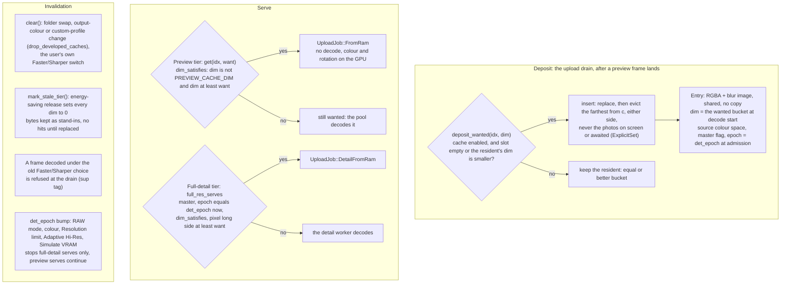

### Browse scheduling

**Detail neighbours wait for a real stop.** `nav_rate` is a moving average of landings per second
(`nav_rate_update`, `NAV_RATE_ALPHA` = 0.5).

- **The current photo** (and Compare's two visible halves) gets its full-detail request on every
  settle (`SETTLE_MS` = 150 ms).
- **The neighbour burst** (photos ahead and behind, plus Compare's next photo) fires only when
  `allow_detail_neighbors` agrees: `detail_sched` is off; or the user is zoomed with Always sharp,
  where that window is the display path; or `nav_rate` is under 2 landings/s
  (`NAV_RATE_THRESHOLD`); or the user has been still for 2 × `SETTLE_MS` (`extended_still`).

A scrub–pause–scrub rhythm therefore does not start full-size decodes that collide with the next
burst. People slow down before they stop, so a real stop still finds its neighbours prepared within
about 300 ms.

**The preview window leans the way you are browsing** (`tick::momentum_split_ahead`). The preview
cache's capacity is split between photos ahead and behind.

- **At rest:** 2:1 ahead (`BASE_AHEAD` = 0.67).
- **Browsing forward:** the split moves toward 0.85 ahead as smoothed scrub speed rises.
- **Browsing backward:** it moves toward 0.15 ahead (mostly behind).

To avoid jitter, the committed split moves only when the target differs by at least 0.12. After
motion stops it relaxes back to 2:1. A move of more than 12 photos in one tick counts as a jump, not as
speed, and a folder change resets everything.

**The preview window never asks for more frames than the cache holds.**
`support::fast_window_split(byte_cap, cache_max, split_ahead, max_side)` sizes the window:

- start from the cache's frame capacity, minus 8 frames of slack;
- apply a comfort floor of 12 frames;
- never exceed `byte_cap − 1`, so the floor cannot push the window past the cache.

On a healthy card the cap never binds. On a small budget the window is the cache minus one frame. A
window larger than the cache makes the eviction throw out frames the window still wants, and the next
tick requests them again; that decode-and-evict loop also churns GPU allocations. An integrated GPU
driving a 4K panel can hit this at startup: about a 266 MB preview budget against 44.7 MB supersampled
frames leaves room for only 5 frames. Any card can hit it after out-of-memory halving. When the window
is too small to keep 3 frames on each side (`MIN_SIDE`), the split is collapsed explicitly instead of
calling `clamp` with an impossible range, which panics in Rust.

**Upload order (a safety net).** The upload thread keeps a small reorder buffer over its single job
channel, so shutdown still simply means "exit when the channel disconnects".
`support::pick_photo_upload` chooses the next job. While priority is on (`detail_sched` on and not
Always-sharp zoom), the order is:

1. The oldest job for the displayed photo, in the single view (the tick publishes that photo every
   tick), whatever its size.
2. An open menu's backdrop.
3. The oldest browsing-preview job (`pick_upload_idx`).
4. The oldest other job.

With priority off, jobs go in arrival order, so during Always-sharp browsing a preview frame never
jumps ahead of the sharp frame being watched. `is_fast_lane` classifies every `UploadJob` variant
explicitly, so a new variant will not compile until its lane is chosen. A tripwire logs (at most once
every 5 s) when a full-size or zoom job waited more than 1 s; backdrops and benchmark probes are
excluded.

**Design lesson: a size-keyed cache and a serial upload stage fail together.** Maximizing on a 4K
screen raises the preview size to 3840 px. Without the four mechanisms below, that collapses browsing
to 0–8 frames/s. Do not remove any of them:

1. The 29.5 ms blur image is made off the upload thread: taken from the thumbnail where possible
   (`frost_thumb`), otherwise shrunk in the decode pool (`async_blur`).
2. A size **shrink** keeps the cached frames, because they are higher quality than needed.
3. A same-tier size **grow** keeps the old frames on screen while it re-decodes over them, so a
   maximize sharpens within about a second instead of flashing an empty stage. Only the user's own
   Faster/Sharper switch clears the caches.
4. **Two-class re-decode priority** (`fast_want_class`): every missing frame, nearest first, is
   decoded before any stale frame is upgraded. Without it the pool spends half its throughput
   re-sharpening frames already on screen, and the rate swings 0→8→17→8 frames/s.

### Measured cost model

The following was measured on 45 MP (8192×5464) camera JPEGs with an RTX 5080, using two dedicated
benchmark programs: one measured decode-to-stop, decode + resize + pack, pool throughput and serial
upload; the other ran the same upload thread carrying preview frames while full-size uploads competed.
The figures still explain the design:

- **A preview JPEG decode costs about 196–220 ms at any requested size.** Huffman decoding dominates.
  `jpeg-decoder` stops at the smallest 1/2ⁿ DCT size at or above the request, so every request in
  (2048, 4096] costs the same 4096 decode. The 64 px step (`ADAPT_STEP`) sets the resize and upload
  size, not the decode cost.
- **Throughput comes from the pool's width, not from a smaller request.** 16 workers gave about 40–47
  frames/s. A sweep of 16→18→20 workers measured about 51→55→59 frames/s, and 18 was kept to leave
  cores for the interface and upload threads.
- **Resizing slightly costs more than not resizing.** Shrinking a 4096 decode to 3840 costs about
  30 ms of Lanczos for a 1.07× reduction, more than using the 4096 frame, so near-stop resizes are
  skipped (`near_stop_skip_resize`).
- **GPU staging is cheap:** 0.03–0.05 ms per MB. The real serial cost was the 160 px blur image (9 ms
  at 2176 px, 29.5 ms at 3840 px), which is why it is made off the upload thread.
- **Preview staging with colour management costs 1.8–1.9 ms per 44.8 MB frame.**
- **Full-size staging costs 52–75 ms alone, about 89 ms with the pool busy, and 83–152 ms in live
  use.** An isolated probe under-reports the real serial cost by about 2×.
- **Upload order matters only near saturation.** With N full-size uploads per second competing
  (N = 0 / 5 / 10), first-in-first-out ordering delivered 51.8 / 50.0 / 27.8 preview frames/s;
  preview-first ordering delivered 51.2 / 50.3 / 39.4. Priority only matters once the thread saturates
  (about 10/s, the live rate), where it recovers 1.42×. It is a safety net.
- **More width is not lower latency.** Widening the upload stage from 4 to 8 concurrent frames
  multiplied median latency by 4.7 and added no frames per second. Little's law assumes the time per
  item (L) does not depend on concurrency; here it does, so feeding a live-measured L back into a
  rate × L width rule would spiral. That is why live-latency feedback is not used.

### The speed benchmark

The Quick benchmark (on the welcome card, and in Settings → Performance → Fast View) reports a
sustained browsing rate for each tier. Saved results carry `BENCH_SCHEMA_VER` = 4. Results saved under
an older schema measured something different and cannot be compared, so they are discarded on load,
and the row reads "device not yet tested" until the user runs the benchmark again.

- **Faster and Sharper preview** report `browse_sustained(mixed, decode, upload) = min(mixed,
  iso_sustained)`. That is the rate measured while full-size uploads compete through the real two-lane
  upload thread, clamped to the contention-free ceiling (`iso_sustained = min(decode pool, upload
  stage)`), since contention can only slow a tier.
- **Full** reports `iso_sustained` directly. Full-detail browsing is the zoomed Always-sharp path: a
  single tier, paced by detail, without the preview-first priority.
- **Every probe iteration submits.** `create_texture_rgba` is a texture creation plus a pending write,
  and a pending write keeps both the texture and its full-size staging buffer alive until the next
  `queue.submit` from any thread. On the static welcome card Slint draws nothing. Without one empty
  `queue.submit` per iteration, the probe measured a growing queue and, on integrated graphics (about
  1.6 GB against a 4.2 GB budget), ran into an out-of-memory device loss.
- **Each run owns an abort latch.** `bench_oom_arm()` at the start of a run is the only thing that
  clears it. The tick's out-of-memory recovery does not, because an OOM during a run spoils its numbers
  whatever caused it. On an OOM, the affected tiers report 0 (non-binding), one log line names the
  stage, the run completes with partial results, and the app keeps running.
- **The Full probe is sized for the machine.** It is clamped to `detail_cap` by the same expression
  the mixed stage uses (for example 8216 → 2560 px on a small laptop), and the per-loop target is
  `min(800 MB, detail budget)`. When the probe is clamped, `bench_clamp_note` writes a caption naming
  both sizes, and `bench_full_probe_res` saves the probe size so the caption survives a restart.

`FALCON_BENCH_ON_BOOT=1` runs the Quick benchmark about 2.5 s after start-up, through the same
`invoke_run_benchmark(true)` call the button uses. It is the only way to reach this code path without
a mouse.

### Measurement levers

These environment variables ship in release builds, cost nothing when unset, and are the instruments
for measurement and automated checks. Levers marked *default on* switch off a shipped behaviour when
set to `0`; the rest switch on an instrument.

| Lever | What it does |
|---|---|
| `FALCON_TICK_PROF=1`, `FALCON_TICK_PROF_MS=<ms>` | Per-step microsecond breakdown for any tick over the threshold (default 25 ms). Each label is the time since the previous label. The always-on `perf:` line names the slowest step (`worst_step=`). |
| `FALCON_TICK_RATE=<secs>` | A periodic `tickrate:` report of the tick's posture and rate. |
| `FALCON_FRAME_PROF=1` | The present-to-present frame timer: a `frameprof:` line per `perf:` window with gap p50/p95/max, `late>20ms` (the dropped-frame proxy at 62.5 Hz), idle gaps, the sample count, the draw span, and `arr p95` over photo arrivals. When unset it costs one relaxed load and a branch. |
| `FALCON_AUTOSCRUB=<secs>`, `FALCON_AUTOSCRUB_REV` | Drives the real held-key browse (`scrubbing` true), forward or reverse. |
| `FALCON_DEBUG_STEP=<n>[:<ms>]` | `n` single arrow taps (`scrubbing` false): the tap path autoscrub cannot reach. |
| `FALCON_DEBUG_JUMP=<delta>` | One discontinuous jump through the real `prime_jump`. |
| `FALCON_DEBUG_CHROME`, `_SIZE`, `_MAXIMIZE`, `_IMMERSIVE_CYCLE`, `_SETTINGS`, `_OPEN`, `_FLOAT_EXIF` | Self-driving hooks for window state, Settings, folder open and the floating EXIF panel. |
| `FALCON_DEBUG_MENU_CAPTURE=<path>` (with `_KIND`, `_REVIEW`, `_LEGACY`) | Captures a rendered menu for menu checks. It is the only GPU read-back of the menu blur, and test-only. |
| `FALCON_TRACE_GLASS`, `FALCON_TRACE_INSPECTION`, `FALCON_TRACE_VIEW_STATE` | Opt-in trace lines for the menu blur, inspection and view state. |
| `FALCON_SIM_DEVICE_LOST=<ms>` | Destroys the shared GPU device after `<ms>` to exercise the device-loss path, skipping the blocking restart dialog. |
| `FALCON_CLASSIC_POSTURE=1` | Reverts the whole preparing-ahead posture: no format-aware window narrowing, no cap on costly decodes, no open-time priming hold, no interaction gate. The HEIC lane cap is inert under it. |
| `FALCON_CLASSIC_POOLS=1` (Mac) | Restores fixed decode and thumbnail pools, the RAM/2 GPU-memory estimate and the RAM keep-alive cache, instead of the elastic pool. |
| `FALCON_SETTINGS_THROTTLE=0` | *Default on.* Turns off the throttle on preparing-ahead work while Settings is open. |
| `FALCON_INTERACT_PACE=0` | *Default on.* Turns off only the interaction rows of the publish gate. With a browse inside 200 ms (`MOTION_PACE_WINDOW_MS`), preparing-ahead work is paced. With a stage or panel input inside 900 ms (`INTERACT_PARK_WINDOW_MS`) that is newer than the browse, it is parked, then paced for a 3 s tail (`INTERACT_PACE_TAIL_MS`). |
| `FALCON_EFFICIENCY=0` | *Default on.* Never engages energy-saving mode. The control still shows and saves, for A/B runs on one build. |
| `FALCON_POWER_SIM=ac\|dc\|saver`, `FALCON_EFFICIENCY_SIM_LATENCY_MS=<n>` | Simulate the power source and the measured latency for energy-saving mode. Calculation only; the log marks the source as simulated. |
| `FALCON_SCAN_WORKERS=<n>` | Folder-scan header readers (capped at 8). |
| `FALCON_BENCH_ON_BOOT=1` | Runs the Quick benchmark about 2.5 s after start-up. |
| `WGPU_BACKEND=<name>\|auto` | One-off GPU backend override, or a reset of the saved choice. |
| HEIC lane switches (`FALCON_CLASSIC_HEIC`, `FALCON_HW_HEIC*`, `FALCON_HEIC_*`) | See [Switches for testing and fallback](#switches-for-testing-and-fallback). |

### Menu blur (frost and glass)

Falcon's frosted glass (`frost` and `backdrop` in code) is a small, blurred picture of what lies
behind a panel or menu, built from images already in memory. It never decodes a photo, reads a file
or reads pixels back from the GPU (`backdrop.rs`, `glass_blur.rs`, `tick::step_blur_backdrop`).

#### Where the blur images come from

Each photo needs a 160 px blurred image (`BLUR_DIM`). Making it by shrinking the whole ~44.8 MB
decoded frame cost the preview pool about 12–20 % of its throughput, so it is taken from the 256 px
thumbnail instead. The diagram shows the feed.

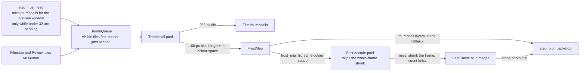

- **The map.** `FrostMap = Arc<Mutex<HashMap<usize, (Arc<[u8]>, u32, u32, Gamut)>>>`. After each
  thumbnail decode, the thumbnail worker parks a 160 px blur image there, checking the folder-open
  counter so that a late result cannot seed the next folder. The map is always written; the
  `frost_thumb` setting only gates reading it. A preview decode looks there first and skips the
  whole-frame shrink on a hit. A miss shrinks the frame instead, so correctness never depends on the
  map being warm.
- **The value carries a colour space, and a mismatch is a miss.** `frost_mip_hit` rejects a blur image
  whose colour space differs from the frame's, because a HEIC thumbnail may come from the file's
  embedded preview, which can declare a different colour space from the main image. Converting would
  add up to 9 levels of 8-bit rounding error in dark, saturated colours, so the frame is shrunk
  instead, and the rejection counts as `fmiss`. A colour-managed derived frame skips the map without
  counting a miss.
- **The feeder.** `step_frost_feed` requests thumbnails across the whole preview window, but only
  while fewer than 32 thumbnail requests are pending (`FROST_FEED_PENDING_MAX`). That leaves at least
  16 of the 48 slots (`THUMB_PENDING_MAX`) for visible tiles. It checks this budget first, so it does
  real work only on ticks where a thumbnail landed. Its requests share the visible tiles' channel,
  failure list and cache, so a feeder thumbnail also serves the filmstrip.
- **Two lanes at the thumbnail queue.** `support::ThumbQueue` is the single place where every pool
  shape takes thumbnail work: the Windows fixed pool, the Mac classic pool and the Mac elastic pool.
  Each request (`ThumbReq`) says whether a tile shows it on screen right now (`explicit`). Workers sort
  what has arrived into those two lanes and always take explicit work first. A visible thumbnail
  therefore waits behind at most one decode already in progress (66–86 ms median with 4 workers)
  instead of up to 32 feeder jobs (about 600 ms) after a jump or a folder open. The lanes add no
  polling or timers, so idle power use is unchanged.
- **Rows the user has left are retired.** Within the explicit lane requests run in arrival order, so
  after a grid-dock scroll the new rows used to wait behind every queued request for rows already
  scrolled past, and those requests also held the shared pending slots the new rows needed. After the
  filmstrip, Review panel and grid dock have made their requests each tick, `tick::step_retire_thumbs`
  looks at the pending requests. One that has been on screen while pending (`Film::visible_pending`)
  but is now outside every visible window is retired. Visible means the filmstrip's model window,
  `Film::pinned` (the Review panel's and the dock's live windows, margins included) or a neighbour of
  the current photo or, in Compare, of either half (`thumb_keep_around`: a Compare wheel step with
  **Never browse onto a blank photo** waits for each free half's next photo). Because a request
  retired earlier is gone for good, a Compare wheel step that is held on a free half's blank target
  also asks for that thumbnail itself (`tick::ask_compare_target`, through `feed_visible_thumb`'s
  dedup and admission limit; a failed decode reads as ready, so the hold always ends). Retiring releases the request's pending slot, bumps `thumb_gen` so the key-gated
  views refill, and sends a `ThumbReq::retire`, which `ThumbQueue` uses to drop that shot's queued job.
  The retirement never starts, answers or interrupts a decode. A job already running lands and is
  cached as usual, and a re-request sent after the retirement is kept, because the channel keeps
  order. The feeder's requests for shots nobody has looked at are never retired. Measured on 976
  paired 45 MP JPG+CR3 shots with three dock columns (4 October 2026), the screen filled 2.0–2.5 s
  after a flick stopped instead of 4.1–4.4 s.
- **Observability.** `fmiss=` on the `perf:` line counts lookups that found nothing usable.
  `blurprof:` is always on: when the backdrop step takes 20 ms or more (`BLUR_SPLIT_LOG_MS`), at most
  once a second, it splits the time into mount, props, pick (including lock wait), rotate, colour,
  compose and send. A quiet log means the blur is cheap.

#### How the glass is built

- **Only when something shows it.** The glass is rebuilt only while a surface that samples it is on
  screen (`blur-sampler-mounted`): the develop and info panels and their stubs, the immersive cull
  card, floating EXIF panels, the Compare bar, the photo context menus and the sort menu.
- **Only what is visible.** `backdrop_layers` lists the stage photo (or both Compare halves, with their
  pan), the visible grid and filmstrip cells, and, while a Review-panel menu is open, the Review panel's
  background and its visible thumbnails. Grid and filmstrip images are fitted inside their cells;
  Review thumbnails fill theirs.
- **Never waits on a worker.** All interface reads happen first. The thumbnail-blur store is then taken
  with `try_lock`; if a thumbnail worker holds it, this tick skips the rebuild.
- **Small sources.** Each layer uses an existing small blur image: the browsing preview's for the stage
  photo (falling back to the parked thumbnail blur image, with its own colour space, when there is no
  preview frame), and the thumbnail-derived one (`FrostMap`) for cells. They are stored unrotated,
  each with its own colour description. Both uses require `frost_thumb`.
- **No work when nothing changed.** A key (`BlurKey`) combines the output colour setting with a
  fingerprint of the window geometry, the menu area and every visible layer (photo, position, clip,
  rotation, fit, source image and its colour). An unchanged key, or a rebuild already in flight, costs
  nothing, so an idle window does no glass work.
- **Whole-window glass** (`backdrop::compose`): built on the interface tick at no more than 256 pixels
  per side with a light box blur, then sent as `UploadJob::Backdrop`.
- **Menu glass** (`backdrop::compose_menu`, `UploadJob::MenuBackdrop`): only the menu's rectangle plus
  48 pixels of margin for the blur, at half scale or less and at most 512 pixels on the long side. Its
  layers are composed on the upload worker, right after the displayed photo's uploads. Its blur
  (`glass_blur::gaussian_blur`) is three box passes sized to match a Gaussian. It has no negative
  weights, so edges get no bright or dark rings. Until the cropped glass covers the menu's real
  laid-out bounds (`menu-blur-covers`), the menu shows the whole-window glass.
- **Colour.** Each photo patch is converted from its own source colour to the output colour after
  sampling (`frost_mip_for_display`). Interface colour never passes through a photo's colour space,
  transparent photo pixels show the interface colour, and the result stays opaque.
- **One canvas for every panel.** Each `GlassPanel` maps the same content-space canvas through its own
  offset (`ox`, `oy`: 0 for window-level panels, minus the stage's x for stage-level panels), so
  neighbouring panels show matching glass.
- **Diagnostics.** `FALCON_TRACE_GLASS` logs build times. `FALCON_DEBUG_MENU_CAPTURE=<absolute folder>`
  (`menu_probe.rs`) opens a menu automatically and saves a renderer capture for inspection; it is the
  only path that reads pixels back. With capture on, `FALCON_DEBUG_MENU_LEGACY=1` uses the older
  uncropped menu glass for comparison.
- **Checking it.** Geometry and timing tests prove placement and cost, not that the blur looks right.
  Visual quality is judged on a real screen.

The diagram shows the per-tick decision.

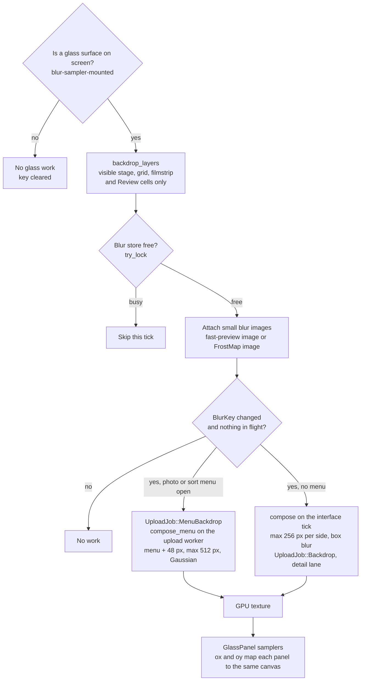

#### Publishing the glass

`step_blur_backdrop` builds the job on the tick and `try_send`s it to the upload thread. An open
menu's backdrop is uploaded ahead of preparing-ahead frames. The key is parked in
`BackdropKey::pending` and promoted to `shown` only in `step_upload_drain`, when the texture lands. A
refused or failed job must never leave a key claiming pixels that did not arrive. If the send is
refused, nothing is parked and the next tick tries again.

`BackdropKey { shown, pending }` sits behind one `RefCell`, and `invalidate()` is its only clearing
verb. Four events invalidate it: a geometry change (`step_adaptive_res`), a manual rotation, an
auto-orient flip, and an output-colour change. A single verb matters because a 180° rotation leaves
`BlurKey` unchanged: clearing only `shown` would let a pre-rotation canvas land and be promoted.

The blur's upload is in the detail lane, so it never pre-empts a browsing frame, and it is excluded
from the slow-detail tripwire. At most one blur job is in flight.

### Per-format decoders

#### One decode dispatch

Every tier decodes a finished image through one match on `shot.kind`:
`decode_source_keep(shot, scale_to, keep)` in `falcon-decode`.

- Each non-JPEG arm decodes, applies `apply_keep`, then runs `finish_source_keep`, which resizes to
  `scale_to` when one is asked for.
- The JPEG arm is `decode_jpeg_arm`. It scales inside the decoder at a DCT stop and always returns
  8-bit RGB.
- `Unsupported` never decodes.
- `decode_source_rgb` is the ordinary 8-bit RGB entry. `decode_full_rgb` is the full-size buffer that
  zoom regions are cut from.

`Keep { alpha, depth }` lets a caller ask for the transparency and bit depth the file actually holds.
Results come back as `Pixels`: `Rgb8`, `Rgba8`, `Rgb16` or `Rgba16` (grey expands to RGB at its own
depth). Nothing is ever up-converted: a JPEG never becomes 16-bit, and a photo never gains an alpha
channel.

- `Keep::NONE` is what the viewer and every other caller use. Under it each decoder runs exactly the
  flattening it always ran: transparency is composited over white, and 16-bit samples keep their high
  byte.
- `Keep::for_web(fmt)` is `NONE` for the JPG export and `ALL` for the PNG export.
  `decode_full_pixels` is the only caller that asks for anything but `NONE`.

Two tests pin this. `the_two_testkit_goldens_export_byte_for_byte_as_they_did` checks fixed hashes of
four export files. `the_display_path_is_the_kept_pixels_flattened` checks that the display decode
equals the kept decode, flattened.

**Which JPEG decoder.** Falcon's own JPEG viewing uses `jpeg-decoder`, plus nvJPEG on Windows and
Image I/O on Mac. `zune-jpeg` is linked only through the `image` crate (used by rawler, Slint and
resvg); its only known runtime route is rawler's `raw_image()` for DNG files whose raw data is
lossy-JPEG compressed. Falcon never calls rawler's preview functions.

#### Everything reads the one `kind`

Every subsystem reads the scan's `kind`, so correcting the classification corrects them all together:

- the decode dispatch at every tier (`decode_source_rgb`, `decode_source_rgb_lane`);
- `source_dimensions`;
- the colour-profile reader (`file_color_tag`);
- RAW partner ranking (`finished_rank`);
- the format tag in log lines (`kind_tag`);
- `Shot::is_jpeg_source`, which admits a shot to nvJPEG, to the GPU YUV zoom path and to in-file
  rotation (`finished_is_jpeg`, which also requires `has_jpg`).

The format name shown to the user comes from `Shot::finished_format`, built from `kind_tag`. A PNG
named `53d879f01a3f481c.JPG` badges **PNG** while the header still shows its real filename. The info
panel adds `(named .JPG)` (`named_ext_when_bytes_disagree`).

`Unsupported` has no format name of its own, so `finished_file_format` answers in this order:

1. If the bytes named a format this machine cannot decode, it uses that name, so a HEIC on a PC
   without the codec still says HEIC.
2. If the bytes are a format this build has no decoder for at all (today AVIF), it gives no name. Each
   surface then uses its generic wording: "This format is currently unsupported", the `IMG` badge,
   "Copy image".
3. If the bytes were never read, or matched the name, the extension supplies the name.

#### The decoder seam (`ImageDecoder`)

Finished images are decoded through the `ImageDecoder` trait in `falcon-decode/src/decode.rs`; RAW
development is outside it. Its methods are `caps`, `probe_dims`, `decode_scaled` (returns at least the
requested long side, and the caller finishes the resize), `decode_scaled_lane`, `decode_full` and
`decode_yuv`. Each worker owns its own decoder instances, so nothing is shared or locked.

Fallback happens through the return value, never through `#[cfg]` (compile-time platform switches).
An accelerated decoder returns `DecodeError::Unsupported` for anything it will not handle, and the
caller falls through to `CpuDecoder`.

| Decoder | Used by | Handles |
| --- | --- | --- |
| `NvJpegDecoder` (`falcon-nvjpeg`) | Windows full-detail and zoom-region workers, when CUDA/nvJPEG is present and the toggle is On | JPEG; the only decoder that can return planar YUV (`caps().yields_yuv`) |
| `ImageIODecoder` | Mac full-detail and zoom-region workers, when the toggle is On | JPEG and HEIC only (`imageio_serves`) |
| `CpuDecoder` | every platform and tier; the only decoder for fast previews and thumbnails | the pure-Rust format code (`decode_source_rgb`); calls WIC (Windows) or Image I/O (Mac) for HEIC and difficult TIFFs |
| `WicDecoder` | Windows; a full implementor, but shipping code reaches WIC through `CpuDecoder` (and the CMYK route below) | any WIC-readable file |

The optional Windows hardware HEIC lane is separate; see
[Windows HEIC hardware decoding](#windows-heic-hardware-decoding).

**`ImageIODecoder`** uses Apple's Image I/O (`CGImageSource`) through direct framework calls, with no
extra crates.

- It reads the header size first and calls `guard_source_dims` before any pixel-sized allocation, then
  checks the decoded frame again.
- Image I/O's scale-on-load returns *at most* `kCGImageSourceThumbnailMaxPixelSize`, but the trait
  promises *at least* the target. `imageio_subsample_max_px` bridges the two by picking the largest
  power-of-two reduction whose long side is still at least the target. For example, a 5,472 px source
  with a 2,048 px target is decoded at 2,736 px.
- `kCGImageSourceCreateThumbnailWithTransform` is false, so Falcon applies EXIF orientation itself,
  exactly once. `kCGImageSourceShouldCache` is false because Falcon does its own caching.
- It draws into an 8-bit RGBA bitmap in the image's own colour space, so no colour conversion is
  hidden. The colour description parsed from the file stays the only colour source.
- Any failure returns `Unsupported`. A JPEG then gets the pure-Rust decoder as a second chance. A HEIC
  re-enters Image I/O through `CpuDecoder` and ends in the same honest failure card.
- The same body, `imageio_decode_rgb`, also serves HEIC in every tier (through `CpuDecoder`'s
  `decode_heic`), the difficult-TIFF fallback and the truncated-JPEG second chance
  (`os_codec_decode_rgb`). For thumbnails it may return the file's embedded preview at the target size.
  The caller refuses a preview that is too small (`preview_is_usable`).
- When the PNG export asks to keep alpha (`Keep::ALL`), it returns straight (un-premultiplied) alpha.
  The bitmap is 8 bits per channel, so the extra depth of a 10- or 12-bit HEIC is not kept on Mac.

**One hardware-decode switch, gated per platform.** Settings → Performance has one hardware-decode
toggle. `platform::accel_toggle_label` names it: "GPU JPEG decode (nvJPEG)" on Windows, "Hardware
JPEG/HEIC decode (Image I/O)" on Mac. Whether it is available comes from
`support::accel_avail_for(nvjpeg_avail, is_macos)`: on Windows only when nvJPEG is, and on Mac always,
because Image I/O is part of the OS. The rule: a platform's accelerated path is gated on that
platform's own availability, never on another platform's probe. Gating the Mac on `nvjpeg_avail`,
which is always false there, would make the Image I/O path unreachable; `accel_avail_tests::truth_table`
pins this. The toggle defaults On on Mac. A one-time migration (`resolve_accel_migration`, recorded in
the saved `accel_migrated` flag) turns a stray saved Off back On. Turning the toggle Off sends every
decode to `CpuDecoder`, which is a useful escape hatch when testing.

#### Formats beyond the core set

The file's contents decide its format (`SrcKind`), not its extension.

- **GIF** (`gif` crate). Frames are composited with correct disposal into full-canvas RGBA, each with
  its own delay. Delays of 0–1 hundredths of a second play at 100 ms, as browsers do
  (`clamp_gif_delay`). Transparency is flattened over white. Thumbnails, previews and zoom use the
  first frame. When the GIF is the current photo, the viewer plays the animation (see
  [What the stage shows](#what-the-stage-shows)). If all frames fit in `GIF_PRECOMPOSE_CAP_BYTES`
  (256 MiB), they are held in memory (`GifPlayback::InMemory`). A larger GIF shows its first frame
  with the note "GIF · N frames (too large to animate)". `falcon-decode` also contains `GifStream`, a
  streaming player with bounded memory, but the viewer does not use it.
- **The GIF worker** (`falcon-gif` thread in `main.rs`) keeps only the newest request and drops older
  queued ones. It catches decoder panics and marks that GIF failed while the worker carries on. It
  converts the frames to the output colour space once, with `tick::bake_anim_frames` (which calls
  `falcon_color::transform_rgba`). Each converted set records its folder-open counter, photo, output
  colour space and custom-profile generation, so a colour-space or profile change discards it and
  requests it again.
- **JPEG XL** (pure-Rust `jxl-oxide`). Orientation comes from the codestream, and the embedded ICC
  profile sets the source colour. HDR JXL (PQ/HLG) is refused with a stated reason. Reads are capped at
  600 MB. Falcon has no JXL encoder.
- **BMP** uses the `image` crate. **APNG** is treated as PNG and shows its first frame only.
- **AVIF and TGA** are recognised and shown with an "unsupported" badge, so a folder of them does not
  look empty. They are never offered as file associations.

#### HEIC decode ladder (`Lane`)

`Lane` tells the decoder which tier is asking: `Thumb` (filmstrip and grid tiles), `Fast` (browsing)
or `Native` (full detail, the zoom source and other helpers). Only `decode_heic_lane` reads it. Every
other format goes through the normal dispatch and is tagged `FrameSource::MainImage` and
`DecodeRoute::Cpu`. For HEIC each rung picks the cheapest path that still answers the request, and
falls through softly to the next; none of these fallbacks counts as a decode failure. The diagram
shows the rungs.

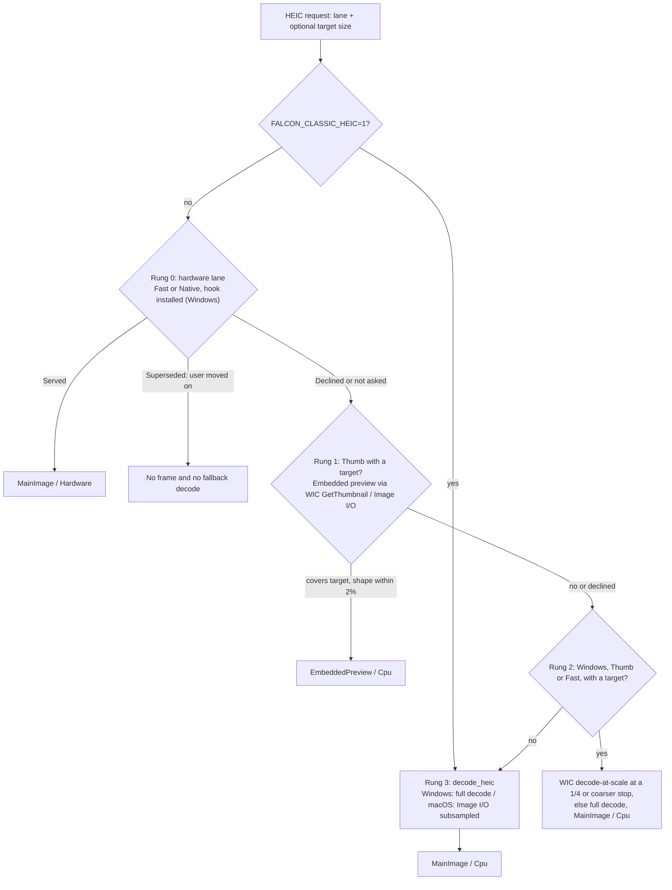

Every rung ends in `finish_source`, so all of them produce the same size for a given target
(`scaled_dims`). A rung changes the cost, never the layout (`scaled_dims_matches_resize_to_long`).
Full detail and zoom tiles always use the main image's native pixels.

- **Rung 0** is the Windows hardware HEVC lane, asked only for `Fast` and `Native`
  (`hw_heic_lane_applies`). It answers `Served`, `Declined` or `Superseded`. `Superseded` means the app
  abandoned the decode because the user had already browsed past the photo, so no slower decode is
  started. See [Windows HEIC hardware decoding](#windows-heic-hardware-decoding).
- **Rung 1** serves only the thumbnail tier. The embedded preview must cover the target size and match
  the main image's shape within 2% (`preview_is_usable`). The shape check also catches a preview the
  codec forgot to rotate. It is tagged `FrameSource::EmbeddedPreview` and described with the
  preview's own colour, so it is never mistaken for the main image. Each kind of decline is logged once
  per session. Reading the embedded preview costs about 3 ms, against about 58 ms for a hardware decode
  of a 48 MP photo, which is why thumbnails never use the lane.
- **Rung 2** (Windows only) asks WIC for a power-of-two stop. The Store HEVC codec charges full price
  for its 1/2 stop, so the ladder starts at 1/4 (`HEIC_MIN_STOP_DIV = 4`). Measured on 48 MP iPhone
  files with 18 workers: 36 frames at a 2,880-px target took 23.6 s through the 1/2 stop and 16.2 s
  with full decodes. At a 1,440-px target, where the 1/4 stop qualifies, they took 8.2 s against
  15.0 s. A stop is used only when it is a real saving and still covers the target
  (`heic_stop_is_acceptable`). Inside the rung, Falcon tries `IWICBitmapSourceTransform` at the stop,
  then `IWICBitmapScaler` at the same stop (`wic_decode_rgb24_scaled`), then a full decode.
- **Rung 3** is the plain decode, followed by a Lanczos resize when needed. On macOS, Image I/O decodes
  straight to a subsampled size for every lane, and its 1/2 subsample is a real saving there.

`FALCON_CLASSIC_HEIC=1` turns rungs 0–2 off for diagnosis; the app then does not install the hardware
hook at all.

#### The sampling contract

This contract is stated in full at `fast_frame_rgba` and binds future work. The decode ladder is the
halving sequence of the full image: full size, 1/2, 1/4, 1/8 and so on. A rung "covers" a request when
its long side is at least the requested size.

- **Sharper preview** (`Supersample`) decodes at the smallest rung that covers the requested size
  (`max_dim`), then Lanczos-resizes to exactly that size.
- **Faster preview** (`Subsample`) applies the same rule to half the request (`max_dim / 2`) and serves
  at least that many pixels.
- **No rung ever undershoots.** A smaller rung is not a cheaper sample; it is a softer picture. No
  tolerance band may be added. `near_stop_skip_resize` only skips the final resize when the covering
  rung is no more than 12.5% larger than the request, which serves more pixels, never fewer.

The two kinds of decoder meet the floor differently, and both are correct:

- JPEG returns the DCT stop as decoded. A Faster preview is therefore at least half the request and
  often more: an 8,064-px image at a 2,880 request lands on its 2,016-px stop.
- Every other format is trimmed to exactly the target in `finish_source`, so the same image serves
  1,440 px.

Do not "fix" the trimmed formats up to the covering rung. On Windows HEIC that would decode 2,016 px at
full HEVC price to show 1,440.

Where a codec charges full price for a rung, a full decode plus Lanczos gives the same picture more
cheaply, so it stands in for that rung. Windows HEIC's 1/2 stop is the measured case (see
[HEIC decode ladder](#heic-decode-ladder-lane)). On macOS, Image I/O subsampling is a real saving, so
Faster preview genuinely costs less for HEIC there.

### JPEG special cases

**CMYK and YCCK JPEGs.** Print-workflow JPEGs (Acrobat, Photoshop and print-RIP exports) have four
colour channels. `jpeg-decoder` delivers true ink amounts for both flavours, so `to_rgb` converts each
pixel with one formula, `(255 − ink) × (255 − K) / 255`, without reading the Adobe APP14 transform
byte. On the test fixtures, compared with the same image saved as RGB, this lands within 5 levels of
the original picture, identically on Windows and macOS. Any embedded profile is still applied
afterwards by the normal colour pass.

On Windows, Settings has a **Colour-managed CMYK JPEGs** row (`Settings::cmyk_os_route`, Off by
default; `cmyk_os_route()` in `falcon-decode`). When it is On, a JPEG whose frame header declares four
components (`jpeg_component_count`) is decoded by Windows' own codec (`WicDecoder`). Photoshop does the
same: both assign a default print profile to an untagged file. On the fixtures that result sat about
96 levels from the original picture, which is why it is not the default.

- The setting is read on every decode, so a change applies to the next photo.
- If Windows declines a file, Falcon's own conversion still runs, so turning the setting on can never
  stop a file from opening.
- The OS route gives up JPEG shrink-on-load for these files; the resize happens afterwards.
- macOS does not show the row.

**JPEGs that end early.** A JPEG cut off mid-scan (a missing end marker, or an interrupted copy or
sync) is refused by `jpeg-decoder` with an unexpected-end error, even though other viewers show the
part that arrived. For that one error class (`jpeg_err_is_truncation`) Falcon gives the OS codec a
second chance through `os_codec_decode_rgb` (WIC on Windows, Image I/O on macOS). The TIFF arm uses the
same fallback for exotic TIFFs.

- Real corruption (format or unsupported-feature errors) still fails and is reported as corrupt.
- If the OS codec declines too, the original error is reported, because it names what is wrong with
  the file.
- A RAW's embedded preview, or a passenger file, never takes this route: there is no standalone JPEG
  file to hand over.

**Reading a JPEG's size without decoding it.** `jpeg_sof_dims` walks the JPEG markers to the frame
header. The walk is bounded three ways: each segment's own declared length, at most 1,024 segments, and
a 16 MiB budget (`JPEG_HEADER_BUDGET`) charged for every byte read or skipped. It scans the reader's
buffer in blocks rather than byte by byte. A real JPEG with a large chunked ICC profile or EXIF
thumbnail before its frame header is still followed to the end. A missing size would cost a photo its
zoom-region tiles, focus readout and zoom decision, so the probe must not give up early on real files.

The budget matters because `source_dimensions` runs on the interface thread, and any file starting
`FF D8 FF` counts as a JPEG by its bytes. A crafted file of `FF D8` followed by gigabytes of filler is
abandoned after 16 MiB instead of stalling the interface (byte-by-byte reading measured 36.9 ms per
32 MB). The same walk supplies the component count for the CMYK setting (`JpegFrame`).

**Menu blur.** The menu blur samples the cached images actually behind the menu (grid, filmstrip and Review thumbnails included) and renders only the menu's own small area (`backdrop.rs`). Three box-blur passes approximate a smooth Gaussian blur (`glass_blur.rs`), and the image is reduced in a way that avoids bright or dark rings at edges. The blur adds no routine GPU read-back, no photo decoding and no recomputing while idle. When no glass surface is mounted (`blur-sampler-mounted` is false), `tick::step_blur_backdrop` does nothing. Setting `FALCON_DEBUG_MENU_CAPTURE` to an absolute folder (`menu_probe.rs`) turns on an opt-in capture of menus and panels for visual checks; it is the only path that reads the GPU back, and normal use never sets it. Floating EXIF panels read the shared metadata stores, never copies taken when the panel was built.

## Rationing work ahead of the user

Falcon prepares photos ahead of you (in code, *speculation*) so that browsing feels instant. That work
must never slow down what you are looking at or waiting for (*explicit* work): the displayed photo,
both Compare halves, the Review hover preview and the frame a blocked browse is waiting for. Preparing
ahead is therefore rationed by format cost and paused during gestures. The visible strip's thumbnails
use their own pool and are never held by the gesture gate.

This section covers the rules: the *pool posture* (how much is prepared ahead, by format cost), the
preview-and-detail choice, the *publish gate* (pausing during gestures), energy-saving mode, and the
Mac pool governor. The Windows HEIC lane's own rules (folder service, lane cap) are in
[Windows HEIC hardware decoding](#windows-heic-hardware-decoding).

### Why rationing exists (pool posture)

With a fast decoder such as JPEG, preparing ahead costs little. With a slow decoder it is the main risk
to responsiveness.

The problem was measured on a real folder of 48 MP iPhone HEIC photos on Windows, decoded in software.
When the folder opened, the neighbour window handed all 18 decode workers a decode of a photo nobody
had looked at yet. Each took 8–14 s under that load, against about 1.5–2 s on its own, and a decode
that has started cannot be cancelled. The photo the user had dragged in took about 10 s to become
sharp, zooms took 4–11 s, and thumbnails waited about 15 s. The decoder was not the problem; the
scheduling was. Everything in this section is scheduling, not codec work.

These scheduling rules are the **pool posture**; their log lines start with `pool posture:`. (This is
a different thing from energy-saving mode, which the glossary also calls a posture.)
`FALCON_CLASSIC_POSTURE=1` (read once per process by `support::classic_posture`) switches the
format-aware posture off for comparison runs: no narrowed runway, no costly-decode cap, no folder-open
priming and no interaction gate. Energy-saving mode has its own switch, `FALCON_EFFICIENCY=0`, and the
classic boot line says when energy-saving mode is still active.

### One posture, two pool shapes

The rules in this section are the same on Windows and macOS. What differs is the decode pool
underneath them:

- **Windows** (and the Mac classic-pools switch): a fixed browsing-preview pool of
  `decode_pool_workers(cores, pool18)` workers, up to 18, always leaving two logical cores for the
  interface tick and the upload thread (`min(18, cores − 2)`, at least 4). A separate thumbnail pool
  has 2–4 workers.
- **macOS**: one elastic pool shared by previews and thumbnails (`spawn_elastic_pool` in `main.rs`,
  decisions in `pool_gov.rs`). Its width moves between a floor worked out from the measured decode
  speed and a ceiling of the number of performance cores, adjusted once per second; see
  [Mac pool governor](#mac-pool-governor). Where a cap below is "a share of the pool", the Mac uses the
  governor's live width, not the boot width.

The governor only reads this section's state and never decides it. It reads the browsing-preview
gesture hold (`fast_hold`, below) and the memory pressure zone, and decides only how wide the pool is.
`FALCON_CLASSIC_POOLS=1` restores the fixed Windows-style pools on macOS in one switch.

Queues are bounded. Finished previews wait in a 16-slot channel. A derive request is handed over only
if the derive worker is free at that moment, so no backlog can build. Zoom tiles have two 24-slot
channels (RGB and YUV), and the GPU upload thread accepts 8 jobs. These limits cap queued work; the
clicked photo never waits for a batch to fill. See [The tick, threads and workers](#the-tick-threads-and-workers)
for what each sender does when the upload queue is full.

### The cost rules at a glance

The text diagram summarises every rule that decides how much costly work may be prepared ahead. The
sections after it explain each part.

```text
fast_cost_prior(kind, heic_accelerated) -> Cheap | Costly      the LANE PRIOR: a fact about the decoder
    Costly only for HEIC while heic_fast_accelerated() is false (software HEVC through the OS codec)

FastCostView::costly_by_prior(kind) = the prior alone
    <- THE CAP and derive-don't-decode (costly_c) read this. No measurement can change it.
FastCostView::costly(kind)          = the RUNWAY class (how far ahead to decode)
    JPEG, and HEIC while accelerated  -> always Cheap; a measurement cannot move it
    HEIC on the software path         -> the prior first; a measurement may only RELAX it
    PNG, TIFF, WebP, JPEG XL, BMP, GIF -> measured (adaptive_raster_cost): may narrow or relax
    no measurement landed yet         -> the prior
    FALCON_CLASSIC_POSTURE=1          -> both answer Cheap: the posture is off

A shot is CAPPED this tick (step_prefetch_fast) when any of these holds:
    costly_by_prior(kind)
    the Settings sheet is open (every format, so the sheet scrolls smoothly)
    the folder is hardware-served HEIC and a HEIC lane cap is set (default 4)
    energy-saving mode is engaged and the photo is not on screen
A shot is NARROWED (kept to the runway) when costly(kind) says so,
    or energy-saving mode is engaged and the photo is not on screen

Cap in force  admission_cap(cap, lane cap) = the smaller: the lane cap can only tighten
              cap = costly_prefetch_cap(workers) = (workers / 4).clamp(2, 6)
              (energy-saving mode: derived from measured latency, never above that)
Runway        costly_prefetch_window(full) = (min(8, ahead), min(3, behind)); it only ever narrows
Duck          costly_prefetch_budget(cap, in_flight, interactive_busy) = 0 while the user waits on a decode
Priming       open_prime_holds: after a folder opens, speculation waits until the user moves or the
              first full-detail frame lands; past OPEN_PRIME_MAX_MS = 500 ms only while that decode runs
Admission     admit_costly_prefetch: the displayed photo and both Compare halves are never rationed;
              the displayed photo is left out instead when its preview will be derived (derive_c)
```

### Two questions, never one

The cost class of a format is asked in two different ways, and keeping them apart is what makes the
posture safe:

- **The lane prior** (`fast_cost_prior`, read through `costly_by_prior`) is a fact about the decoder:
  costly only for HEIC that is not hardware-accelerated (`heic_fast_accelerated`; see
  [Is the lane serving this folder?](#is-the-lane-serving-this-folder)). The **cap** reads it, and no
  measurement can ever lift it.
- **The runway class** (`FastCostView::costly`) may be adjusted by measurement, within the limits shown
  above.

If one question answered both, a run of small files that decoded quickly would relax the class and
hand the whole pool straight back to multi-second decodes. With two, a wrong measurement can at worst
give a deeper queue at the same concurrency. A measured-costly PNG or TIFF folder gets the short runway
but never spends the cap, because measurement does not change which decoder a format uses.

Measurement (`support::note_fast_cost`, fed by every browsing-preview decode through `note_decode`):

- Each format collects a window of 16 decodes (`FAST_COST_WINDOW`). A median at or above
  `FAST_COST_TIGHTEN_MS` (600 ms) narrows the runway; a median of *quiet* samples below
  `FAST_COST_RELAX_MS` (250 ms) widens it.
- A sample is quiet only if it ran beside at most `FAST_COST_QUIET_REGIME` (2) costly decodes, counted
  as the higher of the count when it started and when it finished (`costly_regime_max`). A relax needs
  at least `FAST_COST_MIN_QUIET` (4) quiet samples.
- Each format may relax once per folder (`relax_spent`), and a relaxed class is re-judged after only
  4 decodes (`FAST_COST_PROBATION_WINDOW`), so a wrong relax is undone quickly.
- `support::reset_fast_cost` clears all of this when a new folder opens (not when the opened photo is
  promoted into its full folder), and a change in HEIC hardware service clears HEIC's own measurement
  (`reset_fast_cost_heic`).
- The tick takes one snapshot per `step_prefetch_fast` (`fast_cost_view()`, two relaxed atomic
  loads), so one queue build cannot see two answers.

### The four levers

Each lever is a pure function in `support.rs`; the tick only carries out its answer.

| Lever | Function | What it does | Reads |
|---|---|---|---|
| Runway | `costly_prefetch_window(full)` = `(8.min(full.0), 3.min(full.1))` | A costly photo is decoded only if it is at most 8 ahead or 3 behind (`COSTLY_PREFETCH_AHEAD`, `COSTLY_PREFETCH_BEHIND`). The rule can only shorten the window, never widen it. The window of photos *kept* in memory (retention) is not narrowed, so nothing already prepared is evicted. | `costly()` per photo |
| Cap | `costly_prefetch_cap(workers)` = `(workers / 4).clamp(2, 6)` | At most this many speculative costly decodes at once (4 on an 18-worker pool). The steady ceiling is `costly_prefetch_ceiling(cap)` = cap + 1, because the displayed photo is admitted on top. | `costly_by_prior()` |
| Duck | `costly_prefetch_budget(cap, inflight, interactive_busy)` | The budget is the cap minus what is already decoding, and **zero** while the user is waiting on a decode. | `interactive_busy` |
| Folder-open priming | `open_prime_holds(armed, navigated, detail_landed, detail_busy, elapsed_ms)` | When a folder opens, preparation ahead waits until the opened photo's full-detail frame has landed or been refused. It releases at once if the user moves to another photo, and after `OPEN_PRIME_MAX_MS` (500 ms) if no full-detail decode has started. | — |

`interactive_busy` is true while any of these holds:

- a zoom-region source decode is running;
- a CPU-bound full-detail decode is running;
- the displayed photo's full-detail frame is decoded but still on its way to the screen (`det_sent` or
  the upload slot);
- the full-detail tier is about to ask for the displayed photo (`detail_c_dispatch` answers `Now` or
  `AtSettle`; see [Preview and detail choice](#preview-and-detail-choice)).

The cap is enforced where the decode queue is built. The tick is the queue's only writer and rebuilds
it every tick, so "enqueue at most (cap − already decoding)" is a real concurrency cap without changing
the workers. On macOS, when any format reads costly, the cap is re-derived each tick from the
governor's live pool width.

**The cap bounds pool slots, not CPU. Read this before re-tuning.** The Windows Store HEVC codec is
internally multi-threaded, so N costly workers cost much more than N/pool of the machine. Measured on
the 48 MP class: 610–790 ms per decode with the queue drained, and 2,400–3,100 ms beside four capped
decodes. "14 workers stay free" does not mean "the machine is 78 % free". That is why the duck exists
instead of a lower resting cap: in-flight decodes cannot be cancelled, and a resting cap of 1 would make
the browse decode one photo at a time.

### Admission

`admit_costly_prefetch(candidates, c, explicit, capped, narrowed, CostlyRation { win, budget, derive_c })`
filters the nearest-first candidate list down to what may go to the pool this tick, keeping the order:

1. The displayed photo `c` always goes through, unless `derive_c` says its preview will be derived
   from its full-detail frame instead (see [Derive, don't decode](#derive-dont-decode)).
2. The rest of the explicit set (in Compare, both on-screen halves, `support::displayed_shot`) always
   goes through. It is never rationed and never narrowed. It is not derived either; the derive belongs
   to `c` alone.
3. A *narrowed* photo outside the costly runway is skipped.
4. A *capped* photo spends one unit of the budget, and is skipped when the budget is spent. Cheap
   photos behind it still go through, so a mixed folder's JPEGs keep flowing while its HEICs are
   rationed.

The Settings throttle deliberately widens only the cap, never the runway.

**The displayed photo is exempt at admission but still counted.** Its decode is marked in
`costly_inflight` like any other; the count sites ignore it only *while it is displayed*. When the user
steps off it, it counts again for the rest of its decode. So the steady ceiling is cap + 1, and a
`costly=5/4` field on an 18-worker pool is correct, not a broken cap. During an active browse each newly
displayed photo is admitted the same way. More than cap + 1 decodes can therefore run for as long as the
earlier ones outlive the steps. All of them count, so the speculative budget stays at zero for that
browse.

### The want list never names more frames than the cache can keep

If a tier asks for more frames than its cache can hold, a shortfall of even one frame is not a slow
tier but a livelock: decode → evict a frame that is still wanted → ask for it again, every tick. The
eviction protects only the on-screen set, and the asker re-asks whatever it just evicted. A field log
of a Compare drag showed the same twelve 45 MP photos republished about 9 times a second, about
1.6 GB/s of staging, until the app was closed. Three rules prevent this:

- `support::idle_deepen_allowed(zoomed, compare, scrubbing, film_dragging, still_long_enough, efficiency)`:
  after `IDLE_DEEPEN_MS` (700 ms) of stillness the full-detail window may widen to the budget's
  capacity. It never does so in Compare (Compare is excluded from `zoomed`, so it needs its own term),
  while zoomed, while scrubbing or dragging the strip, or in energy-saving mode. Narrowing the window
  evicts nothing, because the cache cap is sized from the budget, not from the window.
- `support::detail_wanted_cap(detail_budget, est_frame, det_cache_cap, compare)`: the number of frames
  the tier can actually keep. That is the budget's frame count minus one, no more than the count cap,
  and never below the on-screen set (3 in Compare, 1 otherwise). `step_prefetch_detail` cuts its
  priority-ordered want list to this before looking anything up, so every future addition to the list
  inherits the rule. The minus one is exact, not slack: the displayed photo leaves the want list once
  cached but stays resident and protected, so residency is wanted + 1. On a healthy single-view setup
  the cap does nothing (19 against a window of 19).
- The Compare drag stamps the input clock like every other direct manipulation, so Compare parks and
  paces too (see [Pausing preparation during gestures](#pausing-preparation-during-gestures-publish-gate)).

The browsing-preview window has its own version of this rule (`fast_window_split`); see
[Browse scheduling](#browse-scheduling).

### While the Settings sheet is open

The Settings sheet must scroll smoothly, so preparation ahead is throttled, not stopped, while it is
open. This is `support::settings_throttle_enabled`, on by default; `FALCON_SETTINGS_THROTTLE=0` turns
it off. Two things change:

- **Every format spends the costly concurrency budget.** A JPEG folder, which never has a costly prior,
  is limited to the costly ceiling while the sheet is open. The runway is not narrowed.
- **Speculative full-detail publishes are spaced** at least `SETTINGS_PUBLISH_PACE_MS` (250 ms) apart.
  A publish hands a decoded master to the upload thread, which stages it on Slint's own GPU queue, the
  same queue the sheet's scrolling is drawn from. For a 48 MP photo that is about 195 MB, plus a second
  allocation and a full-screen pass if the photo is rotated.

Never throttled: the displayed photo's own frames (and in Compare both halves), explicit decodes, and
the visible strip's thumbnails (a separate pool). The scope is the Settings sheet only, not the export
sheet or the welcome screen.

Nothing latches. The term is re-read every tick, so closing the sheet restores full rate on the next
tick; only decodes already in flight finish under the marks they were admitted with. The log prints one
`pool posture: settings-open throttle ENGAGED` or `RELEASED` line each way, quoting the cap in force.

### What the posture leaves

Neither of these costs comes from a browse step itself:

- **The folder-open batch.** When the priming hold releases, the neighbour prefetch dispatches its
  first batch, and the first ~3.5 s of a browse overlap it.
- **The stop.** The batch in flight when a browse ends cannot be recalled, so the first full-detail
  frame after the browse settles still pays for it: 1,439–1,738 ms, against 795–967 ms for the same
  photos with the queue drained (100-file test folder, 18-worker pool).
- During an active browse, each photo passed can also leave one uncancellable decode running (see
  [Admission](#admission)).

### Reading the pool-posture logs

- **At boot**, one `pool posture:` line states the posture, the runway (8+3), the cap and its ceiling,
  the derive, and the folder-open priming time. On Windows the HEIC half is marked pending until the
  hardware-lane probe answers. On macOS the line says the costly runway and cap are inert for HEIC,
  because Image I/O decodes it in hardware. Under `FALCON_CLASSIC_POSTURE=1` a classic line is printed
  instead (`support::classic_posture_boot_line`).
- **On the ~1.5 s `perf:` line**:
  - `cwin=A+B` appears while a costly runway is narrowed;
  - `costly=N/CAP` appears whenever capped work is in flight. `CAP` is the cap in force (`cap_eff`),
    after the lane-cap and throttle rules, not the boot constant;
  - `dref=` appears when the derive worker refused a derive.
- **Change lines.** Folder-open priming prints one `armed` and one `released` line with the reason.
  Each change of a format's measured class prints `pool posture: <format> fast decodes measure Nms —
  runway NARROW (costly)` or `FULL (cheap)` `(cap unchanged)`. Each HEIC service transition, each
  Settings-throttle edge and each publish-gate row change prints its own `pool posture:` line.
- **Quiet samples.** Each browsing-preview decode sample carries the highest number of costly decodes
  it ran beside (`costly_regime_max`), and only quiet samples may relax a class. The `decode-stats`
  lines report counts, medians and maxima, but do not print this annotation.
- **Frame timing.** `FALCON_FRAME_PROF=1` adds a `frameprof:` line on the same window as `perf:`,
  timing the gaps between presented frames (p50, p95, max, late and idle counts, and `n=`). Read it
  beside `frames=`, never instead of it. Slint draws on demand, so a quiet window's gaps are idleness;
  the number that means something is the distribution during an animation.

### Preview and detail choice

One set of helper functions in `support.rs` makes four decisions each tick:

- whether the full-detail tier asks for the displayed photo now;
- whether the costly speculation budget ducks to zero;
- which tier supplies the picture: the browsing preview or full detail;
- whether to skip the displayed photo's own preview decode and *derive* (shrink) its preview from the
  full-detail image instead.

`zoom_sharp` means you are zoomed in and the browse-speed popup's **When zoomed** choice is **Always
sharp** (`zoom_sharp_active`). `costly_c` means the displayed photo's format is costly by its decoder
(`FastCostView::costly_by_prior`); today that is a HEIC the Windows hardware lane is not serving. It is
a fact about the decoder, never a timing measurement. These are decisions, not queues. The diagram
shows how they connect.

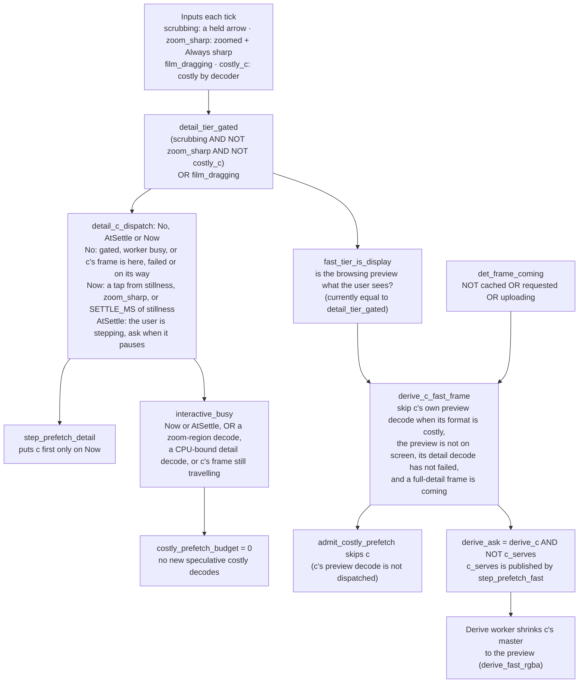

The formulas, as written in `support.rs`:

```text
detail_tier_gated  = (scrubbing && !zoom_sharp && !costly_c) || film_dragging
detail_c_dispatch(gate inputs, det_busy, rapid_nav, ms_since_motion, absent) -> No | AtSettle | Now
derive_c_fast_frame(costly_c, fast_tier_is_display, det_failed_c, det_frame_coming)
                   = costly_c && !fast_tier_is_display && !det_failed_c && det_frame_coming
det_frame_coming(cached, sent, uploading) = !cached || sent || uploading
derive_ask(derive_c, c_fast_serves)       = derive_c && !c_fast_serves
    sent with the detail request as (c, derive_ask); the detail worker then
    try_sends a copy of its master to the derive worker
```

- **Why `costly_c` is in the gate.** On a cheap lane, a held-arrow scrub shows browsing previews and
  the full-detail tier waits. On a costly lane the held arrow behaves like the mouse wheel instead:
  thumbnails carry the hold, and nothing is decoded for a photo the user is passing. Otherwise every
  photo passed would start one uncancellable multi-second decode.
- **Why the duck fires on `AtSettle`.** While the user is stepping, the tier puts off asking for the
  displayed photo until the stepping pauses, but it will certainly ask. Treating that as "not imminent"
  let a new batch of costly decodes start in the ~16 ms between one landing and the next request. On a
  48 MP HEIC folder the next full-detail decode then took 2.5–3.2 s instead of 0.8–0.9 s. Because the
  tier and the duck ask the same `detail_c_dispatch`, they cannot drift apart.
- **`det_frame_coming`** covers the photo continuously from request (`det_sent`), through upload
  (`detail.uploading`), to cache insert. The derive decision therefore holds across a whole browse step
  and changes exactly once. A photo whose full-detail frame is already cached is never decoded again,
  so this term stops its preview being suppressed forever.
- **`fast_tier_is_display`** currently equals `detail_tier_gated`. A switch that would also count a
  rapid wheel hold as "preview is the display" (`R2_RAPID_HOLD_IS_DISPLAY`) is kept off. Measured on a
  100-file 48 MP HEIC folder, it left one uncancellable decode per photo passed in the pool, and the
  photo the browse stopped on took 5.5–6.8 s to sharpen instead of 0.9 s.

Every caller asks these shared predicates. Do not write a second copy of a gate in a caller: a
hand-copied mirror drifts from the tier it imitates.

#### Derive, don't decode

On a costly lane the browsing-preview decode is not a cheap stand-in. A 6048×8064 (48 MP) HEIC has no
power-of-two reduction that covers a ~2176 px preview. The preview decode is therefore the same full
decode the full-detail tier runs, plus a Lanczos reduction. It costs more than the frame it stands in
for, and usually lands after the user has moved on.

So when `derive_c_fast_frame` says so, the displayed photo's preview decode is not dispatched
(`admit_costly_prefetch` skips `c`). When the full-detail worker has the master, it offers it to the
**derive worker**: one thread, one job at a time, which never decodes.

- The hand-off is a rendezvous channel (capacity 0). At most one ~186 MB copy exists, and the
  full-detail worker never blocks (`try_send`). If the derive worker is busy, that derive is skipped
  and the photo's preview is decoded normally later; `dref=` on the `perf:` line counts refusals.
- The derive worker reduces the master with `falcon_decode::derive_fast_rgba`, which applies
  `browse_frame_rgba`'s own sizing and finish to pixels already in memory. It builds the same blur
  image (`support::fast_blur_mip`) and sends the result down the same `Decoded` channel as a pool
  decode. One decode serves both tiers, and the browsing-preview cache still fills for later visits.
- A separate thread keeps the ~160 ms reduction off the full-detail worker; that worker pays only the
  ~52 ms copy. The browsing-preview pool's one-decode HEIC path also hands its masters to this worker
  (see [One HEIC decode per shot](#one-heic-decode-per-shot)).
- The ask is made only if the browsing preview does not already have a usable frame for `c`
  (`derive_ask(derive_c, c_serves)`). `step_prefetch_fast` publishes `c_serves` itself; it counts the
  cache, the drain buffer, the upload thread and the RAM cache. `fast_want_class` decides whether a
  cached frame has the right size and rotation.

The derived frame is indistinguishable from a decoded one:

- It is taken from the master *before* the full-detail tier's CPU colour transform. The browsing-preview
  tier only ever holds source-colour pixels: colour management happens on the GPU at upload, and the
  RAM cache keeps untransformed bytes so a later output-colour change converts from the original.
- It carries the same size bucket, sampling tier, source colour space and EXIF base orientation the
  pool stamps.
- The one bookkeeping difference is `Decoded::derived`. The drain must not clear pool marks
  (`inflight`, `costly_inflight`) that the frame never owned; otherwise a real decode of the same photo
  would be un-counted and queued again.

Measured on a 100-file 48 MP HEIC folder (four paired 20-step arrow browses, with and without the
derive): median step 1,199 → 997 ms; 90th percentile 3,035 → 1,136 ms; worst 3,177 → 1,222 ms; steps
over 2.5 s: 2 → 0. On real iPhone masters the derived frame is bit-identical to a decoded one when the
full-detail tier decodes at full size and the codec did not subsample. When the master was already
reduced, it is held to a perceptual bound instead.

#### Deriving from a colour-managed master

On the Windows hardware HEIC lane, the full-size master can come back already converted into the output
colour space (the GPU colour door). A preview may still be derived from it:
`support::derive_admits(derive, raw, yuv_payload)` refuses only RAW development and YUV payloads, which
have no RGBA pixels to shrink.

The derived frame is stamped with the colour space its pixels are actually in
(`support::derived_frame_gamut`): the output space when the master was managed, otherwise the file's
own. Every consumer compares that stamp with the live output colour space, so:

- the upload does not convert a second time;
- the menu-blur image is built from these pixels, not from the thumbnail's, and no `fmiss` is counted;
- the backdrop's colour transform becomes an identity.

If the user changes the output colour space while such a frame is in flight,
`support::fast_upload_admits` drops it, and the photo is decoded fresh under the new setting.

The info panel's colour-space chip does not read this stamp. It uses the file's own colour space,
recorded by the detail worker's probe (`meta::FileGamuts`, falling back to `shot_gamut`; a RAW
development reads sRGB). So a Display P3 photo still reads as Display P3.

Without this rule, a GPU-colour HEIC folder would keep no preview for the photo the user stopped on,
because that photo's own preview decode is skipped in expectation of the derive.

#### Always-sharp browse pace (`DetailPace`)

When the user browses while zoomed with Always sharp on, the browse waits for each photo's full-detail
frame. Its speed (`effective_scrub_fps`) follows a measured estimate of how fast the full-detail lane
produces frames.

`DetailPace` records three facts from two writers. The full-detail drain records each landing
(`note_landing`). The two browse-advance steps record when the advance blocked waiting for a frame
(`note_hold`) and when it actually stepped (`on_step`). Each step produces a `DetailPaceSample`:

- `Produced { secs, held }`: the frame arrived inside this step's window. `secs` is the production
  interval, from the previous step to the landing; `held` says whether the advance actually waited for
  it.
- `BankAhead`: the frame was already cached before the window opened.

`detail_fps_fold(ema, sample)` folds samples into the estimate:

- Only a `held` sample may lower or seed it; an unheld sample can only raise it.
- `BankAhead` nudges the estimate up by `DETAIL_FPS_PROBE_UP` (×1.25), so a speed learned on a slow
  HEIC stretch recovers over a JPEG stretch.
- Intervals over `DETAIL_FPS_MAX_GAP_S` (3 s) are ignored, and the estimate is capped at
  `DETAIL_FPS_CEIL` (120 fps).

The fold uses the production interval, not the gap between landings, so the estimator never reads its
own pacing back. For the same reason, `landing_is_production_evidence(from_ram, paced)` excludes
landings served from the RAM cache and landings the publish gate paced; neither measures a decode. A
folder swap clears all of this.

### Pausing preparation during gestures (publish gate)

Publishing (showing) a 48 MP full-detail frame stages it on Slint's own GPU queue. A burst of these
makes a drag, a zoom or a panel scroll drop frames. So speculation yields while the user's hands are on
the photo or a panel.

The rule: **pausing never delays what the user is looking at or waiting for.** It only slows photos
nobody has asked for yet.

#### The two clocks: browsing and hands-on input

The gate reads two clocks separately, because they need different answers:

- **`last_motion`: browsing.** A held-arrow scrub, both mouse-wheel browse paths, and every change of
  the current photo. The Always-sharp zoomed wheel uses full-detail frames *during* a spin, so a browse
  must be paced, never parked.
- **`last_input`: hands on the photo or a panel.** It is stamped by:
  - the stage drag (`on_pan_move`), and the stage zoom (`on_zoom_at`), but only when the notch actually
    changes the zoom;
  - a click on the photo (the 1:1 toggle, `on_photo_clicked`);
  - the Compare drag. The Compare pan otherwise never calls Rust, so the markup fires `cmp-pan-input`
    from the drag's pressed branch;
  - a scroll of the Review panel or the folder-grid dock. A Slint `Flickable` scrolls without calling
    Rust, so the tick detects the scroll from the `sel-vp-y` / `grid-vp-y` viewport mirrors;
  - the filmstrip's three gestures: wheel over the strip (`on_film_scroll`), the 1:1 drag
    (`on_film_drag_move`) and the mini scroll bar's press-drag (`on_film_seek`).

Speculation serves future browsing, not the gesture in hand, so during hands-on input it can yield
completely. A drag never stamps `last_motion`: that would tell the full-detail tier the browse is moving
and hold back the sharp frame of the very photo being dragged.

Scrolling the filmstrip is not navigation either. `on_film_drag_move` sets `film_follow = false` and
never changes `current`. What releases the hold afterwards is the next real navigation (a
strip-thumbnail click, an arrow key, a stage wheel notch) or the 3 s tail.

Both clocks start from one shared boot instant (`boot_seed`), so a session never opens parked.

#### The ladder

`support::speculative_publish_arm(settings_throttle, since_motion, since_input, interact_arm)` picks one
row of a ladder (`GateArm`); the first match wins. `GateArm::gate()` maps the row to one of three
answers (`PublishGate`):

- **Full**: speculation runs at full rate.
- **Pace**: at most one speculative full-detail publish per 250 ms; dispatch and the upload drain run
  free.
- **Park**: no new speculative publish, no new speculative full-detail ask, and at most one
  non-displayed finished frame drained per tick. Nothing is discarded.

The diagram shows the rows in order.

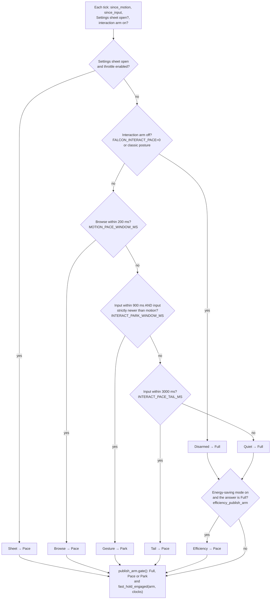

The rules that make it safe:

- **Browse sits above Park.** A live wheel spin keeps its paced full-detail arrivals even when the input
  clock is fresh. (During a browse the folder-grid dock's follow-recenter writes a viewport mirror, for
  example.)
- **The recency rule** (`input_is_newer(since_motion, since_input)`, strict): Park needs the input
  clock to be newer than the motion clock, so the last thing the user did decides. A finished zoom
  followed by a browse does not park the browse. Equal clocks are not "newer".
- **Why 900 ms.** Measured mid-gesture event gaps reach 200–800 ms; a shorter window reopened dispatch
  in the middle of a drag. The window itself is the hysteresis, so nothing latches, and three seconds of
  an idle hand always reach Full (or the energy-saving Pace).
- **A park release never bursts.** The Tail row paces whatever the park held.
- **Energy-saving mode** (`efficiency_publish_arm`) is applied last, and only to a Full answer, which it
  promotes to the `Efficiency` row (Pace). It can only hold more, never less, so a gesture on battery
  still parks.
- **One evaluation per tick.** The tick computes the row once; the holding sites take `row.gate()`. The
  log is keyed on the row (and the browsing-preview hold), because three rows answer Pace and a log
  keyed on the answer would stay silent across real changes. Each change prints one `pool posture:` line
  naming the row (`publish_gate_posture_line`). Rapid alternation between rows that behave alike prints
  at most once per `EFFICIENCY_LOG_QUIET_MS` (2 s), with a count of the skipped changes
  (`posture_log_decision`).
- `FALCON_INTERACT_PACE=0` turns off the interaction rows only; the Settings row stays.

#### Where speculation is held, and what never is

| Site | Tier | Held | Never held |
|---|---|---|---|
| `step_upload_detail` publish (`full_res_publish_held`) | full detail | a speculative frame: spaced 250 ms apart under Pace, kept under Park | anything while a request for an on-screen photo is outstanding (whole tick), or `detail_frame_explicit` |
| `step_prefetch_detail` RAM-cache serve (`full_res_publish_held`) | full detail | as above | `detail_frame_explicit` |
| `step_prefetch_detail` dispatch (`speculative_dispatch_held`) | full detail | new speculative asks under Park | `detail_frame_explicit` |
| `step_upload_drain` bound (`drain_admits_heavy`) | both | under Park, more than one non-explicit finished preview or full-detail frame per tick; the rest are carried to the next tick with their in-flight marks intact | `detail_frame_explicit` frames, which also do not count against the bound |
| `step_upload_fast` publish pick (`tick::fast_frame_parked`) | browsing preview | speculative frames while `fast_hold` is on; they stay in `drain_buf` | `fast_frame_exempt` |
| `step_prefetch_fast` dispatch and RAM serve (`askable`) | browsing preview | speculative asks while `fast_hold` is on, under upload backpressure, or (energy-saving mode) stale-size upgrades | `fast_frame_exempt` |

Never held at all: zoom-region tiles (`step_upload_roi`; they are the picture being dragged), the
visible strip's thumbnails (their own pool), the menu blur and failure markers in the drain, and
explicit decodes. Nothing is discarded. A held frame is checked again next tick, and a held ask is simply
asked again when the gate opens.

**What counts as explicit.** Each tier's exemption is one function, asked at every one of its sites:

- `support::detail_frame_explicit(id, displayed, awaited)` = on screen (`displayed_shot`) **or** the
  frame a zoomed Always-sharp browse is blocked on.
  - `awaited` is one `AtomicI64` (`det_awaited`, −1 for none). `main.rs` writes it once per tick from
    `support::detail_awaited_mirror(scrub_block, wheel_block)`, that is, from what `step_scrub_advance`
    and `step_wheel_advance` return.
  - A held key wins a tie: on macOS a held arrow owns navigation (`HELD_KEY_OWNS_NAV`).
  - The value is written every tick, so a released key clears it. Readers earlier in the tick see the
    previous tick's value, at most one tick old.
  - Without this term, the frame the browse waits for would be paced like speculation: at most 4
    landings a second, on a lane that sustains about 7.
- `support::fast_frame_exempt(id, displayed, hover_ask)` = on screen **or** the Review tile the hover
  preview is asking for (`FastTier::hover_ask`, −1 for none). Without it, a Review-panel scroll (which
  stamps the input clock) would hold the hover's own frame for 3 s while the card said "Loading…".

At the browsing-preview *dispatch* site, a Compare half is only affected while it falls inside the
`lo..=hi` want window, because the want set is built around `c`. At the *publish* site the exemption is
unconditional: a frame in hand is in hand wherever its index sits.

**One spelling of "on screen".** `support::displayed_shot(id, c, compare, cmp_a, cmp_b, len)` is true
for the displayed photo and, in Compare, for both halves. It clamps the half indices to the folder
length exactly as the full-detail want list does. A rescan that shortens the folder therefore cannot
make a tier ask for one index and protect another. Besides the holds, it is asked by:

- the full-detail cache's LRU (least recently used) `protected` list. A frame in that cache is one the
  browse is no longer waiting on, so the awaited term is not needed there;
- `step_upload_roi`'s "still wanted" test, so a Compare half's zoom tiles are not dropped and requested
  again forever;
- `support::fast_evict_protected`, the browsing-preview GPU cache's eviction guard: on screen, or the
  Review tile the pointer rests on (`FastTier.hover_pin`, written only by `step_hover_preview`). A
  hover-fetched frame lies outside the prefetch window by definition, so it would otherwise be the first
  thing evicted;
- `support::ExplicitSet`, which carries the same terms plus the awaited index to **both** evictions over
  browsing-preview residents: the GPU cache (`step_upload_drain`) and the RAM cache (the deposit, and
  `step_l2_pressure`). Evicting the awaited frame's RAM copy would turn a 15–40 ms RAM serve into a full
  decode of the very frame the browse is stopped on.

The browsing-preview tier has one named read door, `tick::fast_peek`. It asks `fast_want_class` for the
rotation test, so a frame baked for the wrong rotation reads as absent, never as a rotated picture.
`browse_frame_rgba` and `browse_frame_or_superseded` are decoders, not cache lookups.

#### The browsing-preview tier during a gesture (`fast_hold`)

Browsing previews are what a scrub shows, what the Always-sharp wheel spins through, and what the
filmstrip and the menu blur read. Pacing them makes no sense: at one publish per 250 ms, refilling an
80-frame window would take about 20 s, which is an outage, not a throttle. So this tier has no paced
state. It is either **held** or **free** (`support::fast_speculation_held(hold, exempt)`).

Why it holds at all: during a zoom-drag right after a big Review-panel jump, the full-detail dispatch
stopped as designed, but the browsing-preview tier kept decoding and uploading 15–26 frames a second.
Those were ~44 MB supersampled (3840 px) frames refilling a window of about 80, and they competed with
the drag for the renderer's queue for 4–6 s.

`support::fast_hold_engaged(arm, since_motion, since_input)` is evaluated once per tick:

| Ladder row | Browsing-preview tier |
|---|---|
| Gesture | held |
| Tail, input clock newer than motion clock | held (a hand paused mid-drag is still on the app) |
| Tail, motion newer (a browse between slow wheel notches) | free |
| Sheet, Browse, Quiet, Disarmed, Efficiency | free |

The hold lasts the gesture plus its 3 s tail, re-armed by every event of the gesture; 900 ms is the
per-event window, not the length of the hold. A browse frees the tier on the very next tick.

The full-detail tier deliberately behaves differently in the tail. Its tail release is already paced
(one publish per 250 ms), so it cannot burst; the preview tier has no paced state to fall back on. The
Settings sheet's lever for this tier is a different mechanism (every format spending the costly
budget), not this hold.

Every surface that stamps the input clock holds speculative preview preparation for the gesture plus up
to 3 s. That includes the stage pan and zoom, a photo click, both panel scrolls, the filmstrip gestures
and the Compare drag. A Review-panel search that ends on a click costs little, because the click is a
navigation: it stamps the motion clock and frees the tier on the next tick.

**How the browsing-preview sites hold without losing anything.**

- `step_upload_fast` holds by never *selecting* a held frame, so the frame stays in `drain_buf` where it
  already was. There is no new buffer, no reordering, and no `break` that could leave a held frame in
  front of the displayed photo's own.
- `step_prefetch_fast` filters its rebuilt want set before both kinds of ask: the pool decode and the
  RAM-cache serve. A RAM serve is not free either: it copies a 14–44 MB resident on the tick thread and
  stages it on the renderer's queue.
- Nothing is remembered and nothing is cancelled. Both steps rebuild their want set every tick, so the
  same frame publishes and the same ask leaves as soon as the hold lifts.
- A buffered frame from an older folder is never held (`tick::fast_frame_parked` checks the folder-open
  counter). It publishes nothing, and holding it would hide its index from the new folder.
- The upload-backpressure test (8 or more frames waiting) counts only frames the upload step may still
  move, so the hold itself does not read as "uploads are behind". Backpressure is not an early exit: it
  limits the asks to the exempt set and the rest of the step runs. That way the user's own frame is
  never starved at the moment a hold releases.
- The runway field (`pf_win`) and the cache meter's denominator (`meter_win`) are computed before the
  hold, and keep their pre-hold values under backpressure. The meter measures what the app *intends* to
  bank, so a held tick is reported neither as a cold cache nor as a full one. A backpressured tick still
  classifies `c`, so `c_serves` is written there too.
- Two more reasons hold speculative preview asks behind the same exemption: the folder-open thumbnail
  start-up hold (`startup_hold`, until visible thumbnails are presented or 3 s pass), and, in
  energy-saving mode, stale-size upgrades after a preview-size change.

**What the hold costs, and how it looks in the log.** Frames held in `drain_buf` are decoded RGBA in
main memory, not GPU memory. They sit outside the browsing-preview GPU budget: `fast_budget` sizes the
GPU `FastCache`, which these frames have not reached yet. The amount is the backlog before the hold plus
the decodes already running when it engaged (up to the pool width, 18). At the 3840 px supersample size
that is on the order of 2 GB, held for the gesture plus its release. This defers memory already
allocated rather than allocating more. It drains in full when the hold lifts, and `step_vram_recovery`
clears the buffer if the GPU out-of-memory path fires.

On the `perf:` line a hold looks like this: `dec=` decays over about one decode time rather than dropping
to 0, because decodes already running still finish and count; `up=` drops within a tick; `buf=` rises
and then stays flat. A `dec=` tail with `buf=` climbing is the hold working, not failing.

**Other readers of `fast_hold`.** It is evaluated once per tick and read by four consumers: the two
browsing-preview steps, the RAM-cache pressure valve and the macOS pool governor.

- `step_l2_pressure`: while the hold is on, some of the missing RAM is the hold's own bounded
  reservation. The valve may still shed cache steps down to the 512 MiB floor, but it may not take the
  irreversible step of clearing and disabling the RAM cache (see [The RAM pressure valve](#the-ram-pressure-valve)).
- The macOS governor (`MacPoolGov::step`, once per second): the hold empties exactly the queue its idle
  test reads, so a held pool counts as **suppressed, not idle** (see [Mac pool governor](#mac-pool-governor)).

#### Gestures that change nothing, and the app's own scrolls

**A gesture that changes nothing stamps nothing.**

- `support::zoom_notch_target(z0, delta, max_zoom)`: a wheel notch zooming out at 1.0, or zooming in at
  `MAX_ZOOM`, returns `None`, and `on_zoom_at` returns before stamping the input clock. A zero delta is
  ignored as well.
- `support::film_scroll_target(cur, want, clamp)`: a strip wheel notch or scroll-bar seek against either
  end of the strip moves nothing. The handlers use the `(lo, hi)` clamp pair that `tick::step_filmstrip`
  publishes (`film_clamp`), and skip both the stamp and the write. Before the first `step_filmstrip` the
  pair is wide open, so an early event does stamp, which is the safe direction.
- The strip **drag** is deliberately unguarded. It carries a press (`film_dragging`), so the hand is on
  the app whether or not the strip can move.

**The app's own panel scrolls are not user input.** Two docked panels scroll themselves:

- The folder-grid dock's follow-recenter writes `grid-vp-y` when the dock opens, when the folder
  changes, and when the current photo's row is off screen. A click on a visible tile scrolls nothing.
- The Review panel's open-edge recenter in `step_selection` writes `sel-scroll-y` and bumps
  `sel-scroll-seq`, and the `.slint` `changed scroll-seq` handler copies the value into `sel-vp-y`. This
  edge also fires when the folder changes. Without a guard, opening a folder with the Review panel open
  would park the new folder's opening burst for the whole park window.

Each recenter records the value it wrote. `support::panel_scroll_memo_step` (built on
`panel_scroll_stamped`) treats a mirror that comes to rest exactly on that value as the app's own move.
The memo is consumed when the mirror arrives, dropped when a real scroll lands somewhere else, and
expires after `PANEL_MEMO_MAX_TICKS` (2 ticks, 32 ms at full rate), because the `.slint` handler may
deliver the value a tick late. A real scroll that lands in the same tick as a recenter still stamps. The
Browse row sitting above the Park row remains the main guarantee; the memo is a second safeguard.

#### The carry and the limits of the park

**The upload drain's carry belongs to one folder.** Frames the drain holds back keep their in-flight
marks, so nothing decodes them again. A folder change clears `fast.uploading` and `detail.uploading`
wholesale (`apply_scan`, through each tier's `on_folder_swap`). A carried frame from the old folder could
then clear a mark now owned by a new job for the same index, and the new folder would stage that photo
twice. `tick::release_parked_done` drops the carry and releases its marks together. It runs at the two
places that clear those marks by another route: the `apply_scan` folder swap and the GPU out-of-memory
recovery (`step_vram_recovery`). `drop_developed_caches` deliberately does not call it: it clears
developed pixels but no in-flight mark, so a carried frame there still owns its mark, and the next drain
retires both under the colour and epoch checks.

**Limits of the park, stated plainly.**

- **The displayed photo can still wait about two ticks (~32 ms).** The full-detail tier uploads one
  frame at a time (`detail.uploading`). If a speculative frame already holds that slot when the user's
  own frame lands, the user's frame waits for it. The park makes this rarer, never worse. "Never
  delayed" is a promise about the gate, not about that one slot.
- **A held frame keeps its GPU texture.** Each frame the upload drain carries owns its texture. With up
  to three ticks of depth and full-detail frames of 45–195 MB, the worst realistic carry is about
  270 MB. It is bounded by the in-flight marks that stop the tiers sending more, and it defers memory
  already allocated rather than allocating new memory.
- **The whole-tick exemption is deliberate.** While a request for an on-screen photo is outstanding
  (`det_sent` contains a `displayed_shot` id), `step_upload_detail` treats the whole tick as exempt,
  even for a speculative frame at the head of the queue. Holding that head would also hold the user's
  own frame queued behind it. The step still publishes one frame per tick in arrival order, so the
  user's frame lands on the next tick: one tick of delay instead of an unbounded one.
- **One remaining case.** `step_upload_detail` takes its carried frame first; if that is a held
  speculative head, it parks it again and stops for the tick. A frame an Always-sharp browse is waiting
  for, queued behind that head, can therefore pay up to the rest of the pace window once. That is at
  most 250 ms under Pace, or the rest of the gesture under Park, on the first landing after a pause in
  which a neighbour was held. Later landings are not delayed.
- **A completely still press.** The hold survives an inspection pause of up to the 3 s tail. A hand
  held truly motionless for more than 3 s, with the button still down, ages into `Quiet` and releases
  speculation at full rate. Every event of a real drag re-arms the clock, so this needs a static press,
  not merely a slow drag. It cannot be fixed from the tick: `main_window.slint` declares `pan-start`,
  `pan-move` and `pan-reset` but no `pan-end`, and no "button is down" state reaches Rust, so nothing can
  tell "holding still mid-drag" from "let go 3 s ago". A pan-end or press-state callback is the
  structural fix. The filmstrip is the one surface that already has press state (`film_dragging`).

### Energy-saving mode (Efficiency mode)

**Efficiency mode** (the glossary's *energy-saving mode*; `posture` in code) cuts background work on
battery. It is one control in Settings → PERFORMANCE: **Auto | On | Off**, default Auto
(`EFFICIENCY_AUTO`). A status line under the control always says what is happening (`efficiency_note`):

- active, and why;
- waiting for battery power;
- "No battery detected — Auto never activates on this computer";
- off;
- turned off for this session by the developer switch.

The diagram shows how the power state becomes a decision and what the decision limits.

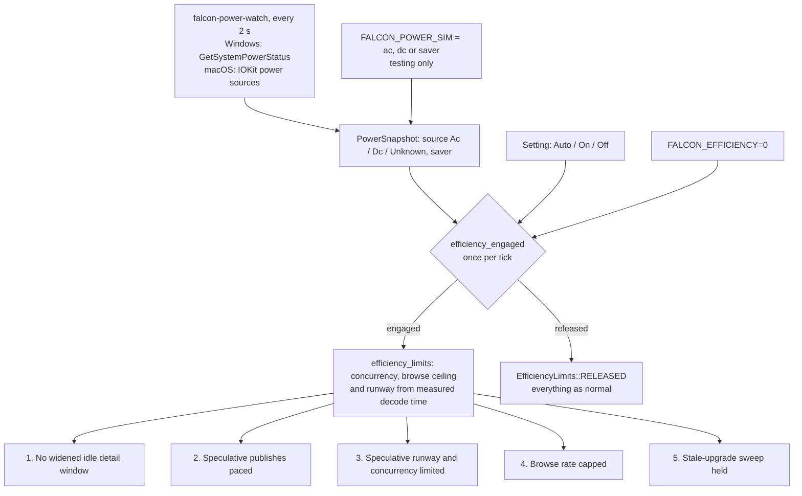

**Reading the power state.** `falcon-power-watch` runs at lowest priority every 2 seconds.

- On Windows it calls `GetSystemPowerStatus`, a static kernel32 import, so Windows 10 support is
  unchanged. The result is decoded into `PowerSnapshot { source: Ac | Dc | Unknown, saver }`, where
  `saver` is Windows' Battery saver flag. One probe takes a few microseconds (1–7 µs measured). On macOS
  it reads the IOKit power sources.
- It reports only changes. It needs no early wake-up and no baseline epoch, because nothing in Falcon
  changes the power state.
- `FALCON_POWER_SIM=ac|dc|saver` simulates a power state for testing. Simulated runs say so in the log
  and report no probe time.

**The decision** is one pure function, `efficiency_engaged(snapshot, mode, env_disabled)`, evaluated
once per tick. Off never engages, On always does, and Auto engages on battery or with Battery saver on.
**Unknown never engages**, so Auto on a desktop honestly does nothing. Every evaluation reads the live
state and nothing latches: unplugging engages the mode within one poll, and plugging in releases it.

**What it changes.** Only speculative work. The displayed photo (including both Compare halves),
anything the user asked for, zoom regions and thumbnails are exempt.

1. The widened idle full-detail window is withheld (`idle_deepen_allowed`'s sixth term). Nothing
   already loaded is thrown away.
2. A quiet ladder's `Full` publish becomes `Pace` (`efficiency_publish_arm`, `GateArm::Efficiency`):
   speculative frames appear at a steady pace, never in bursts. Gesture `Park` rows are untouched.
3. The speculative runway and concurrency are limited (capped and narrowed in
   [The cost rules at a glance](#the-cost-rules-at-a-glance)). The displayed set is exempt in both, so
   the far Compare half never starves behind the runway.
4. The browse rate is capped (`effective_scrub_fps`, `efficiency_scrub_cap`). This is the one change a
   user can feel, so the browse-speed popup says so whenever the cap is in force
   (`scrub_fps_efficiency_note`), and no control shows a rate the mode prevents.
5. After the preview size grows, the stale-upgrade sweep is held. Frames stay marked, so turning the
   mode off re-sharpens them through the normal path. When the mode releases, the RAM keep-alive cache
   keeps its bytes but marks every entry stale (`mark_stale_tier`).

**Changes and logging.** `efficiency_edge(prev, now, mode)` returns `Nothing`, `Adopt`, `Log` or
`LogAndToast`.

- A session that starts already engaged adopts that state silently.
- Every real change logs one line.
- Only an Auto engage also raises a toast: "On battery — reducing background work." or "Battery saver
  is on — reducing background work."
- An arm that flips back and forth within the same gate is logged at most once per 2 seconds, with a
  count of the lines skipped.
- `FALCON_EFFICIENCY=0` turns the feature off for the session, and the control is replaced by a note
  saying so.

**Deliberately not part of it:** changing the tick rate; choosing a low-power GPU adapter (that is
decided once at startup); Windows power-change push notifications (polling costs only microseconds).

**Measured.** On the test kit, speculative full-detail decodes at an engaged launch fell from 51 to 12,
and the displayed photo's time to its full image did not change. The energy saved has not been measured
in joules, because the test kit is fully cached.

### Mac pool governor

On normal Mac builds one elastic pool decodes both browsing previews and thumbnails. `pool_gov.rs`
decides its width once a second from a `GovSample`: queue depth, delivered preview frames, finished
thumbnails, in-flight decodes, the gesture hold, and the memory pressure zone (the same
`l2::pressure_zone` the RAM valve uses, read from free plus inactive Mach pages).

- **Bounds.** The width stays between a floor worked out from the benchmark's measured decode speed
  and a ceiling of the number of performance cores.
- **Grow.** When the zone is calm and browsing is starved for 3 samples in a row
  (`POOL_GROW_STREAK`), it adds one worker.
- **Shrink under pressure.** When the zone is Low for 2 samples in a row (`POOL_SHRINK_STREAK`), it
  removes one worker, never below the floor.
- **Return to the floor when idle.** With only the pressure rule, width would be a one-way ratchet,
  because a Mac with plenty of free RAM never reaches the Low zone. So after
  `POOL_IDLE_SHRINK_SAMPLES` (10) idle samples in a row, the width drops straight to the floor in one
  step. Idle means not held, nothing queued, nothing in flight, no preview frame delivered and no
  thumbnail finished. Thumbnails count as work, so a filmstrip scroll is never mistaken for idleness.
  In-flight decodes count too, so a slow 48 MP RAW decode is not mistaken either. A real pressure or
  starvation step always takes priority over the idle clock.

**A held pool is not an idle pool.** During a gesture, the browsing-preview tier deliberately empties
its queue (`support::fast_hold_engaged`, the same hold read by the preview prefetch steps and the RAM
valve). An empty queue would normally suggest the pool is too wide. So `GovSample` carries `held`, and
`pool_idle` requires `!held`. Without that, a long zoom drag on a cached frame would shrink an
eight-wide pool to its floor mid-gesture, then need several seconds to grow back just as the held work
arrives. `held` is only an input: a held window still measures, and it can still grow if starved. The
test `a_held_pool_is_not_an_idle_pool` pins this.

**Changing the number of workers** (`pool_gov::ElasticGate`). Growing spawns the new worker slots.
Shrinking never interrupts a decode: each worker checks `slot ≥ target` between jobs and exits at its
next dequeue, and the remaining workers drain the queue it leaves behind. Each elastic worker serves
both job types. Slot 0 prefers thumbnails, which keeps the filmstrip and the menu-blur source fed during
a scrub. Every other slot prefers browsing previews. Each type takes the other's work when its own queue
is empty, so neither starves while a worker is free.

**No polling while idle.** Idle elastic workers wait on the pump's condition variable with no timeout.
Preview work always notified that variable. Thumbnail requests do too, through a Mac-only relay thread
(`spawn_thumb_notify_relay`). The relay forwards each burst of requests to the pool's channel,
increments `THUMB_SEQ`, takes and releases the pump mutex, then wakes all workers. A worker re-reads
`THUMB_SEQ` under that mutex before it sleeps, so either it sees the new work or it is already waiting
when the wake-up arrives. Putting this in a relay keeps the shared tick code, which Windows also runs,
unchanged. Without a timed wait, idle worker wake-ups are zero instead of about 160 a second. Windows'
fixed pools block on their channels and never poll.

`FALCON_CLASSIC_POOLS=1` turns the governor off and restores fixed pools for comparison runs.

### Mac worker pool

On a normal Mac build the fast-preview and thumbnail jobs share one elastic pool (`spawn_elastic_pool` and `elastic_pool_worker` in `main.rs`). Its width moves between a smoothness floor and a ceiling. Full-detail decodes are not in this pool; they have their own thread. The decisions are pure functions in `pool_gov.rs`, and the tick step `step_pool_governor` only carries them out. Windows keeps its fixed pools and never builds any of this.

Launching a Mac build with `FALCON_CLASSIC_POOLS=1` restores the older Mac set-up in one switch: fixed pools sized as on Windows (10 fast-preview and 3 thumbnail workers on a 12-core M4 Pro), the older memory budget and the CPU RAM cache. The boot log then says "pool: CLASSIC mode".

- **Floor** (`derive_floor`): `max(3, ceil(r × L))`, kept between 2 and the core count. `r` is the scrub speed the user chose, capped at the sustained rate the saved benchmark measured. `L` is the benchmark's measured time for one decode. This is Little's law: r × L decodes in flight deliver r frames a second. Without a usable benchmark record the floor is `POOL_CONSERVATIVE_FLOOR` (3). A floor from a synthetic (generated-frame) benchmark run is still used, but the boot log calls it a machine lower bound. Example, measured on an M4 Pro: 20 fps × about 148 ms ≈ 3, and a measured width of 3 gave 19.5 fps.
- **Ceiling** (`derive_ceiling`): the number of performance cores (`hw.perflevel0.logicalcpu`), never below the floor. The efficiency cores stay free for the interface, the GPU upload thread and macOS. A Mac without that value (Intel) uses cores − 2. On an M4 Pro the ceiling is 8; a width of 10 made each decode slower.
- **Once a second** the tick fills a `GovSample`, and `pool_gov::govern` decides one step. The memory input is `l2::pressure_zone`, the same zones the CPU image cache uses, so the cache's shrink signal and the pool's shrink signal cannot disagree.

The diagram shows the governor's once-a-second decision: memory pressure can shrink the pool, starvation in a calm zone can grow it, and a long idle spell drops it to the floor.

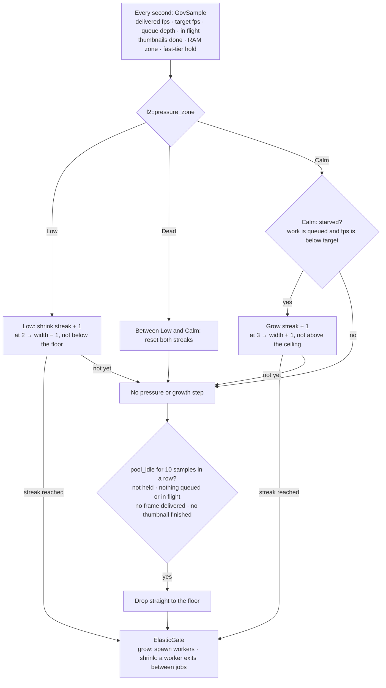

Hysteresis stops it oscillating. Growing needs `POOL_GROW_STREAK` (3) starved samples in a row in the Calm zone. Shrinking needs `POOL_SHRINK_STREAK` (2) Low samples in a row, so safety reacts faster than growth. The band between Low and Calm resets both streaks. There is at most one decision a second, which is also the log rate.

### Measured Mac performance and what it set

The developer **posture benchmark** (Settings → DEVELOPER → Advanced → Posture benchmark) measures decode throughput at pool widths 2, 3, 4, 6, 8 and the full pool. On Mac each width runs twice: at the default scheduling class, and at the utility class (`QOS_CLASS_UTILITY`), which steers threads onto the efficiency cores. It also times Image I/O at 1, 2 and 4 threads. Its pure core is in `posture.rs`; `run_posture_bench` in `main.rs` runs it. It only writes `posture-bench:` lines to `falcon.log`, so Diagnostic logging must be On, and it never changes settings. It shares the speed benchmark's running guard, which is released even if the run panics.

One run on a 12-core M4 Pro (8 performance + 4 efficiency cores, 24 GB), decoding generated 45 MP-class frames at the faster preview size:

| Workers | Default class | Utility class |
| --- | --- | --- |
| 2 / 3 / 4 | 14.0 / 21.1 / 27.4 fps | 13.8 / 20.7 / 25.2 fps |
| 6 / 8 / 10 | 37.0 / 44.9 / 47.0 fps | 20.1 / 19.3 / 19.2 fps |

What that run established:

- The efficiency cores top out near 20 fps on 45 MP-class frames. More utility-class workers than efficiency cores adds no speed, and adds long delays. Per worker, an efficiency core did about 90 % of a performance core's work.
- Image I/O's JPEG decode scaled with threads (11.3, 22.6 and 46.0 fps at 1, 2 and 4 threads), so it behaves like parallel software, not a fixed-function hardware decoder. It was about 1.6× faster than the CPU path at reduced preview sizes and no faster at full resolution. Its real value is native HEIC and fast reduced-size decoding.
- Fixed numbers do not carry over between machines. For example, an 18 fps target leaves no efficiency-core headroom at 45 MP. Pool sizing is therefore derived per machine from the saved benchmark, never from constants.

How the design uses this: the pool's floor and ceiling above come from these results. Production decode threads run at the default class. If a future energy-saving design moves decoding to the utility class, its width must not exceed the efficiency-core count.

### Efficiency limits are measured, not fixed

Fixed limits do not work on a laptop with only built-in graphics. JPEG frames there were measured at 450–1,700 ms per decode, so the decoders produce 3–7 frames a second against a 20 fps browse clock, and every step lands on a frame that is not ready. So while the mode is engaged, `efficiency_limits(...)` derives its numbers once per tick from one measured input: the fast tier's time per decode, `L`.

- **Measuring L.** `note_fast_latency` keeps a smoothed average (EWMA, weight 0.25) for each format. It is stamped with the folder-open counter, so a late decode from the previous folder is dropped. `fast_latency_ewma` uses the displayed photo's format, or failing that the folder's most-decoded format.
- **Concurrency**, by Little's law: `N = ceil(ceiling × L)`. It is at least 2 and at most half the workers left after the displayed photo's slot (`efficiency_worker_share`). If the window really contains a costly format (such as 48 MP HEIC on software decode), concurrency is never raised above the normal costly cap (`efficiency_concurrency_cap`).
- **Browse ceiling**: `min(user setting, 20 fps, 0.8 × N_max / L)`, never below 5 fps (`EFFICIENCY_CEILING_FLOOR_FPS`). The clock must not outrun the decoders; slower but always sharp beats stuttering.
- **Runway depth**: 1.0 s of browsing ahead and 0.25 s behind at that ceiling. That is at least 3 + 2 frames and at most 12 + 4, always less than the mains window. A window containing a genuinely costly format keeps the normal costly window (`efficiency_runway_window`).
- **Where L comes from**, in this order: the test lever `FALCON_EFFICIENCY_SIM_LATENCY_MS`, the live measurement, a seed derived from the saved benchmark (`efficiency_seed`), then defaults (12 fps). A benchmark seed may lower the ceiling but never raise it above 12 fps, because a benchmark taken on mains does not predict battery clock speeds. The source (`LimitSource`: live, benchmark seed, default, simulated) is named in the log, the Settings line, the leaf tooltip and the browse-speed popup.
- **Faster preview while engaged.** Once the mode has held for 2 seconds (`EFFICIENCY_BIAS_DEBOUNCE_MS`, `efficiency_bias_step`), browsing switches to Faster preview. Neither direction clears the cache: shrinking keeps the existing frames (the GPU downsamples them), and growing back keeps the stale frames and re-decodes them gradually. The user's own Faster/Sharper choice still clears the cache, and the preview card says when the mode is holding it.
- Every user-facing sentence comes from one composer that knows the state. It claims a limit only when the user's own setting is above it, names the 5 fps floor when the floor applies, and says where the number came from.

**The leaf.** While the mode is engaged, a small filled leaf (`Theme.leaf`) appears inside the title-bar preload meter (`CacheMeter` in `hud.slint`) on both platforms. The meter keeps its 62 px width: the bar shortens by the leaf plus a gap, and its fill is clipped to the shorter bar. The leaf is mounted with an `if`, not `visible:`, and geometry tests check it.

## Memory: GPU budgets, RAM cache and recovery

On normal Mac builds, the existing once-per-second available-RAM reading also governs
speculative image retention (`memory_pressure`). A low reading immediately pauses background
preview/detail preparation and releases expendable texture-cache entries, queued previews and
parked decoded/uploaded frames. The current photo, comparison photos, hovered preview and awaited
frame retain their existing explicit-request protections. In-flight work keeps its accounting;
later expendable arrivals are shed on subsequent ticks. Background work resumes after four calm
samples above the existing recovery band. This uses the existing available-memory approximation,
not a claim to observe every macOS memory-pressure event. Windows keeps its existing policy.
The tick keeps gesture and combined preparation holds separate (`FastHolds`): the RAM-cache
controller and gesture posture log read only the gesture input. Memory pressure therefore
cannot postpone the controller's last-resort cache clear as if a gesture were still active.

GPU memory and the RAM keep-alive cache react to different measurements. Running out of GPU memory
(*OOM*, out of memory) is recoverable; losing the graphics device needs a clean restart.

On Windows the RAM keep-alive cache (`L2Store`; see [The RAM keep-alive cache](#the-ram-keep-alive-cache))
shrinks and grows with available memory. On a normal Mac build that cache is off, because CPU and GPU
share one memory pool that the Metal working-set budget already governs; the Mac's available-memory
reading (free plus inactive pages) drives the elastic decode pool instead (see
[Mac pool governor](#mac-pool-governor)). `FALCON_CLASSIC_POOLS=1` turns the Mac cache, and its
pressure valve, back on for comparison runs.

### GPU memory budget and sharp-zoom tiers

At startup Falcon sizes its GPU texture caches from the graphics memory it can see (`vram_budget_bytes`,
then `budgets_for_vram` in `main.rs`):

- **Windows** asks DXGI for each hardware adapter's dedicated memory. An integrated GPU counts a quarter
  of its shared system memory. Falcon reads `DedicatedVideoMemory`, not DXGI's `Budget`, because
  `Budget` includes spill-over into system RAM. If nothing can be queried, it assumes 3 GB
  (`FALLBACK_VRAM`).
- **macOS** uses the Metal device's own `recommendedMaxWorkingSetSize`. It falls back to half the system
  RAM when no Metal device answers or under `FALCON_CLASSIC_POOLS=1`.

From that number Falcon:

1. reserves a quarter (clamped to 1–2.5 GB) for the desktop, other apps and Falcon's own non-cache GPU
   use;
2. takes 35 % of the rest (`VRAM_BUDGET_FRACTION`), capped at 12 GB (`VRAM_BUDGET_MAX`);
3. splits it 62 % for browsing previews (the fast tier) and 38 % for full-detail frames, with floors of
   250 MB (`FAST_BUDGET_MIN`) and 180 MB, about one full-resolution frame (`DETAIL_BUDGET_MIN`).

The preparing-ahead window grows with the fast budget. Caches evict by bytes at every insert, so a burst
cannot overshoot the budget.

The same usable figure picks the sharp-zoom tier (Adaptive Hi-Res, `VramTier`):

| Usable GPU memory | Full-detail decode cap (`detail_cap`) | Zoom tiles (`roi_max`, supersampling) |
| --- | --- | --- |
| below 4.5 GB | screen size; zooming in decodes screen-sized region tiles | up to 6144 px, no supersampling |
| 4.5 GB or more (`VRAM_USABLE_CAPABLE`) | 8192 px: most photos decode whole and zoom without tiles; a larger-than-screen decode is shrunk by the GPU, which acts as free anti-aliasing | up to 6144 px |
| 11 GB or more (`VRAM_USABLE_HIGH`) | 8192 px | up to 8192 px, decoded at 2× the viewport and shrunk by the GPU |

Region tiles are used only when the source is larger than `detail_cap`. With Adaptive Hi-Res off, the
whole image loads up to the manual Resolution limit (default 16384 px). The Developer **Simulate VRAM**
control drives the same function, so every tier can be checked on one machine.

### GPU out of memory: a two-way ladder

When wgpu reports an out-of-memory error, `tick::step_vram_recovery` steps the budgets down, and later
restores them. The diagram shows both directions, and the separate path for losing the device.

```mermaid
flowchart TB
  subgraph GPUMEM["GPU memory, Windows and Mac: tick::step_vram_recovery"]
    OOM["on_uncaptured_error: OutOfMemory<br/>sets vram_oom, only the first of a burst is logged"] --> HALVE["Halve fast and detail budgets<br/>floors 250 MB / 180 MB"]
    HALVE --> SS["Stop zoom-tile supersampling<br/>roi_max back to 6144"]
    SS --> RUNG{"oom_frame_cap_rung:<br/>supersampling was off already AND<br/>the live per-frame bound is above screen size?"}
    RUNG -->|"no: supersampling was this step"| KEEP["Keep the 8K base this time"]
    RUNG -->|"yes, Hi-Res on"| CAP["Lower detail_cap and the decode target<br/>to screen size"]
    RUNG -->|"yes, Hi-Res off"| MAN["Override the manual Resolution limit<br/>for this session only, settings.json untouched"]
    CAP & MAN --> RETRY["Clear full-detail failure records<br/>so the failed photo retries at the new size"]
    KEEP & RETRY --> FREE["Clear detail cache, zoom tiles and region,<br/>the drain buffer and queued decodes<br/>keep fast frames within 6 photos of the current one<br/>wait for the GPU"]
    FREE --> STRIKE{"Did this OOM land inside the band<br/>the last restore had to clear?"}
    STRIKE -->|"yes"| ADD["Add a strike, at most 4"]
    STRIKE -->|"no"| WAIT
    ADD --> WAIT["Wait until OOM-free for the band<br/>60 s x 2^strikes: 60 s, 2, 4, 8, 16 min"]
    WAIT --> RESTORE["Restore the whole target tier in one step<br/>budgets, supersampling, caps,<br/>decode target too when Hi-Res is on"]
    RESTORE -->|"a later OOM"| OOM
  end
  subgraph LOST["Rendering device lost: not recoverable in-process"]
    L1["set_device_lost_callback latches once<br/>(device_lost_action)"] --> L2["Next tick: skip all GPU work<br/>(should_halt_gpu_pumps), quit the event loop"]
    L2 --> L3["After the loop: save state,<br/>show the restart prompt (show_device_lost_prompt), exit cleanly"]
  end
```

**Every OOM step must lower a number that bounds a single frame.** The budgets bound caches and the
tile caps bound zoom tiles. What the GPU actually refused, though, is one frame's staging memory, and
`create_texture_cm` stages two textures, so the peak is about twice the frame.
`support::oom_frame_cap_rung(hi_res, was_super_sampling, adaptive_cap, manual_dim, roi_base)` reads the
live per-frame bound and the caller lowers it to screen size. The live bound is the adaptive cap when
Adaptive Hi-Res is on, and the manual Resolution limit when it is off. With Hi-Res off this is a
session-only override:

- `settings.json` keeps the user's limit;
- a restart, or moving the Resolution slider, restores it;
- one log line names both numbers.

Without this step, a 16384 px limit (about 715 MB per frame) would halve the budgets, clear, re-decode
the same frame and run out of memory again for as long as the user stayed on that photo. On a high-tier
card the first OOM only turns supersampling off; the next OOM lowers the cap.

**A restore that runs out of memory again is remembered.** `support::VramRestoreMemory` counts strikes.
An OOM inside the band the last restore had to clear adds a strike, up to four (`MAX_STRIKES`). Each
strike doubles the OOM-free time the next restore needs (`band_secs`: 60 s, then 2, 4, 8 and 16
minutes). An OOM with no recent restore behind it is ordinary pressure and adds nothing. A machine whose
restores succeed never collects a strike, so it keeps the plain 60-second cooldown
(`VRAM_RECOVERY_COOLDOWN_S`). Unlike the RAM valve, the GPU restore is not gradual: it puts the whole
target tier back at once.

Both the degrade step and the restore clear the full-detail failure records only when they really change
the decode size, so a photo is retried only when it has a new reason to succeed. GPU out-of-memory
pruning and Simulate VRAM do not touch the RAM keep-alive cache.

**Losing the graphics device** (a driver reset, or the GPU removed) cannot be repaired in-process,
because Falcon cannot rebuild Slint's renderer. The first device-lost signal latches
(`device_lost_action`) and the tick stops all GPU work (`should_halt_gpu_pumps`). The event loop then
exits after saving state, and a native dialog (`show_device_lost_prompt`) asks the user to restart.
`FALCON_SIM_DEVICE_LOST=<ms>` exercises this path.

### The RAM pressure valve

The RAM keep-alive cache keeps a fixed nominal budget, `min(25 % of physical RAM, 8 GiB)`
(`l2_budget_bytes`), and a live effective budget. Below 1 GiB nominal (less than 4 GiB of RAM) the cache
is off for the whole session (`L2_BOOT_FLOOR`). `L2Store::pressure_sample` adjusts the live budget about
once a second, from `step_l2_pressure`. This runs on Windows, and on a Mac only with
`FALCON_CLASSIC_POOLS=1`. The diagram shows the zones and steps, and the Mac pool governor that shares
the same zones.

```mermaid
flowchart TB
  subgraph RAM["RAM keep-alive cache valve, about once a second: l2.rs, step_l2_pressure"]
    R0["avail_ram_bytes<br/>Windows GlobalMemoryStatusEx / Mac free + inactive pages<br/>no reading: the sample is skipped"] --> R1{"pressure_zone"}
    R1 -->|"Low: below max(1.5 GiB, 6% of RAM)"| R2["Degrade: budget minus nominal/8,<br/>evict farthest from the current photo at once,<br/>photos on screen or awaited are protected"]
    R2 --> R3{"Would it fall below 512 MiB?"}
    R3 -->|"no"| R0
    R3 -->|"yes, during a gesture hold"| R5["Stop at 512 MiB, nothing cleared"]
    R3 -->|"yes, otherwise"| R4["Clear the cache and switch it off"]
    R1 -->|"Dead band: the next 1.5 GiB"| R6["Hold, the calm count resets"]
    R1 -->|"Calm: low-water + 1.5 GiB or more"| R7{"4 calm samples in a row?"}
    R7 -->|"no"| R9["Keep counting"]
    R7 -->|"yes, cache is off"| R8a["Switch back on, empty, at 512 MiB"]
    R7 -->|"yes, below nominal"| R8b["Restore one step, nominal/8,<br/>never above nominal"]
  end
  subgraph POOL["Mac elastic decode pool governor, once a second, normal Mac builds"]
    PG1["Same pressure zones from the Mac's own RAM reading"] --> PG2["Low for 2 samples: one worker fewer,<br/>never below the benchmark floor"]
    PG1 --> PG3["Calm and browsing starved for 3 samples:<br/>one worker more, up to the performance-core count"]
  end
```

How the valve behaves:

- **No flapping.** Restoring one step can never push available RAM back under the low-water mark,
  because the 1.5 GiB recovery band (`L2_RESTORE_BAND`) is larger than the biggest step (nominal/8 is at
  most 1 GiB at the 8 GiB cap). The four-sample streak (`L2_CALM_SAMPLES`) adds a time margin on top.
- **Quiet logs.** Each transition writes one log line; steady state writes none.
- **Gestures do not wipe the cache.** During a gesture hold (`fast_hold`; see
  [The browsing-preview tier during a gesture](#the-browsing-preview-tier-during-a-gesture-fast_hold))
  the preview tier parks frames in RAM (`drain_buf`), so the step that would clear the cache is
  downgraded to stopping at 512 MiB (`L2_RUNTIME_FLOOR`). Once the gesture ends, the next sample clears
  the cache if pressure remains.
- **Explicit frames survive shedding.** Eviction skips `ExplicitSet`: the photos on screen and the frame
  a blocked browse is waiting for.

What clears or invalidates the cache:

- A folder change, and an output-colour or custom-profile change, clear it (`drop_developed_caches`).
- The user's own Faster/Sharper switch clears both the GPU preview cache and RAM.
- Energy-saving mode's switch down to Faster preview keeps everything, because it is a shrink.
- Its switch back up to Sharper keeps the bytes but marks every entry stale (`L2Store::mark_stale_tier`
  sets `dim = 0`, which satisfies no request). The frames stay as stand-ins and are re-decoded through
  the normal path.
- GPU out-of-memory pruning and Simulate VRAM do not touch it.

The low-water mark is the larger of 1.5 GiB (`L2_LOW_WATER_MIN`) and 6% of physical RAM. The cache grows
back only after available memory stays 1.5 GiB above that mark for four samples, so it cannot flip back
and forth. A failed memory reading skips that sample. See `L2Store::pressure_sample` in `l2.rs`,
`step_vram_recovery` in `tick.rs`, and `device_lost_action` and `show_device_lost_prompt` in `main.rs`.

## Input guards and failure paths

Each format has its own bounds; no single byte limit makes every parser safe. Saved review records are
durable user data and must survive failures. Folder discovery never downloads cloud-only files just to
inspect their headers.

### Failure domains

These are the pieces Falcon relies on when input is bad or a resource runs out.

- **Size guard.** `guard_source_dims` in `falcon-decode` is the single check every decoder calls with
  the header's dimensions before allocating pixels. Any new decoder must route its header size through
  it. Details below.
- **Byte caps** for each format and saved file (table below), because no single limit protects every
  parser.
- **Worker isolation.** Each decode job runs under `catch_unwind` (Rust's way of containing a crash in
  one job). A panic marks that photo failed, and the worker keeps running. Locks are taken in a way that
  tolerates an earlier panic (`lock().unwrap_or_else(|e| e.into_inner())`), so one panic cannot spread.
- **Failure latches.** A failed browsing preview is remembered per folder-open counter and photo
  (`fast_failed`); a failed full-detail decode in `det_failed`. Each failure is logged once (when
  diagnostics are on) and is not retried in a loop. See [Failure marks and retries](#failure-marks-and-retries).
- **Tick panic banner.** If the interface tick panics on `PANIC_SURFACE_TICKS` (30, about 0.5 s)
  consecutive ticks, Falcon shows a degraded banner (`tick-degraded`) and writes the review selection
  straight to disk (a rescue flush). It repeats the flush every `PANIC_REFLUSH_TICKS` (300, about 5 s)
  while the panics continue.
- **Durable writer.** Each save is retried once, then reported; see
  [Saved state and data safety](#saved-state-and-data-safety).
- **Saved files.** Settings and review files load with `#[serde(default)]` and clamped values. A review
  (selection) file that fails to parse is renamed aside to a `.corrupt` or `.corrupt[N]` name that does
  not collide (`preserve_corrupt_file`) before anything can overwrite it. An over-cap file is read as
  absent and left untouched, and a zero-byte file counts as debris and is read as absent.
- **Refuse rather than overwrite.** Rotation apply (`falcon-decode/src/apply.rs`) patches a JPEG's
  orientation in place only after re-parsing the file and checking the current value (compare-and-swap),
  then reads the value back. Other files get an XMP sidecar, written by atomic replace. An existing
  sidecar is edited surgically. One that is unrecognised, not valid UTF-8 or over 4 MiB is refused and
  left byte-for-byte intact.
- **Unreadable folder.** An explicit open of a folder that cannot be read shows "Couldn't read this
  folder" instead of "No photos". A rescan of the same folder keeps its current list.
- **Graphics device lost.** Latch, stop GPU work, save and show a restart prompt; see
  [GPU out of memory: a two-way ladder](#gpu-out-of-memory-a-two-way-ladder).

The diagram maps untrusted inputs through their guards and fallbacks to what the user sees.

```mermaid
flowchart LR
  subgraph IN["Untrusted inputs"]
    F1["Image file bytes<br/>JPG, PNG, TIFF, WebP, HEIC, JXL, BMP, GIF, RAW"]
    F2["Metadata<br/>EXIF, ICC, XMP sidecars"]
    F3["Saved files<br/>settings, review data, open-folders registry,<br/>export manifest, picked ICC"]
    F4["Folder contents<br/>names, links and junctions, cloud placeholders, launch arguments"]
  end
  subgraph G["Guards"]
    G1["guard_source_dims before any pixel buffer<br/>limit = RAM/48 pixels, clamped to 200-2,000 MP"]
    G2["Byte limits before reading<br/>JPEG, RAW, JXL 600 MB, HEIC container and GIF frames 256 MiB<br/>EXIF and XMP 4 MiB, picked ICC 64 MiB, saved files 16 MiB"]
    G3["Every worker job in catch_unwind<br/>every lock recovers from poisoning"]
    G4["serde defaults and clamping<br/>unreadable: kept as .corrupt[N]<br/>over cap or 0 bytes: read as absent, untouched"]
    G5["Scan: no link following, name-uniqueness pass<br/>placeholders tagged, never opened"]
  end
  subgraph FB["Fallback chains"]
    B1["Accelerated decoder (nvJPEG or Image I/O)<br/>then CpuDecoder, then a failure latch<br/>keyed by folder-open counter and photo"]
    B2["HEIC: hardware lane, then OS codec (WIC or Image I/O)<br/>TIFF: Rust tiff crate, then OS codec<br/>truncated JPEG: OS codec"]
    B3["GPU out of memory: staged shrink,<br/>restore after a calm interval"]
    B4["Writer: retry once, then report"]
    B5["Rendering device lost: stop GPU work,<br/>save, restart prompt"]
  end
  subgraph OUT["What the user sees"]
    O1["Failure card on the photo: could not decode,<br/>not downloaded (cloud, calm, auto-retry), HEIC codec hint<br/>a failed full-detail frame can be retried with a tap"]
    O2["Unsupported badge naming the format<br/>(from scan classification, not a failed decode)"]
    O3["Events centre: save failures,<br/>damaged-file notices, operation results"]
    O4["Degraded banner and rescue save<br/>after about 0.5 s of repeated tick panics"]
    O5["Unreadable folder: a rescan keeps the current folder,<br/>an explicit open shows the unreadable-folder state"]
    O6["Restart prompt"]
    O7["Diagnostic log, when enabled:<br/>recovery steps, one line per failed photo"]
  end
  F1 --> G1 --> B1 --> O1
  F1 --> G2 --> B2 --> O1
  F2 --> G2
  F3 --> G2
  F3 --> G4 --> O3
  F4 --> G5 --> O2
  G5 -->|"read error"| O5
  G3 --> O4
  B1 -.-> O7
  B3 --> O7
  B4 --> O3
  B5 --> O6
```

The limits are separate checks, not a promise that every malformed file decodes. See `falcon-decode`,
`support.rs` and `main.rs`.

### Source-pixel guard and size caps

**Source-pixel guard.** Every decoder checks the image's declared size in `guard_source_dims(w, h, what)`
before allocating pixels. The cap, `max_source_pixels()`, is total RAM ÷ 48 pixels, clamped to 200–2,000
megapixels and computed once per process (`cap_from_ram`). That budgets about 8 bytes per pixel for the
worst intermediate buffer, so one image may use up to about a sixth of RAM. Zero-size images are refused
too.

These all go through the guard: JPEG (frame header and the DCT-scaled stop), PNG, WebP, TIFF, the WIC
frame and WIC thumbnail, Image I/O frames on macOS, JPEG XL, BMP, GIF (its decoder memory limit comes
from the same cap), the watermark PNG, the RAW viewer and RAW export sources, and X-Trans development.
The one decoder outside it is `falcon-nvjpeg`, where the hardware's own limits apply. A machine whose
cap is below a huge JPEG can still browse it through the DCT-scaled tiers.

**Metadata and file-size caps.** All fail closed: past a cap the read answers "nothing" instead of
allocating.

| Read | Cap |
| --- | --- |
| EXIF | 4 MiB |
| Date taken | 64 KiB |
| JPEG ICC prefix | 512 KB |
| JPEG source; RAW source | 600,000,000 bytes each |
| JPEG XL | 600,000,000 bytes, plus a 1 MB header probe |
| WebP ICC; TIFF ICC | 4 MB each; TIFF IFD at most 4,096 entries |
| HEIF `colr` scan | 256 KB |
| HEIF container; derived item payload | 256 MiB; 64 KiB |
| XMP sidecar | 4 MiB |
| JPEG orientation-locate prefix | 1 MiB |
| GIF pre-composition | 256 MiB and 100,000 frames |
| Watermark text | 64 characters |
| Settings, review data, open-folders registry, export manifest | 16 MiB each (`CONFIG_MAX_BYTES`, `SELECTION_MAX_BYTES`, `EXPORT_MANIFEST_MAX_BYTES`) |
| Picked output ICC profile | 64 MiB |

**Config files are checked before they are read.** `read_to_string` sizes its buffer from the file's
length, so reading an unbounded file risks a huge allocation. Every config-folder file (`settings.json`,
`ratings.json`, `open_folders.json`) therefore gets one metadata check before it is read
(`config_file_over_cap`). The limit is 16 MiB (`CONFIG_MAX_BYTES`), the same number as the review data
and the export record. A file over the cap is treated as absent and left exactly as it is on disk; it is
never moved aside or overwritten, because those bytes may be the user's only copy. The message is logged
once per file per session. Without that limit, the registry would repeat it every 25 seconds.

### Failure marks and retries

**A browsing-preview decode that panics is not retried.** The browsing workers run each decode inside
`catch_unwind`. A codec that panics on a file panics on it every time, so a panic is latched like an
ordinary decode error: `support::latch_fast_panic` records `(folder-open counter, index)` in
`FastTier::failed` and logs one line per photo. Only three things clear it, the same three that clear an
ordinary failure: changing folders (`FastTier::on_folder_swap`), the explicit "try this photo again"
action (`on_retry_detail`), and the cloud-placeholder retry sweep (`step_cloud_retry`). In a measured
browse without this latch, one such file was retried 487 times in 26 seconds, with every browsing worker
aimed at the three hardware sessions.

**Changing the size cap releases full-detail failure marks.** `DetailTier.failed` stops the detail
worker being fed the same failing photo on every tick. One kind of failure is caused by the size cap
itself:

- With Adaptive Hi-Res (`roi-hi-res`) Off, the Resolution limit (default 16384 px, `RES_LIMIT_MAX`)
  decides how large a JPEG is decoded.
- `falcon-decode`'s `decode_jpeg` picks the smallest DCT scale whose long side is at least that limit.
- `guard_source_dims` then refuses an over-large result, so the decode fails.

Lowering the limit makes the same file decodable. So every path that changes the full-detail target size
(`detail_dim_atomic`) clears the failure marks when it actually changes the number. Those paths are the
Adaptive Hi-Res toggle, the Resolution limit and Simulate VRAM, all through `clear_developed`. The two
steps of `tick::step_vram_recovery` also clear them, but only inside the branches that move the size.
The marks are also cleared when the user retries the photo (`on_retry_detail`) and on a folder switch.

## Windows HEIC hardware decoding

Phone HEIC photos are HEVC still images (HEVC is the video codec also called H.265) inside a HEIF
container. Phone cameras usually store one photo as a **grid of tiles**: a 48 MP iPhone photo is 54
tiles of 896 × 1024 pixels (a 9 × 6 grid), plus a small record that says how the tiles fit together.
On Windows, Falcon can decode those tiles on the graphics card's **video engine** (the part built for
video playback) through Direct3D 11 video decoding (`ID3D11VideoDevice`, D3D11VA), and assemble the
grid with GPU compute shaders. Code and logs call this the hardware HEIC **lane**
(`falcon/native/src/hwheic.rs`, log lines starting `heic hw:`).

- **Windows only, and optional.** Windows' own image decoder (WIC, the Windows Imaging Component with
  the system HEIF/HEVC extensions) is the fallback for every file the lane will not take. macOS has no
  such lane: Apple's Image I/O already decodes HEIC with hardware help, so the Mac build treats HEIC as
  an inexpensive format throughout.
- **Which tiers use it.** The lane serves the browsing preview (`Lane::Fast`) and full detail
  (`Lane::Native`). Thumbnails never use it: they come from the file's embedded preview, which costs
  about 3 ms against about 58 ms for a hardware decode of a 48 MP photo. Zoom regions on Windows are not
  routed to it either. See [HEIC decode ladder](#heic-decode-ladder-lane) for where the lane sits among
  the other HEIC paths.
- **Two doors.** The browsing and full-detail decodes reach the lane through rung 0 of
  `decode_heic_lane` (the hook, output `SourceRgb`). On a folder the lane is serving, the full-detail
  worker first tries a second door, `decode_full_managed`, whose output (`ManagedRgba`) is already in
  the output colour space.
- **Sessions.** Hardware decoding uses at most three decoder sessions with eight surfaces each.
  Preparing-ahead (browsing) work may hold only two, so the full-detail decode of the photo on screen
  always has a slot. A request waits at most 5 seconds for a session before falling back to WIC.
- **Turning off.** A decoder-device loss or an assembly fault sets `LANE_LOST`; the hook stays
  installed, but the router declines immediately for the rest of the session. Renderer-device loss has a
  different recovery path; see [GPU out of memory: a two-way ladder](#gpu-out-of-memory-a-two-way-ladder).
- **Leaving early.** With **HEIC speed priority** On (Settings → PERFORMANCE, default Off), a decode the
  browse has moved away from stops at the next 8-tile chunk, and no fallback decode is started; see
  [HEIC speed priority](#heic-speed-priority).

The diagram shows the whole pipeline: the startup probe, who asks, the crates involved, and the two
output contracts.

```mermaid
flowchart TB
  subgraph BOOT["At startup, on its own thread"]
    PROBE["hwheic::probe_and_arm<br/>DecodeDevice::new: D3D11 device with VIDEO_SUPPORT<br/>supports_hevc_main_nv12, then HeicAssembler::headless"]
    ARM["arm: publish the assembler, set LANE_LIVE,<br/>then install_hw_heic_hook"]
    PROBE --> ARM
  end
  subgraph ASK["Who asks"]
    FASTW["Browsing-preview workers<br/>Lane::Fast"]
    DETW["Full-detail worker<br/>Lane::Native"]
    THUMBS["Thumbnails never ask:<br/>they use the embedded preview"]
  end
  subgraph DEC["falcon-decode"]
    LADDER["decode_heic_lane<br/>rung 0: hardware hook, Fast and Native only<br/>rung 1: embedded preview, Thumb only<br/>rung 2: WIC decode-at-scale, Thumb and Fast<br/>rung 3: plain WIC decode"]
    GRID["heif_grid::parse_heif_grid → HeifGridPlan<br/>tiles, byte extents, shared hvcC, mosaic, crop,<br/>irot, imir, pixi. Decodes nothing, no colour verdict"]
    FINSRC["finish_source<br/>same frame size on every rung"]
  end
  subgraph NAT["falcon/native/src/hwheic.rs"]
    MANAGED["decode_full_managed<br/>GPU colour door, full detail only"]
    ROUTE["route: the router<br/>gates, decline memo, tile-plan cache, session pool"]
  end
  subgraph HW["falcon-hwdec"]
    TS["tile_source: read the file, parse_heif_grid,<br/>hevc::parse_hvcc, parameter-set self-check,<br/>bit_depth_gate → TileSource"]
    PHOTO["PhotoDecoder::decode_watched / decode_managed_watched<br/>→ PhotoRun::Done or PhotoRun::Superseded"]
    SESS["DecodeSession on its own D3D11 device<br/>8 surfaces, SurfaceLease<br/>decode_tiles_streaming: pipelined, abort check per 8-tile chunk"]
    DXVA["dxva.rs: DXVA_PicParams_HEVC 232 B,<br/>DXVA_Qmatrix_HEVC 1000 B, DXVA_Slice_HEVC_Short 10 B,<br/>all packed(1)"]
  end
  subgraph GPUA["falcon-gpu::heic, on its own wgpu device"]
    CANVAS["Canvas: R8Uint luma + Rg8Uint chroma (NV12)<br/>write_tile at each tile's mosaic origin<br/>chroma upsampling runs across tile seams"]
    KERN["Nv12Kernel::encode<br/>Falcon's one YUV-to-RGB kernel"]
    MAPH["FINISH_WGSL main_h<br/>crop + irot + imir + horizontal resample"]
    MAPV["main_v: vertical resample, skipped if height unchanged<br/>ManagedRgba: colour conversion in this last pass"]
    READ["read_back: the one read-back,<br/>banded and double-buffered for large frames"]
  end
  SRC["FinishOut::SourceRgb<br/>packed RGB8, the file's own colours,<br/>same size as the WIC path"]
  MRGBA["FinishOut::ManagedRgba<br/>RGBA8 already in the output colour space<br/>(full detail only)"]
  CPUCOL["Colour door refused before work<br/>(render-limit): hardware decode kept,<br/>colour converted on the CPU"]
  WIC["Rungs 1-3: Windows' own decoder (WIC)"]
  NOFRAME["Superseded: no frame yet,<br/>no fallback decode"]
  ARM -.-> LADDER
  FASTW --> LADDER
  DETW --> MANAGED
  DETW -->|"colour door declined: ordinary chain"| LADDER
  LADDER -->|"rung 0: HwHeicHook fn pointer"| ROUTE
  MANAGED --> ROUTE
  MANAGED -->|"render-limit"| CPUCOL
  ROUTE --> TS
  GRID -.-> TS
  TS --> PHOTO --> SESS
  DXVA -.-> SESS
  SESS --> CANVAS --> KERN --> MAPH --> MAPV --> READ
  READ --> SRC
  READ --> MRGBA
  SRC --> FINSRC
  MRGBA --> DETW
  ROUTE -->|"declined at the hook door"| WIC
  ROUTE -->|"Superseded, HEIC speed priority"| NOFRAME
```

**Who depends on whom.** `falcon-hwdec` depends on `falcon-decode` (for the container parse) and on
`falcon-gpu` (for the assembly). Nothing depends back on it, so `falcon-decode` cannot call the lane
directly. The app depends on all three. At startup it installs a plain function pointer (`HwHeicHook`,
through `falcon_decode::install_hw_heic_hook`), and `decode_heic_lane` calls it as rung 0 without
naming any hardware type. This keeps `falcon-decode` an ordinary library, and it makes "no lane on this
machine" the normal case rather than a special build.

**Separate devices.** The lane runs on the same graphics hardware as the interface, but it uses none of
the renderer's device objects. Tiles decode on a dedicated Direct3D 11 device created with video support
(`DecodeDevice`). The grid is assembled on its own wgpu device (`HeicAssembler::headless`), created with
the adapter's full limits. The renderer's device uses wgpu's conservative default limits, which cannot
hold a 48 MP mosaic's ~198 MB working buffer. Even where it could, the separate device keeps assembly
work from queuing behind interface frames, and losing the assembly device does not lose the renderer.
The startup log line `heic hw topology:` (`topology_verdict`) states which of the two reasons applies on
that machine.

### Rules the lane keeps

1. **One session per photo.** All tiles of a photo go through one pipelined decoder session
   (`PhotoDecoder`), never one session per tile.
2. **One colour kernel.** The hardware returns NV12 (the video engine's YUV pixel layout). Falcon's own
   deterministic integer kernel converts it to RGB, so that kernel is the only place two decoders could
   disagree about colour. The D3D11 decode of real tiles matches NVIDIA's NVDEC and the libavcodec
   software decoder byte for byte (`falcon-hwdec/tests/hw_tile_decode.rs`,
   `the_marshalling_reproduces_two_independent_decoders_byte_for_byte`).
3. **Platform decoders only.** Falcon uses the HEVC decoder that Windows and the graphics driver
   provide. It never ships an HEVC decoder of its own.
4. **The same answer as the fallback.** The hook's answer (`FinishOut::SourceRgb`) is packed RGB8: 3
   bytes per pixel, each row exactly `w * 3` bytes. The container rotation (`irot`) is already applied.
   The pixels are not colour-converted; they stay in the file's own colour space. The dimensions are
   exactly what `finish_source`/`scaled_dims` give for the same requested size. That makes rung 0
   interchangeable with the WIC rungs below it. The full-detail tier's GPU colour door uses a second
   contract, `FinishOut::ManagedRgba`: RGBA8 already converted to the output colour space. That frame is
   never handed to the WIC ladder.
5. **The fallback stays.** WIC remains the fallback for every file. `FALCON_CLASSIC_HEIC=1` forces the
   classic WIC paths: the app does not install the hook at all, and `decode_heic_lane` checks the switch
   as well.

### Whether the lane is on

Two one-way switches and one AND (`hwheic.rs`):

- `LANE_LIVE` is set by `arm()` once the startup probe has proved three things: a video device, an HEVC
  Main/NV12 decoder profile, and a working assembly device.
- `LANE_LOST` is set by `lane_lost(reason)` when, during a decode, the decoder device is removed
  (`DeviceLost`) or the shared assembly fails (`Assembly`).
- `lane_live()` is `LANE_LIVE && !LANE_LOST`.

`arm()` publishes the assembler, then sets the switch, then installs the hook, so no thread can ever see
a live lane without an assembler. `lane_lost()` sets the switch before it logs. It also resets HEIC's
measured browsing cost (`support::hw_lane_lost`), so browsing goes back to the protections used for
software HEIC. The hook cannot be uninstalled, so the router checks `lane_live()` first and declines at
no cost. The state diagram shows the three states.

```mermaid
stateDiagram-v2
  [*] --> Probing: app starts
  Probing: Startup probe on its own thread
  Probing --> NotInstalled: a switch is set, or no video device, HEVC profile or assembly device
  Probing --> Live: probe passes and arm runs
  Live: Live, LANE_LIVE set, hook installed
  Live --> Lost: DeviceLost or Assembly error during a decode, lane_lost runs
  Lost: Lost for the rest of the session, LANE_LOST set
  NotInstalled: Not installed this session, WIC only
```

### Reading the container and checking the stream

**The container parser makes a plan and decodes nothing (`falcon-decode/src/heif_grid.rs`).**
`parse_heif_grid` returns a `HeifGridPlan`: the grid's rows and columns, each tile's byte ranges, the
shared HEVC configuration (`hvcC`), the mosaic size, the crop (grid trim, then any `clap`), the rotation
(`irot`), the mirror (`imir`) and the declared bit depth (`pixi`).

- It walks boxes with the same overflow-checked walker the rest of the decoder uses (`bmff_children`)
  and the one shared property-association reader (`bmff_ipma_entries`). Its only new tool is `Cur`, a
  checked cursor for reading fields inside leaf boxes.
- It makes no colour decision: `HeifGridPlan` has no colour field (the raw `colr` box is kept only as
  data). `heif_decode_plan` adds the source colour by asking the existing resolver
  (`heic_color_tag` → `falcon_color::resolve_source_gamut`); the YUV matrix comes from the bitstream's
  own description (`TileSource::yuv_params`).
- A single-image HEIC (not a grid) is planned as a 1 × 1 grid. Containers over `MAX_CONTAINER_BYTES`
  (256 MiB) are refused, and `tile_source` refuses a file whose tiles do not all share one `hvcC`.
- Every failure is a named `HeifParseError`, never a panic. Tests cut a container at every possible
  length (`every_truncation_declines_softly`) and apply 5,000 single-byte changes to a synthetic
  container (`byte_flips_never_panic`) and to real ones (`byte_flips_on_a_real_container_never_panic`).

**The colour kernel (`falcon-decode/src/yuv_kernel.rs`).** The NV12-to-RGB8 conversion is integer
arithmetic with one fixed answer.

- `params_from_vui` reads the colour description inside the HEVC stream (the VUI) and refuses anything
  it does not model, including `matrix_coeffs` 2 ("unspecified"), rather than guessing. Such a file falls
  back to WIC with a `vui` decline.
- Coefficients are Q16 fixed point. Rounding uses `ROUND_ADDEND = 1 << 19` and `NUM_SHIFT = 20`. Chroma
  is upsampled bilinearly at exact ×16 precision, with no rounding in between.
- `falcon_gpu::Nv12Kernel` is the GPU copy of the same arithmetic, and
  `falcon-gpu/tests/yuv_kernel_twin.rs` requires the two to agree. `GOLDEN_PINS` fixes the expected
  outputs as byte hashes.
- Two real-tile NV12 fixtures, kept out of the public source, extend these checks when supplied
  (`FALCON_PRIVATE_TILE_DIR`; see `falcon/crates/testdata/README.md`).

**Only 8-bit pictures enter the lane.** The decoder session is created for HEVC Main (8-bit) with NV12
surfaces. A 10-bit picture fed to it would not fail; it would come back quietly wrong. So
`bit_depth_gate` asks three independent declarations: the container's `pixi`, the `hvcC` configuration
record, and the stream's own sequence parameters (SPS). Any value other than 8, or any disagreement
between them, refuses the file with a `bitdepth` decline. The `pixi` check runs before any HEVC data is
parsed. Two more checks sit beside it in `tile_source`:

- the parameter-set parser's own end-of-data self-check (`tail_verified`): misreading one field almost
  always leaves the end of the data out of place;
- the SPS tile size must match the container's tile size.

**Decode surfaces are released only when their pixels are safe (`falcon-hwdec/src/session.rs`).**

- A surface is marked in use at `DecoderBeginFrame`. It is returned only after its staging copy has been
  mapped and unmapped, which is a hard GPU sync point. Holding a `SurfaceLease` proves the surface is not
  still being written.
- `DecoderEndFrame` runs from a guard, so no early return can skip it. If a run stops early,
  `decode_tiles_streaming` still releases every lease in the current chunk.
- Once the device reports removal, the session records `DeviceLost` in `poisoned` and refuses all
  further work.
- One legal but unusual driver read-back layout is reported once per process (`take_readback_note`)
  instead of being treated as a failure.

**Device limits are checked before a session is taken.** `HeicAssembler::mosaic_fits` compares the
photo's mosaic with the assembly device's `max_texture_dimension_2d`, `max_storage_buffer_binding_size`
and `max_buffer_size`. It refuses with a sentence naming the limit (a `mosaic` decline). The full-detail
tier's GPU colour door also checks the renderer's own texture limit (`renderer_holds`,
`RENDER_MAX_TEX`), because its RGBA frame goes straight into a renderer texture with no CPU resize. That
refusal (`render-limit`, or `render-unmeasured` before the first frame has been drawn) only moves the
colour conversion back to the CPU (`decline_colour` logs this); the file still decodes on the lane.

### The router

`hwheic::route` orders its checks so that a file which cannot take the lane finds out **without taking a
decoder session**. Both doors walk it: the hook (`out = SourceRgb`) and the full-detail GPU colour door
(`out = ManagedRgba`). The text diagram lists the checks in order, with the decline reason each one
logs.

```text
hwheic::route(path, scale_to, lane, out)

check  lane_live() && hw_heic_lane_applies(lane) && assembler built   else → Declined (silent)
       (Thumb never routes here: the embedded preview is cheaper)
check  heic_speed_priority() && is_superseded()                       → Superseded
                                                  "superseded before checkout" (no file read)
  ── pre_checkout_gates: shared word for word with lane_admits ──
0   FALCON_HW_HEIC_DECLINE text in the file name                      → "injected"
0b  DECLINE_MEMO[(folder-open counter, path, mtime)] blocks this door → Declined, silent
1   cached_tile_source → falcon_hwdec::tile_source                    → "container" | "bitdepth" + remember
2   photo::output_dims(src, scale_to)                                 → "geometry"               + remember
3   photo::geometry + HeicAssembler::mosaic_fits                      → "mosaic"
3b  ManagedRgba only: renderer_holds(w, h, RENDER_MAX_TEX)            → "render-limit" | "render-unmeasured"
                                                  (colour moves to the CPU; the file keeps the lane)
4   src.yuv_params()  (params_from_vui)                               → "vui"
  ── the first step that costs the machine anything ──
5   checkout(src, lane, asm) → Lease                                  → "session" | "busy" (waits up to HW_WAIT_MS 5000)
5b  FALCON_HW_HEIC_PANIC text in the file name → deliberate panic after checkout (tests Lease)
6   decode_watched / decode_managed_watched(src, scale_to, watch)
      Ok(Superseded{done,total}) → settle(true); "superseded after N of M tiles" → Superseded
      Ok(Done)  → settle(true); size ≠ promised → "dims" + remember              → Declined
                                           else                              → Served
      Err       → settle(false), session retired; "decode" + remember;
                  DeviceLost | Assembly → lane_lost() for the session          → Declined

Session pool  MAX_SESSIONS 3 x SURFACES 8, keyed by tile size; session_budget keeps one slot for
              full detail. Lease drop returns the slot; on a panic it also files a "panic" decline and
              counts a CPU route, so one bad file costs one file, not the lane.
lane_admits(path, size) runs steps 0-4 for the browsing pool's one-decode size check.
The decline memo and tile-plan cache are cleared at every folder swap (note_folder_swap).
```

"Remember" files the refusal in the decline memo under the shared scope, so it blocks both doors. Each
decline reason is logged once per session (`hw-heic-decline-<reason>`), not once per file. A declined
hook request falls to WIC (rungs 1–3); a declined colour-door request returns to the ordinary chain,
which still tries the lane through the hook before WIC.

### Sessions, plan cache and decline memo

**The session pool.** At most `MAX_SESSIONS` = 3 decoder sessions exist, each with `SURFACES` = 8
surfaces (about 11 MB of video memory for a 48 MP photo's tiles). A session only fits one tile size, so
the pool is keyed on `(tile_w, tile_h)`. When every slot is built and a new tile size arrives, an idle
session of another size is retired. One GPU video engine does all the decoding, so more sessions do not
decode faster; they let one photo's GPU assembly overlap the next photo's decode.
`session_budget(lane, max)` keeps one slot back from the browsing workers: `Lane::Fast` may hold 2 of 3,
so the full-detail decode of the photo on screen never queues behind preparing-ahead work. `checkout`
waits up to `HW_WAIT_MS` for a slot.

`Lease` is the checked-out slot. Dropping it returns the slot. `settle(true)` keeps the session for
reuse, and `settle(false)` retires it after any decode error. If the decode panics instead, `Drop` still
releases the slot, retires the session, records a `panic` decline and counts the attempt as a software
decode in the folder's service tally. A panicking file therefore costs one file, not the lane.

The counters `SESSIONS_CREATED`, `SESSIONS_RETIRED`, `WAITED`, `WAIT_MAX_MS` and `WAIT_EXPIRED` appear in
a `heic sessions:` log line (`session_churn_report`). It is printed on the regular decode-statistics
cadence, and only when something changed. It reads only the counters and never takes the pool lock:
taking that lock on the interface thread was measured stretching a tick to 51 ms during a decode flood.

**Why the wait limit is 5 seconds.** A `busy` decline pays the whole wait, and then the software decode
it was trying to avoid. On a 100-file folder of 48 MP HEICs, a 2-second limit made 7 of 99 checkouts
give up. Each of those files then cost 5,976–6,298 ms through WIC, competing with 17 other software
decodes. Files that waited were served from hardware in a median 918 ms. With the 5-second limit, the
same run had no `busy` declines. Waiting is cheaper because the queue drains: the sessions are busy, not
stuck. Known limit: under heavy load the legitimate wait can reach 4.3–5.1 seconds, close to the limit.
A time limit cannot tell a busy pool from a stuck driver. A progress limit ("no session has been returned
by anyone for T seconds") could, and is the better design if this ever needs to change.

**Tile-plan cache.** Step 1 of the router reads the whole file (about 11 MB for a 48 MP photo), then
parses the container, the HEVC configuration and the bit-depth checks. Normal browsing asks for the same
photo repeatedly: browsing preview on the way past, full detail when you stop, browsing preview again on
the way back. So `cached_tile_source` keeps the parsed `TileSource` behind an `Arc`.

- One predicate decides whether a cached plan may be used:
  `plan_cache_serves(entry_gen, gen_now, entry_mtime, file_mtime)`. The folder-open counter must match,
  so a plan never outlives its folder. The file's modification time must match, so a file rewritten
  under the same name is parsed again. A file whose modification time cannot be read is never cached.
- A parse that started before a folder change is not filed into the new folder's cache
  (`plan_cache_slot`). `note_folder_swap()` empties the cache together with the decline memo.
- The cache has a byte budget, `PLAN_CACHE_BYTES` = 128 MiB, and evicts the oldest entry first. A
  `TileSource` carries the compressed tile data (`tiles: Vec<Vec<u8>>`), which is nearly the whole file.
  Without a budget, a 100-photo phone folder could hold about 1 GB. Repeat requests come close together
  in time, so the budget keeps the benefit.
- Only successful parses are cached; refusals live in the decline memo.

**Decline memo.** Some refusals are facts about the file that will not change on the next request, and
they are expensive to rediscover. `DECLINE_MEMO` remembers five of them per file, for that file only;
the next HEIC still tries the lane.

- `container`, `bitdepth` and `geometry` each cost an ~11 MB read and a full parse, and the one-decode
  precheck (`lane_admits`) would otherwise pay that twice per request.
- `dims` and `decode` are reached only after a session, every tile and the GPU assembly have been spent.
- An entry is keyed by the folder-open counter, the path and the file's modification time. It never
  outlives the folder, and a rewritten file is tried again. A file whose modification time cannot be
  read is not remembered. `note_folder_swap()` clears the memo together with the tile-plan cache.
- **Scope.** A refusal in the half both doors share blocks both the hook and the GPU colour door, and
  the file falls back to WIC; all five reasons are filed that way. The colour door's two render-limit
  refusals happen before any work and remember nothing: the file still decodes on the lane, and only its
  colour conversion moves to the CPU. There is also a slot for refusals confined to the GPU colour
  conversion, but no production code writes it yet, because no hardware error type can currently prove
  that a fault is colour-only. Whoever adds a writer must also record which output colour space failed.
- `mosaic` and `vui` are not remembered: they are arithmetic over a plan the cache already holds. `busy`
  and `session` never are, because they describe a moment, not the file.

### The read-back

After the lane assembles a HEIC on its own GPU device, the finished picture is copied back to main
memory (`heic::finish_out`, planned by `falcon_gpu::band`, which has no other user).

A 48 MP picture is about 195 MB. Copying it in one piece and then unpacking it in one piece would take
the sum of both times and need a 195 MB temporary buffer. Instead, two band buffers alternate: band
k+1's copy is submitted before band k is mapped and unpacked. The total time is then about the longer of
copy and unpack, and the peak temporary allocation is two bands (32 MiB) instead of the whole picture.
Measured about 20 % faster on full-resolution 48 MP HEIC.

- A band aims for 16 MiB (`BAND_TARGET_BYTES`).
- `band::set_target_bytes` halves this to 8 MiB when the startup GPU budget is under 4 GiB. It uses the
  same budget the caches were sized from. On integrated graphics this memory is shared system RAM.
- Read-backs of 24 MiB or less (`BAND_FLOOR_BYTES`, which covers every preview-size HEIC) stay whole.
- A picture is never cut into more than 64 bands (`BAND_MAX`).
- Each band waits on its own submission.

This banding is safe, unlike banding the renderer's publish (see [Publishing a frame](#publishing-a-frame)),
because it is a device-to-host copy plus a CPU unpack on a device the renderer never uses. It also
finishes on the decode worker before the frame reaches the upload thread.
`FALCON_HEIC_READBACK_BANDS=0` reverts to a single copy; the startup log says `heic readback: PIPELINED`
or `WHOLE`. Test: `heic::tests::the_banded_readback_is_byte_identical_to_the_whole_one` (both output
formats, synthetic data, no photo corpus needed).

### Correctness and measured results

The GPU-assembled photo is byte-identical to the same decoded tiles assembled on the CPU with the
reference kernel, including a grid with a 270° container rotation (`falcon-hwdec/tests/hw_photo.rs`,
`the_gpu_assembly_is_byte_identical_to_the_cpu_reference`). Its dimensions match the WIC path's at every
size the browsing tiers request (`the_dims_are_the_shipping_paths_on_every_file_and_tier`). Tile seams
are checked statistically (`the_grid_has_no_seam`). Pipelined and one-at-a-time submission give
identical bytes (`the_same_photo_twice_is_byte_identical_and_pipelining_changes_nothing`). A bad tile
fails the photo while leaving the session usable
(`a_bad_tile_fails_the_photo_closed_and_leaves_the_session_usable`).

*Measured on a 100-file folder of 48 MP phone HEICs:* holding an arrow key banked 100 browsing previews
in 12 seconds with the lane, against 11 through WIC. A paced browse's sharp frame landed in 325 ms
against 838 ms. The slowest interface tick of that browse fell from 104 ms to 15 ms.

### Is the lane serving this folder?

On Windows a HEIC's cost depends on whether the GPU video engine actually decodes it; having the
hardware is not enough. Single-image HEICs (from Windows Camera, Android or Adobe exports) are declined
by the lane and fall back to Windows' software decoder, which takes seconds per frame. Treating such a
folder as cheap just because the machine has the lane turned off every protection in the pool posture;
it measured 4.3× worse on the browsing-preview median than the same build with the lane disabled. So the
HEIC prior asks about *service*, per folder:

```text
heic_fast_accelerated() = macOS
                        OR (hwheic::lane_live() AND hw_service_state() == Serving)
heic_zoom_accelerated() = macOS
    <- deliberately a different question: on Windows the zoom-region (ROI)
       decode is not routed to the hardware lane
lane_live()             = LANE_LIVE AND NOT LANE_LOST
```

The state diagram shows the per-folder service state (`HwService`).

```mermaid
stateDiagram-v2
  state "Unproven, HEIC treated as costly" as Unproven
  state "Serving, HEIC treated as cheap" as Serving
  state "Declining, HEIC costly, latched for this folder" as Declining
  [*] --> Unproven: a folder opens and the ledger resets
  Unproven --> Serving: 2 hardware-served decodes
  Unproven --> Declining: declines dominate
  Serving --> Declining: declines dominate
  Declining --> [*]: the next folder opens
  note right of Declining
    Declines dominate = nothing served and 4 declines,
    or fewer than 1 in 4 of the last 8 attempts served.
    A device loss or assembly fault turns the lane off
    for the session, whatever the state.
  end note
```

- The counters live in `HwServiceLedger` (served, declined, and the last 8 attempts as a bitmask); the
  pure `hw_service_step` moves the state (`HW_SERVICE_PROMOTE` 2, `HW_SERVICE_DECLINE_FLOOR` 4,
  `HW_SERVICE_RECENT` 8, `hw_service_declines_dominate`). Only browsing-preview and full-detail HEIC
  decodes feed it (`note_hw_heic_route`), and only while the lane is live. Served means decoded on
  hardware; anything else counts as declined. Aborts are never recorded.
- `Declining` is latched for the folder, so a folder that alternates cannot flip the posture every few
  frames. A decoder-device loss turns the lane off for the session (`lane_live()` false), which makes
  HEIC costly everywhere.
- Every transition clears HEIC's timing measurement (`reset_fast_cost_heic`) and prints a
  `pool posture:` line. Changing folders starts a fresh tally (`reset_fast_cost`).
- **A route count is not a timing.** The ledger never reads milliseconds; it records only that these
  decodes did not run on the CPU at all. That is why it may set the *prior*, while the rule that no
  timing may lift the cap still holds (see [Two questions, never one](#two-questions-never-one)).
- A hardware-served HEIC full-detail decode does not count as CPU-bound
  (`detail_decode_is_cpu_bound(raw, nvjpeg_ready, jpeg_source, heic_hw)`), so it does not collapse the
  preview window the way a software decode does (`collapse_fast_window`).
- On macOS, Image I/O decodes HEIC in hardware with no per-file decline, so HEIC is always cheap there
  and no service question is asked.

### HEIC lane cap

When the lane serves a folder, HEIC's prior is cheap and the costly cap no longer applies. But the lane
holds only three decoder sessions (`MAX_SESSIONS`), and one video engine time-slices extra requests
rather than serving them faster. So a separate cap limits how many preparing-ahead HEIC decodes may be
in flight on a folder the lane is serving.

- **The control.** Settings → DEVELOPER → **HEIC hardware lane: speculative decode cap**. The choices
  are **4**, **Uncapped**, or a custom number from 1 to `LANE_CAP_UI_MAX` (18). Changes apply on the
  next tick.
- **The default is 4**, which is `MAX_SESSIONS + 1` (`HEIC_LANE_CAP_DEFAULT`): one request per decoder
  session plus the photo on screen. Extra requests do not decode sooner; they just queue. Measured on an
  integrated-GPU laptop, same folder and same build: uncapped produced 30 decodes that waited the full
  5 s for a session and then fell back to the software decoder (6–9.8 s a frame); cap 4 produced 4.
- **The photo on screen and other explicit requests are exempt**, so the real ceiling is the cap + 1.
- **It applies only to HEIC on a lane-served folder** (`lane_bound_heic` = cap set AND
  `FastCostView::heic_is_lane_served`). `step_prefetch_fast` derives the number from that same term
  (`lane_cap.filter(|_| lane_bound_heic)`) and publishes it through `cap_eff` for the `costly=N/CAP`
  field and the throttle line. A folder the lane declines keeps the ordinary costly cap. On macOS, where
  Image I/O has no session pool, `heic_is_lane_served` is always true, so the same cap applies to every
  HEIC folder.
- **It can only tighten.** `support::admission_cap(costly, lane)` = `min(lane, costly)`: the lane cap
  may never raise a limit, for the same reason no measurement may lift the costly cap. There is one
  budget counter, not one per format. Values above 18 would do nothing, because the decode pool has at
  most 18 workers.
- **Saved value.** `Settings::heic_lane_cap` is an `Option<i32>`, so that "never touched" and "chose
  Uncapped" are different values: `None` means never set and gets the default; `Some(0)` means
  Uncapped; `Some(n)` means n. A stored `0` counts as a choice only together with the witness
  `Settings::heic_lane_cap_set`, which only the control writes. A `0` without the witness was saved
  automatically, not chosen, and is migrated once to 4 (`heic_lane_cap_from_settings`,
  `heic_lane_cap_migrates`).
- **Overrides.** `FALCON_HEIC_LANE_CAP=<n>` overrides the setting for the whole run, and the Developer
  card says so. The startup line names whether the cap came from the environment or from Settings. The
  cap is inert under `FALCON_CLASSIC_POSTURE=1`, and the boot `heic hw:` line says so.

### One HEIC decode per shot

On a folder the lane is serving, the browsing preview and full detail would otherwise decode the **same**
48 MP tile grid twice, differing only in the final resize. On an integrated-GPU laptop the single video
engine is the scarce resource: measured at 330–550 ms per photo when quiet and 700–1,100 ms with four or
five requests waiting, and three sessions saturate it. A second decode there decides whether browsing
keeps up. So Falcon decodes such a photo once, at full-detail size, and makes the browsing preview from
that frame (the *master*).

The decision is one pure function at the lane's door:
`support::hw_one_decode_want(lane, raw, scrub, detail, adapt_max) -> Option<u32>`. It answers
`Some(detail)` only when all four of these hold:

- `lane` is `heic_fast_accelerated()`: the lane is live **and is serving this folder**, not merely
  present on the machine. On a folder of single-image HEICs, every file declines the lane and goes to
  WIC; asking WIC for a bigger frame than the preview needs would only make those folders slower.
- `!raw`: not in RAW mode. There the browsing preview shows the finished image while full detail
  develops the RAW, so they are two different pictures.
- `detail > scrub`: full detail really is a second, larger decode. Otherwise the ordinary preview decode
  already satisfies full detail.
- `detail <= adapt_max`: the full-detail target fits within the browsing tier's own ceiling
  (`adapt_max`, 2,880–4,096 px). The browsing pool's 18 workers, its video-memory budget and the memory
  cache's byte budget are all sized for frames in that range. On a capable card, full detail can be
  `DETAIL_CAP_FULL` (8,192 px). On a 6048 × 8064 photo that is a native decode of about 195 MB per
  frame, against about 19.7 MB at 2,560 px. Eighteen workers holding those would be a different program,
  so the arm stays off.

Two more conditions apply to each job. First, `hwheic::lane_admits` runs the router's own pre-session
gates on this file at the enlarged size, using the tile-plan cache. A single file the lane refuses inside
a served folder is then not asked for an enlarged WIC frame. It cannot predict a `busy` pool: that file
pays the enlarged WIC decode, bounded by the lane cap and visible in the `busy` decline note. Second,
`support::heic_one_decode_live()` must be true; both the `FALCON_HEIC_ONE_DECODE=0` switch and the
session latch described below turn it off. When all of this holds, the worker decodes at the full-detail
target with supersampling, the same request shape full detail uses. The arm never engages on macOS,
where `lane_admits` is always false.

**The master goes into the memory cache.** Each shot has one memory-cache entry (`L2Store`). The entry's
`dim` records the size the bytes were decoded *for*. The master's size satisfies both tiers
(`l2::dim_satisfies`); the preview's satisfies only its own. So the cache keeps the master.

The browsing worker does not shrink the master itself. It sends it to the derive worker as a `DeriveJob`
with `DeriveSource::OneDecode { dim, epoch }`. The derive worker makes the preview with
`support::derive_frame`, which uses `falcon_decode::derive_fast_rgba`; that is always a reduction, never
an enlargement. It then sends one `Decoded` carrying the preview plus `L2Deposit::Master(MasterFrame)`.
The master is already an `Arc`, so it travels through the upload thread without a copy, and the upload
drain stores it in the memory cache (`l2_resident`, `l2_resident_bucket`, `l2_deposit_is_master`,
`l2_deposit_epoch`). There is one deposit per `Decoded`. The existing `deposit_wanted` rule stops a
later, smaller arrival for the same shot from replacing the master.

Keeping the reduction off the 18-worker pool matters. Under 16-way contention each whole-frame read costs
about 1.7× its single-thread time, and carrying both frames in every `Decoded` would be 33.9 MB instead of
14.2 MB across a 16-deep channel. The hand-off channel has zero capacity (`sync_channel(0)`), and the
browsing worker's send **blocks** (`support::hand_off_master`): that master is the only product of an
engine decode that has just cost 330–1,100 ms, and dropping it would buy a second decode. The full-detail
tier's own derive uses `try_send`, because a refused hand-off there only skips a spare preview copy. The
lane cap bounds the peak memory: at the default cap of 4, at most five ~19.7 MB masters are alive at once
(~99 MB). With the cap set to Uncapped, up to eighteen can be (~355 MB).

The diagram follows a master from the browsing worker into both tiers.

```mermaid
flowchart TB
  POOL["Browsing worker<br/>hw_one_decode_want + lane_admits → Some(target)<br/>decode once at the full-detail target<br/>det_epoch read at admission"]
  HAND["support::hand_off_master<br/>blocking send on derive_tx, capacity 0"]
  DEAD["Receiver gone<br/>latch the arm off for the session, log one line<br/>later requests use two decodes"]
  DERIVE["Derive worker: support::derive_frame"]
  NEAR{"master_serves_scrub?<br/>near_stop_skip_resize"}
  RED["Reduce to preview size<br/>derive_fast_rgba"]
  MASTER["Decoded: preview +<br/>L2Deposit::Master(MasterFrame dim, epoch)"]
  SAME["Decoded: master IS the preview<br/>L2Deposit::FrameIsMaster epoch"]
  UP["Upload thread → UploadDone::Fast"]
  DRAIN["Upload drain<br/>preview into the browsing GPU cache<br/>master into the memory cache: L2Entry master = true, epoch"]
  DET["Full-detail tier: step_prefetch_detail<br/>l2_full_res = not RAW mode, memory cache on, one-decode switch on"]
  SERVES{"l2::full_res_serves<br/>master, epoch matches,<br/>dim_satisfies, pixel long side at least want"}
  RAM["UploadJob::DetailFromRam<br/>Arc clone, no decode, publish gate still applies"]
  PUB["UploadDone::Detail, from_ram<br/>GPU colour conversion on upload"]
  OWN["Ordinary full-detail decode"]
  POOL --> HAND
  HAND -->|"Sent"| DERIVE
  HAND -->|"DeriveGone"| DEAD
  DERIVE --> NEAR
  NEAR -->|"no"| RED --> MASTER
  NEAR -->|"yes"| SAME
  MASTER --> UP
  SAME --> UP
  UP --> DRAIN
  DET --> SERVES
  DRAIN -.-> SERVES
  SERVES -->|"yes"| RAM --> PUB
  SERVES -->|"no"| OWN
```

**Full detail checks the memory cache first.** The check runs when `l2_full_res` is on: not in RAW mode,
the memory cache on, and `heic_one_decode()`. `tick::step_prefetch_detail` then looks for the next wanted
shot in the memory cache before asking the decode worker.

- A hit becomes `UploadJob::DetailFromRam`, which the upload thread answers as an ordinary
  `UploadDone::Detail`: an `Arc` pointer clone, no decode and no copy.
- It uses the tier's single-flight upload slot (`detail.uploading`). It does not touch
  `det_busy`/`det_sent`, which mark the decode worker; no worker is involved, so the next tick is free to
  serve the next shot.
- It obeys the same publish gate as a decoded frame (`full_res_publish_held`), with the same exemption
  for the photo on screen and the frame a blocked browse is waiting for (`displayed_shot`,
  `detail_frame_explicit`). If the upload queue is full, the request falls through to the worker.

`l2::full_res_serves(master, epoch, entry_dim, pixel_long, want, det_epoch_now)` decides whether a cached
frame may become the sharp frame. It needs all of these:

- **The size bucket and the real pixels.** `dim_satisfies(entry_dim, want)` and `pixel_long >= want`. On
  the Faster preview setting (subsample), an ordinary preview is filed under a 2,880 px bucket but holds
  only 1,440 px of picture. Trusting the bucket alone would publish it as the sharp frame.
- **`master`.** `L2Entry::master` is set only by the drain's master deposit
  (`support::l2_deposit_is_master`). That deposit exists only for a hardware-lane HEIC that passed
  `hw_one_decode_want`. Any other cached frame, however large, is never served as full detail. In RAW
  mode, for example, the browsing preview is always the finished JPG while full detail develops the RAW.
- **`epoch`.** `det_epoch` changes with every setting that changes what "the full-detail frame" means:
  RAW mode, output colour space, Resolution limit, Adaptive Hi-Res and Simulate VRAM. The token is read
  when the decode is **admitted** (`Acquire`, pairing with the setters' `Release`). It is carried in
  `MasterFrame::epoch` or `L2Deposit::FrameIsMaster { epoch }`, and stamped by `l2_deposit_epoch`.
  Reading it at deposit time would be wrong: a master admitted under one Resolution limit and landing
  330–1,100 ms later would carry the new value and pass. A stale entry stays in the cache for the
  browsing tier, which those settings do not affect.

The RAW-mode condition in `l2_full_res` covers the one case the `master` flag cannot: a RAW paired with a
HEIC. There the preview's master really is a hardware HEIC, but full detail is developing the RAW.

**Colour of a frame served from the memory cache.** The memory cache holds pixels in the photo's own
colour space, so a change of output colour space can re-convert from the original. A full-detail frame
served from it is therefore colour-converted on the GPU during upload (`create_texture_cm`, or a plain
rotated upload when the two colour spaces match). It is not converted by `falcon_color::transform_rgba` on
the decode worker. The two paths agree to within 1 level in 255 where resampling is involved, and exactly
when source and output colour spaces are the same. The sharp frame then also matches the preview the
user saw a moment earlier.

**When the master already is the preview.** If the preview size is close to the master's size, the
"reduction" would just be a copy. `support::master_serves_scrub(master_long, want, sup)` asks the
reduction's own question (`falcon_decode::near_stop_skip_resize` against `fast_decode_target(want, sup)`)
before running it. If the answer is yes, the derive worker passes the master on unchanged as the preview.
It is stamped at the master's own size bucket and flagged `L2Deposit::FrameIsMaster`, so one buffer and
one cache deposit serve both tiers. With a 2,560 px master, this window covers preview sizes of about
2,276–2,559 px on the Sharper preview setting (supersample). It removes two whole-frame copies; the upload
thread's usual `Vec`→`Arc` copy remains.

The accepted cost: in this window the browsing tier's video-memory cache holds frames up to about 26%
larger. Any preview later re-uploaded from the memory cache (`FromRam`) is also master-sized: 38% more
bytes on the Sharper setting and 5.5× on the Faster setting. Memory-cache entries grow too, from about
14.2 to 19.7 MB each at a 2,560 px target. Both caches budget bytes, not frames, so they simply hold fewer
frames; nothing overruns.

**If the derive worker is gone, the arm turns itself off.** The browsing worker reports a one-decode job
as sent on the strength of the derive worker's promise to produce the preview. The send can fail for only
one reason: the derive worker's receiver no longer exists. That is permanent and has nothing to do with
the file. `support::hand_off_master` therefore latches the arm off for the session (`one_decode_latch`)
and logs one line (`one_decode_dead_line`). The line names the cause, the fallback (each tier decodes its
own frame, the same as `FALCON_HEIC_ONE_DECODE=0`) and what clears it (only a restart).
`heic_one_decode_live()` combines the switch and the latch. It is read for **every job**, not captured
when the pool starts, so all eighteen workers see the latch at once. Masters already in the memory cache
can still be served, because serving them costs no engine decode.

**Reading the one-decode logs.** Decline notes (`hw-heic-decline-<reason>`) appear once per reason per
session, because a decline is a standing fact. Aborts log one line each, because their count is the
measurement. The `perf:` line gains `dref=N` only when the full-detail tier's derive hand-off was refused
because the derive worker was busy (`support::note_derive_refused`), so an ordinary folder's line is
unchanged. A full-detail frame served from the memory cache logs
`full-res #N: W×H from the RAM L2 (no decode …)`. The full-detail pacer (`DetailPace`) does not count such
a frame as evidence of decode speed. It leaves the pacer on `DetailPaceSample::BankAhead`, an upward
probe, which correctly describes a browse the cache is ahead of. Browsing-tier decode statistics file
one-decode jobs under their own key (`HEIC/hw-1dec`), separate from ordinary hardware decodes (`HEIC/hw`)
and WIC decodes (`HEIC/wic`).

### HEIC speed priority

Settings → PERFORMANCE → **HEIC speed priority** is saved and defaults **Off**. When it is On, a hardware
HEIC decode that the browse has moved away from stops partway instead of finishing. The row's text states
the trade: the photo on screen gets the decoder sooner, but a photo you skipped decodes again if you come
back to it. The reason is that one video engine serves every request; a field log showed 780 ms spent
finishing a photo the user had already left, while the photo on screen waited. The router reads the
setting (`support::heic_speed_priority()`) for every decode, so a change applies to the next photo with no
restart.

**An abort is a third outcome: not a failure and not a decline.** `TileRun::Aborted`,
`PhotoRun::Superseded`, `HwHeicAnswer::Superseded` and `ManagedAnswer::Superseded` carry it all the way
up. Treating it as an error would remember a refusal against a healthy file, retire the session and could
stand the lane down. Treating it as a decline would fall to WIC, paying a full software decode for a photo
nobody is waiting for (6–9.8 s per frame, measured on an integrated-GPU laptop), and would count a decline
against a folder the lane is serving perfectly. So on an abort:

- the session goes back with `settle(true)`, clean and not retired;
- nothing is memoised and no decline note is written;
- the folder's served/declined tally does not move;
- WIC is not asked;
- the caller simply has no frame yet, and a later request starts fresh.

Each abort logs one `heic hw: superseded …` line, because the number of aborts is how the setting is
measured.

**Where a decode can stop.** Inside a decode, the only check is at the top of each chunk in
`decode_tiles_streaming`. At that point the previous chunk is fully drained, `check_device` has run, no
`DecoderBeginFrame` is open, no staging buffer is mapped and no decoder buffer is checked out, so
returning leaks nothing. A chunk is the session's 8 surfaces, so a 54-tile 48 MP iPhone photo is checked
7 times. Checking inside the submit loop would abandon pictures whose surfaces are still in flight on the
engine and gain nothing. The partly written GPU canvas is a local value and is simply dropped; the
expensive finish passes and the read-back are skipped. A second check at the very top of `route()` runs
before the container is read and before a `checkout` that can wait up to 5 seconds. It catches requests
that were already stale when they arrived, and logs `heic hw: superseded before checkout`. The test
`a_superseded_decode_stops_mid_grid_and_leaves_the_session_usable` covers the mid-grid case.

**How a decode knows it has been left behind.** The question is "has the worker running this decode moved
on?", and the two kinds of worker answer it differently. So it is a closure stored per thread.
`hwheic::watch_supersession(Box<dyn Fn() -> bool>)` arms it for one job and returns a guard that disarms
it when dropped, including during a panic. It cannot be passed as a parameter, because the path into the
lane is the bare `HwHeicHook` function pointer, which cannot carry a closure. The decode runs synchronously
on the worker's own thread, so "this thread's current job" is exactly the right scope. Guards do not nest;
each worker arms exactly one per job.

- **Browsing workers** use `support::fast_job_stale(idx, cur, hover_ask)`. The job is stale if it is more
  than `DROP_DIST` (110) photos from the current photo, unless it is the photo a hover preview is asking
  for. This is the same test the worker already runs before decoding, so an abort can only happen where
  the next pop would have dropped the job anyway; it creates no new re-decode pattern.
- **The full-detail worker** uses
  `support::detail_decode_superseded(idx, cur, ahead, compare, awaited, epoch_moved)`. It answers yes if
  the develop settings changed (`det_epoch` moved), because the result would be discarded on arrival.
  Otherwise it never stops in Compare mode, and never stops the photo on screen. Otherwise it answers yes
  if the photo is further away than the live `detail_ahead_atomic` radius, or if an explicit request (such
  as the frame a blocked browse is waiting for) is waiting for a different photo.

Only the hardware HEIC lane listens. The CPU and nvJPEG paths cannot stop mid-decode and keep their usual
60–180 ms bound. Known gap: rotating a photo mid-decode still costs one whole decode of the old
orientation. The drain's rotation check (`turns`) drops that frame on arrival, because the worker has no
copy of the rotation state.

### Switches for testing and fallback

These are environment variables, read once per run:

*Default on* marks a shipped behaviour that setting the variable to `0` turns off.

| Variable | Effect |
| --- | --- |
| `FALCON_CLASSIC_HEIC=1` | No lane at all: no probe, the hook is not installed, and every HEIC uses the classic WIC paths (rungs 0–2 off). |
| `FALCON_HW_HEIC=0` | Skips the startup probe; Falcon behaves like a machine without a video decoder. |
| `FALCON_HEIC_GPU_COLOR=0` | *Default on.* The full-detail tier's lane frames are colour-converted on the CPU instead of in the GPU finish pass. |
| `FALCON_HEIC_ONE_DECODE=0` | *Default on.* Each tier decodes its own frame (turns off one decode per shot). |
| `FALCON_HEIC_READBACK_BANDS=0` | *Default on.* Returns the HEIC read-back to a single copy. |
| `FALCON_HEIC_LANE_CAP=<n>` | Overrides the lane cap setting for the run; it may only tighten the cap. |
| `FALCON_HW_HEIC_DECLINE=<text>` | Files whose name contains the text decline the lane, to test one file declining beside healthy neighbours. |
| `FALCON_HW_HEIC_PANIC=<text>` | Deliberately panics the decode of matching files after a session is taken, to test that `Lease` releases the slot. |
| `FALCON_HW_HEIC_PARSE=1` | Diagnostic only: logs what the container parser finds for each HEIC; changes no result. |

## Colour

Falcon converts every photo from the colour space it was saved in to the display's colour space, so the picture you judge on screen matches the file. Interface colours (the `Theme` tokens) and the colour tag on Mac drawing surfaces use the same output colour space as the photo pixels.

The source colour space describes the pixels Falcon actually kept, not just the file's metadata or extension. An HEIC's embedded preview can be in a different colour space from its main image. Keep this pixel record correct through fallbacks, promotion (when the scan finishes and the open photo joins the full folder view), comparison, blur and export. A profile's measured primaries decide the source colour space first, then its own tone curves (the faithful route). The profile's name is used only when the bytes cannot be measured, and sRGB is the floor.

### Source colour: the file's bytes decide

Falcon converts every photo from the colour space it was saved in (its **source gamut**) to the display's colour space. The source is read from the profile's measured primaries (its colorants), not from its name. The name is a fallback; sRGB is the floor.

**One reader per format.** `file_color_tag(path, kind)` returns a `ColorTag { icc, desc, desc_from_profile }`. Because `kind` comes from the file's bytes, a Display P3 PNG named `.jpg` is read by the PNG reader. The readers:

- JPEG: APP2 `ICC_PROFILE` segments, joined in sequence-number order.
- PNG: `iCCP`. A bare `sRGB` chunk supplies a name only.
- TIFF: tag 34675, read by its own bounded walk.
- WebP: `ICCP`.
- HEIF: `colr` (`prof`/`rICC` profiles, or an `nclx` code as a name).
- JPEG XL: the original ICC profile, or its CICP code as a name.
- BMP, GIF and `Unsupported` carry nothing.

`desc_from_profile` is true only when the name came from the profile's own bytes. Only `profile_desc()` may be shown as the profile's name; `desc` may only be used for matching.

**The resolver**, `falcon_color::resolve_source_gamut(icc, desc)`:

```mermaid
flowchart TB
  TAG["ColorTag from the file<br/>profile bytes and/or a name"] --> MEAS{"icc_colorants_d65:<br/>a measurable matrix/TRC profile?"}
  MEAS -->|yes| NEAR{"nearest_source_gamut<br/>within 0.01 (GAMUT_MATCH_TOL)?"}
  NEAR -->|yes| COL["Colorimetry: sRGB, Display P3,<br/>Adobe RGB or Rec. 2020"]
  NEAR -->|no| FAITH{"register_source_profile:<br/>white D65 or D50, usable curve,<br/>registry below 64?"}
  FAITH -->|yes| SRC["Faithful: Gamut::SourceIcc(n)<br/>its own colorants and curves"]
  FAITH -->|refused| NAMEQ
  MEAS -->|no profile, LUT/cLUT or malformed| NAMEQ{"Gamut::from_description(name)?"}
  NAMEQ -->|matches| DESC["Description route"]
  NAMEQ -->|no| FB["Fallback: sRGB"]
```

1. `icc_colorants_d65` reads the red, green and blue colorants and adapts them to D65. It uses the profile's `chad` tag, or Bradford D50→D65 (`BRADFORD_D50_TO_D65`) when there is none. Guards: the `chad` determinant must be at least `CHAD_MIN_DET` (1e-6), every value at most `COLORANT_MAX_ABS` (4.0), and the result's determinant at least 1e-9.
2. `nearest_source_gamut` compares the colorants with `SOURCE_GAMUTS` (sRGB, Display P3, Adobe RGB, Rec. 2020) by largest element difference. Within τ = `GAMUT_MATCH_TOL` = 0.01, that gamut is the answer (`GamutRoute::Colorimetry`).
3. Otherwise a measurable profile is rendered faithfully (`GamutRoute::Faithful`, next section).
4. Otherwise the name decides (`GamutRoute::Description`).
5. Otherwise sRGB (`GamutRoute::Fallback`).

The answer, `GamutResolution { gamut, route, nearest, unreadable_profile, faithful_refusal }`, carries a `why()` phrase for the log. Step 1 comes first, so every standard sRGB, P3, Adobe RGB or Rec. 2020 file resolves exactly as a name-only reader would. The one designed difference is a mislabelled profile, where the bytes win (`colorimetry_never_loses_a_name_the_old_path_knew`).

**τ is derived, not chosen** (pinned by `tau_is_discriminating`):

- The closest pair of modelled gamuts, Adobe RGB and Rec. 2020, is 0.06965 apart, about 7τ.
- Writing a profile and reading it back through ICC fixed-point numbers moves values by at most 1.34e-5, so τ is 744 times the encoding noise.
- The profiles that ship with Windows land 3.3e-4 (sRGB) and 5.9e-4 (Adobe RGB) from their gamuts.

Do not change τ without re-measuring both sides.

**HEIC colour and the embedded preview.** The HEIF `colr` reader works in two passes:

1. The first `nclx` code or readable profile name, in file order.
2. Only if pass 1 found nothing: a nameless `prof` profile whose colorants land within τ (`colr_places_by_colorimetry`).

The preview reader applies the same rule while it walks `meta → pitm → iref/thmb → iprp/ipma → iprp/ipco` to find the preview item's own `colr`.

There are two entry points:

- `shot_source_gamut(shot)` answers for the file, meaning the main image. For a RAW-only shot or a passenger it is sRGB, the embedded preview's colour space.
- `frame_source_gamut(shot, source)` answers for the frame a tier is holding. It uses the preview item's own declaration only when the frame really came from the embedded preview and that declaration decided something (its route is not `Fallback`). Otherwise it uses the file's answer.

### Profiles Falcon cannot name: the faithful route

A profile whose colorants match none of the four modelled gamuts is not forced onto the nearest name. If it is a matrix/TRC profile, Falcon renders it through its **own** colorants and its own per-channel tone curves. ProPhoto RGB is the main example. Mapping it by name to Rec. 2020 would wash photos out: on a matched sRGB JPEG and ProPhoto TIFF of one image, chroma falls from 26 to 18.7, about 28% less saturated. The faithful route renders such files as their profile intends.

`falcon_color::register_source_profile(icc)` stores the profile in a process registry and returns `Gamut::SourceIcc(n)`, the one `Gamut` value that carries data.

- The registry only grows, so an index stays valid for the whole session. Identical profile bytes share one entry.
- The profile's forward curve (`source_linearize_lut`, three 4,096-entry rows) is used by the CPU transform. It is also uploaded to the GPU as rows 3–5 of the same lookup texture whose rows 0–2 hold a custom display profile's curve, so the preview and detail tiers cannot disagree.
- `trc_kind()` reports 4 for it. That match has no catch-all arm, so adding a `Gamut` value is a compile error rather than silently wrong colour.

**Guards** keep the route to profiles it can honour:

- **At most 64 profiles** per session (`SOURCE_PROFILE_CAP`). Beyond that a profile falls back to its name, then sRGB.
- **White point.** The profile's white is read from its colorants, not from its `wtpt` tag. It must be D65 or D50 within 0.010 in xy (`SOURCE_WHITE_TOL`). A D50 white is adapted with the same Bradford matrix used for profiles without `chad`, so a v4 profile and its v2 twin (ColorMatch RGB, ECI RGB v2, ProPhoto) render identically (measured worst difference: 0). Any other white, such as true cinema DCI-P3, is refused, which keeps files named "DCI-P3" mapping to Display P3.
- **Refusals say which** (`FaithfulRefusal`; log tokens in brackets):
  - `cap-full`: a restart would render the file faithfully;
  - `non-adaptable-white`: it never will;
  - `no-usable-TRC`: the curve tags are missing or malformed;
  - `not-matrix-TRC`: there are no measurable colorants.

**Honest labels.** A faithful source is shown under the profile's own description, which `falcon-color` reads from the same bytes as the transform (`Gamut::display_name`). It is never shown under a modelled name it is not.

- The label is at most 40 characters (`SOURCE_DESC_MAX`). An empty name shows as "embedded profile".
- Control and bidirectional-override characters become spaces.
- Invisible formatting characters are dropped, so they cannot fake or join words: left-to-right and right-to-left marks, the Arabic letter mark, the zero-width space, the byte-order mark and the word joiner.
- Truncation drops trailing combining marks before adding "…".

**Tag-bounded reads.** In both `falcon-color` and `falcon-decode`, every tone-curve and description read is limited to the tag's own declared size, and a description cannot point back into the profile header. A tag claiming more data than it holds cannot read its neighbours' bytes as a curve or a name. Both crates keep their own `icc_description`, and both are tag-bounded.

**Known limits of source colour.**

- The per-file colour log cap (200 files) is per process and never resets. After browsing a large folder, a file opened later may have no colour line.
- One measured HDR display profile sits 0.00888 from D65, inside the 0.010 white tolerance with only 11% to spare. A panel profiled slightly further off would fall back to its name.
- Profiles are de-duplicated by exact bytes, so two otherwise identical profiles that differ only in their copyright text take two registry slots.
- A monitor profile with a broken or degenerate `chad` refuses to load as the output profile ("profile type isn't supported") instead of loading with a colour cast.
- What still resolves by name: profiles that are not matrix/TRC (LUT/cLUT), and the other three refusals above (`cap-full`, `non-adaptable-white`, `no-usable-TRC`). In a 72-photo sweep, 71 photos resolved to a modelled gamut and 1 faithfully. The faithful route rescues the unusual case; it does not change the common one.

### Two colour facts per photo

- The **frame colour** (`shot_gamut`) describes the cached pixels in memory. A colour-managed fast preview may already be in the output space, so this can differ from the file.
- The **file colour** (`file_gamuts`, a `FileGamuts` memo in `meta.rs`) is what the photo file itself declares, for example Display P3 for an iPhone HEIC. The full-detail worker records it whenever it decodes a finished image, with no extra file read, and never overwrites it with a RAW develop's sRGB. The memo is shared with workers and fenced by folder generation: a newer folder's facts win, and a late worker from an older folder cannot erase them.

The colour chip ("source → output") names a RAW develop as sRGB; otherwise it prefers the file colour and falls back to the frame colour. Its rebuild key (`ColorChipSignature`: photo, output colour, source value, unreadable flag, RAW-develop flag) includes the actual source value, so a later, more accurate reading replaces an earlier one even when both were known. The chip never opens a file on the interface thread.

### Output colour

Falcon has six output gamuts: sRGB, Display P3, Adobe RGB, Rec. 2020, Custom and DCI-P3. Settings files store them as the numbers 0–5 (`Gamut::from_i32`).

- **DCI-P3** is true cinema P3 (SMPTE RP 431-2 primaries, DCI white, pure gamma 2.6). It is output-only: `Gamut::from_description` never returns it and `SOURCE_GAMUTS` excludes it, because files labelled "DCI-P3" are almost always P3 with a D65 white.
- **Custom** is the loaded monitor profile. The `Gamut` value carries no data; the profile lives in one process-wide `RwLock<Option<CustomProfile>>`. `CUSTOM_GEN` goes up on every install, so caches keyed on the gamut know to rebuild.
- `parse_display_icc` keeps the monitor's **real per-channel tone curve** as three 4,096-entry linear→device lookup tables (`CUSTOM_LUT_N`), built from `curv` tables, `curv` gammas or `para` types 0–4. `CustomProfile::gamma` is only a summary for the log and the no-profile fallback. The transform never reduces the curve to one gamma; that shortcut would lift shadows (`#101010` would show as `#181818`).
- `trc_kind()` tells the GPU shaders which curve family to apply:
  - 0: sRGB piecewise (sRGB, Display P3, Rec. 2020);
  - 1: Adobe gamma 563/256 (`ADOBE_GAMMA`);
  - 2: the Custom lookup table, sampled from a texture whose width travels in `flags.w`;
  - 3: DCI gamma 2.6 (`DCI_GAMMA`);
  - 4: a faithful source profile's forward table (source side only).
- The transform is `inverse(destination→XYZ) · (source→XYZ)` applied between the two tone curves. It does nothing when source and destination are the same. The 16-bit versions (`transform_rgb16`, `transform_rgba16`) use the same arithmetic with 16-bit ends, and alpha is never touched.
- Buffers of at least 262,144 pixels (`PAR_MIN_PX`, `wants_parallel`) use the shared rayon pool. Smaller ones run on the calling thread, so a small interface buffer never waits behind decode workers' large transforms. Both paths give identical bytes (`the_parallel_floor_never_changes_a_pixel`).
- Interface colours go through the same per-pixel maths (`transform_rgb8`), so the interface and the photos share one output colour space.

**Every new photo surface must be colour-managed.** Photo pixels reach the screen in one of two ways. Either they pass through the GPU conversion pass, `support::create_texture_cm`, which runs `falcon_gpu::CM_SHADER` and also applies rotation, or they are converted on the CPU with `falcon_color::transform_rgba`. A new surface that uploads pixels directly skips colour management. The bug is invisible when both source and output are sRGB, because the conversion then does nothing. So test every new surface with a wide-gamut or custom output profile. Animated GIFs show why: without their CPU conversion, playback would visibly change colour at the hand-off from the still frame to the animation.

### Per-display colour settings

Falcon installs one output transform at a time: the one for the display the window is on. What it remembers per display is the **setting**. `settings.json` holds `display_colors: { key → { gamut, icc_path, name, weak, unit_id } }` (`DisplayColor`) and a one-time `display_colors_migrated` marker. The single `output_gamut` and `custom_icc_path` values remain as a mirror of the active display, so older settings readers keep working. Displays left on plain sRGB with no profile are not stored.

**Display keys.**

- Windows uses the display's `monitorDevicePath` from `support::live_displays`, one row per source, so a duplicated (mirrored) group is one setting named for the whole group.
- macOS uses `cg:{vendor}-{model}-{serial}` (`-b` marks the built-in panel).
- If neither is readable, a hash of resolution and position is used, marked `weak:`. A `weak:` key is saved, and the section says what it is recognised by.

**Identical twin monitors.** Identity has a model half (`display_hardware_id`, the same for two units of one model) and a per-unit half (`display_unit_id`, which adds the EDID serial). Two displays that would get the same key are told apart by desktop position under a `twin:` prefix. Such keys apply only for the current session: they are never saved and never take part in adoption, because rearranging two identical panels would swap their calibrations. The settings section says so in one muted line.

**Wrong-panel protection.** Every saved entry records the unit id. If a stored id contradicts the live one (`display_entry_unit_conflict`), the display falls back to sRGB, the entry is left untouched and one muted line explains why. A missing id on either side is not a contradiction.

**Port changes.** A display whose per-unit id matches exactly one disconnected entry takes that entry over (`adopt_reconnected_displays`: re-key, then a toast once the profile has installed).

- A model-only match never adopts.
- Zero or several candidates never guess.
- Each refusal is logged once per display per session.
- An empty display list changes nothing.

Every real change installs through the one output chokepoint, `on_set_output_gamut`: the ICC is re-parsed, `CUSTOM_GEN` goes up, and every cache keyed by `cm_bake_key` rebuilds.

### Auto-detect and Windows advanced colour

"Auto-detect this monitor" asks the system for the display's colour profile. On Windows the right answer depends on the display's colour mode, because in some modes Windows already converts colour itself.

**Ask for the SDR profile explicitly.** The modern route asks `ColorProfileGetDisplayDefault` for `CPST_STANDARD_DISPLAY_COLOR_MODE`. Asking with `CPST_NONE` works in SDR but fails once Auto Colour Management or HDR is on, and at that point the legacy `GetICMProfileW` route returns only an sRGB stub. `CPST_EXTENDED_DISPLAY_COLOR_MODE` is the separate HDR profile. Windows 10 uses the legacy route.

**Mode.** `support::DisplayColorMode` has five values: `Sdr`, `Wcg`, `Hdr`, `AdvancedUnknown` and `Unknown`. `display_color_mode_from_raw` decides it.

- Only `DISPLAYCONFIG_GET_ADVANCED_COLOR_INFO_2` (Windows 11 24H2 and later; a hand-declared 36-byte struct) tells Auto Colour Management (`Wcg`) from HDR, through `activeColorMode`. The older struct's `wideColorEnforced` bit was measured as set in both states, so it is not used.
- Where only the older struct answers, its `advancedColorEnabled` bit gives `AdvancedUnknown`.
- HDR and Auto Colour Management are always worded separately, because they are switched off in different places.

**The plan** (`autodetect_plan`, a pure function):

```mermaid
flowchart TB
  CLICK["Auto-detect this monitor"] --> PROBE["detect_monitor_icc_and_mode<br/>SDR profile + DisplayColorMode"]
  PROBE --> MANAGED{"windows_manages_colour?<br/>Wcg, Hdr or AdvancedUnknown"}
  MANAGED -->|yes| SRGB["ArmSrgb: output sRGB<br/>say which mode is on, how to turn it off,<br/>and which profile Auto-detect would use"]
  MANAGED -->|no: Sdr or Unknown| HAS{"SDR profile found?"}
  HAS -->|yes| ARM["ArmProfile: install it as Custom"]
  HAS -->|no| NOTHING["Nothing: Couldn't detect"]
```

Under Auto Colour Management or HDR, Windows maps ordinary windows to the panel itself. A Falcon transform to the panel profile would then convert twice, so sRGB is the correct output. `Unknown` is treated like SDR: an unanswered probe is not evidence, and Windows before version 1703 cannot answer at all. For the active display, sRGB is installed through `on_set_output_gamut`; in another display's section only that display's setting changes ("will output sRGB on it").

**The colour watcher (Windows).** A lowest-priority thread, `falcon-colour-watch` (`start_display_colour_watch`), snapshots the active display's mode and assigned SDR profile name every 2 seconds, or at once after a display layout change (`kick_colour_watch`). It sends only changes to the interface thread over an `mpsc` channel, so the tick's only cost is draining that channel (the `colour_watch` span), which is empty on almost every frame. On Mac the same function returns a channel with no sender, so the drain does nothing. A warm snapshot measured 1.09–1.63 ms over 20 runs, about 7% of a 16 ms frame, which is why it stays off the interface thread. `colour_watch_verdict { First, Rebaseline, Unchanged, Changed }` makes the decision:

- **First.** The first snapshot is the baseline. If Windows was already managing colour at launch and Falcon's output is not sRGB, it warns once (`advanced_colour_boot_warn`) without claiming anything changed.
- **Rebaseline.** Every Falcon-side colour change bumps an epoch (`bump_colour_baseline_epoch`), so the next snapshot starts a new baseline instead of reporting the user's own click as a Windows change.
- **Changed.** A real change posts one sentence to both the events centre and a toast (`colour_settings_changed_msg`). Colour management turning on while Falcon's output is not sRGB is a warning ("…double-converts — switch to sRGB or run Auto-detect"). These are information: turning on while the output is already sRGB, turning off (naming the profile Auto-detect can use again), a newly assigned or changed profile, and a removed profile.

Known limits:

- The warning appears in the toast's information colour, while the events centre marks it as a warning; every transient toast uses one colour.
- The Auto Colour Management and HDR paths are covered by table tests but have not been seen on a live display.

**Windows colour functions are looked up by name, not linked.** `ColorProfileGetDisplayDefault` and `ColorProfileGetDisplayUserScope` (in `mscms.dll`) are documented as requiring Windows 10 build 20348, which is newer than consumer Windows 10. As ordinary linked imports they would stop Falcon before `main()` on those systems, with no message. `support::bind_modern_icc` loads them on first use with `libloading`, from System32 only (`LOAD_LIBRARY_SEARCH_SYSTEM32`, so a planted DLL cannot be picked up), and caches the result in a `OnceLock` (`MODERN_ICC_API`). If they are missing, one log line says so and the older per-device `GetICMProfileW` route is used. `GetColorDirectoryW` (available since Windows 2000) is the only `mscms` function linked normally, and release packaging checks the executable's imports.

**macOS.** Auto-detect is the same feature with a different capture step. The macOS arm of `detect_monitor_icc_and_mode` asks CoreGraphics for the profile of the display the **window** is on (not the menu-bar display, which matters on a laptop with an external screen). It saves the profile as the app's own `monitor_detected.icc` (`AUTO_DETECT_ICC_NAME`) and installs it through the same `arm_custom_icc` → `install_custom_icc` → `parse_display_icc` path as Windows.

It reports `Sdr`, and that is correct, not assumed: ColorSync converts from the colour space Falcon declares to the display's, so the panel profile is the right destination and nothing converts twice. `Wcg` and `Hdr` are never claimed on macOS. The colour watcher is Windows-only; macOS uses its own `CGDisplayRegisterReconfigurationCallback`, and the startup log line names which one is running.

## Orientation and rotation

Falcon shows every photo upright and applies each turn exactly once. A decoder may already have applied some turns (only HEIC decoders do). Falcon adds the rest, the file's own orientation tag and the user's manual turns, as clockwise quarter-turns. EXIF values that include a mirror keep their rotation and drop the flip. An upright thumbnail does not prove the full-size image is upright.

### The rotation model

Rotating a photo changes how Falcon shows it. The file on disk changes only when the user chooses **Apply rotations**. Two sources of turns combine into the angle on screen. Both are counted in clockwise quarter-turns (0–3):

- **Base turns**: the photo's own orientation tag (EXIF `Orientation`, the RAW's metadata, or a Falcon `.xmp` sidecar). They count only while **Auto-orient (EXIF)** is on (Settings → Display, saved as `auto_orient`, default On).
- **Manual turns** (`delta`): what the user added with R / Shift+R (actions `rotcw` / `rotccw`), the photo context menus, bulk rotate or the Mac menu bar. They are keyed by the shot's file name (`RotState.delta_by_name`), so they survive rescans and re-sorting. They are saved in the folder's review data (`rotations`).

`compose_turns(auto, base, delta)` in `support.rs` adds them: the base (or 0 when Auto-orient is off) plus the manual turns, modulo 4.

The diagram shows where the two kinds of turns come from and where they are applied.

```mermaid
flowchart LR
  TAG["Orientation tag<br/>EXIF, RAW metadata or Falcon .xmp"] --> BASE["Base turns<br/>RotState.base / base_raw"]
  KEYS["R / Shift+R, menus,<br/>bulk rotate, undo"] --> DELTA["Manual turns<br/>delta_by_name, delta_idx"]
  AUTO["Auto-orient setting"] --> COMPOSE["compose_turns"]
  BASE --> COMPOSE
  DELTA --> COMPOSE
  RAM["Unrotated pixels in memory<br/>preview RAM cache, zoom source"] --> GPU["GPU upload<br/>create_texture_rotated"]
  COMPOSE --> GPU
  GPU --> SCREEN["Photo on screen"]
  DELTA -->|Apply rotations| DISK["Write to the file<br/>JPEG tag patch or .xmp sidecar"]
```

**Decoded pixels in memory stay unrotated.** The browsing-preview RAM cache (`l2.rs`), the zoom worker's full-size source and the menu-blur source keep pixels exactly as decoded. The turn is applied on the GPU when a frame is uploaded (`create_texture_rotated`; an odd turn swaps width and height). Zoom crops map the on-screen rectangle back to file coordinates first (`display_rect_to_source` in `falcon-decode`). A rotate therefore removes only the copies that already carry a turn (`rotate_invalidate` in `tick.rs`):

- the browsing texture, which is re-uploaded from the RAM cache without decoding again;
- the full-detail texture, which is decoded again (the only re-decode);
- the zoom tiles, which are re-cut from the unrotated source;
- the thumbnail, which is the one copy rotated on the CPU.

It also clears the "currently shown" record and the menu-blur key. It drops the shot's cached metadata rows so the info panel shows the rotated dimensions. Turning Auto-orient on or off does the same for every shot at once (`rotate_invalidate_all`).

### One base per source file

A RAW+JPEG pair can disagree about orientation. A JPEG exported by Lightroom or Capture One often carries orientation 1, while the RAW beside it keeps the camera's value. The thumbnail and browsing-preview tiers always decode the finished image (a RAW-only shot's embedded preview inherits the RAW's tag). The full-detail tier decodes the RAW when RAW mode is on. So `RotState` (in `support.rs`) keeps two maps:

- `base`: the finished image's base turns, per shot;
- `base_raw`: the RAW's own base turns, per shot.

Each tier writes only its own slot (`note_base_from(idx, base, from_raw)`). Each frame is checked against the slot it was decoded from (`effective_from(idx, from_raw)`). Some places have no frame in hand: zoom-request mapping, the image-aspect anchor, re-uploads from RAM and the full-detail landing check. They use `effective(idx)`, which follows the current develop mode (`RotState.raw_mode`). That flag is kept in step with the workers' RAW-mode flag, the same way `auto` mirrors Auto-orient. If one slot has not been read yet, the other slot answers, so there is always a value. Switching RAW mode bumps the detail counter and clears developed frames, so nothing decoded under the old mode's base survives.

Why two maps: with one shared map, the last tier to finish decoding would decide the base, and each tier's landing check (`turns != rot.effective(id)`) would throw away the other tier's frame. Worse, changing a base evicts nothing, so a full-detail frame could stay on screen at the wrong angle.

Apply is the one place that writes about both files. `note_base_applied` records the finished image's new base and removes the RAW slot rather than guessing it. The next RAW decode reads the real value from the file. On a folder change, `RotState::on_folder_swap` clears both slots and reloads the manual turns for the new folder. `auto` and `raw_mode` survive a folder change.

### How orientation is read

- Cached images stay unrotated. Rotation is applied as a GPU texture-coordinate transform at upload. The displayed turns are the file's base turns (when auto-orient is on) plus the user's manual turns, modulo four (`RotState::effective_from`).
- EXIF orientation: the rotation part is honoured. For the mirrored values (2, 4, 5 and 7) the rotation is kept and the flip is dropped, with one `falcon.log` note per session (`note_orientation`).
- Only HEIC can arrive already rotated by its decoder (`decoder_consumed_turns`). JPEG, PNG, TIFF and other formats never infer a decoder rotation from EXIF size tags (`PixelXDimension`/`PixelYDimension`), which editors often copy unchanged.
- Windows HEIC: the already-applied part is read from the primary image's own `irot`/`imir` properties (`heif_primary_orientation`, a metadata-only read of the first 256 KiB). They are combined in property order with the same parser the hardware lane uses, which covers half-turns and square images that a width/height comparison cannot detect.
- macOS HEIC: Falcon keeps Image I/O's own behaviour and works out the applied turns by comparing the stored and decoded dimensions (`decoder_consumed_turns_from_dims`). This dimension fallback is used for HEIC only.
- HEIC container mirroring (`imir`): bit 0 flips top to bottom, bit 1 flips left to right. A quarter-turn after a mirror swaps its axis, and two different mirrors make a half-turn (`ItemTransform` in `heif_grid.rs`). The hardware lane applies crop, `irot` and `imir` in one pass (`falcon-gpu/src/heic.rs`).
- A passenger (an undecodable finished file beside a RAW) was never decoded, so no turns were consumed for it.

On Windows both HEIC decoders, WIC and Falcon's hardware path, return pixels with the container's rotation and mirroring already applied, so `read_orientation` returns only the turn that still remains. The hardware planner (`heif_grid`) applies the transform properties in the file's order and normalises them to a rotation followed by a mirror. A crop that comes after a transform makes the hardware path decline, and the OS decoder handles that file. Mirroring done by the HEIC codec is already part of the decoded pixels, and real-pixel tests compare the hardware path against WIC for it.

### Apply rotations

Apply rotations writes to the user's originals, so it follows a strict safety contract (`apply_rotation` in `falcon-decode/src/apply.rs`). It runs on a background worker after a confirmation dialog: "Writes the rotation into each photo's EXIF (JPGs) or an XMP sidecar (RAW) — pixels untouched, timestamps update."

- **JPEG: a 2-byte in-place patch with compare-and-swap** (`patch_jpeg_orientation`). Falcon opens the file once for reading and writing. It parses the APP1/TIFF/IFD0 structure again from scratch, never using a remembered offset, and reads at most 1 MiB to find the `Orientation` value. The value on disk must equal what Falcon expects (`expected`, rebuilt from the cached base). If it already equals the target, nothing is written. Any other value is refused and the shot falls back to a sidecar. Falcon then writes the 2 bytes, syncs them to disk and reads them back through the normal bounded EXIF reader. A 2-byte patch cannot truncate the file. It also avoids rewriting a 50 MB JPEG, which would break hard links and make OneDrive upload the whole file again.
- **Everything else gets an XMP sidecar**: RAW files (never patched in place), finished PNG, TIFF, WebP and HEIC files, and JPEGs whose EXIF is missing or unusual. A RAW uses the basename form (`IMG_0141.CR3` → `IMG_0141.xmp`, the Adobe convention). A finished file uses the full-name form (`IMG_0141.JPG` → `IMG_0141.JPG.xmp`), so a pair's two sidecars never collide (`sidecar_path_for`).
- **A new sidecar** is a minimal XMP packet. It is written to a unique temporary file, synced, then renamed into place (`write_atomic`).
- **An existing sidecar is edited surgically** (`write_xmp_sidecar` → `xmp_surgical_set`): a text-level replacement of `tiff:Orientation` only. No XML parser runs on the file, so entities are never expanded, and all other content is kept byte for byte. Reads are limited to 4 MiB (`XMP_READ_CAP`). A file that reaches the limit is refused, so a larger file can never be cut short and written back. A file that is not valid UTF-8 is refused rather than re-encoded, and so is an unrecognised structure. A refusal leaves the file untouched and the shot's manual turn pending.
- **Sidecar values are file-absolute.** A Falcon sidecar's `tiff:Orientation` means what the file's own tag would mean. The reader subtracts any turns the platform decoder already applied (see [How orientation is read](#how-orientation-is-read)). The value Apply reports back (`RotApplyReport.new_base_turns`) is in the app's "remaining turns" units, so Apply causes no visible change while Auto-orient is on.

**Adding `tiff:Orientation` to a sidecar that lacks it** (`tiff_insertion_context`, `tiff_namespace_redeclaration_safe` in `apply.rs`). Falcon inserts the attribute into the first `rdf:Description` opening tag. It reads only that tag's quoted attributes. It accepts XML whitespace around `=` and a literal `>` inside a quoted value. It never expands entities or rewrites the packet.

- A `tiff:Orientation` that is already present in a form Falcon cannot edit (for example `tiff:Orientation = "1"` with spaces) is refused rather than duplicated. The file and the pending turn are kept.
- A namespace declared only on a sibling element does not count for this element.
- Falcon adds its own `xmlns:tiff` declaration only if every `xmlns:tiff` in the packet already names the TIFF namespace URI. That way the insertion can never change the meaning of someone else's `tiff:` names.
- This check is deliberately cautious. It can also refuse because of an unrelated conflicting declaration, or text that only mentions one. It is not a full XML scope parser. A conflicting local binding or a malformed tag is refused.

Updating an existing attribute (`tiff:Orientation="N"`) or element (`<tiff:Orientation>N</tiff:Orientation>`) is a plain value replacement and does not need this check.

Apply works out the turns the decoder consumed from the cached remaining turn and the fresh absolute tag, with no second decoder probe, because such a probe could fail on a locked file. When a HEIC has no EXIF, Apply starts from orientation 1.

**Reading back, repeat Applies and crashes.** `read_orientation` checks Falcon's sidecar first (`sidecar_orientation`). An applied rotation therefore wins over the file's unchanged embedded tag (the Adobe convention) and survives a reload. A RAW reads only `name.xmp` and a finished file reads only `name.ext.xmp`; the two never cross. A second Apply builds on the value the first one wrote (`current_for_sidecar`).

There is no separate journal file. The pending manual turns saved in the review data are the recovery record.

- The apply worker hands back each shot as soon as its file is written (`publish_applied` into `RotState.apply_slot`). The interface then subtracts exactly the turn that was written, so a rotation made during the Apply is kept.
- The patcher is idempotent. Re-running the same expected → target finds the file already at the target and writes nothing.
- After the batch, XMP ratings are queued and the review data is flushed through a writer barrier before the result is shown.
- Shutdown drains the hand-off before it saves anything (`ShutdownStep::DrainAppliedRotations`, through `support::rebase_only`). When the folder changes, the outgoing folder's finished entries are rebased and saved before the switch.
- So if Falcon quits, crashes or changes folder mid-batch, at most one photo's state is uncertain, and the next Apply cannot rotate the whole batch a second time.

Accepted limits:

1. The process may die in the short gap between a file's sync and the review-data save. That one shot can then show a double rotation on the next launch. Nothing is corrupted, and the user can rotate it back.
2. The folder may change while a batch is still arriving. Shots written after the old folder's last save are logged by count and first file name (`RotState::on_folder_swap` returns them). They are not dropped silently. Their rotation is on disk and their pending turn stays recorded.

### Unapplied rotations

**Unapplied rotations are always visible and never lost silently.**

- Copy and Move transfer the original bytes, so a manual turn that has not been applied does not travel with the file. The Copy confirmation counts the picks that have pending turns and says so (`copy-rot-notice`). A one-time notice follows a copy or move that included such shots: "Apply rotations first if you want them upright elsewhere".
- Closing Falcon with rotations that are new since the last Apply or acknowledgement opens a reminder. Its buttons are **Open Review** (the default, on Enter) and **Close anyway** (`rot-reminder-open`). The acknowledgement lives in `RotState.rot_acked` and is cleared on a folder change.
- **Discard rotations** removes every manual turn for the folder after a confirmation.

Rotating several photos at once is described in [Rotating and revealing several photos](#rotating-and-revealing-several-photos).

## RAW viewing and development

A shot can hold a RAW file, a finished image (JPG, HEIC, PNG and so on) or both. Falcon shows the finished image by default and develops the RAW only when asked.

### Preview or RAW

Embedded JPEG extraction keeps the existing largest-preview selection. After reading a
RAW container, it moves only that JPEG to the start of the same allocation and releases
the rest before decoding. Segment-aware end detection skips metadata payloads and handles
progressive scans, so an EXIF thumbnail's EOI cannot cut the main preview short. If the
stream is malformed or truncated, extraction keeps the old remaining-byte fallback.

A new launch starts in finished-image (Preview) mode; RAW mode lasts only for the session. Photos that only have a finished image show "no RAW for this shot" inside the fixed-height selector box. RAW-only photos keep the Preview/RAW choice. Pairs use the finished image by default. The selector, the displayed pixels and the colour label always agree.

The finished-image side of the selector names the format detected from the file's bytes (JPG, HEIC, PNG and so on), not its extension (`Shot::finished_format`, which also checks `has_jpg`). A RAW whose sibling file cannot be decoded shows Preview. The label updates whenever the current photo's facts change, even if its position in the folder does not, for example after a cloud file finishes downloading. This reads facts already in memory and never opens a file. In Compare, the selector shows the shared format when both halves match, **Images** when they differ or one half is a preview, and **Preview** for two RAW-only photos. Compare has one Preview/RAW switch for both halves.

**One acceptance point for RAW mode.** Both RAW selectors go through `view::accept_raw_mode`. It refuses a request while the clicked photo is still opening, or when the mode would not change, and puts the selector back to the real state. An accepted request updates, in this order: the decoder flag (`raw_mode`), the rotation record's mode (`RotState::set_raw_mode`), the interface, and then the develop epoch (`det_epoch`). Results already in flight carry the old epoch and are not shown. The handler then clears developed full-detail frames and their failure marks, zoom tiles, the zoom overlay and the zoom failure latch, because a failure on one decode path says nothing about the other. Repeating a click on the current mode discards nothing. Glass images are not cleared, because they do not depend on RAW mode. RAW mode is never saved: an old `raw_mode` key in `settings.json` is ignored and not written back.

### A RAW with a file this computer cannot open (a passenger)

`Shot` keeps two questions apart:

- `jpg` answers **which files belong to this shot**.
- `has_jpg` answers **is the finished file the picture on screen**.

Sometimes a RAW's best finished sibling cannot be decoded on this machine: an AVIF, or a HEIC on a Windows PC without the HEVC extension. The sibling then rides along as a passenger. Its path stays in `jpg`, the kind stays the RAW-preview `Jpeg`, and `has_jpg` is false. One function, `mint_finished`, makes this decision for both the scan and `reclassify_hydrated`:

| Best finished file | RAW beside it | `kind` | `has_jpg` | Picture shown |
| --- | --- | --- | --- | --- |
| Decodable | either | that format | true | the finished file |
| Not decodable here | yes | `Jpeg` | false | the RAW (passenger) |
| Not decodable here | no | `Unsupported` | false | none: the "format isn't supported" card |
| None | yes | `Jpeg` | false | the RAW |

Everything about the **picture** reads `has_jpg` and gets the RAW:

- decoding and dimensions;
- orientation (`read_orientation`);
- source colour (`shot_source_gamut` returns sRGB, the embedded preview's colour space);
- the EXIF panel rows (`exif_rows`) and the zoom percentage (`zoom_pct_valid`);
- the badge (`RAW`) and the RAW/finished selector.

Everything about **files** reads `jpg` and finds both: delete, recycle, copy, move and the `./Picks` export record. The `./Picks` copy's completion message counts copied files this PC cannot open and names their format (`unopenable_clause`). The info panel lists both files (`RAW 45 MB · HEIC 3 MB`) while the badge says `RAW`. The "install the codec" card appears only when the undecodable file is the shot's only source.

The export run treats a passenger as a RAW-only shot; see [RAW-only export](#raw-only-export).

### Size checks before development

Viewing a RAW checks a DNG's declared size before the RAW library (rawler) allocates pixel memory, using the same check as export (`load_viewer_raw` in `falcon-decode/src/raw_export.rs`). Other RAW formats are size-checked after decoding and before development (`guard_source_dims`). This is a size guard, not a rendering change; white balance, orientation and source-colour rules are unaffected.

### GPU and CPU development

RAW previews may be developed on the GPU (`falcon-gpu`), for RGGB Bayer sensors only. Other sensors use the CPU developer. Fujifilm X-Trans sensors use Falcon's three-pass Markesteijn demosaicer (`falcon-decode/src/xtrans.rs`), because rawler's default for X-Trans is bilinear. CPU RAW viewing, zoom regions and export share that branch. Linear (already demosaiced) RGB DNGs are refused for viewing and export, because their crop path is not implemented. The calibration and DNG fixes shared by viewing and export are listed under [RAW-only export](#raw-only-export).

**RAW highlights.** The GPU RAW preview (`falcon-gpu`, RGGB sensors only; other layouts use the CPU developer) keeps sensor values above nominal white after the black/white rescale. After white balance and the camera-to-sRGB matrix, it applies the same highlight rule as the CPU developer (rawler's `clip_euclidean_norm_avg`, also used for Fujifilm X-Trans): a pixel brighter than white is blended toward its average brightness before clipping. Clipping each colour channel separately would turn blown camera neutrals, such as white skies and specular highlights, pink. Apart from this shared rule, the GPU preview is not pixel-identical to CPU development: it uses a bilinear demosaic and simpler levels. RAW exports always use the CPU developer.

## Export

Falcon has two kinds of output. **Copy to Picks**, and moving rejects to `./Rejected`, copy or move the original files unchanged (see [File operations, delete and recovery](#file-operations-delete-and-recovery)). **Export** writes new files into `./export`: it decodes each picked photo, rotates it upright, resizes it, converts it to sRGB, stamps an optional watermark and encodes it as JPG or PNG. This section is about Export.

### Watermarks, presets and the export recipe

Export offers no watermark, an image watermark or a text watermark, with a live preview. A preset is a complete recipe, including the output format (`WmPreset.format`): applying a preset sets the sheet's format, and saving one records it.

Each word of a recipe has one composer and two readers. The composers are:
- `support::out_size_term`: "2048 px" or "Full size";
- `out_quality_term`: for example "q80", empty for PNG;
- `wm_mark_term`: "image mark", "text mark", or empty for none.

The readers are:
- `wm_preset_recipe`, the hover tooltip: one line such as "2048 px · q80 · text mark · bottom-right";
- `wm_preset_brief`, the chips on the preset row.

An empty term means "this preset has nothing here". The tooltip, as a complete recipe, fills the gap with the format's name or "no mark"; the chips show nothing. Only the tooltip gives the watermark's placement.

The preset rows read three parallel lists: names, tooltips and chip briefs. `main.rs::publish_presets` fills all three in one pass and is their only writer. It runs at boot, on Save preset and on Delete preset, so the lists cannot get out of step.

### Output format

The export run converts files: it decodes JPG, PNG, TIFF, WebP, GIF, BMP, JXL and HEIC, resizes, converts to sRGB, stamps the watermark and re-encodes. The order is the same for both formats, because the watermark is drawn in sRGB. The OUTPUT section starts with **Format**, and the rows run Format → Size → Quality → Colour, because the format decides what the next two rows mean.

`falcon_decode::WebFormat { Jpeg, Png }` defines the formats, with `ext`, `noun`, `index` and `from_index`. It is saved in lower case and defaults to `Jpeg`; any number other than the PNG stop reads as `Jpeg`, so a hand-edited settings file cannot pick a stop that does not exist. The control is the stock two-stop `Seg` from `segs.slint`.

**With PNG chosen, the Quality row stays on screen, mutes and stops responding.**
- It is never hidden, because unmounting it would make the rows below jump on every switch.
- The chosen JPEG quality is kept in `out-quality-tier`, so switching back finds it unchanged.
- The mute is a colour change, not `opacity`. Opacity below 1 on a row with several children creates a separate layer, which can blur at an odd window width on the centred sheet.
- The control is `enabled: !qrow.off`, so clicks, drags and hover do nothing. A test presses inside it: under PNG nothing changes; under JPG the tier moves.

**Captions** are composed in Rust. `support::out_quality_caption(fmt, tier, custom)` checks the format first:
- on PNG it says "not used for PNG — larger files, no loss" (PNG files are typically 8–9 times larger);
- otherwise it gives one of the four JPEG tier captions;
- a custom quality value gets no caption.

The two Format captions are `support::OUT_FORMAT_CAPTIONS` ("any image in, JPG out — smallest files" and "any image in, PNG out — no compression loss"). They are measured in tests to fit their 372 px column, because an elided caption fails silently.

**Saving.** The format is saved as `Settings.out_format` and `WmPreset.format`. Both structs use `#[serde(default)]`, so older settings files and presets load as JPEG, the format they were made with. The Colour row is unaffected: both formats convert to sRGB.

### The export sheet's layout

The sheet you normally open (pick a preset, press Export) is 520 px wide in list mode. The preset editor is 720 px. Both are limited to the window width minus 12 px. At 520 px the title (`support::out_web_sentence` at `font-lg`/600 beside a `display-md`/700 count) stays on one line for every plural; a test checks it at 508 px, narrower than the 560 px minimum window ever allows.

- **Header.** The header row holds only `[count · sentence] · ×`. The description, the font warning, the run options and the filename example sit below it at the sheet's full inner width.
- **Run options.** The two options use Settings' shared `ToggleRow` (44 px tall, 13 px/500 labels, 12 px side padding, hover inset 3 px) inside one `SettingsGroup` card, with the filename example as the first row's caption. Bottom padding follows the Settings cards' rule: 12 px below a trailing caption, 0 below a trailing row.
- **`label-color`.** `ToggleRow` has one extra property, and it changes colour only: `label-color` (default `Theme.text`; the disabled mute still wins, so a dead label can never be coloured). Exactly two places pass `Theme.warn`: the export sheet's include-rejects row, and the same question in the copy confirmation, which uses the same component.
- **Preset chips.** Each preset row shows up to four chips, in this order: format, size, compression, watermark (`JPG` `2048 px` `q80` `text mark`). A PNG preset has no compression chip and an unmarked preset no mark chip.
  - The chips are the shared `Chip` in its default hint style (18 px), mounted the way `MenuItem` mounts a shortcut.
  - Each chip is a conditional sibling inside a centring `VerticalLayout`, because a `HorizontalLayout` does not vertically centre a fixed-height child.
  - The preset name is the only thing that shrinks, eliding first; at 520 px at least 96 px of name remains with all four chips.
- **Action cells.** The tick, edit and delete cells are 36 px at `y: 2px`, so the 32 px hover wash leaves 4 px gaps on every side, the same rule as the title bar. All the numbers are even, so edges land on whole device pixels at 150 %. The name row's `padding-right: 118px` follows from the cells starting at `W − 110`.
- **Scrolling.** The body scrolls while the Cancel/Export actions stay pinned.

### Export colour

`export_color_action(target, src)` is the one rule:

| Export | Action |
| --- | --- |
| `./export` (`ExportTarget::Web`) | `ConvertToSrgb`, or `TagSrgbOnly` when the source is already sRGB |
| `./Picks` and `./Rejected` copies (`ExportTarget::Selected`, `Rejected`) | `CopyOriginal`, always |

Copies are never converted or re-tagged, because that would destroy a wide-gamut original. The export pipeline (`falcon_decode::export_web_file`) runs **resize → convert to sRGB → stamp the watermark → encode** in that order for both formats. The watermark is drawn in sRGB, so it never passes through the photo's colour conversion (`the_mark_never_rides_the_source_transform`).

- **JPG** embeds `falcon_color::srgb_icc_for_export()`: the standard v2 profile named "sRGB IEC61966-2.1", with a fixed creation date so two exports of one photo are byte-identical. It is deliberately not the on-screen `icc_bytes_for_gamut` profile, whose "Falcon sRGB (exact)" name made Photoshop report a profile mismatch on every open.
- **PNG** says the same thing in PNG's own way. It writes an `sRGB` chunk (rendering intent Perceptual) plus the standard `gAMA`/`cHRM` fallback values, and no `iCCP`, because the PNG specification tells readers to ignore `iCCP` when `sRGB` is present. PNG has no quality setting, which is why the export sheet dims the Quality row.

### PNG export keeps transparency and 16-bit depth

The PNG export keeps what the file holds: transparency first, then 16-bit depth. The JPG export flattens transparency over white. Both decisions come from the decoded pixels, never from the file name or header:

- **Transparency** is kept only if at least one decoded pixel is less than fully opaque. An opaque RGBA source is written as RGB: a third smaller and pixel-identical. This check happens once, in `decode_full_pixels`, before resizing, so the rest of the pipeline runs three channels wide.
- **Depth** is kept only when the decoder actually produced 16-bit samples. Nothing is up-converted.

| Source | What is kept |
| --- | --- |
| PNG | 16-bit, RGBA, palette + `tRNS`, grey + alpha |
| TIFF (built-in decoder) | RGB16, RGBA8/16, Gray16, GrayA8 |
| WebP | `ALPH` transparency |
| GIF | the composited canvas with its real alpha, so cleared areas, and canvas outside a small first frame, export transparent as browsers show them |
| BMP | 32-bit alpha |
| JPEG XL | depth above 8 bits, from the header's `bit_depth`. Not verified by a test file: there is no JPEG XL encoder in the tree. |
| HEIC on macOS | alpha, un-premultiplied; 10/12-bit depth is not kept |
| HEIC on Windows | nothing: WIC's converter outputs 24-bit RGB before Falcon sees the pixels, and the run logs `heic_keep_note()` once |
| Exotic TIFF (OS fallback: bilevel, CMYK and so on) | nothing |

The diagram shows the export pipeline from a picked shot to the written file.

```mermaid
flowchart TB
  SHOT["Picked shot"] --> SRC{"web_pixel_source"}
  SRC -->|finished file| DEC["decode_full_pixels with Keep::for_web<br/>drop alpha if fully opaque"]
  SRC -->|RAW-only: Camera preview| DEC
  SRC -->|RAW-only: Develop RAW| DEV["develop_raw_pixels_for_export"]
  SRC -->|Unsupported, or RAW-only with Skip| SKIP["Skipped and counted"]
  DEC --> ROT["rotate_pixels to display orientation"]
  DEV --> ROT
  ROT --> RES["resize_pixels_to_long<br/>premultiplied Lanczos, never upscales"]
  RES --> CONV["transform_pixels to sRGB"]
  CONV --> MARK["stamp_watermark_pixels"]
  MARK --> ENC{"Format"}
  ENC -->|JPG| JPG["encode_jpeg with the sRGB ICC"]
  ENC -->|PNG| PNG["write_png: RGB or RGBA, 8 or 16-bit<br/>sRGB chunk, Compression::Fast"]
  JPG --> PART["Instance-unique .part file"]
  PNG --> PART
  PART --> CLAIM["Claim the final name, then rename"]
```

Each stage has one body for all four layouts:

- `rotate_pixels` makes no copy when there is no rotation.
- `resize_pixels_to_long` uses the same resizer at 3 or 4 channels and 8 or 16 bits. It premultiplies before Lanczos and divides after, so hard edges over transparency get no dark fringe.
- `transform_pixels` uses `transform_rgb16`/`transform_rgba16` for 16-bit.
- `stamp_watermark_pixels`: for 8-bit RGB it is the original watermark code, byte for byte. Layouts with alpha use true source-over and write the output alpha, so the mark shows over transparent areas at its own opacity.

`write_png` picks `Rgb` or `Rgba` and 8 or 16 bits from the `Pixels` value, writes 16-bit samples big-endian, and checks the buffer length. Compression is set explicitly to `png::Compression::Fast`. On a 45 MP photo resized to 4,096 px it took 68 ms for a 28.1 MB file; `Default` took 1,194 ms for 21.3 MB, so a quarter smaller file would cost about 17 times the encode time.

**Memory.** `export_web_file(px, w, h, &WebSpec, dst)` is the production entry. It takes the pixels by value and writes into a buffered `.part` file, so the export does not hold extra copies of the source, the rotation and the encoded file. The `png` crate still compresses the whole image in memory before writing, and its fallback for incompressible data builds a second file-sized buffer. Peak memory is therefore one pixel frame plus one compressed file. Measured on one 1200×800 image shape: about 1.5 frames for a smooth ramp, 1.9 for 16-bit photo content, and 4.1 for incompressible noise. A 45 MP 16-bit RGBA photo therefore peaks near 683 MB, and the worst case is near 1.46 GB. True streaming (the crate's `StreamWriter`) uses a different compressor and would change every PNG's bytes, so it has not been adopted. A 90°, 180° or 270° rotation still costs one frame, and decoding a 16-bit PNG briefly holds two frames inside the decoder.

Because the encoder writes into the `.part` file, that file exists **before** the final name is claimed. If another Falcon instance wins the name first, the decode was wasted and the `.part` is removed (see [Export run: safety and existing files](#export-run-safety-and-existing-files)). The per-file log line names the layout written: ` [RGB8]`, ` [RGBA8]`, ` [RGB16, <n> bytes]` or ` [RGBA16, <n> bytes]` (`web_pixels_log_suffix`). The user sees no extra control, toast or caption for this. `export_web_image` remains as an in-memory entry for the crate's own tests.

### Export run: safety and existing files

New exports go to the `export` subfolder (`support::EXPORT_SUBFOLDER = "export"`) inside the photo folder. The collision check, the writer and the reveal action all use that one constant. Files earlier exports wrote to a `Web` folder stay where they are, and their manifest and notification entries still point there. Code and settings still use the older word "web" internally (for example `web_deliverable_name` and `WmPreset`), so saved settings keep loading.

Export refuses to start while the chosen image watermark is missing. Each file is written under a `.part` name and then renamed into place in one step (atomic). A progress card shows real progress and offers Cancel.

"Already there" is not decided by filename alone:

1. **Optional preset suffix.** With "Append the preset name to filenames" on, files are named `<stem>_<preset>.<ext>`; otherwise `<stem>.<ext>`. The extension is the run's format. One function, `support::web_deliverable_name`, makes the name for the pre-scan, the run and the manifest key, so the dialog's numbers match what the run does. The preset-name field refuses characters the OS cannot store, DOS device names and trailing dots, and shows the reason under a greyed Save. `sanitize_name_component` cleans the name again when a filename is built, because older saved presets may hold bad names.
2. **One collision question per run.** If files from the same recipe already exist, one dialog (`confirm-kind` 8) says "N of M files this export would write already exist in ./export" and offers Skip existing, Overwrite or Cancel. It appears before any pixel is decoded.
   - `support::web_collision_scan` lists the folder once instead of checking each file on the UI thread.
   - Empty files count as unfinished, not as existing.
   - Case and Unicode variants of a name are checked against the real filesystem.

   Both numbers come from the run's own rules. The scan names files with this run's format, then asks `is_unsupported()` first and the same `support::web_exports_a_picture(shot, policy)` the run uses.

The dialog says plainly that overwritten versions are gone for good, not moved to the Recycle Bin. Overwrite renders to `.part` and replaces the old file atomically. Unlike a fresh export, it does not delete anything when a render fails, because this is the path where data can be lost. Cancel, Esc and Enter all return to the export sheet.

**Writing each file.**

- **Never a half-written file under the final name.** Each photo is encoded into an instance-unique `.part` file first. Falcon then claims the final name with an atomic create-new (`claim_new`) and renames the `.part` onto its own empty placeholder. Every exit path (encode error, lost claim, failed rename, cancel) removes the `.part`. When the user chose **Overwrite** there is nothing to claim: the rename replaces the old file atomically, and a failed rename leaves the old file whole. The general protocol is in [The in-progress marker (.part)](#the-in-progress-marker-part).
- **An empty file at the final name needs attention.** A zero-byte deliverable is what a run that died between claim and rename leaves behind. It is counted as needing attention, not as "already there".
- **Collision counts follow the real disk.** Before a run, `web_collision_scan` lists the `export` folder once. `WebCollisionNames` answers exact names and ordinary ASCII misses from that listing. For case-folded matches and non-ASCII names it asks the destination file system, because Mac and Windows volumes can be case-sensitive or not and Unicode name equivalence varies. The count is never guessed from the operating system.
- **The export record.** Every file Falcon writes into `./export` is recorded in `falcon_export.json`; see [The export record](#the-export-record).

### RAW-only export

When the export set contains RAW-only shots (no decodable finished image), the sheet shows a selector: **Skip / Camera preview / Develop RAW** (`RawExportPolicy`). It resets to Skip each time the sheet opens, and it and its explanation take space only when RAW-only shots are present.

- A RAW whose same-name partner cannot be decoded still counts as RAW-only.
- A RAW plus finished pair always exports the finished image, whatever the viewer's RAW switch says.
- The choice applies to one run. It is not a saved setting or an editing recipe.
- Development uses the camera's recorded white balance and Falcon's own rendering, with no exposure or white-balance sliders.
- Copy to Picks still copies the original files and has no such selector.

`web_pixel_source(shot, policy)` decides each photo, in this order:

1. `shot.is_unsupported()`: export nothing. An undecodable lone file is reported as unsupported, not as RAW-only.
2. `shot.has_jpg`: export the finished image. A RAW plus finished-image pair always exports its finished file.
3. `shot.raw.is_some()`: apply the run's choice (Skip, `CameraPreview` or `DevelopedRaw`).

The order matters. The scan gives every unsupported shot `has_jpg == false`. If the RAW question came first, the unsupported group could never be reached, and an undecodable file would be treated as a RAW.

The collision pre-check (`web_collision_scan`), the sheet's counts and the export run all ask through `web_exports_a_picture`. The number the user sees therefore describes the run that will happen.

**Camera preview** exports the RAW's embedded preview under the shot's own name, and the export log line ends ` [camera preview]`. **Develop RAW** develops the sensor data, and the line ends ` [developed RAW]`. **Skip** writes nothing and counts the shot as RAW-only.

The diagram shows how each shot's pixels are chosen and produced, and where a failure stops.

```mermaid
flowchart TB
  SHOT["Shot in the export set"] --> SRC{"raw_export::web_pixel_source"}
  SRC -->|"unsupported"| NONE["No exportable source: skipped"]
  SRC -->|"has a finished image"| FIN["Finished: decode the finished file"]
  SRC -->|"RAW-only + Skip"| NONE
  SRC -->|"RAW-only + Camera preview"| PREV["CameraPreview: the RAW's embedded JPEG<br/>never upscaled"]
  SRC -->|"RAW-only + Develop RAW"| DEV["DevelopedRaw: develop_raw_pixels_for_export"]
  DEV --> GUARD["Metadata-only cloud check<br/>DNG header size preflight<br/>rawler decode<br/>DNG sensor-origin and D65 calibration fixes"]
  GUARD --> SENSOR{"Sensor layout"}
  SENSOR -->|"Bayer"| BAYER["rawler CPU developer"]
  SENSOR -->|"X-Trans 6x6"| XT["Three-pass Markesteijn<br/>falcon-decode/src/xtrans.rs"]
  BAYER & XT --> PIX["Full default crop, unrotated sRGB<br/>Rgb16 for PNG, Rgb8 for JPEG"]
  PIX --> ROT["RAW orientation read_orientation(shot, true)<br/>plus the captured manual turns, applied once"]
  FIN & PREV & ROT --> PIPE["Resize, convert to sRGB, watermark, encode"]
  PIPE --> PART["Write .part, then rename under the publication lock<br/>and record the completed file"]
  DEV -->|"error or panic"| FAIL["This photo fails, no preview substitute,<br/>the next photo continues"]
```

**One source decision.** `raw_export::web_pixel_source` (in `falcon/native/src/raw_export.rs`) answers `Finished`, `CameraPreview`, `DevelopedRaw` or nothing, and both the collision pre-scan and the run use it. Before the collision question, `PendingWeb` captures the folder, shots, marks, format, watermark, size, rotation settings, manual turns and RAW policy, so answering the question cannot export a different set or recipe. The result remembers its own folder: switching folders during an export cannot point the finished notice's Show action at the new folder.

**Developing.** Developed pixels come from `falcon_decode::develop_raw_pixels_for_export`, never from the embedded-JPEG path or the viewer's GPU texture. It returns the full default crop as unrotated sRGB: `Pixels::Rgb16` for PNG, `Pixels::Rgb8` for JPEG. The worker reads RAW orientation with `read_orientation(shot, true)`, adds the captured manual turns once and rotates. It then uses the normal resize, watermark, encoder and `.part` publication. A failed development never falls back to a preview. Camera-preview mode keeps its own limits (it never upscales and is counted separately), and the result names developed RAWs separately.

**The decoder** is rawler 0.8.0.
- **Bayer** sensors use rawler's CPU developer, with Falcon's validation.
- **Fujifilm X-Trans** uses Falcon's three-pass Markesteijn demosaicer, because rawler's default for X-Trans is bilinear. CPU RAW viewing and zoom regions use the same X-Trans branch; the GPU RAW path does not handle the 6×6 sensor.
- Falcon validates sensor layout, crops, sample buffers, black and white levels, camera white balance and calibration.
- One shared calibration step (`normalize_calibration_to_d65`) corrects non-D65 XYZ-to-camera matrices to D65 input; D65 matrices are left alone.
- For DNG only, `normalize_dng_sensor_origin` corrects rawler's active-area CFA and black-level origin before the viewer or export uses it.

Tests check known colours and pixel coordinates, not just that an image came out.

**Guards.**
- Cloud checks read metadata only and run before any RAW data is opened.
- A Rust panic inside one file becomes that file's failure, and the next photo continues.
- Unsupported sensor or metadata layouts are explicit errors.
- Linear (already-demosaiced) RGB DNGs are refused for viewing and export, because their crop path is not implemented.
- DNG header dimensions are checked before pixel decode. Other rawler formats allocate before Falcon can check them; the normal source-size check (`guard_source_dims`) then runs after decode and before the much larger development buffers. This bounds development work. It does not promise one frame's worth of memory and cannot prevent a process-wide allocation abort.

**Progress and Cancel.**
- The progress card names the current file and stage.
- The `done` count advances only when a photo has completed, failed or been skipped (`ExportItemDone`), not when its decode starts.
- Cancel shows **Stopping…**. At the next safe checkpoint, the unfinished photo is discarded and completed files are kept. Checkpoints bracket RAW decode and development, encoding and publication; rawler itself cannot be interrupted mid-call.
- The publication lock covers only the final rename and the record of the completed file, never decoding or encoding. The status line and Cancel never take it.

**Manifest.** Completed outcomes are held in memory per folder and filename (`PendingManifest`), so the manifest is not rewritten after every photo. A normal finish writes once, and a failed write keeps the outcomes for a later attempt. On every exit from the event loop, including the Mac's time-limited quit, `stop_and_flush_completed` sets Cancel, closes publication under the lock and flushes the completed records. Files published earlier, and their records, survive a cancelled or failed replacement. There is no separate journal or new manifest format, and Falcon cannot make an unwritable filesystem save.

**Verification and its limits.** Synthetic DNGs run on CI and cover every X-Trans colour-filter phase, known colours, crop and tile edges, calibration and precision (`xtrans_all_cfa_phases_preserve_flat_color_and_sensor_samples` and its neighbours). A camera preview is a visual reference, not an exact target for a different RAW renderer. This does not certify every Fujifilm model, and tests run on Windows do not prove native Mac behaviour.

## Review, selection and menus

Falcon's review tools are star ratings (0–5), flags, reject marks, rotations, selection, comparison and undo. Keep each shot's identity through filtering, sorting, reloads, background work and pairing: ratings, flags, rejects, rotations, undo and file actions must go to the intended photo or selection. Saved review state is user data, not a disposable cache. The rules that protect it are in [Orientation and rotation](#orientation-and-rotation), [File operations, delete and recovery](#file-operations-delete-and-recovery) and [Saved state and data safety](#saved-state-and-data-safety).

While the folder is still being scanned, thumbnails offer no edit actions (they show the normal disabled colours and ignore clicks), and the Review panel's hover preview and the filmstrip's drag-to-compare are not guaranteed to work.

### Culling data

Each folder's culling state is `ratings: Vec<i32>` plus `marks: Vec<u8>` bit flags (`MARK_FLAG`, `MARK_REJECT`; flag and reject exclude each other). Undo and redo are per folder, capped at 500 entries.

If the tick panics on 30 consecutive ticks (`PANIC_SURFACE_TICKS`, about half a second), Falcon:
- shows a persistent banner;
- writes the review data straight to disk from outside the failing tick;
- repeats the save periodically while the panics continue, because a repeating panic would otherwise also stop the normal autosave.

One clean tick clears the banner.

### The Review panel

The Review panel (code prefix `sel`, from its older name "Selection") is a light table of photo tiles (`SelTile`). It never shows photos you have not touched.

**Filters.** The chips are:
- Reviewed: anything rated, flagged or rejected (the default);
- Picks;
- Rejects;
- Rated: lights gold;
- Rotated.

A sixth, hidden category, Selected, shows its chip only while a selection exists; its label comes from `support::selected_chip_label(n)`. One function, `support::sel_mode_ok`, decides which filter a photo belongs to for both the tiles and the rating-digit counts, so they cannot disagree.

**Thumbnails load for what the panel shows**, independently of the filmstrip:
1. The grid copies its scroll position to the main window.
2. `tick::step_selection` turns that position into the visible rows and pins those shots in `Film.pinned`. The thumbnail cache's farthest-first eviction skips pinned shots.
3. It requests missing visible thumbnails from the centre outwards. A request for a tile that is scrolled out of the panel (and every other visible window) before its decode starts is retired (`step_retire_thumbs`).

The panel may queue requests only while fewer than `SEL_FEED_PENDING_MAX` (40) of the 48 thumbnail slots (`THUMB_PENDING_MAX`) are busy. The grid dock's share is 44, and the filmstrip runs first each tick, so the strip always keeps headroom. With the panel closed, or in immersive mode, nothing is pinned or requested. Pins belong to the current folder and are released on a folder swap.

**Mini scroll bar.** `MiniVBar` (`widgets.slint`) is the same component the grid dock uses:
- an 8 px band with a 4 px track;
- a 6 px thumb at least 28 px tall;
- muted at 55 % when idle, accent-coloured while hovered or dragged.

It sits in the panel's 20 px right padding, snapped to whole device pixels in window coordinates. The panel itself starts at x = 3, so snapping in panel coordinates would land off the pixel grid at 125 % and 150 % scaling. The bar mounts only while the grid's content is taller than the panel. A press or drag writes the grid's `viewport-y` directly, so the same observer that handles a wheel scroll updates the copied position, clears the hovered tile and records the input time. The fade at the bottom of the panel keeps its own "more below" test.

### Selection and bulk actions

Multi-select is a temporary working set, not a saved mark: `support::SelectSet`, with `range_span` for Shift-click ranges. Pure helpers back the bulk verbs: `bulk_targets`, `bulk_mark_sets`, `uniform_rating`, `displayed_order` and `sel_mode_ok`.

Rating several photos asks first, unless the `direct_bulk_rating` setting is On. The rating direction is decided once, from the selection's shared state, never from whichever tile was clicked. The question is a `BulkAsk` raised by `show_ask_toast`. It has its own 20-second timer (`ASK_MS`), longer than ordinary notices.

One helper, `clear_bulk_ask`, tears the question down at every exit and returns what was asked:
- When a newer message pushes the question aside, the newer message says what was cancelled, using `ask_cancelled_line(n, stars)` beneath its own sentence.
- Every other ending is a silent No: ×, Esc, No, the bell, Clear all, the timeout, or a newer question.

**Rule: selection surfaces and bulk keys are dormant in Compare and in immersive mode.** In Slint this is `bulk-actions-armed = count-selected > 0 && !compare && !immersive`; in Rust it is `support::bulk_actions_allowed`. This is intended behaviour, not dead code.

**Select new / edited** works in a folder Falcon has written files into before, for example a Picks folder. It reads that folder's manifest and selects shots in two groups (`support::export_verdict`):
- **New:** Falcon did not write their files.
- **Edited:** the file's size or modification time no longer matches the record.

It compares stored and live file facts only, never source files, and keeps no clock of its own. OneDrive and iCloud can rewrite modification times, so "edited" means "different size or date", and the result says "(by size/date)". A folder with no manifest gets a short message and no change. Otherwise the result replaces the current selection and offers a way back. It is dormant in Compare and immersive mode.

### Rotating and revealing several photos

**Rotate.** With a multi-photo selection armed, R / Shift+R, the plural rows of both photo context menus and the Mac menu bar's Rotate rows all call `bulk-rotate(dir)`, which runs `on_bulk_rotate`. It re-checks `bulk_actions_allowed` at click time (so bulk rotate is not offered in Compare or immersive mode) and drops stale indices. Each shot is turned through the same `rot.rotate` + `rot_invalidate` path as a single rotate. The cached metadata panel is rebuilt once (`exif_built`) and the selection counter (`sel_gen`) bumps once. Bulk rotate changes only the manual turns, never pixels.

Animated GIFs cannot rotate, because the playback path has no rotation. `gif_rotate_verdict` makes that call for single and bulk rotate alike, with a bounded header probe remembered for the folder. A GIF that cannot be probed is refused too.

The batch is a single undo entry, `UndoEntry::BulkRot { turns }`, pushed by `push_undo_bulk_rot`:
- Undo restores each photo's previous rotation by name.
- Redo is rebuilt from the current rotations in the same pass (`apply_bulk_rot`).
- The three clean-up paths (apply, discard, and "proved animated") drop a `BulkRot` whole if any of its names is affected; they never shorten it, because a half-reversible batch would be wrong. They share `support::act_is_a_rotation` and `act_turns_name`, and the test `the_three_bulkrot_prunes_drop_the_batch_whole` covers all three.

The result line counts both halves, for example "Rotated 4 photos right — 1 animated GIF skipped" or "Nothing rotated — 3 animated GIFs skipped". The plural menu rows are enabled by `bulk-actions-armed`, not by the clicked photo's GIF block, so a selection containing one animated GIF still rotates the rest.

**Reveal.** `reveal-selected` builds one path per shot with `support::reveal_paths`: the finished file if there is one, else the RAW, in selection order. It then calls `tick::reveal_select_many`. A single file uses the ordinary one-file reveal. For several files:
- **Windows:** Falcon converts the folder and each file into shell item lists (PIDLs). It passes each file's last item ID (`ILFindLastID`) as the child items `SHOpenFolderAndSelectItems` documents. COM is initialised apartment-threaded on the UI thread, "already initialised" answers are accepted, COM is never uninitialised, and every PIDL is freed.
- **macOS:** Falcon calls `NSWorkspace.activateFileViewerSelectingURLs:`.

The Mac menu bar's Reveal item stays single, because it acts on the current photo. The menu bar has no Select All item, because a ⌘A menu item would intercept the key's own select-all handling (`menubar_model.rs`).

### Hover preview

Rest the pointer on a Review tile and a larger picture appears beside the panel, over the photo (`HoverPreview` in `panels.slint`). The setting is On by default.

**Timing.** The rest lasts `HOVER_REST_MS` (333 ms) of wall-clock time, so a slow idle tick cannot stretch it. It is zero when Settings → Review → Appears is "At once". The card lingers for `HOVER_LINGER_MS` (120 ms) after the pointer leaves, so crossing the gap to the next tile swaps the picture instead of blinking.

**The card** is a `GlassPanel` rim with a `Theme.stage` ground inset by `space-1h`, and one `Image`. It leaves `hover-glass` at its default, so it adds no menu-blur sampler. It has no input area, no opacity and no animation of its own. The rim is a separate drawing layer, so every edge is snapped to whole device pixels (`support::snap_dev`).

The diagram shows how the card decides what to show.

```mermaid
flowchart TB
  REST["Pointer rests on a Review tile<br/>333 ms wall clock, 0 when 'At once'"] --> LIVE{"hover-preview-live?<br/>on, panel open, not immersive,<br/>no popup, not Compare"}
  LIVE -->|no| HIDE["HoverState::default(): no card"]
  LIVE -->|yes| ROOM{"At least 240 px of room<br/>beside the panel?"}
  ROOM -->|no| NOROOM["No card, logged once per window size"]
  ROOM -->|yes| PEEK{"fast_peek: the stage's browsing<br/>frame already on the GPU?"}
  PEEK -->|yes| SHOWF["Show it: no decode, no upload,<br/>no new GPU memory"]
  PEEK -->|no| FAILED{"Fast tier already failed<br/>this shot in this folder?"}
  FAILED -->|yes| QUIET["Show the thumbnail, say nothing"]
  FAILED -->|no| THUMB["Show the 256 px thumbnail<br/>under a 'Loading…' pill"]
  THUMB --> ASK["pump_push_front: one browsing-size ask<br/>re-stated each tick, withdrawn when the pointer moves on"]
  ASK --> WORKER["Fast worker: hover_ask is exempt from<br/>the 110-shot distance skip (fast_job_stale)"]
  WORKER --> DRAIN["Upload stage: fast_frame_exempt lets it<br/>past the gesture hold"]
  DRAIN --> SHOWF
```

**The picture.** The first choice is the stage's own browsing-preview frame, borrowed through `tick::fast_peek`. That is a map lookup and a reference-count copy of a texture already on the GPU: no decode, no upload, no new memory.

If that frame is missing, the card shows the 256 px thumbnail under the Compare halves' "Loading…" pill and asks for one browsing-size decode with `support::pump_push_front`. The ask is repeated each tick until it is filled, because the queue is rebuilt every tick, and withdrawn when the pointer moves on, so at most one hover ask is ever queued. A decode a worker has already started finishes and is simply cached.

Two exemptions let a far tile's picture arrive:
- **The distance skip.** Fast workers normally throw away a queued job more than `DROP_DIST` (110) shots from the current photo (`support::fast_job_stale`). `FastTier.hover_ask` names the one far index they may still decode. Only `step_hover_preview` writes it, and it is mirrored into the workers' `FastWorkerCtx`.
- **The gesture hold.** During a gesture, the upload stage holds back every frame not on screen until the last input is `INTERACT_PACE_TAIL_MS` (3 s) old. Scrolling the panel counts as input, so `support::fast_frame_exempt(id, displayed, hover_ask)` lets the hover frame through at both places that apply the hold. Frames the user asked for reach the uploader before preparing-ahead frames.

A shot the fast tier has failed in this folder is never asked for again, and the card shows no word for it.

**The size** comes from `support::hover_box(W, H, aspect)`:
- A 3:2 photo is half the window wide; every other shape gets the same area.
- The box is then limited to 80 % of the photo band (window height − 162), 60 % of the window width, and the room right of the card's left edge (W − 519).
- With less than 240 px of room (W < 759) there is no card.

The card's x is 511 (8 px right of the panel), snapped. Its y centres on the tile's picture and is clamped between the 52 px title band and the 110 px filmstrip band. When the browsing frame replaces the thumbnail, the box can move by under a pixel, because the thumbnail's shape is rounded to 256 px.

**The gate** is one Slint expression, `hover-preview-live = hover-to-preview && sel-open && !immersive && !popup-open && !compare`. Rust reads it and never re-states it, and every way it can turn off returns `HoverState::default()`. Pressing the tile, or Esc, hides the card until the pointer leaves that tile.

A folder swap is not a gate term. It is caught in three ways:
- the published record, `HoverPub`, compared on `(gen, idx, turns, fast, loading, w, h)`, whose "nothing shown" value is the default with `idx == -1` (written by hand, because a derived default would be 0);
- `step_selection` clearing the hovered index when it rebuilds the tiles;
- `on_folder_swap` releasing the pins.

**Esc.** The first Esc hides the card. `EscRoute::HidePreview` is the top rung of `support::esc_route`, above closing the newest floating EXIF panel, and applies only when no modal dialog is open. The full order is:
1. hide the preview;
2. close the newest floating EXIF panel;
3. cancel a shortcut capture;
4. leave immersive mode;
5. close popups, then a pending bulk question, then the selection.

**The log.** A hover problem is otherwise invisible, so these lines are written, and none per tick:
- `hover-preview: ON` / `OFF`, and the appear mode;
- one line per shown photo: `#12 fast 2560×1707`, `#12 thumb, fast requested`, `#12 thumb, no fast entry` or `#12 no picture yet`;
- `no room (W 560 → 41 px beside the panel)`, once per window size.

**Known edges.**
- While the output colour space is being re-applied, the card shows nothing, where the tile keeps its old colours.
- In RAW mode the card uses the browsing tier's rotation (`effective_from(i, false)`), which can differ from the stage's full-detail RAW frame.
- After a right-button press and release, Slint withholds the tile's exit event, so no tile re-arms until the next press.

### The EXIF panel's views

The info (EXIF) panel has four states: minimised (stub), Simple, Standard and Full (`INFO_VIEW_SIMPLE` 0, `INFO_VIEW_STANDARD` 1, `INFO_VIEW_FULL` 2, plus the minimised flag). The `i` key and the View menu behave the same in every view.

Two saved values answer different questions.

- **Per-folder memory** records how you arranged the panels in this folder. It is stored in `folder_attrs.panel_min` and watched through `panel_min_seen`. A write you did not make yourself first reseeds the watcher, so it is not mistaken for your arrangement. There are seven such places, listed on `tick::reseed_panel_min_seen`:
  - the boot folder open;
  - `apply_scan`'s folder swap;
  - `reseed_panel_min_seen_at_boot`;
  - `apply_panels_seg`;
  - `apply_info_view_seg`;
  - `apply_panels_restore`;
  - `step_compare_info_panel`.
- **The launch default** (`Settings.info_view`) is a floor that only the Settings row writes. `build_settings` reads it from the `info_view_pref` cell, never from the live panel, so a folder that restores Simple does not quietly rewrite the default.

The panel's own header buttons (`…` for Full, the chevron for Simple) change the live view and the folder memory, never the default. The Settings control changes the default, applies it to the open panel at once, and reseeds the watcher, so the click is not saved as this folder's arrangement.

A stored value out of range is handled three ways:
- the `settings.json` read at boot clamps it to the nearest view;
- sidecars and folder memories fall back to Standard (`info_view_or_standard`);
- the Settings control refuses an unknown index (`InfoView::from_index`).

**Floating panels.** Floating EXIF panels (View EXIF) and the docked info panel read the same live per-shot stores in `PerShotMeta` (`meta.rs`). A closure must clone the shared `Rc<PerShotMeta>` and borrow the store inside it; cloning one of its `RefCell`/`Cell` fields copies the store as it was when the closure was built, and the panel stays empty. The test `no_consumer_copies_a_per_shot_metadata_cell` reads the struct's own field list and fails if any source line clones one of those fields. With diagnostic logging on, `falcon.log` records `float-exif: showing N EXIF rows` for each floating panel. For headless checks, `FALCON_DEBUG_FLOAT_EXIF=<open_ms>[:<unpin_ms>]` opens a floating panel on the current photo, and optionally releases its pin, through the real callbacks.

### Compare (A|B)

Compare uses pins: a pinned half stays put while wheel-browsing moves the other (`pin-a` and `pin-b`; A is pinned by default). Panning moves both halves by the same fraction of each half's own maximum pan. Tab switches the active half and Space toggles its pin. Ctrl+wheel (⌘+wheel on Mac) always zooms.

Ratings and marks in Compare go to the focused half. `tick::compare_cull_target(focus, a, b)` takes no `current` parameter, so the single-view cursor cannot redirect them. `compare_cull_blocked` refuses a cull key until that half shows, for the current folder, the shot its labels name.

The "Loading…" pill over a half appears only while something is actually coming. `tick::half_says_loading(present, failed)` is true when the half has no frame AND neither the full-detail nor the browsing tier has failed that shot; one `failed_for(idx)` check serves both halves. A half that no tier will ever serve shows what it has (the thumbnail or the browsing frame) and says nothing.

### Undo history

Falcon's reversible history has three records:
- the `UndoRedo` stack: ratings, marks, rotations and bulk changes;
- the `DeleteRecord`: files sent to the Recycle Bin or Trash;
- `last_move`: files moved to the Rejected folder.

The last two live outside the stack because delete and move both end in a re-scan, and `apply_scan` always replaces the stack.

To put the three in order, every reversible act takes a number from one counter, `main.rs::next_act_seq`. The counter is pre-incremented, so 0 means "never stamped", and it is called only from the ten places that arm something reversible. Ctrl+Z reverses whichever live record has the highest number. So after delete → move → Ctrl+Z, the move is undone, not the delete. The counter lives in `main`, not in `UndoRedo`: a counter reset by a re-scan would let a new edit take a lower number than a delete record that survived the scan.

The diagram shows how one counter orders the three records and which surfaces read the answer.

```mermaid
flowchart LR
  ACTS["Reversible acts<br/>7 push_undo* sites, 2 delete arms, the move"] --> SEQ["next_act_seq<br/>one rising number per act"]
  SEQ --> STACK["UndoRedo stack<br/>top_seq"]
  SEQ --> DEL["DeleteRecord<br/>live only if recover_offer_live"]
  SEQ --> MOVE["last_move<br/>live only if move_undo_live"]
  STACK & DEL & MOVE --> ARM["support::live_undo_arm<br/>newest live number wins<br/>UndoArm::Stack / Delete / Move, or None"]
  ARM --> D1["Ctrl+Z dispatch: on_undo"]
  ARM --> D2["Enablement: undo_control_enabled<br/>only Move waits for a running file operation"]
  ARM --> D3["Pill label: undo_pill_label<br/>'Undo move' or 'Undo'"]
  ARM --> D4["Undo rows in both context menus"]
  ARM --> D5["Events-centre rims: seq_row_index"]
  ARM --> D6["Pinned last-action row<br/>when no row matches"]
```

`support::live_undo_arm(...)` counts each record only while it is live: the stack's `top_seq`, the delete record through `recover_offer_live`, and the move record through `move_undo_live`. It returns the newest live one, or `None` when nothing is reversible. Everything that shows or performs Undo reads this one answer:
- the Ctrl+Z dispatch;
- enablement (`undo_control_enabled`): only the Move arm runs through `start_op`, which refuses while another file operation holds `sel_busy`, so only Move is greyed out then;
- the pill label (`undo_pill_label`): "Undo move" when a move is newest, otherwise "Undo". The move is the one reversal that moves files on disk, and "Undo delete" would wrongly suggest a matching redo;
- the Undo rows in both context menus;
- both highlight rims in the events centre;
- the pinned last-action row.

Delete and move have no redo, by design.

### The events centre and notifications

The events centre (the bell) has the header **Undo · Redo · │ · Clear**. The divider separates the reversible actions from Clear, which cannot be undone.

Two rims link rows to the history:
- an accent rim marks the row Undo would reverse;
- a light rim marks the row Redo would re-apply.

Both come from `support::seq_row_index`, where −1 means no row. When no row describes the newest act, a **pinned last-action row** appears instead. It covers acts that raise no notification (for example "Flagged IMG_1234"), and it is the visible sign that a re-scan cleared the cull history. A matching row and the pinned row cannot both appear, because both are decided from the same number.

Undo and redo results appear where they can be seen. The events panel covers the toast card, so `main.rs::say_edit_result` asks `support::edit_say_route`:
- with the panel open, the sentence becomes a persistent `NotifEntry` tagged with its act number;
- with the panel closed, it is an ordinary transient toast (`show_transient_toast`).

**Notifications** are one durable log, keeping the newest 50, plus one toast slot in the foreground. Dismissing a toast acknowledges it. The toast's countdown uses wall-clock time and freezes while `toast-blocked = modal-blocking || welcome-open || toast-hovered`:
- the first two cover whatever paints over the card;
- for hover, the card's body TouchArea is the parent of its contents, so its `has-hover` covers every pill on the card. A TouchArea placed beside the pills, underneath them, would not.

### Context menus

There are two twinned context menus: the photo menu (right-click on the photo) and the Review-tile menu.

- **They act on a target.** `ctx-target` is −1 for the photo on stage, or N for the clicked thumbnail. The `ctx-populate(idx)` callback fills the menu through `support::ctx_populate_fields`, and every action goes through the existing guarded per-index callbacks. A filmstrip right-click does not navigate.
- **They behave alike.** Both close on a folder swap. Both show the same header, composed in Rust by `support::ctx_menu_header`: the target's filename, or "N images" when the bulk verbs apply. Anything added to one menu must be added to the other; keeping them twinned is what stops them drifting apart.
- **Glass.** Both menus are frosted `GlassPanel`s with `hover-glass: true`, the same recipe as the floating EXIF panel. `hot` is left false: a menu opens under the pointer, so a hover-driven solid state would switch on in its first frame. Menus count as blur samplers (`ctx-menu-mounted`, beside `sort-open`, in `blur-sampler-mounted`); otherwise they would frost with a stale backdrop.
- **Row layout.** View EXIF sits in the file group, before Reveal. "Show log file" is in Settings → Developer, not on the menu.
- **The Select row** is enabled by the app's one selection test, `sel-gesture-kind(true, false) >= 0`, which already includes "not in Compare, immersive mode or a dialog".

Three smaller menus complete the set: the HUD's **sort** menu, the path pill's **Copy path** menu, and the title bar's **Open ▾** (Image… / Folder…).

Both context menus and the sort menu share one glass look: square, full-width hover rows inside a rounded menu. The sort menu reports its real bounds to the blur, joins the same blur gate and clears its readiness when it closes.

**What a menu key acts on.** While a photo's context menu is open, key hints and actions target that menu's photo or selection. Otherwise the normal current-photo and selection rules apply, and targets are re-checked before acting. None of these may send an action to another photo: an out-of-date menu, a key repeat after the menu closes, text editing, shortcut rebinding or a dialog.

**How menu targeting works.** Every photo-menu action goes through the main window's `menu-action(action, via-key)` callback. It acts only while a photo menu is open, and only for photo actions (marks, ratings, rotation, delete, copy, undo and redo). It first asks Rust whether the menu is out of date (`context-stale`); an out-of-date menu is closed and the key is swallowed. An open dialog or shortcut capture also swallows it. A key used on a menu sets `menu-key-used`, so the held key's repeats are swallowed after the menu closes; the flag clears on the next fresh key press. Each tick also closes a photo menu whose context became stale. On a Mac, menu-bar commands carry the menu's context serial; a command from an older context is discarded and logged.

**Shortcut chips.** Menu rows show the key that performs them. Most chips come from the live keymap through `support::refresh_menu_shortcuts`, never as literals. Fixed chords such as Ctrl+C / ⌘C, Ctrl+A and Deselect come from the platform table.

A chip is hidden wherever the key would act on a different subject from the row. On a single-photo row the chip shows only when both are true:
- `ctx-target == -1`: the key acts on the current photo, so it matches the row;
- `!bulk-actions-armed`: with a selection armed, the key acts on every selected photo, even when the menu's photo is not in the selection.

Plural rows show their chip whenever they are enabled (`bulk-actions-armed`), because they act on the selection and have no single target to mislead about. The rule covers every single row whose key also has a plural meaning: the marks, Rotate (R / Shift+R) and the three copy rows (Ctrl+C).

**Plural rows.** Both menus show their plural rows on one switch, `ctx-plural`. Counted rows appear only from two selected photos; a selection of one shows the single rows. The rows are:
- **Select all**, on both menus. Its key comes from the platform table, and it is enabled by the Ctrl+A rule plus a non-empty displayed list (`sel-rows.length` with the panel open, `count-all` with it shut).
- **Select**, which reads **Deselect** when the target is already selected.
- **Delete N photos…** on the photo menu, with the Del chip while armed. The photo menu's last row reads **Delete this photo…**.
- Single **Flag / Reject / Unmark** for the clicked tile on the tile menu, plus **Unmark N**.
- **Rotate N right / left** and **Reveal N in Explorer** ("in Finder" on Mac), on both menus.

The tile menu shows no shortcut chips on rows that act on the tile. Select all, Clear selection and Undo/Redo keep theirs there, because they take no index.

**Heights.** Each `MenuItem` adds 33 px including spacing. The photo menu's full height is 879 px with single rows and 912 px with plural rows; the tile menu's is 803 and 836 px. Each menu is `min(content, parent.height − 16px)` tall, with a scrolling body and a fade. At the 560×400 minimum window both menus are capped at 340 px and scroll. At a 900 px window, the photo menu scrolls and the tile menu fits. The test `both_context_menus_fit_the_minimum_window_and_pin_their_naturals` checks these numbers. A taller menu reaches the bottom limit sooner, so near the bottom of the window it can open slightly above the cursor.

## File operations, delete and recovery

Falcon copies picks to `./Picks`, moves rejects to `./Rejected`, exports to `./export` (see [Export](#export)) and sends deleted shots to the Recycle Bin or Trash. It never deletes a file permanently. Copies, moves and restores never overwrite an existing file; only an export with **Overwrite** chosen replaces files, and Apply rotations edits files in place as described in [Apply rotations](#apply-rotations). Copy and Move transfer the original bytes, so unapplied manual turns do not travel with them (see [Unapplied rotations](#unapplied-rotations)).

### The in-progress marker (`.part`)

Every copy destination goes through three steps (`claim_new`, `part_marker`, `copy_via_part`):

1. **Claim** the final name with an exclusive create (`claim_new`, O_EXCL / `CREATE_NEW`). This reserves an empty placeholder and never overwrites anything.
2. **Write** the bytes to `<final>.part`, itself created exclusively, and fsync it.
3. **Rename** `<final>.part` onto the final name. On both Windows and Unix a rename replaces its target. That is safe here only because the target is the empty placeholder Falcon claimed in step 1. The rename is retried up to four times over about 350 ms, in case a virus scanner or OneDrive briefly holds the new file.

So a final file with a `<final>.part` beside it is the fingerprint of a run that died mid-copy. The cross-volume fallback for moves and undo-moves (`move_via_part`) uses the same steps. A same-volume move is one atomic rename and needs no marker.

When a destination already exists, `dest_verdict` decides:

- **Skip**: a complete file that matches.
- **Attention**: a marker is still present, the file is zero bytes, or its size doesn't match and Falcon has no record of writing it. Attention is counted and logged, never skipped silently, and never redone automatically, so another live window's copy is not disturbed.
- **Diverged**: the size doesn't match, but the export record explains why (see [The export record](#the-export-record)).

**Recovering an interrupted copy.** A copy interrupted part-way leaves a `.part` marker beside an empty file at the final name. Falcon recovers it only when three things hold: the marker is at least 60 seconds old (`PART_STALE_SECS`), the final file is an ordinary empty file, and the source still exists. Recovery removes the marker's directory entry without opening or truncating it, so a marker that is a link never truncates its target. It then checks again that the claim is still empty, removes the empty file, and claims the name the normal exclusive way (`part_blocks_claim`). Anything else refuses recovery and keeps earlier export-record entries: a non-empty or linked destination, a fresh, future-dated or unreadable time, or a failed clean-up. The 60-second rule is a timeout guess, not proof that the other copy stopped: a copy stalled for over a minute could still race recovery. The second emptiness check narrows that race; there is no lock between processes. If the empty file cannot be removed (another process holds it), it stays without its marker, and `dest_verdict` reports Attention on every later run until someone removes it by hand. Ordinary error clean-up removes only files that call created.

**One ordering exception: encoded exports** to `./export`. The image encoder writes straight into its output file. So the export creates its temporary file (`<name>.<pid>.<counter>.part`, unique to the process) *before* claiming the final name. The claim, the rename onto Falcon's own placeholder and the never-overwrite rule are the same as for copies. A cheap existence check before decoding still catches the usual "already there" case. A shot that loses the rare race for the claim has its temporary file removed.

The review-data conversion uses its own `<new>.part` and cleans it up itself. The export record (`falcon_export.json`) never uses `.part`, because nothing would clean up a stray one, and it would poison `dest_verdict` for that name.

The diagram shows how one destination file is written or refused.

```mermaid
flowchart TB
  S["Copy to Picks, export, or undo a move: one file"] --> PB{"part_blocks_claim: is a destination.part marker present?"}
  PB -- "no marker" --> CL
  PB -- "marker, and recovery is not allowed:<br/>under 60 s old, unreadable time, destination not an empty regular file, or source missing" --> ATT["Needs attention: counted and logged, nothing replaced, manifest record kept"]
  PB -- "marker at least 60 s old, empty claim, source exists" --> UN["Unlink the marker without opening it, recheck that the claim is still empty,<br/>then remove the empty claim"]
  UN -- "a step fails or the claim changed" --> ATT
  UN -- ok --> CL{"claim_new(destination): exclusive create"}
  CL -- "created: a 0-byte placeholder" --> CP["copy_via_part: create destination.part exclusively, write, fsync, rename onto the placeholder (4 tries)<br/>move: same-volume rename first, across volumes copy through .part, then remove the source"]
  CP -- "error" --> CLEAN["remove only a marker this call created"]
  CL -- "already exists (copy and export)" --> DV{"dest_verdict"}
  DV -- "sizes match, no marker" --> SK["Skip: already there"]
  DV -- "marker present, zero bytes, or a size difference with no manifest record" --> ATT
  DV -- "size differs and the manifest explains it" --> DIV["Diverged: the destination or the source changed since the copy, counted, not an error"]
  CL -- "already exists (undo move)" --> UK["Skip: the original path is occupied"]
  WEB["Web export: encodes into an instance-unique name.pid.counter.part first, then claims and renames,<br/>a lost claim race removes its .part"]
```

### The export record

`falcon_export.json` sits in `./Picks` and `./export`. For each destination file Falcon wrote, it records the size and the modification time in whole seconds (`ManifestRec`).

- It answers **Select new / edited** (`ExportVerdict`: New, Edited, Unchanged). A file with no record is New, meaning something other than Falcon put it there.
- It turns re-copying an edited pick into a counted, non-error **Diverged** result instead of a truncation warning. `dest_changed` says whether the destination or the source changed. Falcon never claims the user "edited" a file, because it cannot know that.
- For an encoded export, the key is the name produced by `web_deliverable_name`: `<stem>.<ext>`, or `<stem>_<preset>.<ext>`, with the extension of the run's format. The pre-run collision check and the run's own existence check use the same function. So a PNG export and a JPEG export of one photo are separate rows, and neither can claim the other's file.
- The record is merged and written with `write_atomic` on the worker. Entries whose files are confirmed missing are pruned; an access error never counts as missing.
- Two Falcon windows exporting to one folder are last-write-wins. The worst result is that a file reads as New once.
- Moves never write a record, and `./Rejected` never has one.

When a re-export fails, Falcon keeps the earlier record whenever the destination file still exists, including a refused rename or a file the user edited. Only a destination confirmed absent loses its record (`failed_web_manifest_outcome`). A successful replacement records the new file. Records that could not be written are kept in memory and retried later (`PendingManifest` in `raw_export.rs`).

### Delete and recovery

Delete is the one action that removes the user's files. It always sends them to the Recycle Bin (Windows) or the Trash (Mac); Falcon never deletes a file permanently.

**Opening the dialog.** The delete key opens the dialog. It is the `delete` row in Basic shortcuts, default Del, and Backspace counts as the same key. It works only when photo shortcuts have focus, so typing in a text field never triggers it. The **Delete…** row in the photo context menus does the same for the menu's own target shot (`delete-shot`). With a multi-photo selection, the key opens the plural dialog instead.

The dialog (`confirm-kind` 6) has three buttons:

- **Cancel**, styled quietly;
- **Mark as rejected**, the safe alternative;
- **Move to Recycle Bin** or **Move to Trash**, in the danger colour (wording from `PlatformStrings`).

Enter cancels. The dialog names the photo (the shared name for a pair) and counts the Falcon sidecars that will go with it.

**Folder-scoped identity.** Opening the dialog captures four facts: the folder-open counter, the folder, the shot's index and its name (`del_pending`). The plural dialog captures every target in `del_bulk_pending`. Two things make this necessary. Camera folders often share names and positions: `IMG_0001` sits at index 0 in every import. And the folder can change while the dialog is open, because the title-bar Open button and drag-and-drop stay live.

So both buttons re-check all four facts with `delete_identity_check` before touching anything. The check runs in a fixed order: counter, then folder, then whether the index is in range, then name. On the first difference it refuses with "Folder changed — delete cancelled". **Mark as rejected** acts on the verified index, not on whichever photo is current. The plural dialog is all or nothing: if any target has changed, nothing is deleted.

Any folder change also closes every open confirmation dialog and context menu and drops the captured identity (`reset_transient_ui`). A delete pressed while a copy, move or empty-bin operation is running is refused with a message.

**Recycling and rescanning** (`on_delete_recycle`):

1. Save the review data and pending XMP ratings, then wait on the writer (`writer_barrier`, 10 s). A sidecar created by that save is then on disk before the file list is collected.
2. Collect the shot's files plus Falcon's own sidecars (`sidecar_path_for`): the RAW, the finished image, `name.xmp` and `name.ext.xmp`. Only regular files are included.
3. Recycle them (`recycle_shot_files`). On Windows the `trash` crate deletes the files one by one (`IFileOperation`). A lock part-way through can leave a partial result even when the call reports failure. On Mac each file goes through `trashItemAtURL`, and Falcon keeps the in-Trash location that macOS returns.
4. Check which files actually left (`still_present`). Record for recovery only the files confirmed to be in the bin: Windows lists the bin (`confirm_recycled_in_bin`), and Mac uses the captured Trash locations (`mac_confirm_trashed`). A file that something else removed at the same moment is never recorded.
5. Always rescan, whether the delete succeeded or failed, so the list matches the disk. The rescan carries a landing hint (`reload_req` with the deleted index, clamped by `post_op_land`). The view lands on the neighbouring photo, not the first one, and the "resume where you were" offer is suppressed.

**Recovery: the Recover button and Ctrl+Z.** When at least one file reached the bin, Falcon keeps one `DeleteRecord` for the session. It holds:

- the folder and its folder-open counter;
- the shot's index and name;
- the confirmed files;
- the time just before the delete;
- an order stamp for undo;
- on Mac, the pairs of original path and Trash location.

The delete result appears in the events centre with a **Recover** button. Only the newest delete keeps a working Recover button. A new delete overwrites the single record, so older rows lose theirs.

Recover (`on_recover_delete`) and Ctrl+Z run the same code:

- **Same folder only.** `recover_offer_live` allows recovery only while the folder the delete ran in is the one on screen; an empty folder never matches. Otherwise Falcon says the delete happened in another folder, touches nothing and drops the record.
- **Ctrl+Z undoes the newest action.** Each undoable action carries an order stamp. `undo_arm` compares the top of the undo stack, the delete record and the move record, and undoes whichever is newest. The Undo control and the handler read the same answer (`live_undo_arm`).
- **No redo for a delete.** Deleting again from a keystroke would be destructive.

The `trash` crate's bin listing and restore (`trash::os_limited`) do not exist on macOS. So the restore has two platform versions with different arguments behind one name, `recover_recycled_files`:

- **Windows** `(name, originals, op_time)` lists the Recycle Bin. It matches each original by full path, with a deletion time no earlier than the recorded time minus 3 seconds; the newest match wins (`match_recycled_items`). It sets aside any original whose path is now occupied, then calls `restore_all`. An occupied name is skipped, never overwritten. A collision that appears during the restore is retried without that file. An emptied bin gives an honest failure message.
- **macOS** `(name, originals, pairs)` needs no bin listing. Each captured Trash file is renamed straight back with `renamex_np(..., RENAME_EXCL)`. An occupied original is refused by the rename itself, so there is no gap between the check and the move. A volume without `RENAME_EXCL` falls back to a plain rename, which is logged. `trashItemAtURL` writes no Finder "Put Back" data, so restoring from the Finder Trash by hand means dragging the file out. Falcon's own Recover is exact.

Afterwards Falcon rescans and lands on the restored shot. Its rating and marks return from the review data kept for files that left the folder.

The diagram shows the whole delete and recovery path.

```mermaid
flowchart TB
  KEY["Delete key or context-menu Delete…"] --> SEL{"Selection armed?"}
  SEL -->|no| ONE["open_delete_confirm<br/>capture counter, folder, index, name"]
  SEL -->|yes| MANY["open_bulk_delete<br/>capture every target"]
  ONE --> DLG["Delete dialog<br/>Cancel · Mark as rejected · Move to Recycle Bin / Trash<br/>Enter cancels"]
  MANY --> DLG
  DLG --> CHECK{"delete_identity_check<br/>all four still match?"}
  CHECK -->|no| REFUSE["Folder changed — delete cancelled<br/>nothing touched"]
  CHECK -->|yes, Mark as rejected| REJ["Reject the verified shot(s)"]
  CHECK -->|yes, Move to bin| FLUSH["Save review data and XMP ratings<br/>writer_barrier, 10 s"]
  FLUSH --> COLLECT["Collect files plus Falcon .xmp sidecars"]
  COLLECT --> BIN["recycle_shot_files<br/>Windows: trash::delete_all<br/>Mac: trashItemAtURL, keep Trash location"]
  BIN --> CONFIRM["Keep only files confirmed in the bin<br/>Windows: bin listing · Mac: captured locations"]
  CONFIRM --> RESCAN["Rescan, land on the neighbour"]
  CONFIRM -->|something reached the bin| REC["DeleteRecord, one slot<br/>Recover on the newest event only"]
  REC --> RECOVER{"Recover or Ctrl+Z<br/>recover_offer_live: same folder?"}
  RECOVER -->|no| OTHER["Say it was another folder, drop the record"]
  RECOVER -->|Windows| WREST["List bin, match path and time<br/>restore_all, skip occupied names"]
  RECOVER -->|Mac| MREST["Rename Trash file back<br/>renamex_np with RENAME_EXCL"]
  WREST --> BACK["Rescan, land on the restored shot<br/>the message says what came back and what was missing or skipped"]
  MREST --> BACK
```

## Saved state and data safety

Falcon changes and removes user files, so saving is where a mistake costs the most. Saved review data and settings are never treated as a cache: they are replaced in one step, a damaged file is kept for recovery, and a failed save is reported.

### Saved files

Falcon writes four kinds of lasting file:

| File | Where | Written by | Read by | Size cap | If it is damaged |
| --- | --- | --- | --- | --- | --- |
| `falcon_review_data.json` (older name `falcon_selection.json`): ratings, flags, rejects, manual rotations, sort and resume memory | the photo folder | `save_selection` → `enqueue_review_data` → writer thread | `load_selection`, once per folder open after `review_data_state` | 16 MiB (`SELECTION_MAX_BYTES`) | unreadable: renamed to `.corrupt[N]` plus a red events entry. 0 bytes: debris, read as absent and left alone. Over the cap: read as absent and left untouched. |
| `settings.json` | the config folder | `save_settings` → `enqueue_write` → writer thread | `load_settings` | 16 MiB (`CONFIG_MAX_BYTES`) | unreadable: `settings.json.corrupt[N]` plus a warning the tick shows. Over the cap: defaults, file untouched. |
| `<photo>.xmp` (`tiff:Orientation`, `xmp:Rating`) | beside the photo | Apply rotations (`apply.rs`, on the apply worker); ratings via `enqueue_xmp_rating`, with the read-modify-write on the writer thread | `sidecar_orientation`, `sidecar_rating` | 4 MiB read | never rewritten wholesale; surgical edits only; refused if unrecognised or not UTF-8 |
| `falcon_export.json` (the export record) | `./Picks` and `./export`; earlier `./Web` folders keep theirs; **never `./Rejected`** | `write_export_manifest` → `write_atomic` **directly**, on the copy or export worker | `read_export_manifest` | 16 MiB (`EXPORT_MANIFEST_MAX_BYTES`) | read as absent and left on disk |

The config folder (`config_dir`) is `%LOCALAPPDATA%\Falcon` on Windows and `~/Library/Application Support/Falcon` on macOS. It also holds:

- `ratings.json`, an older rating store read only as a seed for folders with no review data;
- `open_folders.json`, the registry of open folders (see [Several Falcon windows at once](#several-falcon-windows-at-once));
- on Mac, `falcon.lock`;
- per-process `falcon-<pid>.log` files, written only when diagnostic logging is on.

**A damaged settings file is kept, not overwritten.** `load_settings` tells an absent `settings.json` (first run: defaults, no message) apart from an unreadable one. An unreadable file is renamed to `settings.json.corrupt`, or `.corrupt1`, `.corrupt2` and so on if that name is taken (`preserve_corrupt_file`). The tick then shows a warning: "Settings file was unreadable — kept as … and reset to defaults". A silent reset would lose shortcuts, per-folder resume memory and every preset. The review-data file follows the same rule, with a red events entry. A zero-byte file is never preserved: it is debris from an interrupted create, so it reads as absent. A file over its size cap is read as absent and left exactly as it is.

**Older names are still understood, and nothing asks the user to migrate.** A folder's `falcon_selection.json` converts silently to `falcon_review_data.json` with its contents byte-identical. The copy destination is `./Picks` (`PICKS_SUBFOLDER`); an older `./Selected` folder on disk is left alone. New encoded exports go to `./export` (`EXPORT_SUBFOLDER`); earlier `./Web` folders are not moved, and their records stay valid. The panel is called the **Review** panel, although some code names still say "selection" (`sel-open`, `select_set`, `save_selection`).

### Durable writer

Saving runs on one worker thread (`writer_loop`, thread `falcon-writer`) that handles requests in the order they arrive (first in, first out), so the interface never waits for the disk. Settings, review data, XMP rating sidecars and opted-in diagnostic lines all go through it. The review file's name is chosen when the write happens (`review_write_target`): `falcon_review_data.json` if it exists, otherwise the older `falcon_selection.json` if only that exists, otherwise the new name. A save queued just before a name conversion, or by a second Falcon window, therefore still reaches the folder's real file.

The diagram shows every caller, the one queue, what each message does, and the writes that bypass the queue.

```mermaid
flowchart TB
  subgraph CALL["Callers"]
    A1["save_selection -> enqueue_review_data(folder, bytes)"]
    A2["save_settings -> enqueue_write(settings.json, bytes)"]
    A3["sync_xmp_ratings -> enqueue_xmp_rating(sidecar, stars)"]
    A4["Open-folders registry: 25 s heartbeat and folder open -> enqueue_write"]
    A5["log_event with diagnostic logging On -> a Log line carrying a permission ticket (any thread)"]
  end
  Q["One unbounded mpsc channel of WriteMsg<br/>single consumer thread falcon-writer, FIFO: the last write to a file wins"]
  A1 & A2 & A3 & A4 & A5 --> Q
  Q --> W["Write: write_atomic, inside catch_unwind"]
  Q --> R["ReviewData: review_write_target(folder) chosen now, on the writer thread<br/>the new name if it exists, else the legacy name if only it exists, else the new name"]
  Q --> X["XmpRating: read the sidecar, change xmp:Rating, write it back (other content kept)"]
  Q --> L["Log: append only if the ticket is still valid, turning logging Off discards queued lines<br/>never retried, never reported"]
  Q --> B["Barrier: acknowledge after every earlier message"]
  R --> W
  W --> RT{"failed?"}
  X --> RT
  RT -- "retry once, still failing" --> F["fails list, drained by the tick into the events centre<br/>review data and settings: changes may not be on disk, XMP: rating sidecar not written"]
  subgraph ATOMIC["write_atomic"]
    WA1["unique temp sibling name.pid.counter.falcontmp"] --> WA2["write_all, then sync_all (fsync)"] --> WA3["rename over the target, the temp is removed if the rename fails"]
    WA4["reap_stale_temps removes .falcontmp files older than 60 s at folder load and at boot"]
  end
  subgraph BAR["writer_barrier: wait, then log and continue after the timeout"]
    BA1["Apply rotations finished (10 s)"]
    BA2["Delete one photo, or several, before listing their files (10 s)"]
    BA3["Shutdown, after SaveSettings and FlushSelection (10 s)"]
    BA4["Shutdown start, for log order only (2 s)"]
  end
  NQ["Not queued: the export manifest (write_atomic on the export worker), the shutdown registry unregister (inline, after the barrier),<br/>if the writer is missing or gone, every enqueue_* writes inline"]
```

The queue is an unbounded `mpsc` channel (`WriteMsg` and `writer_loop` in `support.rs`): it has no length limit of its own. Turning diagnostic logging Off invalidates queued log lines; it never disables settings, review or XMP saving.

**`write_atomic`** (`support.rs`) is the basic durable write:

1. Create a unique temporary file beside the target: `<name>.<pid>.<counter>.falcontmp`.
2. Write all the bytes.
3. Call the shared `file_io::sync_file`: normally `sync_all`; on macOS only, `ENOTSUP` from full sync permits an ordinary `fsync` fallback, which must itself succeed. Other errors propagate. This supports writable SMB shares without promising a physical-device flush from a remote server.
4. Rename the temporary file over the target. Any failed write, synchronization or rename closes and removes only this attempt's temporary file, preserving the old target. Temporary files use exclusive creation, so an existing file is never truncated.

`reap_stale_temps` removes `.falcontmp` files older than 60 seconds when a folder loads, and in the config folder at startup. The age rule protects a temporary file that another running Falcon is still writing. There is **no fsync of the parent folder** after the rename, so the rename itself is not forced to disk; this is a known, accepted gap. Review JSON and XMP sidecars share `falcon_decode::file_io::write_atomic`; JPEG orientation patches use the same synchronization helper.

What the writer guarantees:

- **One FIFO queue**, so writes to the same file land in the order they were queued. The last write wins.
- Each write runs inside `catch_unwind`. A panic in file code becomes an ordinary error and cannot kill the writer thread, which would silently drop every later write.
- Each settings, review-data or XMP write is retried once. A second failure is logged and added to a failures list, which the tick shows in the events centre (`writer_take_fails`). A write is never dropped silently. A failed settings or review-data save says "your latest changes may not be on disk". A failed XMP rating says the sidecar may be locked by another app and that "Ratings are safe in Falcon" (`writer_fail_message`).
- Diagnostic lines (`WriteMsg::Log`) are appended. They are never retried and never raise an events entry, because that entry would itself be logged and loop.
- If the writer is not running (very early startup, unit tests, or a writer thread that failed to start), or its channel has closed, the `enqueue_*` functions write inline on the calling thread so nothing is lost. **That inline write's error is currently discarded.**

**Where fsync may run.** No fsync runs on the interface thread on any repeating schedule. Settings, review data and XMP ratings always go through the writer. Two callers still use `write_atomic` directly:

- `write_export_manifest`, on the copy or export worker;
- `write_open_folders`, the registry of open folders.

The registry names its caller (`RegistryCaller`), and `registry_fsync_inline` picks the thread from that name. Two tests pin this: `the_heartbeats_fsync_never_runs_on_the_caller` and `a_queued_heartbeat_can_never_land_on_top_of_a_later_folder_open`.

| Caller | When | Thread | Why |
| --- | --- | --- | --- |
| `Heartbeat` | about every 25 s while a folder is open, from the tick | writer thread | Done inline, this was measured at 24.2 ms (22.6 ms of it fsync) on a cold disk, felt as a hitch on the first click after a pause. The reads (`read_open_folders` + `pid_alive`, 0.3–1.5 ms) stay on the caller, which needs their answer to build the update. |
| `FolderOpen` | once per folder open | writer thread | For ordering. Both kinds of update are built on the caller, so the order they are built is the order they are queued, and the FIFO puts the newest on disk (`writer_fifo_same_target_ordering_and_barrier`). An inline write would race an older queued heartbeat and lose, hiding the folder from a second window for up to 25 s. The "already open" warning comes from the read, which stays on the caller. |
| `Shutdown` | the last shutdown step (`UnregisterFolder`) | inline | It runs after the final writer barrier. A queued write would sit behind a barrier that has already answered, and the process would exit still listed as having the folder open. |

So exactly one interface-thread fsync remains, once per event: the shutdown unregister. `open_folders.json` is still a read-modify-write without a cross-process lock, so two Falcon processes racing can lose one entry. The next heartbeat repairs it, and the only cost is a missed or unnecessary "open in another window" warning.

**Flush barriers.** `writer_barrier(timeout)` queues a barrier and waits until everything queued before it has been handled. Four places wait on it, each with a 10-second limit:

1. **Apply rotations**, after the batch, so the review data with the applied turns removed is on disk before the result is shown;
2. **the plural delete**, before the file list is collected;
3. **the single delete**, at the same point;
4. **the shutdown sequence** (`ShutdownStep::WriterBarrier`).

On timeout it logs and carries on, so a hung network drive can never freeze exit or delete. A barrier promises only that earlier writes were **attempted**, not that they succeeded; failures still arrive through the events centre. A separate 2-second barrier at the very start of shutdown only keeps log lines in order before shutdown switches logging to direct writes (`graceful_shutdown`).

The full shutdown order is in [Quitting and shutdown](#quitting-and-shutdown).

### Review-data file name conversion

The per-folder review file is `falcon_review_data.json`. Older folders may still hold it under its earlier name, `falcon_selection.json` (`LEGACY_SELECTION_FILE`). The older name is read only by a folder whose one-time conversion has not finished or was refused. It is **never written**, except through `review_write_name(new_exists=false, old_exists=true)`: when only the old file exists, saves keep going to it, so a folder always has one history. The conversion (`convert_ladder`) runs behind a `ReviewIo` trait, so tests can make every refusal branch happen. It moves raw bytes only and never re-serialises the JSON, because the keys are a documented hand-edit surface.

The diagram shows the conversion ladder and the cases where both names already exist.

```mermaid
flowchart TB
  S["review_data_state(folder): run once per folder open, the verdict goes to every reader"] --> L0{"falcon_selection.json (legacy name) present?"}
  L0 -- no --> N["Nothing to convert"]
  L0 -- yes --> R1{"Rung 1: claim_new(falcon_review_data.json)<br/>exclusive create is the race-free probe"}
  R1 -- "already exists" --> BP["both_present"]
  R1 -- "other error" --> F1["Failed: read the legacy name this session"]
  R1 -- "claimed: our 0-byte placeholder" --> R2{"Rung 2: rename legacy onto the claim<br/>up to 4 tries, pausing 50, 100, 200 ms"}
  R2 -- ok --> OK["Renamed, the log re-reads both names"]
  R2 -- "still refused" --> R3{"Rung 3: read legacy (16 MiB cap), copy through new.part with fsync onto the claim,<br/>then remove legacy"}
  R3 -- ok --> OK
  R3 -- "copied, legacy not removable" --> OK2["Renamed, both names hold the same bytes, the next open finishes the job"]
  R3 -- "unreadable, over the cap, or copy failed" --> R4{"Rung 4: abandon_claim<br/>is the legacy file still there?"}
  R4 -- "no: another run converted it" --> OK3["Renamed: leave the new file exactly as it is"]
  R4 -- "yes, new is our 0-byte claim or already gone" --> F2["remove only our claim and any new.part, Failed, read the legacy name"]
  R4 -- "yes, new holds bytes we did not write" --> BP
  BP --> BA{"new is 0 bytes (debris)?"}
  BA -- "yes, removable, first time" --> RT["remove it and its .part, run the ladder once more"]
  BA -- no --> BB{"both files byte-identical?"}
  BB -- yes --> BBX["remove legacy: Renamed (BothPresent if it cannot be removed)"]
  BB -- no --> BC{"new unreadable or over the cap, and legacy parses?"}
  BC -- yes --> BCX["BothPresent: read the legacy name this session"]
  BC -- no --> BD["BothPresent: the new name wins, legacy left untouched"]
  WR["Saving never uses this verdict: the writer picks the file at write time (review_write_name)"]
```

`both_present` handles three cases that are **not** two separate histories:

- a 0-byte new file is debris from a dead run. It is removed, any stray `<new>.part` is cleared, and the conversion is retried once.
- byte-identical files are an interrupted conversion. Falcon completes it by removing the old name.
- an unreadable or over-cap new file beside an old file that parses: Falcon reads through the old name for this session.

Otherwise both files are real, the new one wins, and the old one is left untouched.

Rung 4 checks the old name first because two conversions in one process can overlap: a background folder open and a rescan. Without that check, the slower one could delete the faster one's finished file. Rung 4 only ever removes a 0-byte file, because only that can be its own claim. The `<new>.part` copy file is cleaned up on every error path; nothing else in the app would remove it.

**Rules that keep the review-data save path safe from races.**

1. `review_data_state(dir)` is the one resolver, and it runs the conversion. It is entered **once per folder open**. Its answer (`ReviewDataState`) is passed to every reader in that open: `load_selection`, `review_data_present` and the check for entries that moved out. They do not each ask again, because each entry can cost an exclusive claim, a rename and, on the refusal path, up to 350 ms of retry pauses.
2. The **save side does not use that answer.** The writer thread chooses the file name when it writes (`review_write_target` → `review_write_name`): the new name if it exists, otherwise the old name if that exists, otherwise the new name. Whatever the conversion did in between, the bytes land on the file the folder actually has. The save path never converts.
3. **Folders stay clean.** `save_selection` never creates a review file for a folder with no ratings, marks, moved-out entries or rotations. Sort and panel memories alone never create one. Once a file exists it is kept up to date, even when it becomes empty.
4. If the conversion was refused, for example because another program locks the file, the folder is read under the old name for the session. Falcon shows a warning, not a success message: "This folder's review data is locked by another program — Falcon is reading it in place and will rename it when the folder is free."

### XMP rating sync

This is off by default. It is turned on with the **XMP sync** switch in the Review panel's Rated row and saved as `xmp_sync_ratings`. Star ratings then leave Falcon as `xmp:Rating` in sidecars, with values 0–5. Clearing a rating writes `"0"`, so an old rating cannot reappear in another tool. Each file in a shot gets its own sidecar: the RAW's is `name.xmp` and the finished image's is `name.ext.xmp`. The sidecar is edited surgically, like the rotation sidecar, and can carry both values.

Ratings are written to sidecars only, even for JPEGs. Lightroom reads XMP embedded inside a JPEG, so it will not see a JPEG's sidecar rating; Bridge, digiKam and XnView do.

- `sync_xmp_ratings` compares current ratings with a journal keyed by file name (`xmp_rating_deltas`) and queues only the changes (`enqueue_xmp_rating`). The read-modify-write happens on the writer thread, so rating a photo never waits for sidecar I/O. It runs at the periodic save, and just before the Apply, delete and exit barriers.
- `reseed_xmp_journal` resets the journal to the folder's current ratings on every folder open. Opening a folder therefore never writes sidecars in bulk.
- Turning sync on offers one explicit catch-up (`xmp_backfill`), confirmed with **Write sidecars**. It writes every rated photo's current star. A photo that is now unrated but still has a sidecar with an old star gets `"0"` written. It never creates a sidecar for a photo that was never rated, and it leaves a foreign `-1` ("rejected" in other tools) alone. Cancelling leaves sync off.

### Several Falcon windows at once

Several Falcon processes may run at the same time; there is no single-instance lock. `claim_primary_instance` only decides which process is the **primary** one for diagnostic logs:

- on Windows, a named mutex (`Local\FalconInstanceMutex_v1`);
- on macOS, an `flock` on `falcon.lock` in the config folder;
- elsewhere, every process is primary.

Any failure of the check counts as primary. When diagnostic logging is on, a secondary process writes `falcon-<pid>.log` in the config folder instead of cutting off the primary's log. Per-process logs older than 7 days are removed.

Opening a folder that another live Falcon already has open shows a warning toast and an events entry: "This folder is open in another Falcon window — review edits (ratings, flags, rejects) are last-writer-wins between them". It never blocks the open and never writes into the photo folder.

The warning comes from `open_folders.json` in the config folder. Each process records its pid, its folder and a heartbeat, refreshed about every 25 s while a folder is on screen. Entries older than 90 s are pruned, and on Windows so are entries whose process has exited (`pid_alive`). On macOS the process check always answers "alive", so a crashed window ages out by time alone. The writer, the registry and the review data are plain portable code. Only the primary-instance check differs by platform.

**`./Rejected` deliberately has no export record.** Empty to Bin recycles every file in that folder. A
record there would be recycled along with the photos, would keep the Empty button enabled for ever, and
would distort the count its confirmation shows. (The config-file size caps are described under
[Source-pixel guard and size caps](#source-pixel-guard-and-size-caps).)

## Motion and immersive mode

One saved setting controls all interface motion: **Interface motion** (Settings → Display; code `motion_ui`, default On). It is purely an interface switch and takes effect immediately. Each animated value has an `eff-*` twin, for example `sel-eff`, `chrome-eff` or `chip-reveal-eff`. Every binding reads the twin. When motion is On, the twin follows the animation. When motion is Off, it jumps straight to the final value, so every covered transition is instant.

The setting's caption states its scope: "Panel, toast and full-screen transitions. Control animations are unaffected." Switch knobs, segmented-control pills, hover washes and the Settings page ease still animate. The value is a `MainWindow` property (`motion-ui`) passed down to the toolbar components; it is not a Slint global. Durations come from `Theme`: `anim` is 120 ms and `anim-med` is 200 ms.

### What the motion setting covers

- **Toasts slide and fade in** (8 px, `anim-med`). A toast's buttons are mounted and clickable only once the card is fully shown (`toastcard.hot`), because a faded but enabled button would still catch clicks. A toast that replaces an unread one shows a "+N" counter (`toast-more`). The countdown pauses while the pointer is over the card (`toast-hovered`). That flag comes from the card body's own touch area, which encloses every button. The area is enabled only once the card is fully shown, so the 200 ms slide-in still counts down even under the pointer.
- **Panels slide in but never out.** The Review panel, Settings, the speed panel and the export sheet slide 8 px and fade in over 200 ms when opened from nothing (`sel-eff`, `set-eff`, `speed-eff`, `export-eff`). Closing is instant. Switching from one panel to another is also an instant swap: every control that opens one panel while closing another sets `panel-switch` first. A panel is clickable from its first frame; input never waits for the animation.
- **Entering and leaving immersive mode crossfades the interface** (`chrome-eff`). Only opacity animates. Layout, the window-corner radius, the square-corner latch and maximize handling all switch on the same frame. Every touch area inside the fading interface is gated on the `immersive` flag itself, never on opacity, so input stops on the frame immersive mode starts.
- **Toolbar status chips fade in** (`chips-eff`, 120 ms). Whether a chip shows, and the space it reserves, switch at once, and only opacity animates. A chip disappears instantly and frees its space on the same frame, because a fading ghost would overlap the path text that takes the space back.

### Immersive mode

**Immersive mode** is entered and left with F (the `full` shortcut) or F11. Esc also leaves it.

During folder discovery, F/F11 and the Mac fullscreen menu work once the first photo is ready,
including while waiting at an unfinished batch edge. Real dialogs still own input, and View only
still prevents editing until discovery completes. The existing Mac welcome-screen exception stays.

- **Windows: cover the monitor, never change the window frame** (`immersive_enter` / `immersive_exit` in `main.rs`). Falcon never calls `set_fullscreen` on Windows. Leaving winit's fullscreen briefly puts the decorated window style back, which would flash a title-bar frame. Instead, entering saves the window's outer position, inner size and maximized state in physical pixels, on the first enter only. It then moves the window to cover the current monitor's exact bounds. Windows treats an undecorated window that exactly fills a monitor as full screen, so the taskbar drops behind it. Leaving restores the saved bounds. If the window was maximized, Falcon maximizes it again instead and lets Windows recompute the work area. The window style never changes, so nothing flashes. The saved bounds are virtual-desktop coordinates and stay valid even if a monitor is unplugged.
- **macOS: native full screen.** A Mac window with a title bar cannot cover the menu bar, so immersive mode uses Mac full screen and coordinates with the green button (`immersive_fs_transition`). It requests full screen only if the window is not already in it. On exit it releases only a full screen that it started itself. F always works as the full-screen toggle (see [Mac fullscreen states](#mac-fullscreen-states)).

The diagram shows the Windows immersive states; the Mac states are in [Mac fullscreen states](#mac-fullscreen-states).

```mermaid
stateDiagram-v2
  [*] --> Windowed
  Windowed: Normal window (Windows)
  Immersive: Immersive, window covers the monitor
  Windowed --> Immersive: F or F11, save position, size and maximized flag, then cover the monitor
  Immersive --> Windowed: F, F11 or Esc, restore the saved bounds or maximize again
```

### Corner reveals

**Corner reveals in immersive mode.** Immersive mode hides all interface, but the rating and flag keys still work. Two corner surfaces, shown only in immersive mode, confirm what happened:

- **Bottom right: a cull card.** It shows the info panel's real action row. Both places use the same component (`CullActionRow` in `hud.slint`), so flag, reject and star clicks go through the same callbacks.
- **Bottom left: the RAW/zoom peek**, which is the develop panel or its magnifier stub.

A surface appears when the pointer reaches its corner. The corner zones come from the existing stage touch area, so no new hit surface is added. The cull card also appears after any rating or mark change (hooked in `on_set_rating`, `set_mark_bit`, undo and redo). Rust owns the countdown that hides them again (`step_immersive_reveal`, `reveal_linger_frames`). Its length is the **Corner controls stay visible** setting (`reveal_linger_sec`, 1–10 s, default 3). Hovering a revealed surface keeps it open. Unlike the rest of the interface, these surfaces fade out as well as in. Compare mode suppresses them.

Outside immersive mode, the same bottom-right corner shows a small "i" stub when the info panel is fully off. On Mac, the top edge in immersive mode is left to macOS's own auto-revealing title strip.

## Platform rules and the Mac

Windows and macOS share the Rust engine and the Slint interface. Windows keeps Falcon's own toolbar and window controls inside the window. On the Mac, the same toolbar normally sits in the Mac title bar (the title-bar toolbar), and the window buttons are Apple's own. The Cargo feature `mac-chrome-experiment` only adds isolated diagnostic builds (see [Mac diagnostic builds](#mac-diagnostic-builds)); every Mac build contains the title-bar toolbar code.

Choosing the title-bar route at startup is not proof that it works. If attaching it fails at runtime, Falcon records the failure (`mac_experiment::mark_toolbar_failed`) and restores AppKit's state. Every later chrome call checks that flag (`native_toolbar_route`) and uses the in-window toolbar instead, whose window-button placement and full-screen observers are installed at that moment. Cross-compiling on Windows proves only that the Mac code compiles; window behaviour needs a real Mac.

### How Mac behaviour stays testable

Most Mac work cannot run on the Windows development PC. So Falcon writes every Mac *decision* as a plain, platform-neutral Rust function and keeps only the Apple calls behind `#[cfg(target_os = "macos")]`. Files such as `menubar_model.rs` and `pool_gov.rs` begin with `#![cfg_attr(not(target_os = "macos"), allow(dead_code))]`: Windows compiles them and runs their tests even though nothing on Windows calls them. The same holds for the window-button rules in `support.rs` (`mac_cluster_posture`, `mac_band_action` and related functions) and for `mac_f_key_intent` in `main.rs`.

The Apple Silicon cross-check (`cargo check --target aarch64-apple-darwin`) proves only that the Mac code compiles; it does not run its tests. A Mac mechanism whose decision cannot be written as a pure function cannot be reviewed until someone runs it on a Mac, so new Mac work should start by stating its decision as one.

Other examples are the full-screen helpers `immersive_fs_transition`, `mac_f_key_intent`, `mac_plain_fullscreen_arm` and `imm_latch_verdict` in `main.rs`, and `fs_poll_due` in `support.rs`. A Windows test run proves the logic. A Mac cross-compile proves the code compiles for Apple Silicon. Neither proves window, full-screen, power or display behaviour on a real Mac; that needs the Mac Actions tests and a real-Mac test of the packaged app.

### macOS module inventory

| File | What it does |
| --- | --- |
| `mac_experiment.rs` | Chooses the toolbar route and records a failed attachment (`native_toolbar_route`, `mark_toolbar_failed`); diagnostic-build modes, profiles and test-image rules; launch-check hooks; the key-diagnostic log lines. |
| `mac_experiment_native.rs` | The AppKit host (`Host`): hidden toolbar window, title-bar slot, window notifications, layout and teardown. |
| `ui/mac_toolbar.slint` | `MacToolbarWindow`, the hidden window that holds `MainToolbar` for the title bar. |
| `mac_experiment_ui.rs`, `ui/mac_experiment.slint` | The diagnostic probe bar (`MacExperimentBar`) and diagnostic card; compiled for Mac diagnostics and automated UI tests. |
| `mac_chrome_compat.rs` | The macOS 26-only `compat-host` diagnostic variant. |
| `menubar_model.rs` | What the Mac menu bar contains and enables (pure, tested on Windows). |
| `mac_menu.rs` | Builds the native `NSMenu` bar from that model and queues its commands for the tick. |
| `mac_assoc.rs` | Default-app handling through LaunchServices. |
| `macos_open.rs` | Files opened from Finder (Apple Events). |
| `pool_gov.rs` | The Mac decode-pool governor (pure, tested on Windows). |
| `platform.rs` | Per-platform wording (`PlatformStrings`), shared with Windows. |
| `support.rs`, Mac parts | `apply_mac_window_chrome`, the `mac_titlebar` window-button code for the in-window fallback, power and display-colour probes, `claim_primary_instance`. |
| `falcon/vendor/winit` | Falcon's modified window library; its `falcon-macos-hosted-view` feature keeps the toolbar's drawing surface alive. |
| `falcon/native/tests/mac_hosted_view.rs` | The native AppKit surface-move test that Mac CI runs. |
| `scripts/mac-bundle.sh`, `scripts/mac-experiment-bundle.py`, `scripts/test-mac-chrome-smoke.py` | Packaging, bundle checks and the launch check. |

### Mac startup

Before the window is shown:

- In a diagnostic build only, the bundle's mode file is read before settings or windows exist (`mac_experiment::mode`), and the mode's isolated profile folder is created (`mac_experiment::prepare`).
- Settings load. The pre-show `NSScreen` probe seeds the screen-size cache provisionally (`MAC_SCREEN`), after the first window size has been chosen (see [Capability probes](#capability-probes)).
- If the Mac is on battery and `WGPU_POWER_PREF` is not set, the low-power GPU is requested (see [Power and energy on the Mac](#power-and-energy-on-the-mac)).
- `native-window-controls` is set before `app.run()`, so the main window is created decorated, with the attributes from `mac_titlebar_window_attributes` (see [Window chrome on each platform](#window-chrome-on-each-platform)).

After the window is shown:

- The main window turns the input method off (see [Keyboard input on Mac](#keyboard-input-on-mac)).
- The toolbar timer (`mac_experiment::start`) waits up to 3 seconds for the main view, then attaches the title-bar toolbar (see [How the title-bar toolbar is attached](#how-the-title-bar-toolbar-is-attached)).
- At the first window activation the window library installs its menu bar, and Falcon adds its own menus to it (see [Mac menu bar](#mac-menu-bar)).
- About 600 ms after show, the window's own monitor replaces the provisional screen size, and the `shadow-probe:` lines are logged.
- About 800 ms after show, the restored window placement is checked against the screen the window is really on (see [Saved window position and size](#saved-window-position-and-size)).

### Platform services

The shared engine calls platform-specific services through narrow boundaries. The diagram groups every place where Windows and macOS differ; each box shows the Windows answer and the Mac answer to the same question.

```mermaid
flowchart LR
  APP["Shared Rust engine and Slint interface<br/>platform code sits behind cfg and pure helpers"]
  subgraph WORDS["Wording: platform.rs PLATFORM table"]
    S1["19 fields per OS: Explorer or Finder, Recycle Bin or Trash, OneDrive or iCloud Drive,<br/>Ctrl+ or ⌘ glyphs, shortcut chips, gamut help text"]
    S2["Pure composers for toasts and dialog text<br/>confirm-dialog labels set from Rust at startup"]
    S3["Windows text pinned word for word by windows_strings_unchanged<br/>one bin word per dialog, tested on both platforms"]
  end
  subgraph DEC["Decode acceleration: chosen by what the decoder returns, always with a CPU fallback"]
    D1["Windows: NvJpegDecoder (CUDA nvJPEG), optional"]
    D2["Windows: D3D11VA hardware HEIC lane, optional"]
    D3["Mac: ImageIODecoder (JPEG and HEIC)<br/>size guard before allocation"]
    D4["Both: CpuDecoder (pure Rust)<br/>OS codec (WIC or Image I/O) for HEIC, unusual TIFF and truncated JPEG"]
  end
  subgraph PROBE["Capability probes, Windows / Mac"]
    P1["Screen size: GetSystemMetrics / post-show monitor probe MAC_SCREEN, 2048 px until it lands"]
    P2["GPU memory budget: DXGI adapter memory / Metal recommendedMaxWorkingSetSize, else RAM/2<br/>3 GB if nothing answers"]
    P3["Total RAM: GlobalMemoryStatusEx / hw.memsize"]
    P4["Available RAM: GlobalMemoryStatusEx / Mach free + inactive pages"]
    P5["Cloud placeholder: RECALL_ON_DATA_ACCESS, RECALL_ON_OPEN or OFFLINE attributes / SF_DATALESS flag"]
    P6["Display colour: QueryDisplayConfig and its ICC profile / CGDisplayCopyColorSpace"]
  end
  subgraph OSI["OS integration, Windows / Mac"]
    O1["Reveal a file: explorer /select / open -R"]
    O2["Open a folder: Explorer / open"]
    O3["Copy files and text: CF_HDROP clipboard / NSPasteboard file URLs and text"]
    O4["File types: per-user HKCU ProgIDs and the packaged icon helper / Info.plist types and LaunchServices default handler"]
    O5["Delete and recover: trash crate (IFileOperation), bin listing and restore /<br/>NSFileManager trash with captured in-Trash URLs, renamex_np restore"]
    O6["Primary instance for logs: named mutex / flock lease"]
    O7["Diagnostic log home: app folder, then Downloads, then config folder<br/>Mac app folder = the folder containing Falcon.app"]
    O8["Open from the OS: command-line arguments / Apple Events (macos_open.rs)"]
  end
  subgraph CHROME["Window chrome"]
    C1["Windows: undecorated window, Falcon's own window buttons, DWM corner preference<br/>immersive = borderless cover of the monitor, never set_fullscreen"]
    C2["Mac: native window buttons, transparent title bar, MainToolbar in Apple's title-bar slot<br/>(hidden toolbar window, surface kept by the modified winit), immersive = Mac full screen"]
  end
  APP --> WORDS & DEC & PROBE & OSI & CHROME
```

**Several copies and the diagnostic log.** Several Falcon windows (processes) may run at once; see [Several Falcon windows at once](#several-falcon-windows-at-once). The first one claims "primary" for logging (`support::claim_primary_instance`: the named mutex `Local\FalconInstanceMutex_v1` on Windows, an `flock` on `falcon.lock` in the configuration folder on Mac). When diagnostic logging is on, the primary writes `falcon.log` to the folder containing the executable (Windows) or containing Falcon.app (Mac); if that folder is not writable, then to Downloads, then to the configuration folder. Secondary processes write `falcon-<pid>.log` in the configuration folder, and Mac diagnostic builds log in their own profile folder.

### Platform wording (`PlatformStrings`)

All user-visible text that differs between Windows and macOS comes from one table, `PLATFORM` (type `PlatformStrings`) in `falcon/native/src/platform.rs`. Each platform compiles its own copy of the table. Only wording lives here. The shell actions themselves (reveal in Explorer/Finder, send to the Recycle Bin/Trash) are behaviour, and they stay in per-platform code where they are called.

| Field | Windows | macOS |
| --- | --- | --- |
| `reveal_verb`, `file_manager` | Reveal in Explorer, Explorer | Reveal in Finder, Finder |
| `trash_noun` | Recycle Bin | Trash |
| `move_to_trash`, `empty_to_trash`, `empty_action_label` | Move to Recycle Bin, Empty to Bin, Empty → Bin | Move to Trash, Empty to Trash, Empty → Trash |
| `cloud_hint` | OneDrive | iCloud Drive |
| `mod_shift`, `mod_ctrl`, `key_delete` | Shift+, Ctrl+, Del | ⇧, ⌘, ⌦ |
| Fixed shortcut labels (`copy_`, `deselect_`, `select_all_`, `undo_`, `redo_shortcut_display`) | Ctrl+C, Ctrl+D, Ctrl+A, Ctrl+Z, Ctrl+Y | ⌘C, ⌘D, ⌘A, ⌘Z, ⇧⌘Z |
| `file_assoc_visible` | shown (per-user Open With card) | shown (default-app card) |
| `cmyk_route_visible` | shown | hidden (the row names Windows' own codec) |
| `gamut_copy` | names Windows Auto Colour Management and HDR | names ColorSync in System Settings → Displays |
| `accel_unavail_note` | No CUDA/nvJPEG GPU detected … | empty (Image I/O is always present) |

Sentences that include a platform word are built by small pure functions in the same file, and production code calls them: `recycle_toast_text`, `partial_recycle_toast_text`, `empty_rejected_toast_text`, `recover_unavailable_text`, `recover_missing_text`, `cross_folder_recover_text`, `cloud_not_downloaded_text`, `heic_decode_failed_text`, `empty_rejected_confirm_body`, `empty_confirm_title`, `overwrite_confirm_body`, `accel_toggle_label`, `heic_assoc_missing_tip` and `efficiency_auto_clause`. The tests call the same functions, so they check the real text rather than a re-typed copy.

Rules:
- `windows_strings_unchanged` (a Windows-only test in `main.rs`) pins every Windows value byte for byte. Change Windows wording only together with that test.
- `the_empty_confirm_dialog_speaks_one_trash_noun` runs on both platforms. It checks that the Empty dialog's title and body use this platform's bin word and never the other platform's.
- Put a new platform-specific word in this table or one of its sentence builders, never as a literal in a `.slint` file or a worker's `format!`. Every place that shows the same action must use the same word.

### Capability probes

Falcon asks the operating system a few questions. Each platform answers in its own way:

| Question | Windows | macOS | If there is no answer |
| --- | --- | --- | --- |
| Screen size (`screen_long`, `screen_logical_size`) | `GetSystemMetrics`, `GetDpiForSystem` | the `MAC_SCREEN` cache (see below) | browsing previews use 2,048 px; the window opens at its default size |
| GPU memory for cache budgets (`vram_budget_bytes`) | DXGI `DedicatedVideoMemory` | Metal `recommendedMaxWorkingSetSize`, else half of RAM | `FALLBACK_VRAM`, 3 GB |
| Total RAM (`falcon_decode::total_ram_bytes`) | `GlobalMemoryStatusEx` | `sysctl hw.memsize` | 8 GB assumed |
| Available RAM (`falcon_decode::avail_ram_bytes`) | `GlobalMemoryStatusEx` | Mach page counts (free + inactive pages) | that pressure sample is skipped |
| Cloud-only placeholder | `RECALL_ON_DATA_ACCESS`, `OFFLINE`, `RECALL_ON_OPEN` file attributes | `SF_DATALESS` file flag | — |
| Display colour profile | `QueryDisplayConfig` → `ColorProfileGetDisplayDefault` | `CGDisplayCopyColorSpace` | — |

Before `app.run()`, the window library (winit) has no window and cannot name a monitor (`current_monitor()` is `None`). The platform's own startup probes are therefore the real source. At startup Falcon logs `shadow-probe:` lines that put the value in use beside a possible portable replacement. About 600 ms after the window appears it logs `shadow-probe: screen …` (on Windows `GetSystemMetrics` against winit; on Mac the pre-show `NSScreen` probe against the window's own monitor). It also logs `shadow-probe: vram <source>=…` and `shadow-probe: ram win=…`. wgpu does not report GPU memory, so the portable VRAM and RAM values are `n/a`. These lines are evidence only; nothing switches automatically. Remove a platform-only probe only after boot logs from many machines (at least ten boots across three or more GPUs) show that the portable value matches.

**Screen size on macOS.** `MAC_SCREEN` in `main.rs` caches the screen's physical size and scale, and it has two writers. A pre-show `NSScreen` probe (`support::mac_screen_probe`) seeds it provisionally. That probe names the main screen, which may not be the screen the window opens on. About 600 ms after the window is shown, the window's own monitor (read through winit) writes the authoritative value. `mac_screen_replaces` allows only two changes: empty to any sane value, and provisional to authoritative. An authoritative value is never replaced. `probe_is_sane` rejects sizes of 100 px or less and 32,768 px or more. Until a probe lands, `screen_long` returns `SCRUB_DIM_MIN` (2,048 px) and `screen_logical_size` returns (0, 0), so a fresh install opens at the 1280 × 800 default. The provisional seed is written after that sizing on purpose; moving it earlier would change the first-launch window size.

Two readers use the value live. Every tick reads `adapt_max_for(screen_long())`, so the browsing-preview ceiling used by `step_adaptive_res` rises to the panel's real size (clamped to 2,880–4,096 px) as soon as the probe lands. The speed benchmark reads the screen when it starts, to choose its preview tiers with `bench_tiers`. A wrong screen size mislabels those tiers. For a 45 MP photo (8,216 px long side), a 2,048 px screen gives the tiers (1,027, 2,054), while a real 3,024 px MacBook Pro 14 panel gives (2,054, 4,108). The test `bench_tiers_mis_tiers_on_the_phantom_screen_and_is_fixed_by_the_probe` pins both cases.

Known limit: the value is set once per launch. If Falcon moves to a larger display mid-session, it keeps the first screen's tiers until relaunch.

### Window chrome on each platform

**Windows.** The window is undecorated (`no-frame` true). Falcon draws its own minimise, maximise and close buttons and its own resize border. Corner rounding uses the DWM corner preference (`DWMWA_WINDOW_CORNER_PREFERENCE` with `DWMWCP_ROUND` or `DWMWCP_DONOTROUND`).

**macOS.** The window is decorated, so the system draws the red, yellow and green window buttons over Falcon's bar.
- Decoration comes from the `.slint` binding `no-frame: !native-window-controls` in `main_window.slint`. It cannot be set in the window-attributes hook, because Slint's winit backend re-applies `no-frame` on every window-property pass. `main.rs` sets `native-window-controls` to true before `app.run()`, so the window is created decorated.
- The hook `mac_titlebar_window_attributes`, installed by `falcon_backend_selector` for every backend choice, adds the Mac-only attributes: `titlebar_transparent`, `title_hidden`, `fullsize_content_view`, `transparent(false)` (for the normal shadow and corner shape) and `movable_by_window_background(false)` (dragging stays with the toolbar, as on Windows). The same hook gives the hidden toolbar window its own attributes (see [The hidden toolbar window](#the-hidden-toolbar-window)).
- The red, yellow and green buttons are Apple's real buttons (`standardWindowButton`), not drawings.
- `titlebar-leading-inset` is 80 px on Mac and 0 on Windows. The window buttons end about 72 px from the left edge, and 8 px more gives breathing room. Falcon's own window-button cluster is removed from the interface tree, not just hidden, so no invisible click area is left behind.
- When the OS owns the window shape, Falcon's own corner rounding and clipping are off (`chrome-square || native-window-controls`), and macOS supplies the mask and shadow. The resize border is inert because macOS handles edge resizing.

The title-bar toolbar described below is built on top of this chrome.

### The title-bar toolbar

On a Mac, Falcon shows its normal toolbar (`MainToolbar`, the same design Windows uses) inside Apple's title-bar slot (`NSTitlebarAccessoryViewController`). macOS keeps that slot visible and correctly placed in Mac full screen, so the green button gives full screen with a working toolbar. Falcon does not imitate full screen by maximizing the window, and it does not keep a second, Mac-only toolbar built from Apple controls.

The main window (`MainWindow`) still owns all state, panels, actions and the keyboard handler. The toolbar surface (`MacToolbarWindow` in `ui/mac_toolbar.slint`) only displays and forwards:

- **State in.** The main window publishes one `toolbar-state` value (`ToolbarState`: counts, open panels, path, cache meter and so on). `sync_toolbar` copies it into the toolbar on Falcon's existing adaptive tick, and only when it changed. There is no extra timer.
- **Clicks out.** `toolbar_action` converts the click point from the toolbar surface to the screen and then into the main window (`main_anchor`). It gives keyboard focus back to the photo unless a dialog blocks input, then calls the main window's own `toolbar-action`. A popup never starts above the photo area (`content-top`).
- **Keys out.** The toolbar has no text fields. Its key events go to the main window's original handler (`forward-key` → `toolbar-key`), so modifiers, repeats, rebinding, dialog gates and menu-targeted shortcuts behave exactly as in the main window.
- **Tooltips.** The toolbar reports its tooltip text and position. The main window draws the tooltip (`Tip`) at the converted point, just below the toolbar's real bottom edge.
- **Colour.** Theme colours are copied from the main window (`copy_theme`), and the toolbar surface gets the same colour tag as the photo surface (`apply_metal_layer_colorspace`), retried until the surface accepts it.

The diagram shows which side owns what, and how state, clicks, keys and tooltips cross between the two windows.

```mermaid
flowchart TB
  subgraph MAIN["Main window: MainWindow"]
    STATE["toolbar-state<br/>one ToolbarState value"]
    ACTION["toolbar-action and toolbar-key<br/>the original handlers"]
    TIP["Tip<br/>tooltips drawn by the main window"]
    TOP["content-top<br/>toolbar's measured bottom edge, 0 in immersive"]
  end
  subgraph BAR["Toolbar surface: MacToolbarWindow"]
    MT["MainToolbar<br/>same design as Windows"]
    SURF["Drawing surface<br/>kept alive by Falcon's winit copy"]
  end
  SLOT["Apple title-bar slot<br/>NSTitlebarAccessoryViewController"]
  HOST["Host in mac_experiment_native.rs<br/>layout on window notifications only"]
  APPKIT["AppKit<br/>decides width and height, e.g. 38 pt"]
  TICK["Falcon's adaptive tick<br/>sync_toolbar"]
  STATE --> TICK
  TICK -->|"state, theme colours, colour tag"| MT
  SURF --> SLOT
  APPKIT --> HOST
  HOST -->|"host-width, host-height, fullScreenMinHeight"| BAR
  MT -->|"click point: surface to screen to main window"| ACTION
  MT -->|"forward-key"| ACTION
  MT -->|"tooltip text and x"| TIP
  HOST -->|"toolbar bottom edge"| TOP
```

The photo area starts at the toolbar's measured bottom edge inside the main window (`native-toolbar-inset`, sampled by `Host::sample`), so no toolbar row is reserved twice, including in Mac full screen where the toolbar sits above the content. Windows, and the in-window fallback toolbar on a Mac, use the fixed 44-pixel `titlebar-h`.

**Height and cell sizes.** macOS also decides the toolbar's height. The title bar is 38 points in the compact toolbar style. `Host::layout()` reads it with `mac_experiment::titlebar_band` (the content view's top minus the top of `contentLayoutRect`) and sizes the slot, the drawing surface, `fullScreenMinHeight` and `MacToolbarWindow.host-height` to it. Never write Falcon's 44-point `titlebar-h` into a size AppKit owns, or macOS clips the excess. Tooltips and `content-top` are measured from the toolbar's live height (`Host::bar_height`).

In `MainToolbar`, bar-button cells (`bar-cell-w` = `titlebar-h` − 4) and their hover squares (`IconBtn` `barwash`, radius 12 × side / 36 rounded to even) follow the bar height. At Windows' 44-pixel bar this gives 40-pixel cells with 36-pixel hover squares of radius 12. In the Mac's 38-point title bar it gives 34-point cells with 30-point squares of radius 10. With `native-window-controls`, a 2-point trailing margin keeps the bell's square 4 points from the window edge.

**Mac toolbar layout differences.** On the Mac (`native-window-controls` true):
- The toolbar reserves an 80-point leading zone for the window buttons (`titlebar-leading-inset`), and Falcon's own minimise, maximise and close buttons are not mounted.
- The cache meter sits just left of the notifications bell.
- The side reserves change from 286/180 to 224/110 points, so the free centre band is the same width as on Windows and the toolbar narrows through the same thresholds.
- The title-and-path group is centred on the whole bar (the window width), not on the free band. When the window is narrow, it is pushed back inside the band. Both platforms snap it to an even-pixel grid.

In the in-window fallback, Falcon also moves the window buttons: the close button's centre is 20 points from the left edge (`TRAFFIC_LIGHT_TARGET_CENTRE_PT`), the cluster is centred vertically in Falcon's 44-point bar, and AppKit's spacing is kept, with an 8-point gap before the first toolbar control. On the title-bar route, macOS places the buttons.

**One router for window-chrome updates.** `support::apply_mac_window_chrome` is the single entry for every chrome update: after show, on every `Resized`, and on immersive changes. On the title-bar route it calls `mac_experiment::apply(immersive)` and returns, so the fallback's button moving, centring, strip handling, remembered inputs and opacity observer never run. `install_mac_fullscreen_observers` is skipped as well, because the toolbar host observes its own window notifications.

`Host::update` acts only when `immersive` changes; there are no steady-state repair writes.
- Entering immersive removes Falcon's title-bar slot controller and hides the toolbar. A trailing slot's hidden flag is not reliable across macOS versions, and a hidden slot must not catch clicks.
- Leaving immersive adds the slot back and shows the toolbar.

The notification observer only queues a line of text for each native event: full-screen enter and exit, resize, move, backing scale, screen change, key, miniaturise, occlusion and close, plus frame changes of the toolbar's own views. The queue holds up to 512 lines, and no Slint call runs inside the AppKit callback; the toolbar timer drains the queue. Layout runs only on those notification edges, never as a repair loop.

Falcon tracks a completed enter or exit separately from the request. If no completion arrives within 5 seconds, the log says "not observed" rather than "failed". AppKit reports a failed transition through a window-delegate method, and Falcon does not replace winit's delegate to catch it.

**Toolbar timer and diagnostics.** The toolbar host's timer runs every 16 ms for 2 seconds after any native event or immersive change, then every 250 ms. Geometry is logged only when it changes. Every 5 seconds a heartbeat line counts events and writes and records the photo size and the screen state. A mismatch between the hidden window's scale and the real host's scale is logged when it is seen twice. All of these lines go through `log_event`, so they are written only when Diagnostic logging is on, or in an automated launch check. A write count that keeps rising while nothing changes is a defect: nothing should be re-applied while nothing changes. Key presses on the main window are logged by name only for diagnostic keys (modifiers, arrows, paging, function keys, Escape, input-source keys); typed text is never logged (`mac_experiment::main_key_line`).

`Host` also observes whichever window currently holds the toolbar surface (`sync_input_host`), because in Mac full screen that is macOS's own toolbar window. The light check that runs between notifications (`Host::sample`) reads focus, scale, clipping and the photo area's top edge. A toolbar that AppKit cuts off is logged (`toolbar_clipped`).

**Colour tag.** Each drawing surface is tagged with the output colour space (`apply_metal_layer_colorspace`). If a surface's layer is briefly missing, which is common during full-screen transitions, Falcon remembers that surface and re-applies the tag after its next render with the current display profile (`ColourTagRetry`). If the colour space itself cannot be built, for example from an unreadable custom profile, Falcon stops retrying until the next explicit colour or window change, so a profile is never re-parsed on every frame.

### The hidden toolbar window

Slint can draw only into a window it created, so the toolbar is drawn in a hidden window (the `donor` in code). Its drawing surface is then moved into the title bar, and macOS detaches it from the hidden window when it moves. Falcon's modified winit keeps its own reference to that surface. Events stay addressed to the hidden window, but size, sharpness, cursor and text-input positions come from the window the toolbar is actually in. macOS owns the toolbar's layout: never move or resize the hidden window to imitate it. While another window holds the surface, the hidden window must not take it as its keyboard focus. The [winit view implementation](falcon/vendor/winit/src/platform_impl/macos/view.rs) contains the surface-lifetime handling.

**Creating the hidden toolbar window.** Slint creates a component's native window later, on an event-loop turn it chooses. Falcon therefore never assumes the hidden toolbar window (`donor` in code) exists right after construction:

- While the toolbar component is being constructed, `donor_being_created()` is true. The window-attributes hook `mac_titlebar_window_attributes` (`main.rs`) then makes that one window invisible, inactive, transparent and off-screen, and turns on Falcon's winit extension `with_falcon_hosted_view`. That extension keeps the drawing surface alive after macOS removes it from the hidden window. Every other window gets the normal main-window attributes.
- `create_accessory` keeps the same component and checks again on later turns (`donor_readiness`): Waiting, Ready, WrongHandle (a window without a Mac view) or TimedOut after 5 seconds. It never recreates the component while waiting.
- When ready, the hidden window is made fully transparent, click-through, left out of the Window menu and of window cycling, shown once so the renderer starts, and then ordered out. The toolbar surface's input method is turned off.
- The surface then moves into an empty holder view (`shell`) in the title-bar slot. `finish_initialization` lays it out before the first frame, so the toolbar never draws narrow, and focuses the photo.
- If any step fails, `mark_toolbar_failed` sends every later chrome call to the in-window toolbar (`native_toolbar_route`). `restore_inline_toolbar_after_failure` restores the native objects first, then installs the in-window window-button placement and full-screen observers.
- On quit (`Drop for Host`), Falcon removes its observers and the title-bar slot, puts back the toolbar and toolbar style it replaced, and returns the surface to the hidden window.

The diagram shows the hidden window's life from launch to quit, including failure.

```mermaid
flowchart TB
  START["start: Mac launch"] --> NEW["Construct MacToolbarWindow<br/>donor_being_created is true:<br/>hidden, inactive, transparent, off-screen,<br/>with_falcon_hosted_view"]
  NEW --> READY{"donor_readiness<br/>checked on later turns"}
  READY -->|"Waiting"| NEXT["Keep the component<br/>check again next turn"]
  NEXT --> READY
  READY -->|"WrongHandle, or TimedOut after 5 s"| FAIL["mark_toolbar_failed<br/>restore native objects"]
  READY -->|"Ready"| PREP["Hidden window: transparent, click-through,<br/>not in Window menu or window cycling<br/>input method off, show once, order out"]
  PREP --> ATTACH["Move the surface into the holder<br/>in the title-bar slot"]
  ATTACH -->|"error"| FAIL
  ATTACH --> INIT["finish_initialization<br/>layout before first frame, focus the photo"]
  INIT --> RUN["Running<br/>layout only on window notifications"]
  FAIL --> INLINE["In-window toolbar<br/>window buttons and full-screen observers"]
  RUN -->|"quit"| RESTORE["Drop for Host<br/>restore toolbar and style,<br/>return the surface to the hidden window"]
```

### How the title-bar toolbar is attached

`mac_experiment::start` runs on every Mac launch. Its timer creates a `Host` (`mac_experiment_native.rs`) once the main window's view exists. If the view has not appeared within 3 seconds, attachment fails.

The sequence below shows the attachment steps in order.

```mermaid
sequenceDiagram
  participant T as Toolbar timer
  participant H as Host
  participant S as Hidden toolbar window (Slint)
  participant W as Main NSWindow (AppKit)
  T->>H: Host::new once the main view exists
  H->>W: observe window notifications
  H->>S: create_full_bar makes MacToolbarWindow holding MainToolbar
  Note over S: macOS creates the native window on a later turn
  loop each tick, up to 5 s
    T->>H: create_accessory checks donor_readiness
  end
  H->>S: alpha 0, ignores mouse, not in the Window menu, Transient + IgnoresCycle, input method off
  H->>S: show, then orderOut (never visible)
  H->>W: shell view inside a trailing NSTitlebarAccessoryViewController
  H->>W: move the toolbar surface into the shell (patched winit keeps its own reference)
  H->>W: NSToolbar with style UnifiedCompact
  H->>W: add the slot unless immersive, then layoutIfNeeded
  H->>W: read the title-bar height (titlebar_band), size slot, surface and fullScreenMinHeight
  H->>S: set host-width and host-height, request a redraw
  H->>H: HOST ATTACHED, focus the photo
```

The hidden window is created through the same winit hook as the main window, while `donor_being_created()` is true. It is excluded from the Window menu and marked `Transient | IgnoresCycle` (collection behaviour 72), so no window-cycling shortcut can bring an invisible window forward. If the drawing surface is lost while being moved, attachment fails with that reason. Once attached, the in-window `MainToolbar` is unmounted (`mac-experiment-host`). The toolbar surface spans the whole slot width, and its height is the one macOS reports.

**Failure and teardown.** Attachment fails if the main view is missing, the hidden window is not created within 5 seconds, it has the wrong kind of window handle, or the surface is lost while being moved. When it fails, the timer stops for good: there is no retry or repair loop. The failed `Host` is dropped first, which restores AppKit's state. Then `restore_inline_toolbar_after_failure` marks the toolbar failed, turns `mac-experiment-host` off so the in-window toolbar mounts again, and immediately runs the fallback's window-button placement and installs its full-screen observers. The status line reads "TITLE-BAR TOOLBAR FAILED, normal toolbar in use: …".

On quit, `mac_experiment::shutdown` stops the timer and drops the `Host`. Its `Drop`:
- removes the notification observers;
- removes the title-bar slot;
- puts back the window's previous toolbar and toolbar style, but only if Falcon's toolbar is still the current one;
- returns the drawing surface to the hidden window as its content view;
- hides the toolbar window.

The objects stay alive until that teardown finishes.

### Keyboard input on Mac

With a composing input method such as Pinyin, macOS turns plain letter keys into composition, and Falcon's single-key shortcuts would never arrive. So, on macOS only:

- The main window turns the input method off right after it first appears, and the shortcut scope (`keys`) turns it off again whenever it regains focus.
- The two real text fields, the watermark text (`wtin`) and the preset name (`pin`), turn it on while they have focus, through the `set-ime` callback. Number fields leave it off; digits arrive as plain keys.
- The title-bar toolbar surface keeps it off.

Windows does nothing here; its input methods already deliver Falcon's shortcuts.

When diagnostic logging is on, each Mac key press on the main window is logged by `record_main_input` through `main_key_line`. The line names only modifiers, input-source keys, arrows, paging keys, function keys and Escape; every other key is `other`. It records whether the key was F, whether text arrived and how long it was, whether it repeated and whether the input method was allowed. Typed text and input-method contents are never logged. This tells "the key never reached Falcon" apart from "focus was elsewhere" and "the command ran". A successful compile or cross-check does not prove that keys reach Falcon on a Mac.

### Mac fullscreen states

The Mac has two kinds of full screen:

- **Mac full screen** is what the green button, ⌃⌘F, Mission Control or a Spaces swipe gives. The window moves to its own Space, and Falcon's toolbar stays up.
- **Immersive mode** (F) hides Falcon's toolbar and panels. On the Mac it always uses Mac full screen too, because a window with a title bar cannot cover the menu bar. On Windows, immersive mode covers the monitor instead and never calls `set_fullscreen` (see [Immersive mode](#immersive-mode)), so this section does not apply there.

Three facts describe a Mac window: whether Falcon is immersive (`immersive`), whether the window is in Mac full screen (`window.fullscreen()`, called `os_fullscreen` below), and whether Falcon itself requested the current full screen (`immersive_owns_fs`, called "owns" below).

**What F does.** The F key, ⌃⌘F and View → Enter/Exit Full Screen all run the same handler (`toggle-fullscreen`). It decides in this order:

1. `mac_plain_fullscreen_arm(immersive, welcome_open, empty_state)` = `!immersive && (welcome_open || empty_state)`. With no photo on screen (the welcome guide or the empty-folder card), F toggles plain Mac full screen and leaves `immersive` false, so the toolbar and window buttons stay up and Falcon does not own this full screen. The `!immersive` term matters: the stage can become empty while immersive (the last photo culled), and F there must still exit.
2. Otherwise `mac_f_key_intent(immersive, os_fullscreen)` returns an `FKeyIntent`:
   - `Exit` when Falcon is immersive.
   - `LeaveForeign` when the window is in a Mac full screen that Falcon did not start. Falcon re-reads the real OS state, then leaves full screen. F never nests immersive mode inside it.
   - `Enter` otherwise: it turns immersive on and requests Mac full screen.
3. Enter and Exit go through `immersive_fs_transition`. Entering requests full screen only when the window is not already in it, and sets "owns". Leaving releases full screen only when Falcon owns it and it is still standing; a full screen the user started stays.

Escape also exits immersive mode. The View menu row reads "Exit Full Screen" whenever Falcon is immersive or the window is in Mac full screen.

The diagram shows the four steady states, the transitional one, and what moves between them.

```mermaid
stateDiagram-v2
  direction LR
  Windowed: Normal window<br/>immersive off, OS full screen off, owns off
  Entering: Immersive requested, macOS still animating<br/>immersive on, OS full screen not yet on
  ImmOwned: Falcon immersive mode<br/>immersive on, OS full screen on, owns on
  Native: Mac full screen with Falcon's toolbar<br/>immersive off, OS full screen on, owns off
  ImmInNative: Immersive inside a full screen Falcon did not start<br/>immersive on, OS full screen on, owns off
  [*] --> Windowed
  Windowed --> Entering: F, ⌃⌘F or Enter Full Screen with a photo shown<br/>request full screen, owns on, latch armed
  Entering --> ImmOwned: macOS reports full screen, latch clears
  ImmOwned --> Windowed: F, ⌃⌘F, Escape or a panel that exits immersive<br/>release full screen, owns off, latch armed
  ImmOwned --> Windowed: green button or Spaces swipe<br/>tick reconciliation clears immersive and owns
  Windowed --> Native: green button, Mission Control or Spaces
  Windowed --> Native: F on the welcome guide or empty stage<br/>immersive stays off, latch armed
  Native --> Windowed: F, ⌃⌘F or the menu row<br/>re-reads the OS before acting
  Native --> Windowed: green button or Spaces swipe
  Native --> ImmInNative: F within one 250 ms poll of a green-button entry<br/>chrome hides, no OS call
  ImmInNative --> Native: F or Escape<br/>chrome returns, full screen stays
  ImmInNative --> Windowed: green button or swipe<br/>tick reconciliation
  note right of ImmOwned
    F and Escape are ignored while a transition latch is armed.
    The latch clears when the poll reads its target state,
    or after 1.5 s, which is logged as a timeout.
    The poll runs at 4 Hz, and on every tick while a latch is armed.
  end note
```

If F is pressed within one poll of a green-button entry, Falcon has not yet seen the new full screen. It hides its interface as immersive without any OS call and without owning the full screen; the next F or Escape brings the toolbar back, and the user's full screen stays. An exit made outside Falcon (green button or Spaces swipe) while immersive is handled on the tick: immersive is switched off, the saved bounds and "owns" are cleared, and the window chrome is re-applied.

**The transition latch.** Mac full-screen changes are animated and arrive later. Every path that requests one arms a latch (`ImmTransition`) holding the full-screen state it expects (`target_fs`). That target is never worked out from `immersive`, because the no-photo path changes full screen without changing `immersive`. While the latch is armed, further F presses are ignored. Each tick, `imm_latch_verdict` clears the latch when the OS reports the target (`ClearLanded`). After `IMM_LATCH_TIMEOUT_MS` (1.5 s) it clears anyway and logs `latch timeout` (`ClearTimeout`), so a transition that never arrives cannot block the F key. The timeout check runs on every tick, even one with no reading.

**Polling.** Full-screen state is read at 4 Hz (`FS_POLL_MS` = 250 ms, `support::fs_poll_due`), and on every tick while a transition is in flight. An external exit is handled only on a tick that began with no latch armed, so a transition finishing on that tick is not also treated as an external exit. The cost: leaving full screen by the green button or a Spaces swipe is noticed up to 250 ms late.

On the Mac, immersive mode has no top-edge toolbar reveal: macOS's own title strip appears at the top edge on hover. The corner reveals work as on Windows (see [Corner reveals](#corner-reveals)).

What the toolbar and window buttons do in each state:

| State | `os_fullscreen` · `immersive` | Normal Mac build (title-bar toolbar) | In-window fallback |
| --- | --- | --- | --- |
| Normal window | 0 · 0 | Toolbar in the title-bar slot; macOS places the window buttons. | `Released`: Falcon centres the window buttons in its 44-point bar. |
| Mac full screen, toolbar up | 1 · 0 | Toolbar and slot stay; `fullScreenMinHeight` keeps the slot visible. The window buttons appear at the top edge on hover, as in any Mac app. | `Held`: the three buttons move into Falcon's bar and AppKit's full-screen strip is silenced. |
| Immersive | 1 · 1 | Falcon removes its title-bar slot and hides its `NSToolbar`. macOS's standard strip shows the window buttons on hover. | `Released`: the buttons go back to AppKit's strip, which is returned to normal. |
| Entering immersive | 0 · 1 | Same as immersive (the slot is removed when the intent changes). | `Released`, strip untouched; becomes immersive or the normal window. |

In Mac full screen the window buttons appear when the pointer reaches the top edge, as in any Mac app; Falcon's toolbar must not flicker or shift when they do.

### In-window fallback: window buttons and the full-screen strip

This route runs only when the title-bar toolbar is not in use: after attaching it failed (`mac_experiment::mark_toolbar_failed`), or in the `control` diagnostic mode. Falcon's toolbar is then drawn inside the main window, as on Windows, and the real AppKit window buttons float over it. In Mac full screen, AppKit moves its title bar, buttons included, into a separate strip window (the "band" in code) that slides down on hover.

Falcon does not redraw the buttons. While its toolbar is up, it moves the same three button objects into its own view, and it gives them back when the toolbar is down. `mac_titlebar::center` converts through whichever view a button is currently in, so placement needs no special case. Two simpler-looking routes are not used: macOS's simple full screen would break the F-key rules, and Slint re-applies window decorations, so editing the window's style mask does not stick.

The placement (`MacClusterPosture`) is read fresh on every pass from the window's style mask, never remembered, by `support::mac_cluster_posture(os_fullscreen, immersive)`:

| State | os_fullscreen · immersive | Placement | Strip | Where the window buttons are |
| --- | --- | --- | --- | --- |
| Normal window | 0 · any | `Released` | left alone | AppKit's title bar, centred into Falcon's 44-point bar by `center` |
| Mac full screen, toolbar up | 1 · 0 | `Held` | silenced (`Neutralize`) | moved into Falcon's view, visible, centred in Falcon's bar |
| Immersive | 1 · 1 | `Released` | normal | back in AppKit's strip, the standard Mac way |
| Entering immersive | 0 · 1 | `Released` | left alone | still AppKit's; becomes immersive or the normal window |

Two rules hold in every state:
- The window buttons always exist somewhere visible. No state hides one, and every pass sets `setHidden:NO`. There is no hidden placement value, so one cannot be written.
- No pass may leave a silenced strip holding buttons the user cannot reach. `restore_band` runs before any button moves, so the strip is back to normal by the time the buttons are handed to it.

The diagram shows one pass of the fallback chrome update.

```mermaid
flowchart TB
  START["support::apply_mac_window_chrome<br/>after show · every Resized · immersive change · 4 Hz poll"]
  READ["Read os_fullscreen from the window style mask"]
  POST["mac_cluster_posture(os_fullscreen, immersive)"]
  LOOK{"Would Falcon keep the strip silenced?<br/>(mac_band_action asked with Neutralized)"}
  FIND["identify_band: stashed title-bar container's window,<br/>then childWindows, then top-anchored NSApp.windows<br/>each checked by band_geometry_ok"]
  STATE["MacBandState: Absent · Neutralized · FoundUnneutralizable<br/>mac_band_state_carry: a held button left outside last pass<br/>turns Neutralized into FoundUnneutralizable"]
  ACT{"mac_band_action"}
  KEEP["Neutralize: strip alpha 0 and ignores clicks,<br/>both read back"]
  REST["Restore: restore_band writes AppKit's values back<br/>and reads them back"]
  DEM["Demote after 2 misses in a row<br/>(MAC_BAND_DEMOTE_AFTER): buttons go to AppKit's strip"]
  AFTER["mac_posture_after_restore:<br/>restore failed in full screen → keep the buttons"]
  MOVE["Move the three buttons in or out, setHidden:NO"]
  CENTER["center, when mac_cluster_placement allows"]
  CARRY["mac_adoption_carry: note a held button not in Falcon's view"]
  START --> READ --> POST --> LOOK
  LOOK -->|yes| FIND --> STATE
  LOOK -->|no: Absent| STATE
  STATE --> ACT
  ACT --> KEEP --> MOVE
  ACT --> REST --> AFTER --> MOVE
  ACT --> DEM --> REST
  MOVE --> CENTER --> CARRY
```

Each way of finding the strip is checked against the strip's expected geometry. A window that is merely linked is not enough, and a sheet on another window is never mistaken for the strip.

The pure functions behind each step are all in `support.rs` and tested on Windows:
- `mac_cluster_placement(os_fullscreen, posture) = posture.holds() || !os_fullscreen`. Falcon lays the buttons out only when they are Falcon's or the window is normal. In immersive mode they belong to AppKit's strip.
- `mac_band_action(os_fullscreen, posture, band, misses_before) -> (MacBandAction, u32)`, with `MacBandAction { Restore, Neutralize, Demote }` over `MacBandState { Absent, Neutralized, FoundUnneutralizable }`. AppKit builds the strip lazily, so the first pass of every full screen usually finds nothing. `Absent` is therefore not a failure: Falcon keeps the toolbar-up placement and keeps looking, and the 4 Hz poll silences the strip within 250 ms of it appearing. Only `FoundUnneutralizable` (found, but the writes did not read back) counts as a miss. Only `MAC_BAND_DEMOTE_AFTER` (2) misses in a row hand the buttons to AppKit's standard strip. One success ends a demotion at once, and a normal-window pass resets the count, so one full screen cannot leave a penalty for the next.
- `mac_posture_after_restore(os_fullscreen, posture_req, restore_failed)`. A strip Falcon could not restore is still invisible and click-through. While the restore keeps failing in full screen, Falcon keeps the buttons in its own view, visible though misplaced, instead of sealing them inside the strip. A normal window is exempt, because there the buttons go to the window's own visible title bar.
- `mac_adoption_carry(posture, all_adopted)` and `mac_band_state_carry(observed, prev_incomplete)`. If a held button did not actually move into Falcon's view, the next pass that finds a silenced strip scores a miss. Setting the flag records only what this pass saw; using it is where the strip state matters. Split this way, three failing passes count 0 → 1 → 2 and demote. Mixing the two would reset the count on the very pass its own escalation caused, so it would loop forever. The test walks that sequence of passes, not just individual cases.

**Re-silencing the strip immediately.** AppKit can raise the strip's opacity when the pointer reaches the top edge. Without a fix this shows as a brief flash until the next 250 ms poll silences it again. So once a strip is silenced and both writes read back, `neutralize_band` arms a key-value observer on the strip's `alphaValue` (`FalconBandAlphaObserver`, built with the same `ClassBuilder` pattern as the full-screen notification observer), which sets the opacity back to zero as soon as AppKit changes it. `restore_band` disarms the observer first, before writing AppKit's own value back; otherwise Falcon would immediately undo its own restore. The observer ignores its own writes, checks that it is looking at the strip Falcon holds, catches panics, and logs once per process. The 4 Hz poll remains as a backstop.

A brief hover flash has still been seen on a MacBook Pro with this observer, so it is not a complete fix. The title-bar toolbar route avoids the problem: it never silences the strip and leaves it entirely to macOS.

**Known limits of the fallback** (log tokens in brackets):
- The strip cannot be identified during the full-screen animation, so a live strip can briefly sit over Falcon's bar on entry (`band=absent`). In test logs it was identified 49–215 ms after entry, within one poll.
- A demotion to AppKit's strip (`DEMOTED` in the log) and a restore that keeps failing (`restore-failed`, `HELD-BACK`) are safety paths that have not been observed in use.

### Saved window position and size

Falcon saves the window's position and size, then restores them at the next launch. The saved record is `SavedWinGeom`: x, y, width and height in physical pixels, whether the window was maximised, and the `scale` the window had when it was saved. A full-screen or immersive window is never saved.

The saved scale exists because a physical size means nothing before the window exists. Slint's winit adapter converts a pre-show size using a scale of 1.0. A remembered window could therefore come back 1.5× too large on a 150 % display, or far too large on a 2× Mac screen and then clamped by macOS. So the record carries its own divisor (`latch_scale` reads `window().scale_factor()` when saving). The restore converts with the number the size was written with and does not need to ask any screen.

The diagram shows how a move is saved and how each kind of saved record is restored.

```mermaid
flowchart TB
  CHANGE["Window moved or resized"]
  OWN{"Mac: a placement Falcon itself requested?<br/>expect_self_placement / absorb_self_placement"}
  SKIP["Ignore it, the expectation is used up"]
  SAVE["Save SavedWinGeom with its scale"]
  BOOT["Next launch: restore_decision"]
  MACNEW["Mac, scale saved: size and position<br/>converted to logical points, macOS picks the screen"]
  MACOLD["Mac, older record without scale:<br/>size via the main-screen probe, position physical"]
  WINNEW["Windows, scale saved: size converted,<br/>position stays physical"]
  WINOLD["Windows, older record: physical size"]
  CHECK["Mac, about 800 ms after show:<br/>check against the window's own screen<br/>too big → shrink to fit and save<br/>off every screen → default size, centred<br/>user moved it meanwhile → keep their placement"]
  CHANGE --> OWN
  CHANGE -->|Windows: existing latch gate| SAVE
  OWN -->|yes| SKIP
  OWN -->|no| SAVE
  SAVE --> BOOT
  BOOT --> MACNEW & MACOLD & WINNEW & WINOLD
  MACNEW & MACOLD --> CHECK
```

- The Mac converts both size and position. winit divides a physical position by the main screen's scale, which put a window saved on a second monitor back on the first. Windows converts only the size; there the position passes through unchanged and was never wrong.
- A record written before the scale field existed takes the older path unchanged. Inventing a scale would be a guess about which screen the record came from.
- On the Mac, every programmatic `set_size`/`set_position` first records what it asked for (`expect_self_placement`, with a reason: boot restore, post-show re-assert or off-screen re-place). A matching move or resize is then absorbed instead of saved. Anything else came from the user or macOS and is saved. Window size alone cannot tell who moved a window, so Falcon records who asked instead.
- Windows checks the saved position and size against the monitor list before showing. The Mac cannot list monitors before showing, so it applies the saved size and position, then checks them after show against the screen the window is actually on (`mac_window_visible_phys`, falling back to the main-screen probe).

### Power and energy on the Mac

**Power reading.** `power_probe()` reads IOKit (`IOPSCopyPowerSourcesInfo`, `IOPSGetProvidingPowerSourceType`), and `mac_power_from_sources` maps the result:

- No internal power source (a Mac mini, Studio, iMac or Mac Pro) is `Unknown`. Settings says no battery was detected, and Auto energy saving never engages.
- "Battery Power" is `Dc`. Anything else, mains or a UPS, is `Ac`.
- A failed probe counts as mains, so a plugged-in Mac is never slowed down by mistake.
- `saver` is always false: macOS Low Power Mode is not read. A Mac on mains with Low Power Mode on is treated as mains, and Auto does not engage.

The power watcher (`support::start_power_watch`) takes this reading every 2 seconds on a lowest-priority thread and reports only changes. The wording follows the platform: Auto follows the power source on both systems, and only Windows mentions Battery saver. Efficiency mode itself is described under [Rationing work ahead of the user](#rationing-work-ahead-of-the-user).

**Energy-saving indicator.** The title bar has one energy-saving indicator on both platforms: a small leaf inside the cache meter (`CacheMeter.leaf`, driven by the `efficiency-leaf` property). It follows the live power reading, so nothing about it is fixed at launch.

**GPU choice on battery (Mac).** At launch, if `WGPU_POWER_PREF` is not set and the Mac is running on battery (IOKit's providing power source, `support::on_battery_power`), Falcon asks for the low-power GPU (`support::power_pref_choice` returns `LowPower`). The same choice goes to `falcon-gpu`'s separate RAW-development device through `falcon_gpu::set_low_power`, so a Mac with two GPUs can keep automatic graphics switching. The choice is made once, when the GPU is selected. Plugging in later does not change it, and the boot log says so. On Windows the battery input is always false, so the choice stays high performance.

### Mac menu bar

The Mac menu bar comes from one model. `menubar_model.rs` decides the menu tree, titles, check marks, key hints and enablement from a plain `MenuSnapshot` that the tick assembles. `mac_menu.rs` only turns that into Apple `NSMenu` objects. Slint's own menu bar does not meet Falcon's needs: its app menu is fixed, it has no Window or Help roles, its Quit ends the process before Falcon saves, and its shortcuts would register single letters as live keys. So Falcon adds its menus into the bar that Slint's window library (`muda`) installs. The app menu gains Settings… (⌘,) and Show Welcome Guide, followed by File, Edit, Photo, View, Window and Help, seven menus in all. Window is built from AppKit's standard items. Help is registered as the Help menu, so the system search field appears.

The diagram shows how the menu model, the AppKit menus and the tick connect.

```mermaid
flowchart TB
  STATE["App state (Slint properties)"]
  TICK["UI tick builds MenuSnapshot<br/>only when tick_fingerprint changes"]
  PUMP["mac_menu::tick_pump<br/>store snapshot · check the bar is still ours<br/>re-title on change · return queued tags"]
  MODEL["menubar_model.rs<br/>build_menus · enabled_for · bulk_count"]
  BAR["NSMenu bar<br/>app menu + File · Edit · Photo · View · Window · Help"]
  VALID["validateMenuItem: and menuNeedsUpdate:<br/>read the stored snapshot"]
  USER["User clicks an item or presses a ⌘ chord"]
  QUEUE["CMD_QUEUE<br/>the item's tag only"]
  WAKE["note_menu_activity<br/>tick back to 16 ms"]
  INVOKE["Same invoke_* callback as the in-app control"]
  STATE --> TICK --> PUMP
  PUMP --> MODEL --> BAR
  BAR --> VALID
  USER --> QUEUE --> PUMP
  USER --> WAKE
  PUMP --> INVOKE --> STATE
```

Rules:
- Only ⌘ chords are real key equivalents: ⌘, ⌘O ⌘W ⌘Z ⌘C and ⌃⌘F, plus ⌘Q on Quit and ⌘M on Minimize. macOS captures a real key equivalent before any text field sees it, so single-letter culling keys appear only in the title, for example "Flag (P)" or "Rate ★★★ (3)". The test `live_equivalents_are_cmd_chords_only` pins this.
- Every key hint comes from the live keymap through `support::menu_shortcut`, the same formatter as the context-menu hints and the Settings rows. No key text is hard-coded.
- Each item has a stable numeric tag. A click only queues its tag. The tick drains it and calls the same `invoke_*` callback as the in-app control, so there is one action path, and no Slint call runs inside an AppKit callback.
- `validateMenuItem:` reads the stored snapshot, so enablement is current both when a menu opens and when a ⌘ chord is pressed. Titles and check marks are reapplied when the snapshot changes and when a menu opens. The File menu turns automatic enabling off, so Open Recent (the 10 most recent folders, `RECENTS_MAX`) can be disabled when the list is empty.
- Help has "Shortcuts in Settings…" (it opens Settings) and "Show log file".

**Keeping Falcon's menus in the live bar.** The window library installs its menu bar at the first window activation and builds a new one whenever a window is re-created. A one-time install is therefore not enough.
- Before adding anything, Falcon checks that the bar is built: the first item's submenu must contain ⌘Q (`app_submenu_fingerprint_ok`). This proves the bar exists, not whose bar it is.
- Every tick, Falcon compares the live `NSApp.mainMenu` with the bar it added to (`graft_state`) and checks that its own marker item is still inside. If either check fails, it rebuilds.
- Rebuilding is idempotent. Every top-level item Falcon adds carries `TAG_TOPLEVEL`, and a rebuild first removes all of them, so repeated rebuilds never duplicate menus. The Window and Help roles are cleared before that sweep.
- A rebuild waits one tick while a menu is open.
- Every rebuild redirects Quit (found by its ⌘Q key) to Falcon's graceful quit.
- The log says "installed" only after reading Falcon's Help menu back out of the live bar, and it quotes the bar's real item count.

**Titles that say what will happen.** With a multi-photo selection active, the Photo menu acts on the whole selection. Its titles say so, using the context menus' wording:
- "Flag 12 Photos" or "Unflag 12 Photos"; "Reject 12 Photos" or "Un-reject 12 Photos". The direction comes from the same selection state that the write uses (`support::bulk_menubar_mark_title`), so a title cannot promise the opposite of what happens.
- "Rate 12 Photos ★★★" and "Clear Rating on 12 Photos". Whether a rating press sets or clears is decided at press time (`support::bulk_rate_target`), and the ask-first notice says which before anything is written.
- "Unmark 12 Photos", "Rotate 12 Photos Left" / "Rotate 12 Photos Right" (through `bulk-rotate`), and "Delete 12 Photos…", which opens the delete confirmation that names the count.

The rule is `menubar_model::bulk_count`, which calls `support::bulk_actions_allowed`, the same rule the keyboard uses. Compare and immersive mode therefore stay single-photo. With no selection the titles are the single-photo ones.

File → Reveal stays single, because the File menu is about the current file. There is no Edit → Select All. ⌘A and ⌘D already work, because Slint maps ⌘ to Control on the Mac. A menu item with ⌘A would capture the chord under different conditions; for example, it cannot tell that a shortcut is being rebound.

**Honest enablement.**
- Photo items are disabled when no folder is loaded or a dialog is open.
- Settings and Show Welcome Guide are disabled under a blocking dialog.
- Undo reads "Undo Delete" only when ⌘Z would restore a deleted photo.
- Sort and Open Recent mirror the live state.
- Quit and the Help items are always available.
- View → Enter/Exit Full Screen reads "Exit" whenever Falcon is immersive or the window is in Mac full screen.

**Idle cost of the menu bar and the full-screen check.** Building a full `MenuSnapshot` means formatting about twenty shortcut strings and copying the recent-folders list, so the tick avoids it when nothing has changed. It first builds the cheap scalar part with no heap allocation. It then hashes that together with allocation-free hashes of the keymap (`hash_keymap`) and the recent folders (`hash_recents`) in `menubar_model::tick_fingerprint`. An equal fingerprint means an equal snapshot, so skipping the rebuild leaves `validateMenuItem:` reading current data. `menubar_model::probe_literal` lists every `MenuSnapshot` field without `..Default::default()`, so adding a field fails to compile until it is included. A rebuild at least every `MENU_REBUILD_FLOOR_MS` (250 ms) is the backstop. The check that the menu bar is still Falcon's runs every tick; it is a couple of cheap Objective-C reads.

### Mac diagnostic builds

Building with the Cargo feature `mac-chrome-experiment` produces isolated diagnostic apps for testing the title-bar toolbar. They never share data with normal Falcon. The mode is fixed in the app bundle (`Resources/experiment-mode.txt`) and read once, before settings or the window are created (`mac_experiment::mode`). An unknown value falls back to `candidate`. Without the feature, and in unit tests, there is no mode at all. The normal Mac build then always uses the title-bar toolbar (`mac_experiment::native_host`), and falls back to the in-window toolbar only if attaching it fails.

| Mode | App name | What it is for |
| --- | --- | --- |
| `candidate` | Falcon Mac Full 04 | The whole app with the title-bar toolbar, plus a diagnostics card. Opens real folders. |
| `control` | Falcon Mac Control 04 | The in-window fallback toolbar, for comparison. |
| `native-host` | Falcon Mac Public Host 04 | A small Slint probe bar (click counter, text field, F, Photo focus, drag) beside a native "Native N" button in the title-bar slot. |
| `native-reference` | Falcon Mac Native Reference 04 | The native toolbar and slot with only the native button: no Slint surface and no hidden window. |
| `compat-host` | Falcon Mac Compat Host 04 | The probe bar plus a macOS 26-only frame compatibility variant (`mac_chrome_compat.rs`). Refuses to start on other macOS versions. |

Isolation rules:
- Each mode has its own profile, `~/Library/Application Support/Falcon Mac Full 04/<mode>/`. It serves as the configuration folder (`support::config_dir`) and the log folder. `mac_experiment::prepare` creates it before any settings or log reads.
- Every mode except `candidate`, and every automated launch check, can open only its bundled test image (`assets/chrome-test.png`, copied to `<profile>/fixture/`) or that image's folder. Launch arguments, Finder opens, drops and recent folders all pass through `begin_reload`, where `mac_experiment::allows_open` rejects anything else. The image goes through the normal photo pipeline, so F sees a real photo state. These test-image-only profiles also treat the welcome guide and the file-association prompt as already shown (`mac_experiment::prepare_settings`). This happens on every settings read, because startup reads settings twice.
- Diagnostic builds cannot change file associations. `mac_experiment::associations_allowed` is false, and the lowest LaunchServices call in `mac_assoc.rs` refuses as well. Their Info.plist has no document, UTI or URL types (`scripts/mac-experiment-bundle.py`). Each mode has its own bundle identifier and name, and the bundle records its source revision.
- The window title and version show a label such as `<version>-mac-full04 · candidate · <revision>`.

- **Compatibility mode limits.** It changes only Falcon's own window-frame objects, one instance at a time. It never changes Apple's shared frame class or winit's window delegate, does not hide system parts of the title bar, does not poll, and undoes its changes on quit.
- **Diagnostic card** (`MacExperimentStatus`). It shows the build label, the status line and the real log path, with Open logs, Copy diagnostics, Photo focus, Hide and Test F. In `candidate` mode it sits behind a small "Mac candidate · Diagnostics" badge. Photo focus makes the main window active, gives the photo keyboard focus and turns the input method off. Test F does the same, then runs the same full-screen command as the F key.

### Mac builds and launch checks

Mac apps are built only on GitHub Actions (`macos-15`, Apple Silicon), and runs are started by hand (`workflow_dispatch`). `.github/workflows/mac-proto.yml` builds the normal app; `mac-chrome-experiment.yml` builds the diagnostic `candidate` app (see [Mac diagnostic builds](#mac-diagnostic-builds)): the same tests with `mac-chrome-experiment` compiled in (its runtime modes stay off under `cfg(test)`), a `candidate` package and the same launch check. The normal-app run:

1. validates the release notices (`scripts/release_materials.py`) before compiling;
2. installs the pinned Rust toolchain, stops unless the runner is a native Apple Silicon machine (`arm64`, host `aarch64-apple-darwin`), and records the source revision;
3. overrides `CARGO_TARGET_DIR`, because the repository's `.cargo/config.toml` points at a Windows-only path;
4. runs the whole workspace test suite with `--locked`, including the native title-bar move test, before the long release build;
5. builds with `--locked --release`, then runs the packaging, icon, winit-patch and JPEG-patch script tests;
6. packages the app with `scripts/mac-bundle.sh`;
7. opens the packaged app with an isolated test profile (`scripts/test-mac-chrome-smoke.py`). The app download is published only if this launch check passes. The launch-check logs are uploaded either way.

`mac-bundle.sh` refuses any binary that is not `arm64` only (`lipo -archs`). It reads the version from `falcon/native/Cargo.toml` at build time. Apple's `CFBundleVersion` and `CFBundleShortVersionString` get the numeric part (`1.2.3` from `1.2.3-rc.1`). `FalconSourceVersion` keeps the full Cargo version, and `FalconSourceRevision` keeps the source commit. A shipping build requires a clean checkout, writes the source revision into the app (`source-revision.txt`), and refuses a binary built with the diagnostic feature or without the title-bar toolbar (`check_binary`). The script builds the app and document icons with `iconutil` and checks them. It ad-hoc signs the app (`codesign -s -`), verifies the signature, then packs `Falcon.app` into a `.tgz`. The tarball matters because GitHub's artifact upload strips the executable bit, which survives inside a tarball. The app is not notarized, so a tester approves it once in System Settings → Privacy & Security → Open Anyway.

A Windows test run or a Mac cross-compile does not replace these Actions tests or a real-Mac test.

**The launch check.** `scripts/test-mac-chrome-smoke.py` starts the packaged app with `FALCON_MAC_PROBE_SMOKE_OUT` set. The app then uses an isolated `ci-smoke` profile with logging, opens the bundled test image, registers no file associations, presses the grid button twice through the real toolbar (`smoke_toggle_grid`) and writes a JSON report (`finish_smoke`). The check passes only if, within 45 seconds:

- the build label matches the package;
- the title-bar toolbar drew, and AppKit did not clip it;
- a photo is shown;
- no welcome or file-association dialog is open;
- with the full toolbar, the grid round trip worked.

No tester download is published without a passing report. The check proves launch and drawing on a cloud Mac; appearance and keyboard behaviour still need a person on a real Mac.

### Mac startup and quit

The startup and shutdown order is the same on both platforms (see [Startup order](#startup-order) and [Shutdown order](#shutdown-order)). The Mac adds steps beside it without reordering it:

1. Before `app.run()`, the settings-apply block sets `native-window-controls`, an 80 px `titlebar-leading-inset` and `is-mac`. This must happen before the window exists, because winit creates it at first show and `no-frame: !native-window-controls` must already hold its final value.
2. The GPU adapter preference is chosen once, from the IOKit battery probe. On battery, Falcon asks for `LowPower` for its own adapter and, through `falcon_gpu::set_low_power`, for the separate RAW-development device, so a Mac with two GPUs keeps automatic graphics switching. This is the only power fact fixed at startup. The title bar shows the live Efficiency mode state, which the power watcher updates every 2 s.
3. The native menu bar is not built at startup. Each tick calls `mac_menu::tick_pump`, which installs Falcon's menus once the menu library's bar exists, checks every tick that the bar AppKit shows is still Falcon's, refreshes titles and check marks when state changes, and returns clicked commands for the tick to run.
4. The Apple Events open-documents handler (`macos_open::install_odoc_handler`) lets Finder's "Open With → Falcon" and file double-clicks reach `begin_reload`, the same path as a command-line argument. The quit handler (`install_terminate_handler`) sends Dock Quit and other system quits into the graceful shutdown tail, after stopping file operations and export at a safe point (`register_quit_cancel`).

### Mac-specific code

Most of it is ordinary shared code that Windows also compiles and tests; only the Apple calls are Mac-only.

| Module | What it does |
| --- | --- |
| `menubar_model.rs` | What the Mac menu bar contains: menu tree, titles, key hints, check marks and which items are enabled, computed from a plain `MenuSnapshot`. Pure; compiled and tested on Windows. |
| `mac_menu.rs` | Turns that model into Apple `NSMenu` objects and queues clicked items for the tick (Mac only). |
| `pool_gov.rs` | The Mac elastic worker pool's decisions: floor, ceiling, grow, shrink, return to floor when idle. Pure; tested on Windows. |
| `macos_open.rs` | Receives files opened from Finder (Open With, double-click on an associated file) by adding `application:openURLs:` to winit's existing app delegate class (Mac only). |
| `mac_assoc.rs` | Makes Falcon the default app for photo types through LaunchServices, for the Settings card and the first-launch prompt (Mac only). |
| `mac_experiment.rs` | Chooses the Mac toolbar route (title-bar toolbar or in-window fallback), holds the isolated diagnostic modes and their profiles, and reads the title-bar height (`titlebar_band`). |
| `mac_experiment_native.rs` | The AppKit side of the title-bar toolbar: `NSToolbar`, title-bar slot, hidden toolbar window, window notifications, launch check and diagnostics (Mac only). |
| `mac_chrome_compat.rs` | A diagnostic-only compatibility variant for macOS 26 (`compat-host` mode). Normal builds never enter it. |
| `mac_experiment_ui.rs`, `ui/mac_experiment.slint` | The small probe bar and status card used by diagnostic modes. |
| `ui/mac_toolbar.slint` | `MacToolbarWindow`, which wraps the shared `MainToolbar` for the title bar. |
| `mac_titlebar` (a module inside `support.rs`) | The in-window fallback's window-button placement and full-screen strip handling. |
| `meta.rs`, `view.rs` | Folder-swap owners for per-shot metadata and view state, shared by both platforms (see [Per-folder state and its owners](#per-folder-state-and-its-owners)). |
| `posture.rs` | A temporary developer benchmark that measures worker widths and CPU classes and only writes `posture-bench:` log lines. It schedules nothing. |
| `scripts/mac-bundle.sh`, `scripts/mac-experiment-bundle.py` | Build and sign the `.app`: Info.plist, document types, icons, notices, and the separate identities of diagnostic builds. |

## Windows file icons and associations

Falcon registers itself for photo types per user (Settings → File associations). The public name Falcon Photo Viewer appears in Windows' Default Apps list, in Finder and on the About card. Internal identities (the Mac bundle ID, registry keys, settings and review file names) keep their original Falcon names so existing setups keep working.

### File types and the registered copy

- **One file type per extension.** Falcon registers one Windows file type (a "ProgID") per extension, such as `Falcon.Image.png`, in the current user's registry (`windows_assoc.rs`). The older shared type `Falcon.Image` stays registered because some people chose it as their default before the per-format types existed, and its open command keeps working for them.
- **Protected choices stay protected.** Windows protects each user's default-app choice (`UserChoice`). Falcon never edits it and never replaces an open command another app wrote. Upgrading moves Falcon's own extension claims and capability entries to the per-format types, including a move that was interrupted, without touching `UserChoice` or default-extension values.
- **Only the registered copy changes things automatically.** At startup, the copy of Falcon that Windows has registered may move old registrations to the per-format types, refresh icons, repair the type name and remove stale `.heic`/`.heif` entries. Falcon decides whether it is that copy by comparing the quoted absolute path in the registered open command with its own executable. It resolves both paths and compares them with Windows' ordinal case folding (`owned_command_path`, `canonical_exe`). If the path is missing, malformed or cannot be resolved, Falcon changes nothing until the user presses **Update**. Each existing per-format command gets the same check, and icon references keep the registered command's path even when Falcon was launched through an equivalent spelling or alias.
- **HEIC clean-up.** The startup HEIC clean-up follows the same ownership check. It removes only stale `.heic`/`.heif` claims and Falcon capability entries, checks both extensions independently, and never rewrites handlers. Other applications' values, and another Falcon copy's per-format handlers, stay intact.
- **Update and Remove.** **Update** writes open commands and icons together. Families the user switched off stay off. **Remove** deletes both kinds of Falcon registration (the per-format types and the shared type) and leaves other apps' entries alone.
- **No type description.** Falcon's file-type classes carry no description (`write_class` deletes the default value), so Explorer keeps each format's own Type text; a one-time repair (`assoc_repair_type_name`) fixes registrations that an older build wrote.
- **Never write an extension-wide `DefaultIcon`**, because it would override the icon of whichever other app opens that type.

### File icons

Each format gets its own file icon from resources built into the executable. JPG, PNG, TIFF, HEIC, HEIF, WebP, BMP, JPEG XL, GIF and APNG each have a labelled icon. RAW files share one RAW icon unless **Distinct RAW-format icons** is on (setting `distinct_raw_icons`, saved, Off by default); then each RAW type (CR3, NEF, ARW and so on) has its own. Only the extension chooses the icon; Falcon never opens the photo for it (`file_icons.rs`). Unknown formats use the generic document icon.

Resource IDs are fixed in `falcon/native/assets/icons/catalog.rs`: 1 is the app icon (also the executable's first icon, index 0), 2 the generic document, 3 the shared RAW icon, 10–19 the finished formats, and 100 upward the RAW formats. Never renumber an existing ID, because Windows stores these numbers.

The RAW-icon choice is carried by the settings callbacks, the startup seeding and every settings snapshot. Changing it rewrites only the RAW icon entries and never runs full registration. A copy of Falcon that is not the registered one still saves the choice; it takes effect when the registered copy next starts, or when **Update** registers the new copy. A later Apply uses the saved value.

### The icon helper for the shared type

Windows looks up icons per file type, so every file whose default is the old shared `Falcon.Image` type would show the same icon. For that type only, Falcon registers a small icon helper (an `IconHandler`). It is a shell-extension DLL built from `falcon/native/shell-icons/handler.cpp`, statically linked to its runtime and embedded in the executable by `windows_icon_bridge.rs`. It implements `IPersistFile` and `IExtractIconW`. When Explorer asks for an icon, the helper reads only the filename's extension (length-limited, case-insensitive) and never opens the photo. It answers with Falcon's matching per-format icon location, or the generic icon for unknown types. Existing defaults on the shared type gain format icons this way without changing Windows' protected choice.

- **Update order.** Update first finishes the essential registration: open commands, file-type claims and capabilities. Then it copies the helper to `%LOCALAPPDATA%\Falcon\shell-icons\` and registers it. The helper's file name contains a build hash for caching only, not as a trust check: Falcon compares every byte before reusing an existing copy, and never overwrites a different file, because Explorer may have it loaded.
- **Failure is optional.** If installing or registering the helper fails, Update still succeeds: the shared type falls back to the static generic icon, only Falcon's handler binding is detached, and the failure is logged when diagnostic logging is on. Inert registration metadata may remain for a later retry or Remove. A DLL known to be damaged is never kept just because its file exists. Errors in the essential registration still fail Update.
- **Startup check.** Inside the registered-copy check, startup keeps the helper only if the registered DLL path still exists as a file. Otherwise it restores the generic icon and detaches Falcon's binding, without deploying anything.
- **Remove** unregisters the helper with everything else. Loaded helper bytes may stay in the `shell-icons` folder; Falcon never replaces a DLL that is in use and never restarts Explorer.
- **Tests.** The build also makes a test-only helper with a different identity for native Windows Shell tests (`falcon/native/tests/windows_shell_icons.rs`); it is never embedded in the app. Direct DLL tests redirect the registry. Real-Shell tests briefly register made-up file types, so they are opt-in (ignored by default) and run one at a time within their test process, even when `--include-ignored` selects both kinds.

Macs neither build nor install either helper.

### On the Mac

The app bundle (`scripts/mac-bundle.sh`) declares every supported photo type, with Falcon as a viewer at the "Alternate" rank. Falcon then appears in Finder's Open With list but does not make itself the default. Settings → File associations sets the default through LaunchServices (`mac_assoc.rs`), and files opened from Finder arrive through `macos_open.rs`. Bundle identities and type declarations are kept stable across releases. Apple's `iconutil` builds the app icon and the generic document icon from separate, complete PNG icon sets (`app.iconset` and `document.iconset`), and both document groups use the generic document icon. Packaging reads the stored PNG and small ARGB representations directly and checks their displayed pixel coverage against the source frames. Apple iconutil's small-icon PNG export applies an extra transparency conversion, so it is not used as the pixel reference. The same native check runs before compilation in the Mac workflow.

### File icons (corrected text for the old icon-resource paragraph)

Settings → FILE ASSOCIATIONS lets Falcon register itself for photo types in the current user's registry (`windows_assoc.rs`). Each format gets its own file icon from resources built into the executable. JPG, PNG, TIFF, HEIC, HEIF, WebP, BMP, JPEG XL, GIF and APNG each have a labelled icon. RAW files share one RAW icon unless **Distinct RAW-format icons** is on (setting `distinct_raw_icons`, Off by default, saved); then each RAW type (CR3, NEF, ARW …) has its own. Only the extension chooses the icon; Falcon never opens the photo for it (`file_icons.rs`). Resource IDs are fixed in `falcon/native/assets/icons/catalog.rs`: 1 = app icon (also the executable's first icon), 2 = generic document, 3 = shared RAW, 10–19 = finished formats, 100 and up = RAW formats. Never renumber an existing ID, because Windows stores these numbers.

### Registration (corrected text for the old registry paragraph)

Falcon registers one Windows file type per extension (a "ProgID" such as `Falcon.Image.jpg`). The older shared type `Falcon.Image` stays registered because some people chose it as their default before the per-format types existed. Windows protects those default choices (`UserChoice`), so Falcon never edits them and never replaces an open command another app wrote. Automatic changes at startup only happen in the copy of Falcon that Windows has registered. These changes are: moving old registrations to the per-format types, refreshing icons, repairing the type name, and removing stale `.heic`/`.heif` entries. Falcon checks which copy is registered by comparing the quoted absolute path in the registered open command with its own executable. It resolves both paths and ignores letter case the way Windows does (`owned_command_path`, `canonical_exe`). If the path is missing, malformed or ambiguous, Falcon changes nothing until the user presses **Update**. A different copy of Falcon still saves the Distinct RAW-format icons choice. It takes effect when the registered copy next starts, or when Update registers the new copy. Update writes open commands and icons together. Changing the RAW icon choice rewrites only RAW icon entries and never re-runs full registration. Families the user switched off stay off. **Remove** deletes both kinds of Falcon registration and leaves other apps' entries alone. Never write an extension-wide `DefaultIcon`, because it would override the icon of whichever other app opens that type.

**No type description on Falcon's file classes.** Every class Falcon registers is written with no default value: the legacy `Falcon.Image` class and the per-format `Falcon.Image.<ext>` classes, all written by `write_class` in `windows_assoc.rs`. A class's default value is the shell's description of the file type. If Falcon set one, Explorer would show it as the Type of every photo (for example "Falcon photo" for JPG, CR3 and PNG alike), even where Falcon is not the default app. With no value, Explorer shows its own per-format name ("JPG File", "CR3 File"), as Windows Photos does. Older builds wrote such a description. At startup `assoc_repair_type_name` deletes it from `Falcon.Image`. It acts only in the registered copy, behind the same ownership check as icon upgrades. It never creates a key, and it notifies the shell (`SHChangeNotify`) only when it changed something.

### Icons for files still opened with the old shared type (corrected text)

Windows looks up icons per file type, so every file whose default is the old shared `Falcon.Image` would show the same icon. For that type only, Falcon registers a small icon helper. It is a shell-extension DLL built from `falcon/native/shell-icons/handler.cpp` and embedded in the executable by `windows_icon_bridge.rs`. When Explorer asks for an icon, the helper reads only the filename's extension (length-limited, case-insensitive) and never opens the photo. It answers with Falcon's matching per-format icon, or the generic icon for unknown types. Update first finishes the essential registration: open commands, file-type claims and capabilities. Then it copies the helper to `%LOCALAPPDATA%\Falcon\shell-icons\` and registers it. The helper's file name contains a build hash for caching only. Falcon compares every byte before reusing an existing copy, and never overwrites a different file, because Explorer may have it loaded. If installing or registering the helper fails, Update still succeeds. The shared type falls back to the generic icon, and the failure is logged when diagnostic logging is on. At startup, the registered copy keeps the helper only if the registered DLL file still exists; otherwise it restores the generic icon. Remove unregisters the helper with everything else. Falcon never restarts Explorer. The build also makes a test-only helper with a different identity for Windows Shell tests (`falcon/native/tests/windows_shell_icons.rs`); it is never embedded in the app. Those tests briefly register made-up file types, so they are opt-in (ignored by default) and run one at a time. Macs neither build nor install either helper.

### File associations: one list for both platforms

The welcome panel also has **File associations → Apply to all** below The keys. It lists the
supported formats and reuses the existing handlers: Windows selects all available families
(excluding HEIC when its system codec is unavailable) and calls `assoc-apply`; Mac calls the
existing all-formats `assoc-prompt-choice(2)` route, retaining its per-type previous defaults.
The wheel-browsing option lives in The feel above Quick benchmark, with the same saved preference.

`support::ASSOC_FAMILIES` is the single list of formats Falcon can be associated with, in Settings-row order: JPEG, PNG (with APNG), TIFF, HEIC, WebP, GIF, BMP, JPEG XL and RAW (`falcon_decode::RAW_EXTS`). Register, read-back and remove all walk this list. Unsupported formats (AVIF, TGA) are deliberately left out.

- **HEIC on Windows depends on a Store codec.** Windows decodes HEIC only when the Microsoft Store HEVC/HEIF extensions are installed. `heic_codec_present` asks the read-only WIC probe (`falcon_decode::wic_heif_codec_present`, cached per session). When the codec is missing, `gate_heic` forces the HEIC family off in Apply, and the Settings row is faded with the tip "Requires the HEVC/HEIF Image Extensions from the Microsoft Store" (`platform::heic_assoc_missing_tip`). `HEIC_FAMILY_IDX` names that row. On Mac, HEIC is always available.
- **macOS.** The app's `Info.plist`, written by `scripts/mac-bundle.sh`, declares every family with Falcon as a viewer at the "Alternate" rank (`LSHandlerRank`). That only adds Falcon to Finder's Open With list; it does not make Falcon the default. The Settings card's **Make default** and **Reset** buttons set the per-user double-click default through LaunchServices in `mac_assoc.rs`. Each extension is resolved to its live system type identifier (UTI) at call time with `UTTypeCreatePreferredIdentifierForTag`. Reset returns to the previous default Falcon captured, if that app still exists; otherwise to Preview; otherwise the button is disabled (`assoc_reset_target`). The first-launch question offers None, RAW + JPEG/HEIC, or all formats (`assoc_prompt_families`). `support::MAC_FAMILY_UTIS` is an evidence table, not runtime input; the test `mac_plist_covers_assoc_families` keeps it, the family list and the plist in step. A default only takes effect from the real `.app`, not from an unbundled binary.
- Files opened from Finder arrive through the Apple Events handler in `macos_open.rs` (`install_odoc_handler`).
- Mac test builds and the automated launch check never change associations (`mac_experiment::associations_allowed`).

### Mac bundle icons (corrected text)

The app icon and the generic document icon are built with Apple's `iconutil` from `app.iconset` and `document.iconset`. Packaging checks the stored pixels directly against the source images, preserving exact alpha and the existing one-level displayed-coverage tolerance. Both document groups use the generic document icon.

## About card

Clicking the version at the bottom of Settings opens the About card (`ui/about.slint`, `about.rs`) on top of Settings. It shows the app icon, the name Falcon Photo Viewer, the running version and the designer credit, then three public links: the GitHub repository (`falcon-photo-viewer`), Instagram (`@hwuphoto`) and LinkedIn. The personal email is not part of the card. The × button, Escape or a click outside closes only the card and returns to Settings as it was.

- The card fits its contents. An error message makes it taller, and in a short window the body scrolls (a stretch-1 `Flickable`) while × stays visible.
- While open it counts as a dialog: it blocks the photo and inspection like other dialogs, and it takes key presses before photo shortcuts or shortcut rebinding. The same open state feeds the shared Windows/Mac toolbar.
- Its position is snapped to whole device pixels so text stays sharp.
- `about.rs` maps the three links, by number, to fixed HTTPS profile/repository addresses. Nothing from a photo or from the user is passed to the system's link opener, and a hidden card or an unknown action opens nothing. If opening fails, the error stays visible on the card.

The version button is left-aligned with the Settings content; Show welcome stays on the right. Clicking the version still opens the About card. This supersedes the earlier centred-version layout.

**The version string has one source.** `app.set_app_version(env!("CARGO_PKG_VERSION"))` reads the version from `falcon/native/Cargo.toml` on both platforms. A Mac title-bar test build shows `mac_experiment::build_label()` instead (the same version plus a test-build suffix). Nothing types the version by hand.

## Languages

English is the source language. Other languages are language packs, which are data only. The
contributor guide is [docs/development/translations.md](docs/development/translations.md).

- **Sources.**
  - `falcon/native/translations/languages.json` is the language list: code, own name, matched
    system tags, plural rule.
  - `translations/<code>.json` holds one pack per listed language, keyed by the exact English text.
  - Plural rules live in `src/i18n_rules.rs`, shared by the build script and the app.
- **Build.**
  - `build_translations.rs` (called from `build.rs`) validates every pack and writes
    `OUT_DIR/translations/<code>/LC_MESSAGES/falcon-native.po` for Slint, with all entries under
    context `falcon`.
  - It also writes `OUT_DIR/packs.rs`, the `LANGUAGES` table with each pack embedded by
    `include_str!`.
  - It sets `SLINT_BUNDLE_TRANSLATIONS` only when there is at least one pack, because Slint fails on
    an empty folder. It sets `FALCON_TRANSLATIONS_HASH` so a pack edit recompiles the `slint!`
    units, which do not track `.po` files.
  - `i-slint-compiler`'s `bundle-translations` feature is a build dependency.
- **Choosing.**
  - `i18n::init` runs once, right after `load_settings`, before any window exists.
  - `Settings.language` decides: `""` follows the system, `"en"` is English, anything else is a pack
    code, and an unknown code follows the system.
  - The system's ordered preferences come from `sys-locale`. `system_language` walks them: exact tag,
    then language plus script, then a region mapped to a script (zh CN/SG/MY → Hans, TW/HK/MO →
    Hant), then the bare language only for a tag with no script information. English first wins.
  - `i18n::select_for_slint` runs right after `MainWindow::new` and replaces Slint's own locale
    guess.
  - The choice holds for the whole run. The Settings picker saves a new choice and shows a restart
    note when it differs from the running language.
- **Rust lookups.**
  - The active pack is parsed once into a `OnceLock` and its strings are leaked, so
    `tr(&'static str) -> &'static str`.
  - `tr_format!` expands to `format!` with the same literal for English, which keeps the compile-time
    placeholder check and byte-identical English. For other languages it fills named placeholders by
    name.
  - `tr_plural!` keys a pack by the English singular and picks the form with the rule's
    `plural_index`.
  - Every lookup falls back to English.
- **Settings and toggle.**
  - LANGUAGE leads Settings, as a dropdown (owner ruling in the round-1 review): a Font-selector
    style trigger opens a sort-menu style list hung under it at its width. It has the sctxbox
    height cap, a Flickable and a bottom fade, so any number of packs stays reachable. Rust builds
    the rows as "System (…)", "English", then the own names.
  - The menu (`language-menu-open`) closes on any press, is the first arm of the Esc ladder (it
    closes before Settings), and closes when Settings closes. Settings is a dialog, so the photo is
    already blocked and the menu needs no place in `menu-open`.
  - Opening it calls `keys.focus()` first, as the shortcut-capture rows do. The Esc ladder lives in
    the `keys` FocusScope, a sibling of Settings, so a Settings text field left focused would
    otherwise swallow Esc.
  - Settings → Developer → "Widen controls to fit text" sets `Theme.fit-text`, saved as
    `Settings.fit_text_widths`. Off is today's geometry. On, each width tuned to English becomes
    `max(tuned, what its translated words need)`, one value expression per site (ledger L47):
    - the welcome's Skip/Done buttons and the toast card's Yes/No row (measured against hidden
      English copies, so English never moves);
    - the compare bar's focus badge and its two `SegPill`s (`fit-width`);
    - the photo and Review-tile context menus: their rows' need, never the filename header
      (`preferred-width: 0px`, owner ruling), bounded only by the window;
    - the export sheet's two label columns (`lbl-left-w`/`lbl-right-w`, so controls stay aligned);
    - the info panel's ISO brief cell (the other floored cells show camera values);
    - the copy dialog (kind 1), when a content choice outgrows its 116 px cell (`cfm0`–`cfm2`);
    - the export progress card, from its title and counts (the done count held at the total's
      width). The Review panel's category chips stay fixed (owner ruling: leave them).
  - The toggle also skips two Rust cut-offs: `auto_detect_label`'s 24 characters and
    `custom_gamut_label_is_long`'s 8 (`fit-text-toggled` re-decides them at once).
  - Both new settings are saved only once set, so old settings files stay byte-identical.
- **Tests and the pseudo-language.**
  - Non-release builds also bundle `xx-TEST` from `translations/test/xx-TEST.json`, which wraps
    every message in ⟦…⟧, and set `cfg(falcon_pseudo_language)`.
  - Tests are English by default: `boot()` pins Slint to `"en"`, and `cfg(test)` lookups use a
    per-thread override that defaults to English.
  - Slint keeps the selected language per thread, so a test can select `xx-TEST` without affecting
    others.
- **Checks.** `scripts/check-translations.py` collects every marked message:
  - Slint `@tr("falcon" => …)`, and Rust `tr`, `tr_format!`, `tr_plural!`, `tr_noop!`;
  - comments, `#[cfg(test)]` modules and `*_tests.rs` are skipped.

  For every pack, it checks entries, placeholder sets and plural shapes. Slint messages use
  numbered placeholders and Rust messages named ones. `--write` regenerates `xx-TEST.json`.
- **Never translated.**
  - Log lines and saved values, including key tokens and the `Rejected` and `Picks` folder names.
    Where a log line and the screen shared a sentence, the log keeps an English copy (`*_english`
    helpers, `entry_custom_label_log`).
  - Registry text.
  - EXIF values.
  - Text that drives behaviour. Compare ids and translate only what is drawn.
- **Where behaviour used to read English text (marking round).**
  - Key tokens stay English in settings and Slint comparisons; `support::key_token_name` and Slint
    `key-name` translate only the drawn keycap.
  - Tooltip clears compare `Tip.text` with the property each owner publishes (the same translated
    text), never an English literal.
  - The Undo menu rows compare `cull-undo-label`, an English id from `undo_pill_label`; the Events
    button draws its translated words.
  - EXIF rows are filtered and ordered on their English keys from `falcon-decode`, then published
    through `exif_row_shown`.
  - Mac top-level menus carry a `menubar_model::TopMenu` id; `TopMenu::role()` places Window before
    Help, registers the help menu and sets explicit enablement for File and View. Only
    `TopMenu::title()` is translated.
  - `scripts/mac-bundle.sh` writes `CFBundleLocalizations` (English plus each listed pack) so macOS
    draws its own panels in the app's languages.
- **Fonts for Chinese characters.** Inter has none, and Slint gives the shaper no language, so
  fontique asks the system for a Han fallback with no locale; on Windows that can be a Japanese font
  without the Simplified forms (found in the 1.0.13 release check). At start-up
  `i18n::apply_han_fallback` sets the Han-script fallback key (`Hani`, no locale) in Slint's shared
  collection to the installed system fonts from `han_fallback_families` (the first installed of
  Microsoft YaHei UI, … on Windows; PingFang SC, … on macOS). `han_font_code` decides whose fonts:
  Simplified Chinese when it runs, and also in other languages (the picker always shows "简体中文"),
  unless the system's languages put Japanese, Korean or Traditional Chinese first, which keeps the
  system's own Han font. Latin text keeps Inter.
- **Selecting a language also sets Slint's decimal separator.** No Slint code formats decimals
  today.

## Public source and release packaging

The public source is a reviewed snapshot of the code. Every published file is chosen explicitly, and it contains no photos, no decoded real-photo data and no internal working records. Building Falcon is covered in [REBUILDING.md](REBUILDING.md).

### Tests and optional photo sets

The automatic tests make their own synthetic images, so a fresh checkout can run the whole suite (`cargo test --locked --workspace`, run inside `falcon/` so its Cargo configuration applies). Some extra checks use real camera photos that are not in the repository. To run them, point the test-time variables `FALCON_PHOTO_TEST_DIR`, `FALCON_HEIC_TESTKIT`, `FALCON_STANDARD_TESTKIT`, `FALCON_EDGE_TESTKIT`, `FALCON_OTHER_RAW_TEST_DIR` or `FALCON_PRIVATE_TILE_DIR` at your own folders (`falcon/crates/test-support/fixture_paths.rs`). A local Cargo configuration may set defaults, explicit environment values take precedence, and a Mac ignores Windows-only defaults. Without these folders the checks print SKIP, so a green summary alone does not prove real-photo coverage; `FALCON_REQUIRE_PRIVATE_FIXTURES=1` turns a missing folder into a failure. Supplied tile data must still match its recorded bytes and checksums. The synthetic regression tests always run.

### Matching source

A released app must be built from exactly the published source revision. Mac and Windows packaging record it in the package (`source-revision.txt`). When building from a source archive, supply it as `FALCON_SOURCE_REVISION` (`scripts/mac-experiment-bundle.py`). Inside a Git checkout an explicit revision must equal the checked-out commit, and a Git repository found in a parent folder is never treated as the archive's own checkout. Packaging never relies on a copied `.git` folder.

### Libraries carried with Falcon's changes

Two libraries are kept in the repository under `falcon/vendor/` and selected through `[patch.crates-io]` in `falcon/Cargo.toml`. Keep both trees complete, with their notices, original-file inventories and declared changes.

- **`falcon/vendor/winit`**, the window library (0.30.13). It adds one opt-in Mac feature, `falcon-macos-hosted-view`, used by the title-bar toolbar; other platforms' code matches upstream.
- **`falcon/vendor/zune-jpeg`** (0.5.15, used under its Apache-2.0 licence option). It replaces one AVX2 routine that turns rows of intermediate numbers into columns (an integer transpose, `output[row][column] = input[column][row]`) with an independently written version that keeps every bit and the existing callers and detection rules. Its Apple Silicon (NEON) code is unchanged, and the changes are listed in `falcon/vendor/zune-jpeg/FALCON-CHANGES.md`.

Falcon's own JPEG viewing does not use zune-jpeg: it uses `jpeg-decoder`, plus nvJPEG on NVIDIA Windows machines and Apple's ImageIO on Mac. zune-jpeg is linked only through the `image` crate (used by rawler, Slint and resvg), and its only known runtime route is rawler's `raw_image()` for DNG files whose raw data is stored with lossy JPEG compression. Falcon never calls rawler's preview functions. So JPEG-viewing tests do not exercise the patched code; its own tests and `scripts/check-zune-jpeg-patch.py` do.

Git keeps both vendor folders byte for byte (`.gitattributes`). `scripts/winit-upstream-sha256.json` and `scripts/zune-jpeg-upstream-sha256.json` list the original files, so the integrity checks catch missing files, undeclared changes and a Cargo patch that is not actually selected.

### Licences and notices

- Falcon's own code is Apache-2.0 (`LICENSE`, `NOTICE`). Dependencies keep their own terms. RAW development uses rawler 0.8.0 under LGPL-2.1; see [REBUILDING.md](REBUILDING.md).
- `THIRD-PARTY-NOTICES.txt` lists every library compiled into the Windows and Mac apps. `scripts/generate-notices.py` generates it from the locked dependency graph for both platforms and checks it against Cargo's dependency tree, with Slint, JPEG, font and runtime notices added explicitly. Packaging fails if the notices are missing or out of date.
- Released apps carry the notices and rebuild instructions beside the app; the Mac app also keeps them inside its signed resources. The README carries Slint's attribution badge.

How the notice generator treats upstream notices (tests: `scripts/test-generate-notices.py`, `scripts/test-release-materials.py`):

- A licence template is not a copyright notice. The generator keeps pinned upstream licence files and source-header notices exactly. A package with a placeholder holder needs recorded, reviewed provenance, and a missing upstream holder statement is recorded as missing, never invented. Never invent a holder or an unrecorded source revision.
- Permissive notice sections need the actual supplied holders, or a recorded finding that there is none. BSD-3 conditions come from pinned complete files. The final assembled output is validated too, and example holders are allowed only inside the standard Apache, LGPL and W3C appendices. The exact, hashed FreeType licence keeps its own year placeholder; the actual FreeType credit is supplied separately.
- REUSE metadata (`.reuse/dep5`, `REUSE.toml`) and SPDX copyright headers are kept. Holder recognition ignores ordinary licence instructions, and declarations inside prose need a date or a copyright symbol. Holder syntax checks reject known legal and template false positives; they do not establish legal ownership.
- Source-header discovery compares each library's compiled-source inventory with that library's own notices; another library's credits never count. It checks complete comments that begin in the first 250 lines of each `.rs` file that rustc compiled for the normal Windows and Mac builds. It recognises copyright symbols and names on the next line, checks BSD portion terms even when the author is already named, and lists comments that name a common licence without a holder (including colon, parenthesis and SPDX-style forms). It is a lead list for review, not a complete licence parser, and it does not cover non-Rust compiler inputs or every optional configuration.
- Close translations explicitly credited to other projects also get verified upstream notices; other mentions of ports have recorded, scoped decisions.
- Notice excerpts keep the original contiguous spacing and portion headers verbatim. Recorded author names must match the fresh dependency report exactly, including accents, and helpers read those records as UTF-8.
- A fresh regeneration verifies the generator version and the target graph; saved, unverified output is never a production input. Upstream notice text is checked out with LF line endings, and notice and lock hashes normalise line endings, so Windows checkout settings cannot change the result.

### Release packages

- **Windows.** `scripts/package-windows.py` builds from an exact Git archive of one commit, in a temporary source folder with a fresh Cargo home and target folder. Inherited build and scale overrides are removed, the static C runtime is set explicitly, and child processes get an explicit allowed environment. Before packaging it checks the executable's normal and delayed imports against an allowed set and its embedded icons, matches Cargo's native build-script output to the produced executable, checks the embedded icon-helper DLL's imports and records its hash. The receipt records the source revision, toolchain and checksums.
- **Mac.** CI builds and packages one source commit, and shipping mode rejects a checkout with uncommitted changes (see [Mac builds and launch checks](#mac-builds-and-launch-checks)). When bundling by hand, the caller must supply the executable built from that same commit.
- **Licence files in packages.** Both downloads include readable licences and rebuild instructions; a missing or stale set fails packaging. Package licence resources are rebuilt from pinned inputs every time, so older files cannot linger in a reused output folder. Reusing a generated licence folder requires its ownership marker; unowned or linked folders are refused before anything is overwritten.
- **Ownership markers** belong only to reusable staging folders. Windows archives and Mac downloads exclude them, and freshly created Mac app resources remove them before signing. A staging folder is marked before copying begins, so an interrupted run can be retried. Broken Windows junctions are refused before the accompanying guides are overwritten.

## Rules learned in practice

Each rule below names a mistake that is easy to make in this code and the check that catches it.

### Decoding and performance

**Control loops must converge.**

- **A smoothed rate that throttles its own input ratchets.** Ask of any new measured rate: does throttling on it change what it measures? `detail_fps` does, so only real production landings feed it (`landing_is_production_evidence`, `detail_fps_fold`). `nav_rate` measures the user's own navigation, so it does not.
- **A want list may never name more frames than its cache can hold.** One frame too many causes a livelock: on every insert the cache evicts a frame that is still wanted, and the next tick asks for it again. Enforce the limit where the list is built. `fast_window_split` caps the fast window at `byte_cap − 1` frames, and `detail_wanted_cap` caps the detail window. Watch for a comfort constant, such as a floor of "at least 12 frames", that predates the limit and overrides it. Ask: what happens when the budget is at its floor?
- **A controller that can retry a failing level needs to remember the failure.** A longer wait alone is not enough. `L2Store::pressure_sample` uses a level band larger than its largest step down, a time band of four calm samples, and restores one step at a time. `VramRestoreMemory` gives the GPU-memory restore the same memory: each restore followed by an out-of-memory error inside its band doubles the next wait (60 s → 2 → 4 → 8 → 16 minutes).

**Caches and keys.**

- **Tag cache keys with the size they were decoded for.** A cache keyed by photo position and invalidated by size would empty on every window resize. Stamp the tag when the decode starts, from the atomic that sized it (`scrub_dim_atomic`), and test it with one shared predicate (`dim_satisfies`). A tag stamped when the result arrives makes an old frame look new. A dedupe that checks only presence drops every larger re-decode.
- **A rebuild key for an interface list changes when content arrives,** not when a collection's length changes. The filmstrip key (`FilmKey`) uses the fast tier's arrival counter (`fast_gen`), not the cache length.
- **Hand frames between threads without copying.** Wrap the bytes in `Arc` before the consumer takes them. The RAM cache stores and serves those `Arc`s, so neither a deposit nor a hit copies a multi-megabyte frame.

**Scheduling.**

- **On the shared serial upload stage, the lane the user is watching goes first while the user is moving.** `is_fast_lane` puts fast and RAM-served frames ahead of full-detail frames and zoom tiles. A stopped user has no fast traffic, so the detail lane fills as soon as it drains.
- **Defer the neighbour prefetch while the user browses in a steady rhythm, but keep an escape for genuine stillness.** Twice `SETTLE_MS` (300 ms) without movement lets the prefetch burst run, so a real stop still lands on photos that are already prepared.
- **A hardware lane that exists is not a lane that serves this folder.** Only "it is serving this folder" may change scheduling (see `heic_fast_accelerated`).
- **A parallel job has a minimum size.** A small buffer sent to the process-wide rayon pool waits behind whatever the decode workers have already queued. During a settings-panel stutter, a 19,000-pixel colour transform on the interface thread was measured waiting 50–110 ms behind eighteen 48 MP decodes. `falcon_color::PAR_MIN_PX` (262,144 pixels) keeps small transforms serial. Ask of any new `par_iter`: how small can this buffer get, and who else is in the pool?

**Diagnostics.** The tick log's `worst_step=` names a span of code, and a span is only useful when it is narrow. Most labels name a single step. If a label still covers several steps, split it before suspecting any one of them.

**Measuring.**

- **The development machine is not the target.** Check on a laptop with integrated graphics, and with mixed-format, empty, very large and 11,000-file folders. Design budgets for typical 16–32 GB machines.
- **Run headless performance tests with the window in the foreground.** When the window is hidden, Windows' power throttling (EcoQoS) and timer coalescing slow the process, and the numbers measure power management instead of Falcon.

### Interface (Slint)

**Pointer and hover.**

- **Use one ancestor `TouchArea` for whole-surface hover.** With nested TouchAreas, an ancestor keeps `has-hover` while a child TouchArea holds the pointer; a sibling underneath does not. Do not combine children's hovers with a hand-made latch. A child that disappears mid-hover never fires `changed has-hover`, so the latch is left stuck.
- **Fading out is not enough to remove an element.** A mounted but transparent TouchArea still receives clicks, and an element removed with `if` cannot animate its appearance. Motion that fades opacity must also gate `visible` or `enabled`.
- **A dimming scrim does not block input.** A bare `TouchArea` passes the mouse wheel through to whatever is behind it. Only a `scroll-event` handler stops the wheel.
- **Keep property-change observers on the component that owns the property.** The component that hides a subtree must clear whatever that subtree latched, because a destroyed TouchArea never fires `changed has-hover`.
- **`set_vec` on a `VecModel` is a reset.** It destroys and recreates every row, including a row whose TouchArea is hovered. For a live model whose length has not changed, use `set_row_data`.

**Layout and scrolling.**

- **Slint layouts never clip and never shrink a child below its minimum.** Clipping also limits hit-testing, so an overflowing TouchArea paints over its neighbours and steals their clicks.
- **A fixed-height panel body has exactly one absorber.** This is the one child with `vertical-stretch: 1`, a small `min-height` (about one row) and `max-height: 100000px`. The large maximum is required: unless it is set explicitly, Slint caps an unsized `Flickable`'s maximum and preferred height at its content's. Never cap the body with a reserve sized from today's chrome, such as `stage-h - 108px`. When the chrome grows, the shortfall comes off the bottom of the panel and the action row leaves the screen. Ask of any reserve: whose height is this, and what happens when that thing grows?
- **Decide what is chrome before choosing constants.** Chrome is the header and the action row. A card that grows with the photo set is body, and body belongs inside the scroller. Bind the scroller's `viewport-height` to the body column itself. If it is bound to the wrong child, the action row still looks right, but content further down cannot be reached.
- **A layout centres on the cross axis only a child that it sizes.** A `HorizontalLayout` child that declares its own height sits at `y = 0`, which looks like the layout doing nothing. Put a fixed-size child in a full-height wrapper cell and centre it there, as `HudChip` (`ui/hud.slint`) does.
- **`interactive: false` on a `Flickable` turns off drag scrolling only** (Slint 1.17); the mouse wheel still scrolls. The export preset editor uses it so that a drag positions the watermark in the live preview, while the wheel can still reach content below the fold. Its Save/Cancel row stays pinned through the same single-absorber layout as the preset list.

**Drawing.**

- **Every colour comes from a `Theme` token** (`ui/theme.slint`). At start-up and on every output-colour change, `apply_theme_transform` (`main.rs`) converts all tokens into the display's colour space. A colour literal inside a component is never converted.
- **Slint chooses an element's render class from whether a binding is present, never from its value.** `border-width: cond ? 1px : 0px` makes the element a bordered rectangle at compile time, and a bordered rectangle is drawn anti-aliased even at 0 px. `border-radius` alone does the same. Use conditional siblings, one per render class, and give the plain one no class-selecting binding at all.
- **Draw every rule line with `AaHairline`** (`ui/glyphs.slint`). A plain fill is drawn without anti-aliasing, so a 1 px line can land on one or two device rows depending on where its edge falls. A bordered rectangle is inset by half its border width. `AaHairline` uses an anti-aliased border and over-hangs its slot by half its weight, so the ends are not cut short. A half-pixel coordinate is correct when it cancels a renderer inset.
- **Hover is an explicit swap to another solid fill** (for example `well` → `well-hover`). `.brighter()` barely changes a near-black well, and a translucent wash that replaces a solid fill makes the control fade.

**Component contracts.**

- **A disclosure header's word describes the rows under it.** When a fold splits, each header names its rows' kind ("Advanced", "Legacy"). Its "· N changed" count comes from one function over the saved defaults (`tick::step_dev_fold_counts`): no default value is written in the markup, and no second text can disagree with it. Rows that move between folds move unchanged.
- **When a property is copied from a sibling component, trace it through every reader in the receiving component.** `Seg.enabled` came from `CustomSeg`, but `Seg` draws its pressed state through `shown-sel`, which `CustomSeg` does not have. A disabled row therefore still responded to a held press until the gate reached that drawing path.

### Testing interface behaviour

- **A test that drives a pointer event cannot prove a handler that exists for the no-pointer case.** A wheel notch is itself a pointer event, so a handler meant for a programmatic recentre stays untested. Produce that state without an input event. If the claim is "this element has no pointer surface", the source is the evidence, and the test's comment should say why a headless test cannot check it.
- **A parity check is not a placement check.** `y % 2 == 0` passes for `y = 0`, which is exactly the misplacement it should catch. Ask of every geometry assertion: what value would it accept that the design forbids?
- **A geometry test can stay green while scrolling is broken.** If a scroller's `viewport-height` is bound to the wrong child, every geometry assertion can pass while the content below is unreachable. Assert the scrollable extent as well.

### Data and correctness

**Defaults and records.**

- **Read a global default from the setting the user's choice wrote,** never from the live property the app itself writes. Two stores answer two different questions: the per-folder recorder ("what did the user arrange here?") and the settings value ("what is the default?"). Every writer of the live value that is not the user must reseed the recorder. Keep the list of those writers in one comment, as `tick::reseed_panel_min_seen` does, and recount it against the source whenever a writer is added.
- **A presentation record keyed on the folder-open counter needs a "nothing shown" value that does not carry the counter.** Otherwise the record never equals its default after the first folder, its early exit can never run, and the step runs on every tick even with its panel closed. For every term of a dedupe key, keep one test in which only that term changes.

**Strings the operating system shows.** Judge a string written into an OS registration on the OS surface that shows it (for example Explorer's Type column, checked with `Shell.Application` or `AssocQueryString`), not at the line that writes it. Falcon's file-type classes carry no description (`write_class` in `windows_assoc.rs` deletes the default value), so Explorer keeps each format's own Type text. A registration fix should ship with a one-time repair for registrations an older build wrote (`assoc_repair_type_name`).

**One shader source.** Duplicated WGSL drifts apart. The rotation and colour-transfer code shared by `CM_SHADER`, `YUV_WGSL` and the HEIC `FINISH_WGSL` comes from one macro (`rot_uv_cm_core!` in `falcon-gpu`), and the `wgsl_single_source` tests check every copy against it.

**Folder identity is data.** The current folder (`cur_dir`), the shot list and the review file must agree on every path. The shot name is the rating key, so shots split from one stem get unique names (for example `IMG.jpg` and `IMG.tif`). `cur_dir` is the last folder that had photos. To ask "is the user still on this folder?", use the scan memory (`last_scanned_dir`) instead.

**Failures and sends.**

- **A failure latch is cheap only if it is stamped, answered and retryable.** Stamp it with the folder-open counter. Answer on failure, so the pending mark clears. Make it retryable.
- **Recording a request as pending before sending it needs a rollback.** `send_or_rollback` (`tick.rs`) undoes exactly the bookkeeping the send was going to pay for, and logs once that the worker has gone.
- **Resolve a save's destination when it is written, on the writer thread.** That makes a save immune to reordering between a queued write and a file conversion (`WriteMsg::ReviewData`).

**When two fields answer two questions, the check follows the question.** `shot.jpg` answers "which files does this shot have?". `shot.has_jpg` answers "which picture is on screen?". A RAW whose same-name sibling cannot be decoded (a *passenger*) has `jpg: Some(..)` but `has_jpg == false`, and its picture is the RAW. `mint_finished` in `falcon-decode` is the one place these values are set; its table is in [A RAW with a file this computer cannot open](#a-raw-with-a-file-this-computer-cannot-open-a-passenger).

Classify each predicate, not each function. A bookkeeping function can still contain a line that decides which picture is used.

When two places must ask the same question, share one function rather than keeping two copies in step. The export count, the collision pre-check and the export run all call `web_exports_a_picture` (through `web_pixel_source`), and `raw_only_pick` is the single RAW-only test.

**Every new photo surface must be colour-managed**; see [Output colour](#output-colour).

### Platforms

- **Route every platform noun.** When Windows and Mac code meet (a merge, or a new platform branch), search every new user-facing string for platform words (Windows, Recycle Bin, Explorer, Battery saver, Ctrl/⌘) and take them from `PlatformStrings` in `platform.rs`. A noun typed for one platform is shown to the other platform's users as soon as the code is shared.
- **A new platform probe must be able to answer "I don't know" wherever the other platform's probe can.** Windows' power probe maps an unknown line status to `PowerSource::Unknown`, which shows "No battery detected — Auto never activates on this computer." The Mac probe (`mac_power_from_sources`) gives the same answer on a Mac without a battery. Without it, a desktop Mac would wait for battery power forever.
- **When a rule is stated for both platforms, check which probe answers it on each.** The rule "never read a cloud placeholder" relies on Windows' placeholder attributes and on macOS's `SF_DATALESS` flag (`is_dataless`) during the scan. A stub that always answers "no" cannot be told apart from a probe that found nothing.

### Decoding and performance: where browsing time goes

- **Pool size, not preview size, sets browsing speed.** Fast browsing of large JPEGs is limited by the CPU's Huffman (entropy) decoding, the step that unpacks the compressed data. For a large camera JPEG this costs about 200 ms per frame, at almost any requested size. Asking for a smaller preview barely helps; more workers do. The fast pool uses up to 18 workers and leaves at least two cores free (`decode_pool_workers`).
- **Keep the serial GPU upload thread for staging only.** Heavy per-frame work there caps the refill rate for the whole app. A 160 px blur image computed there cost about 30 ms per frame at 3840 px and became the limit for a maximised window. That is why the blur image is made from the thumbnail.
- **Benchmark the stage that limits the pipeline.** Do not benchmark only the stage that runs in parallel. A decode-pool benchmark that skips the serial upload stage can report several times the real browsing rate.

## Before shipping a feature

A self-check adapted from the Nielsen Norman Group usability heuristics:

1. **Status:** does the user see the mode, progress and failures in the events centre (the bell), and not only in the log?
2. **Words:** does it use the photographer's words and the direction of their workflow?
3. **Freedom:** do undo, cancel and Escape work, and does undo restore everything it implies?
4. **Prevention:** is the destructive path confirmed, and does Enter do what the dialog says?
5. **Recognition:** is there a visible control, or must the user remember a gesture?
6. **Recovery:** is a failure seen, explained and retryable? Is each failure latch stamped, answered and retryable?
7. **Fidelity:** is what's on screen what's being judged? That means the right pixels and the right colour (the fast preview must match full detail under a custom profile), honest badges, and actions that apply to the photo actually shown.
8. **Hardware and edge cases:** laptop and integrated-GPU memory, slow or locked storage, mixed-format, empty and huge folders, a second monitor, a maximised window, a cold jump to a distant photo.
9. **Folder identity:** if it touches shots, ratings or `cur_dir`, do all three still agree on every path?
10. **Seams:** when a mechanism built for JPEG is extended to new formats, surfaces or colour spaces, did colour, cost, calibration and failure messages come along?

The weakest areas are status (1) and recovery (6). The mechanisms exist; the recurring gap is that they are not used. A new failure path defaults to `log_event` only, and a new latch defaults to permanent. Ask of every change: did this path use the mechanism that already exists?

### Rules every change must keep

- A shot's identity and RAW/finished pairing survive sorting, filtering, reloads, promotion and background work.
- A result is shown only if its folder-open counter, photo, source, orientation, output colour and quality still match.
- What the user asked for comes before preparing ahead; never let speculative work delay the current photo.
- File type comes from the file's bytes, never its name.
- Background work never downloads cloud placeholder files.
- Each rotation or flip is applied exactly once.
- Saved review data is user data: write atomically, retry once, report failures.
- No permanent repaint or window-repositioning loops to hide state bugs.
- No duplicate full decodes, and no GPU read-back for visual effects.
- Windows: never write an extension-wide `DefaultIcon`, and never touch another app's registration or the user's protected default choice.

## Maintaining this reference

This file stays at the repository root beside [README.md](README.md). Keep it to the current design: diagrams, the source map and the rules. Update it when behaviour or an implementation rule changes, and check names against the source; where this guide and the source disagree, the source is right and this guide should be fixed. Plans and change history are kept elsewhere and do not belong here. Use plain language, with exact function and type names where they help someone find the code. Keep the diagrams during clean-ups and update their labels when the code changes. After renaming a heading, re-check every link to it in this file.
